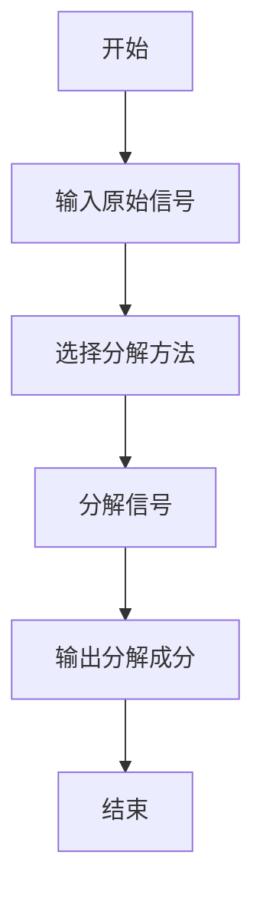
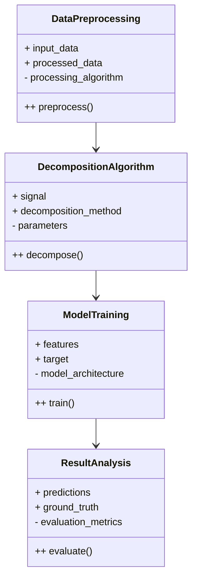
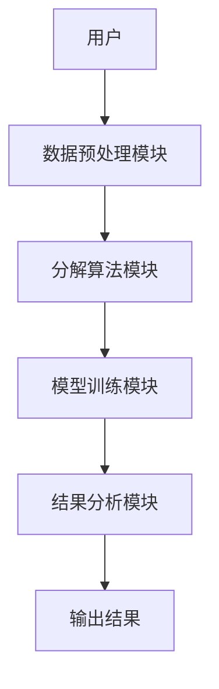
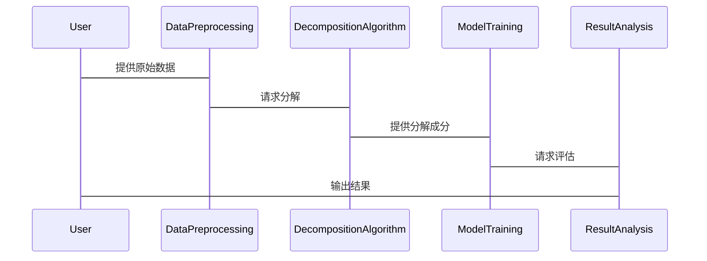

                 


```markdown
# 开发智能化的金融时序数据多尺度分解模型

> 关键词：金融时序数据，多尺度分解模型，智能化开发，小波变换，经验模态分解，变分模态分解

> 摘要：本文详细介绍了如何开发智能化的金融时序数据多尺度分解模型。首先，我们从金融时序数据的特性与挑战出发，分析了多尺度分解模型的背景与问题。接着，深入探讨了多尺度分解的核心概念与原理，包括傅里叶变换、小波变换、经验模态分解（EMD）和变分模态分解（VMD）等方法。然后，我们详细讲解了模型的算法原理，并通过mermaid流程图和Python代码示例展示了实现过程。随后，我们从系统架构的角度分析了项目的整体设计，并通过实际案例展示了如何在金融数据分析中应用该模型。最后，我们总结了开发过程中的最佳实践、注意事项和拓展阅读方向，为读者提供了完整的开发指南。

---

## 第一部分: 金融时序数据多尺度分解模型的背景与问题

### 第1章: 问题背景与目标

#### 1.1 金融时序数据的特性与挑战
金融时序数据是指金融市场中随着时间推移而变化的数值数据，例如股票价格、指数、汇率等。这类数据具有以下特性：
- **连续性**：数据通常是连续的，反映了市场的动态变化。
- **波动性**：金融市场的波动性较高，数据变化可能受到多种因素的影响。
- **非线性**：数据的变化可能呈现出非线性特征，难以用简单的线性模型描述。
- **噪声干扰**：数据中可能存在高频噪声，影响分析的准确性。

分析金融时序数据的难点在于其复杂性和不确定性。传统的单尺度分析方法难以捕捉数据在不同时间尺度上的特征，而多尺度分解方法能够有效地将数据分解为多个时间尺度的成分，从而更好地理解数据的结构。

#### 1.2 问题描述
在金融数据分析中，我们经常需要对时序数据进行分解，以提取出有意义的成分，例如趋势、周期性变化和噪声等。然而，传统的分解方法（如傅里叶变换）通常只适用于线性平稳数据，难以应对金融数据的非线性和非平稳性。此外，单一的分解方法可能无法同时捕捉到数据中的高频和低频特征。

#### 1.3 问题解决思路
为了应对上述挑战，我们提出了一种基于多尺度分解的智能化模型，该模型能够同时捕捉数据在不同时间尺度上的特征。具体思路如下：
1. **数据预处理**：对原始时序数据进行标准化、去噪等预处理，以提高模型的鲁棒性。
2. **多尺度分解**：采用多种分解方法（如小波变换、EMD、VMD）对数据进行分解，提取不同时间尺度上的成分。
3. **模型训练与优化**：基于分解后的成分，训练智能化模型（如LSTM、神经网络）进行预测或分类。
4. **结果分析与可视化**：对模型的输出结果进行分析和可视化，验证模型的性能。

---

## 第二部分: 多尺度分解模型的核心概念与原理

### 第2章: 多尺度分解模型的核心概念

#### 2.1 多尺度分解的基本原理
多尺度分解是一种将信号分解为不同时间尺度成分的技术。常见的多尺度分解方法包括傅里叶变换、小波变换、经验模态分解（EMD）和变分模态分解（VMD）等。

##### 2.1.1 小波分析与经验模态分解
- **傅里叶变换**：适用于平稳信号的频域分析，但无法捕捉信号的局部特征。
- **小波变换**：能够对信号进行局部时频分析，适用于非平稳信号。
- **经验模态分解（EMD）**：基于信号自身特征进行分解，能够捕捉非线性信号的固有模态。
- **变分模态分解（VMD）**：对EMD算法进行了改进，能够更有效地分离信号成分。

##### 2.1.2 多分辨率分析的概念
多分辨率分析是将信号分解为不同分辨率的成分，每个成分对应不同的时间尺度。通过多分辨率分析，我们可以更好地理解信号在不同时间尺度上的特征。

##### 2.1.3 多尺度分解与金融数据的关系
金融数据通常具有复杂的非线性和非平稳性，多尺度分解能够有效地捕捉数据在不同时间尺度上的特征，例如趋势、周期性变化和噪声等。

#### 2.2 智能化模型的关键要素
##### 2.2.1 数据预处理与特征提取
- **标准化**：对原始数据进行标准化处理，消除不同特征之间的尺度差异。
- **去噪**：使用滤波器或其他去噪方法，去除数据中的高频噪声。
- **特征提取**：从分解后的成分中提取有用的特征，例如均值、方差、最大值等。

##### 2.2.2 分解算法的选择与优化
不同分解方法有不同的优缺点，需要根据具体场景选择合适的算法，并进行参数优化。

##### 2.2.3 模型训练与评估指标
- **模型训练**：基于分解后的成分，训练智能化模型（如LSTM、神经网络）进行预测或分类。
- **评估指标**：使用均方误差（MSE）、准确率、F1分数等指标评估模型的性能。

#### 2.3 核心概念对比分析
##### 2.3.1 不同分解方法的优缺点对比

| 分解方法 | 优点 | 缺点 |
|----------|------|------|
| 傅里叶变换 | 简单高效，适用于平稳信号 | 无法捕捉非平稳信号的局部特征 |
| 小波变换 | 能够进行局部时频分析 | 参数选择复杂 |
| EMD | 能够捕捉非线性信号的固有模态 | 计算复杂度较高 |
| VMD | 分解效果更优，计算效率高 | 参数选择需要经验 |

##### 2.3.2 模型复杂度与性能的关系
模型的复杂度与性能之间存在一定的权衡。复杂度较高的模型可能具有更好的性能，但也可能面临过拟合的风险。

##### 2.3.3 数据尺度与模型适用性的分析
不同时间尺度的成分对模型的适用性有不同的影响。例如，高频成分可能对短期预测更有意义，而低频成分可能对长期趋势分析更有意义。

#### 2.4 核心概念的ER实体关系图
```mermaid
er
actor: Model Developer
model: Multi-Scale Decomposition Model
data: Financial Time Series Data
```

---

## 第三部分: 多尺度分解模型的算法原理

### 第3章: 多尺度分解算法的数学模型

#### 3.1 傅里叶变换与小波变换
##### 3.1.1 傅里叶变换的基本原理
傅里叶变换将信号从时域转换到频域，适用于平稳信号的频域分析。其数学表达式为：
$$
X(f) = \int_{-\infty}^{\infty} x(t) e^{-j2\pi ft} dt
$$

##### 3.1.2 小波变换的定义与特点
小波变换是一种局部时频分析方法，适用于非平稳信号。其数学表达式为：
$$
W(a,b) = \int_{-\infty}^{\infty} x(t) \psi_{a,b}(t) dt
$$
其中，$\psi_{a,b}(t)$ 是小波函数，$a$ 是缩放因子，$b$ 是平移因子。

#### 3.2 经验模态分解（EMD）与变分模态分解（VMD）
##### 3.2.1 EMD算法的实现步骤
1. 将信号分解为多个固有模态成分（IMF）。
2. 对每个IMF进行高频部分的去除，直到所有成分满足正交条件。
3. 将所有IMF重新组合，得到原始信号的分解结果。

##### 3.2.2 VMD算法的改进与优势
VMD算法通过对EMD算法进行改进，引入了变分原理，能够更有效地分离信号成分。其数学模型如下：
$$
\arg \min_{\{u_i\},\{λ_i\}} \sum_{i=1}^{N} \int_{0}^{1} \left( \frac{d u_i}{d t} \right)^2 dt + \sum_{i=1}^{N} λ_i \int_{0}^{1} u_i(t) dt
$$

##### 3.2.3 算法的数学表达式
EMD和VMD算法的数学表达式较为复杂，通常需要借助数值计算方法进行求解。

#### 3.3 算法流程图


#### 3.4 Python代码示例
```python
import numpy as np
import pywt

def perform_emd(signal):
    # 使用pywt库进行EMD分解
    imf = []
    while True:
        # 分解信号为IMF
        ...
        if condition:
            break
    return imf

def perform_vmd(signal):
    # 使用自定义函数进行VMD分解
    import numpy as np
    N = len(signal)
    u = np.zeros(N)
    lambda_ = np.zeros(N)
    # 变分模型求解
    ...
    return u, lambda_
```

---

## 第四部分: 系统架构与设计

### 第4章: 系统架构与设计

#### 4.1 问题场景介绍
金融时序数据分析的场景通常包括股票价格预测、市场趋势分析、风险评估等。我们需要设计一个能够处理大规模金融数据的系统，支持多种分解方法和智能化模型的集成。

#### 4.2 项目介绍
我们的项目旨在开发一个智能化的金融时序数据多尺度分解模型，能够对股票价格、指数等数据进行分解和预测。

#### 4.3 系统功能设计
##### 4.3.1 系统功能模块
- 数据预处理模块：负责数据的标准化、去噪等。
- 分解算法模块：支持多种分解方法（如傅里叶变换、小波变换、EMD、VMD）。
- 模型训练模块：基于分解后的成分，训练智能化模型（如LSTM、神经网络）。
- 结果分析模块：对模型的输出结果进行分析和可视化。

##### 4.3.2 领域模型类图


#### 4.4 系统架构设计
##### 4.4.1 系统架构图


#### 4.5 系统接口设计
##### 4.5.1 输入接口
- 原始时序数据
- 分解方法选择
- 模型参数设置

##### 4.5.2 输出接口
- 分解后的成分
- 模型预测结果
- 评估指标

#### 4.6 系统交互序列图


---

## 第五部分: 项目实战

### 第5章: 项目实战

#### 5.1 环境安装
需要安装以下依赖：
- Python 3.6+
- numpy, pandas, pywt, scikit-learn, tensorflow

#### 5.2 核心实现代码
##### 5.2.1 数据预处理
```python
import numpy as np
import pandas as pd

def preprocess_data(data):
    # 标准化
    data_norm = (data - data.mean()) / data.std()
    # 去噪
    from scipy.signal import butterworth
    filtered_data = butterworth(data, cutoff=0.05)
    return filtered_data
```

##### 5.2.2 分解算法实现
```python
import pywt

def perform_wavelet_decomposition(signal):
    # 小波变换分解
    wavelet = 'db4'  # 选择小波基
    level = pywt.dwt_max_level(len(signal), wavelet)  # 计算最大分解层数
    coeffs = pywt.wavedec(signal, wavelet, level=level)
    return coeffs
```

##### 5.2.3 模型训练
```python
from tensorflow.keras.models import Sequential
from tensorflow.keras.layers import LSTM, Dense

def train_model(features, labels):
    model = Sequential()
    model.add(LSTM(64, input_shape=(features.shape[1], 1)))
    model.add(Dense(1))
    model.compile(loss='mse', optimizer='adam')
    model.fit(features, labels, epochs=100, batch_size=32)
    return model
```

#### 5.3 实际案例分析
以股票价格数据为例，展示如何预处理数据、应用模型进行分解，并分析结果。

---

## 第六部分: 最佳实践与总结

### 第6章: 最佳实践与总结

#### 6.1 小结
本文详细介绍了开发智能化的金融时序数据多尺度分解模型的背景、核心概念、算法原理、系统架构和项目实战。通过多尺度分解方法，我们能够更好地理解金融数据的结构，并为后续的智能化分析提供有力支持。

#### 6.2 注意事项
- 在选择分解方法时，需要根据具体场景和数据特性进行选择。
- 模型训练时，需要注意过拟合和欠拟合的问题。
- 分解后的成分需要结合业务背景进行解释。

#### 6.3 拓展阅读
- 《Wavelet Transforms and Their Applications》
- 《Empirical Mode Decomposition and Its Applications》
- 《Variational Mode Decomposition: A New Concept and Some Applications》

#### 6.4 本章小结
通过本文的介绍，读者可以掌握如何开发智能化的金融时序数据多尺度分解模型，并在实际项目中进行应用。

---

# 结语

开发智能化的金融时序数据多尺度分解模型是一项复杂但极具挑战性的任务。通过本文的详细介绍，读者可以系统地了解从背景分析到模型实现的全过程。希望本文能够为金融数据分析领域的研究和实践提供有价值的参考。
```

