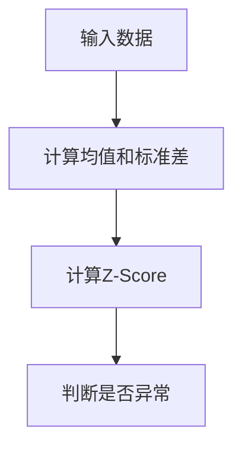
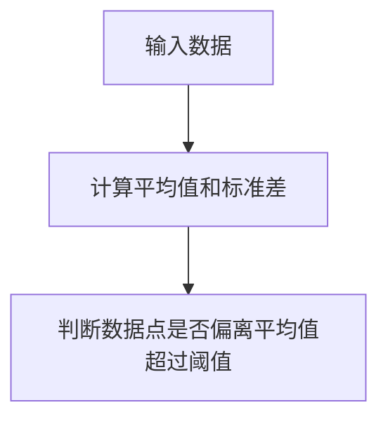
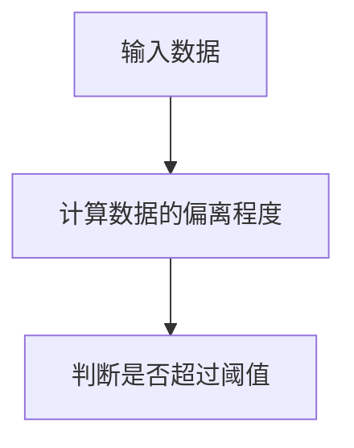
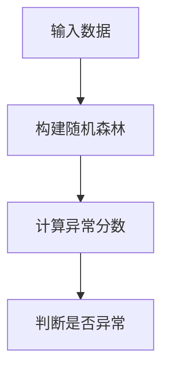
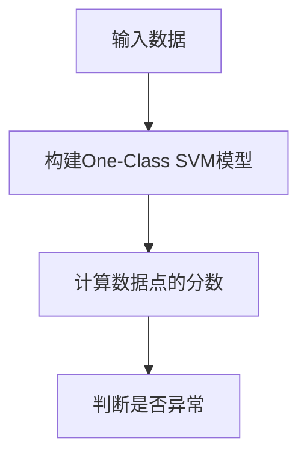
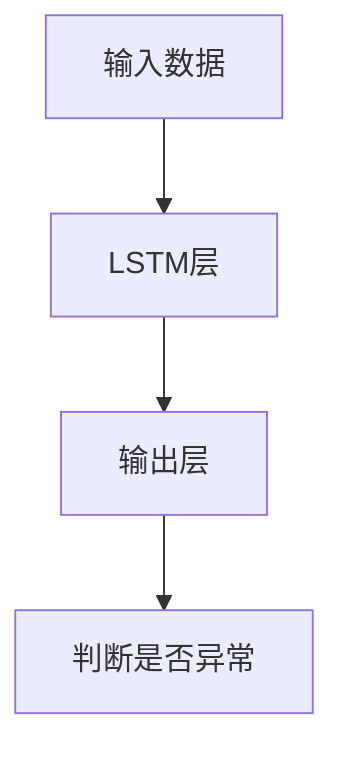
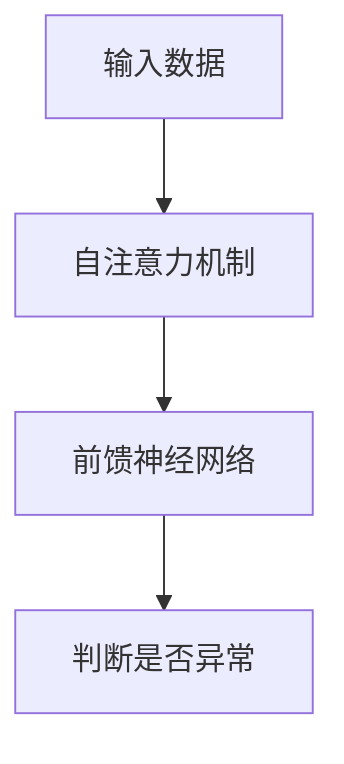
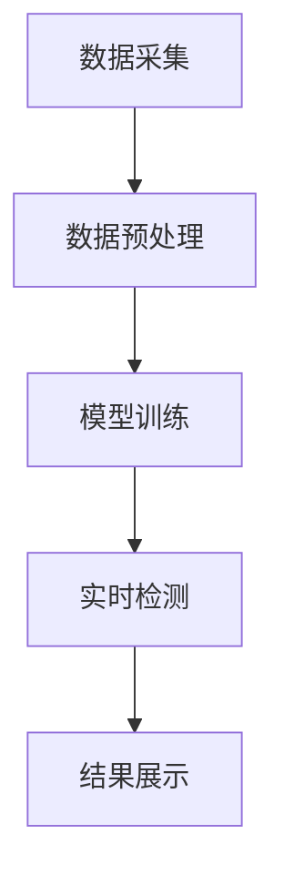

                 


# 开发智能化的金融时序数据异常检测模型

> 关键词：金融时序数据，异常检测，深度学习，LSTM，ARIMA

> 摘要：本文详细探讨了开发智能化的金融时序数据异常检测模型的关键步骤与方法，涵盖数据预处理、特征提取、模型选择与优化、系统架构设计等内容，结合实际案例分析，帮助读者掌握如何构建高效的金融异常检测系统。

---

## 第一部分: 金融时序数据异常检测模型概述

### 第1章: 异常检测模型背景与核心概念

#### 1.1 问题背景与问题描述

##### 1.1.1 金融时序数据的重要性
金融时序数据是金融领域的核心数据，包括股票价格、交易量、汇率、利率等。这些数据的波动反映了市场动态，对金融决策具有重要意义。然而，金融市场的复杂性和不确定性使得异常检测变得尤为重要。

##### 1.1.2 异常检测在金融领域的应用价值
异常检测在金融领域有广泛的应用场景，如欺诈检测、风险管理、市场监控等。通过及时发现异常交易或数据波动，金融机构可以有效规避风险，提高交易安全性和效率。

##### 1.1.3 传统方法的局限性与智能化需求
传统的异常检测方法，如基于统计的Z-Score和孤立森林算法，虽然在某些场景下有效，但难以应对金融时序数据的复杂性和非线性特征。智能化异常检测模型，如基于深度学习的LSTM和Transformer，能够更好地捕捉数据中的复杂模式。

#### 1.2 核心概念与定义

##### 1.2.1 时序数据的定义与特征
时序数据是指按时间顺序排列的数据，具有时间依赖性、季节性、周期性和趋势性等特征。

##### 1.2.2 异常检测的定义与分类
异常检测是指识别数据中偏离预期模式或行为的过程。根据检测目标的不同，可以分为单变量异常检测、多变量异常检测和时间序列异常检测。

##### 1.2.3 智能化异常检测的内涵
智能化异常检测结合了人工智能技术，利用深度学习等方法，能够自动学习数据特征，提高检测准确性和效率。

#### 1.3 核心概念关系与ER实体关系图

##### 1.3.1 实体关系图展示
```mermaid
er
    entity(金融时序数据) {
        id: 唯一标识符
        timestamp: 时间戳
        value: 数据值
        status: 正常/异常状态
    }
    entity(异常检测模型) {
        model_id: 模型唯一标识符
        model_type: 模型类型
        training_data: 训练数据集
        evaluation_metrics: 评估指标
    }
    entity(交易行为) {
        transaction_id: 交易唯一标识符
        user_id: 用户标识
        amount: 交易金额
        time: 交易时间
    }
    entity(风险评估) {
        risk_score: 风险评分
        detected_anomaly: 是否检测到异常
        anomaly_type: 异常类型
    }
```

### 第2章: 金融时序数据特征与异常检测方法

#### 2.1 时序数据的特征分析

##### 2.1.1 时间依赖性
时序数据往往表现出很强的自相关性，即当前时刻的值与过去时刻的值密切相关。

##### 2.1.2 季节性与周期性
许多金融数据呈现出明显的季节性或周期性波动，如月度数据的季节性波动，季度数据的周期性特征。

##### 2.1.3 噪声与趋势
时序数据中通常包含噪声和趋势成分，需要通过数据预处理步骤进行提取或消除。

#### 2.2 异常检测方法分类

##### 2.2.1 基于统计的方法
- **Z-Score方法**：通过计算数据点与均值的偏离程度来检测异常。
- **算术平均法**：基于数据的平均值和标准差进行异常判断。
- **程度分析法**：通过设定阈值来判断数据是否偏离正常范围。

##### 2.2.2 基于机器学习的方法
- **Isolation Forest算法**：一种基于决策树的无监督异常检测方法。
- **One-Class SVM**：通过构建数据分布的模型来识别异常点。

##### 2.2.3 基于深度学习的方法
- **LSTM网络**：适用于捕捉时序数据中的长程依赖关系。
- **Transformer模型**：通过自注意力机制捕捉数据中的全局关系。

#### 2.3 各种方法的优缺点对比

##### 2.3.1 统计方法的简单性与局限性
统计方法简单易懂，但难以处理复杂的数据分布和非线性关系。

##### 2.3.2 机器学习方法的可解释性
机器学习方法在一定程度上具有可解释性，但在处理复杂时序数据时表现有限。

##### 2.3.3 深度学习方法的表达能力
深度学习方法具有强大的表达能力，能够捕捉数据中的复杂模式，但训练时间较长且需要大量数据支持。

### 第3章: 常见异常检测算法原理与实现

#### 3.1 基于统计的异常检测算法

##### 3.1.1 Z-Score方法



代码实现：

```python
import numpy as np

def z_score_outlier_detection(data, threshold=3):
    mean = np.mean(data)
    std = np.std(data)
    z_scores = (data - mean) / std
    return np.where(np.abs(z_scores) > threshold)[0]
```

##### 3.1.2 算术平均法



代码实现：

```python
def arithmetic_mean_outlier_detection(data, threshold=0.5):
    mean = np.mean(data)
    deviations = np.abs(data - mean)
    return np.where(deviations > threshold * np.std(data))[0]
```

##### 3.1.3 程度分析法



代码实现：

```python
def threshold_based_outlier_detection(data, threshold=0.95):
    sorted_data = np.sort(data)
    lower_quartile = np.quantile(sorted_data, 0.25)
    upper_quartile = np.quantile(sorted_data, 0.75)
    iqr = upper_quartile - lower_quartile
    lower_bound = lower_quartile - (iqr * threshold)
    upper_bound = upper_quartile + (iqr * threshold)
    return np.where((data < lower_bound) | (data > upper_bound))[0]
```

#### 3.2 基于机器学习的异常检测算法

##### 3.2.1 Isolation Forest算法原理



代码实现：

```python
from sklearn.ensemble import IsolationForest

def isolation_forest_detection(data, contamination=0.05):
    model = IsolationForest(contamination=contamination)
    model.fit(data)
    return model.predict(data)
```

##### 3.2.2 One-Class SVM算法



代码实现：

```python
from sklearn.svm import OneClassSVM

def one_class_svm_detection(data):
    model = OneClassSVM()
    model.fit(data)
    return model.predict(data)
```

#### 3.3 基于深度学习的异常检测算法

##### 3.3.1 LSTM网络原理



代码实现：

```python
import tensorflow as tf
from tensorflow.keras.layers import LSTM, Dense, Dropout

def lstm_anomaly_detection(data, units=64, dropout=0.2):
    model = tf.keras.Sequential([
        LSTM(units, return_sequences=True),
        Dropout(dropout),
        LSTM(units),
        Dense(1, activation='sigmoid')
    ])
    model.compile(loss='binary_crossentropy', optimizer='adam')
    return model
```

##### 3.3.2 Transformer模型原理



代码实现：

```python
import tensorflow as tf
from tensorflow.keras.layers import MultiHeadAttention, Dense

def transformer_anomaly_detection(data, num_heads=8, key_dim=64):
    attention = MultiHeadAttention(num_heads=num_heads, key_dim=key_dim)
    attention_output = attention(data, data)
    dense_layer = Dense(1, activation='sigmoid')
    return dense_layer(attention_output)
```

---

## 第四部分: 项目实战与系统架构设计

### 第4章: 系统分析与架构设计方案

#### 4.1 项目场景介绍

##### 4.1.1 项目背景
假设我们正在开发一个金融交易平台的异常检测系统，用于实时监控交易数据，检测异常交易行为。

##### 4.1.2 项目目标
实现一个高效的金融时序数据异常检测系统，能够实时处理大量数据，准确识别异常交易。

#### 4.2 系统功能设计

##### 4.2.1 功能模块划分
- 数据采集模块：从数据库中读取时序数据。
- 数据预处理模块：对数据进行清洗和特征提取。
- 模型训练模块：训练异常检测模型。
- 实时检测模块：对实时数据进行异常检测。
- 结果展示模块：将检测结果可视化展示。

##### 4.2.2 系统功能流程图



#### 4.3 系统架构设计

##### 4.3.1 系统架构图

```mermaid
docker
    service(前端) {
        server: Nginx
    }
    service(后端) {
        server: FastAPI
        depends_on: model_service
    }
    service(model_service) {
        server: TensorFlow Serving
        depends_on: redis
    }
    service(redis) {
        image: redis:alpine
    }
```

##### 4.3.2 接口设计
- 数据采集接口：`GET /api/v1/data`
- 模型训练接口：`POST /api/v1/train`
- 实时检测接口：`POST /api/v1/detect`

##### 4.3.3 交互流程图

```mermaid
sequenceDiagram
    client ->+> server: GET /api/v1/data
    server ->+> model_service: POST /api/v1/train
    model_service ->+> server: POST /api/v1/detect
    server ->+> client: return detection results
```

---

## 第五部分: 最佳实践与总结

### 第5章: 项目实战

#### 5.1 环境安装与配置

##### 5.1.1 安装Python和相关库
```bash
pip install numpy pandas scikit-learn tensorflow keras
```

##### 5.1.2 安装深度学习框架
```bash
pip install tensorflow keras
```

#### 5.2 核心代码实现

##### 5.2.1 数据预处理代码

```python
import numpy as np
import pandas as pd

def preprocess_data(data_path):
    df = pd.read_csv(data_path)
    df['timestamp'] = pd.to_datetime(df['timestamp'])
    df.set_index('timestamp', inplace=True)
    return df
```

##### 5.2.2 LSTM模型实现

```python
import tensorflow as tf
from tensorflow.keras.layers import LSTM, Dense, Dropout

def build_lstm_model(input_shape, units=64, dropout=0.2):
    model = tf.keras.Sequential([
        LSTM(units, return_sequences=True, input_shape=input_shape),
        Dropout(dropout),
        LSTM(units),
        Dense(1, activation='sigmoid')
    ])
    model.compile(loss='binary_crossentropy', optimizer='adam')
    return model
```

#### 5.3 案例分析与详细讲解

##### 5.3.1 数据来源与特征分析
使用股票价格数据作为示例，分析其时间依赖性、季节性、周期性和趋势性特征。

##### 5.3.2 模型训练与评估
训练LSTM模型，使用训练数据进行模型训练，并通过验证集评估模型性能。

##### 5.3.3 实时检测与结果展示
对实时股票价格进行异常检测，展示检测结果。

#### 5.4 项目小结

通过本项目，我们掌握了金融时序数据异常检测的核心步骤，包括数据预处理、模型选择与优化、系统架构设计等。

---

## 第六部分: 最佳实践与总结

### 第6章: 最佳实践与总结

#### 6.1 小结
智能化的金融时序数据异常检测模型能够有效提高金融交易的安全性和效率，但在实际应用中需要考虑数据质量、模型选择和实时性等多方面因素。

#### 6.2 注意事项
- 数据预处理是关键，确保数据的完整性和准确性。
- 模型选择要结合实际场景，选择合适的算法。
- 实时性要求高的场景需要优化模型推理速度。

#### 6.3 拓展阅读
- 《Time Series Analysis and Its Applications》
- 《Deep Learning for Time Series Forecasting》
- 《Anomaly Detection in Time Series Data》

---

通过本文的详细讲解，读者可以系统地掌握开发智能化金融时序数据异常检测模型的关键技术与实践方法。

