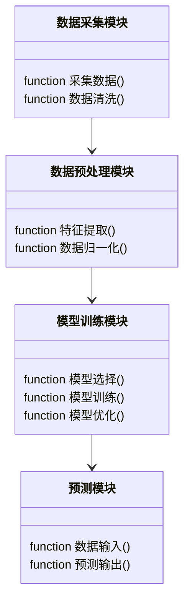
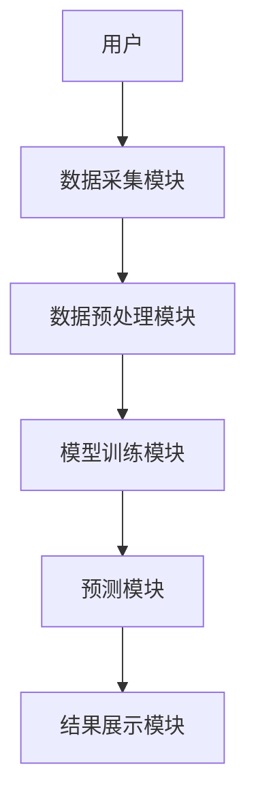
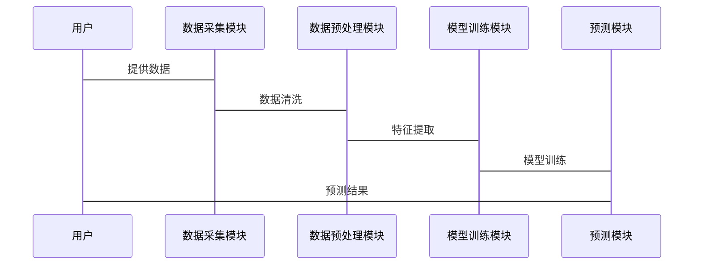

                 


# 开发智能化的金融时序数据预测模型

> **关键词**: 人工智能, 时间序列分析, 金融预测, 深度学习, 机器学习

> **摘要**: 本文详细探讨了如何开发智能化的金融时序数据预测模型，从背景与挑战、核心概念、算法原理、数学模型、系统架构到项目实战，全面解析了金融时序数据预测的各个方面。文章结合传统算法、机器学习与深度学习方法，分析了其在金融预测中的应用，并通过实际案例展示了如何构建高效、准确的预测模型。同时，本文还提供了系统的架构设计与实现方案，为读者提供了从理论到实践的完整指南。

---

# 第一部分: 金融时序数据预测模型概述

---

# 第1章: 金融时序数据预测模型的背景与挑战

## 1.1 金融时序数据的定义与特点

### 1.1.1 金融时序数据的定义

金融时序数据是指在金融领域中，按照时间顺序记录的数值型数据。这些数据通常反映了金融市场的动态变化，例如股票价格、汇率、利率、商品价格等。金融时序数据的一个显著特点是其时间依赖性，即未来的值往往与过去的值密切相关。

### 1.1.2 金融时序数据的核心特点

- **连续性**: 数据是按时间顺序连续记录的。
- **波动性**: 金融市场的数据通常具有较高的波动性，受多种因素影响。
- **依赖性**: 数据点之间存在较强的依赖关系，尤其是短期内的依赖性。
- **非线性**: 金融数据的变化通常是非线性的，难以用简单的线性模型描述。

### 1.1.3 金融时序数据的常见应用场景

- **股票价格预测**: 帮助投资者做出投资决策。
- **汇率预测**: 支持跨境交易和外汇风险管理。
- **利率预测**: 用于债券定价和货币政策制定。
- **风险管理**: 帮助机构识别和管理金融市场的风险。

## 1.2 时序数据预测的背景与意义

### 1.2.1 时序数据预测的背景

随着金融市场的日益复杂化，传统的基于统计的方法在预测准确性上逐渐显现出其局限性。近年来，人工智能和机器学习技术的快速发展为金融时序数据预测提供了新的可能性。

### 1.2.2 时序数据预测在金融领域的意义

- **提高预测准确性**: 通过引入先进的算法和技术，可以更准确地预测金融市场的变化。
- **优化投资决策**: 基于预测结果，投资者可以做出更明智的投资决策。
- **风险控制**: 通过预测潜在的风险，机构可以更好地进行风险管理。

### 1.2.3 时序数据预测的挑战与难点

- **数据的不完全性**: 金融市场受到多种不确定因素的影响，数据往往存在噪声。
- **模型的复杂性**: 高精度的预测模型通常较为复杂，难以解释。
- **计算资源需求**: 深度学习模型需要大量的计算资源。

## 1.3 智能化预测模型的发展与现状

### 1.3.1 传统金融预测方法的局限性

传统的金融预测方法主要包括统计模型（如ARIMA）和简单的机器学习模型。这些方法在一定程度上可以解决问题，但其预测精度和鲁棒性有限。

### 1.3.2 智能化预测模型的崛起

随着计算能力的提升和算法的改进，深度学习模型（如LSTM、Transformer）逐渐成为金融时序数据预测的主流方法。

### 1.3.3 当前智能化预测模型的发展现状

- **算法多样化**: 从传统的ARIMA到深度学习模型，算法选择更加多样化。
- **数据处理技术进步**: 数据预处理技术的提升有助于提高模型的预测精度。
- **计算资源优化**: 云计算和分布式计算技术的普及降低了模型训练的成本。

## 1.4 本章小结

本章从金融时序数据的定义与特点出发，分析了时序数据预测的背景与意义，并探讨了智能化预测模型的发展与现状。接下来的章节将深入探讨金融时序数据预测的核心概念与联系。

---

# 第2章: 金融时序数据预测的核心概念与联系

## 2.1 时序数据分析的核心概念

### 2.1.1 时间序列的基本组成

时间序列可以分解为以下几个组成部分：

- **趋势（Trend）**: 数据的长期方向性变化。
- **周期性（Seasonality）**: 数据在固定周期内的重复模式。
- **季节性（Seasonal variation）**: 数据在特定时间段内的波动。
- **随机性（Noise）**: 数据中的随机波动部分。

### 2.1.2 时间序列的分解方法

常用的时间序列分解方法包括：

1. **加法模型**: 将时间序列分解为趋势、周期性和随机性部分。
2. **乘法模型**: 将时间序列分解为趋势、周期性和随机性部分，但各部分是相乘的关系。

### 2.1.3 时间序列的特征提取

特征提取是时序数据分析的重要步骤，常见的特征包括：

- **均值、方差**: 描述数据的集中趋势和离散程度。
- **自相关系数（ACF）**: 描述数据点之间的相关性。
- **偏自相关系数（PACF）**: 用于识别时间序列的阶数。

### 2.1.4 ER实体关系图

```mermaid
ERDiagram
actor 顾客 {
  string id
  string name
}
actor 订单 {
  int order_id
  date order_date
  int quantity
}
actor 产品 {
  int product_id
  string product_name
  decimal price
}
```

---

## 2.2 机器学习与深度学习在时序预测中的应用

### 2.2.1 机器学习的基本原理

机器学习是一种通过数据学习模式的技术，常用算法包括支持向量机（SVM）、随机森林（Random Forest）等。

### 2.2.2 深度学习的核心思想

深度学习通过多层神经网络模拟人脑的工作方式，能够自动提取数据中的特征。

### 2.2.3 机器学习与深度学习的对比分析

| 对比维度       | 机器学习            | 深度学习            |
|----------------|--------------------|--------------------|
| 数据需求       | 数据量较小          | 数据量较大          |
| 特征工程       | 需要手动提取特征      | 自动提取特征         |
| 模型复杂性     | 模型相对简单         | 模型复杂，参数多     |

---

## 2.3 金融时序数据预测的核心要素

### 2.3.1 数据特征的提取与选择

- **特征选择**: 选择对预测结果影响较大的特征。
- **特征工程**: 对数据进行预处理，提取更有意义的特征。

### 2.3.2 模型选择与优化

- **模型选择**: 根据数据特点选择合适的模型。
- **超参数调优**: 通过网格搜索等方法优化模型性能。

### 2.3.3 评价指标与模型调优

- **评价指标**: 常用的指标包括均方误差（MSE）、平均绝对误差（MAE）、R²系数等。
- **模型调优**: 通过交叉验证等方法优化模型性能。

## 2.4 本章小结

本章分析了金融时序数据预测的核心概念与联系，介绍了机器学习与深度学习的基本原理，并探讨了模型选择与优化的关键要素。接下来的章节将深入探讨金融时序数据预测的算法原理。

---

# 第3章: 金融时序数据预测的算法原理

## 3.1 传统时序预测算法

### 3.1.1 ARIMA模型

ARIMA（Auto-Regressive Integrated Moving Average）模型是一种广泛应用于时间序列预测的统计模型。

#### ARIMA模型的数学公式

$$ ARIMA(p, d, q) $$

其中，$p$ 表示自回归（AR）的阶数，$d$ 表示差分的阶数，$q$ 表示移动平均（MA）的阶数。

### 3.1.2 指数平滑法

指数平滑法是一种简单的时间序列预测方法，适用于具有趋势或周期性数据的预测。

### 3.1.3 线性回归模型

线性回归模型适用于时间序列数据的线性趋势预测。

---

## 3.2 机器学习算法在时序预测中的应用

### 3.2.1 支持向量机（SVM）

支持向量机是一种监督学习算法，适用于分类和回归问题。

#### SVM回归的数学公式

$$ y = \text{sign}(w \cdot x + b) $$

### 3.2.2 随机森林（Random Forest）

随机森林是一种基于决策树的集成学习方法，适用于分类和回归问题。

### 3.2.3 K-近邻算法（KNN）

K-近邻算法是一种基于实例的机器学习算法，适用于分类和回归问题。

---

## 3.3 深度学习算法在时序预测中的应用

### 3.3.1 长短期记忆网络（LSTM）

LSTM是一种特殊的循环神经网络（RNN），适用于时间序列数据的预测。

#### LSTM的数学公式

$$
f_t = \text{tanh}(W_f \cdot [h_{t-1}, x_t] + b_f)
$$

$$
i_t = \sigma(W_i \cdot [h_{t-1}, x_t] + b_i)
$$

$$
o_t = \sigma(W_o \cdot [h_{t-1}, x_t] + b_o)
$$

$$
h_t = f_t \cdot c_t + i_t \cdot c_{t-1}
$$

$$
c_t = f_t \cdot c_t + i_t \cdot c_{t-1}
$$

### 3.3.2 循环神经网络（RNN）

循环神经网络是一种适用于序列数据的神经网络模型。

### 3.3.3 Transformer模型

Transformer模型是一种基于注意力机制的深度学习模型，近年来在自然语言处理和时间序列预测领域取得了显著成果。

---

## 3.4 算法对比与选择策略

### 3.4.1 各种算法的优缺点对比

| 算法名称       | 优点                     | 缺点                     |
|----------------|--------------------------|--------------------------|
| ARIMA          | 易于实现，适合线性数据     | 不适合非线性数据           |
| LSTM            | 能够捕捉长期依赖关系       | 训练时间较长               |
| Transformer      | 高效，适合长序列           | 计算资源需求较高           |

### 3.4.2 算法选择的依据与策略

- **数据特性**: 数据是否具有周期性、趋势性等。
- **计算资源**: 深度学习模型需要较高的计算资源。
- **预测精度**: 根据实际需求选择精度要求高的模型。

### 3.4.3 实际应用中的注意事项

- **数据预处理**: 数据清洗、归一化等。
- **模型调优**: 参数优化、交叉验证等。
- **结果验证**: 使用历史数据进行回测。

## 3.5 本章小结

本章详细介绍了金融时序数据预测中常用的算法，包括传统算法、机器学习算法和深度学习算法，并分析了各种算法的优缺点。接下来的章节将探讨金融时序数据预测的数学模型与公式。

---

# 第4章: 金融时序数据预测的数学模型与公式

## 4.1 时间序列分析的数学基础

### 4.1.1 时间序列的线性模型

线性回归模型是时间序列分析的基础模型。

#### 线性回归模型的数学公式

$$ y_t = \beta_0 + \beta_1 t + \epsilon_t $$

其中，$\epsilon_t$ 为误差项。

### 4.1.2 时间序列的分解模型

时间序列分解模型将序列分解为趋势、周期性和随机性部分。

#### 加法模型的数学公式

$$ y_t = T_t + S_t + e_t $$

其中，$T_t$ 为趋势部分，$S_t$ 为周期性部分，$e_t$ 为随机误差。

### 4.1.3 时间序列的差分模型

差分模型通过差分操作消除趋势和周期性。

#### 差分模型的数学公式

$$ \Delta y_t = y_t - y_{t-1} $$

---

## 4.2 机器学习模型的数学公式

### 4.2.1 支持向量回归（SVR）

支持向量回归是一种基于支持向量机的回归算法。

#### SVR的数学公式

$$ y = \text{sign}(w \cdot x + b) $$

### 4.2.2 随机森林回归

随机森林回归是一种基于决策树的集成学习方法。

---

## 4.3 深度学习模型的数学公式

### 4.3.1 LSTM网络的数学公式

LSTM网络通过细胞状态和门控机制捕捉时间序列的长距离依赖关系。

#### LSTM的数学公式

$$
f_t = \text{tanh}(W_f \cdot [h_{t-1}, x_t] + b_f)
$$

$$
i_t = \sigma(W_i \cdot [h_{t-1}, x_t] + b_i)
$$

$$
o_t = \sigma(W_o \cdot [h_{t-1}, x_t] + b_o)
$$

$$
h_t = f_t \cdot c_t + i_t \cdot c_{t-1}
$$

$$
c_t = f_t \cdot c_t + i_t \cdot c_{t-1}
$$

### 4.3.2 Transformer模型的数学公式

Transformer模型基于自注意力机制，适用于长序列的预测。

#### Transformer的数学公式

$$
\text{Attention}(Q, K, V) = \text{softmax}\left(\frac{QK^T}{\sqrt{d_k}}\right)V
$$

其中，$Q$ 是查询向量，$K$ 是键向量，$V$ 是值向量，$d_k$ 是向量的维度。

---

## 4.4 本章小结

本章详细介绍了金融时序数据预测中常用的数学模型与公式，包括传统的时间序列模型、机器学习模型和深度学习模型。接下来的章节将探讨金融时序数据预测的系统分析与架构设计方案。

---

# 第5章: 金融时序数据预测的系统分析与架构设计方案

## 5.1 问题场景介绍

金融时序数据预测系统需要解决以下问题：

- 数据采集与预处理
- 模型训练与优化
- 预测结果输出与分析

### 5.1.1 项目背景

随着金融市场的复杂化，传统的预测方法已无法满足需求，智能化预测模型的开发成为必然趋势。

### 5.1.2 项目目标

开发一个智能化的金融时序数据预测系统，能够实现高精度的预测结果。

---

## 5.2 系统功能设计

### 5.2.1 领域模型设计



### 5.2.2 系统架构设计



### 5.2.3 系统接口设计

- **数据接口**: 提供数据输入和输出的接口。
- **模型接口**: 提供模型训练和预测的接口。

### 5.2.4 系统交互流程



---

## 5.3 本章小结

本章从系统角度分析了金融时序数据预测的实现过程，提出了系统的功能模块与架构设计方案。接下来的章节将通过实际案例分析，展示如何开发一个智能化的金融时序数据预测系统。

---

# 第6章: 金融时序数据预测的项目实战

## 6.1 环境安装与配置

### 6.1.1 安装必要的库

```bash
pip install numpy pandas scikit-learn keras tensorflow
```

### 6.1.2 配置开发环境

- 安装Jupyter Notebook或PyCharm作为开发环境。

---

## 6.2 系统核心实现源代码

### 6.2.1 数据采集模块

```python
import pandas as pd

def collect_data():
    # 示例数据采集代码
    data = pd.read_csv('financial_data.csv')
    return data
```

### 6.2.2 数据预处理模块

```python
import numpy as np

def preprocess_data(data):
    # 数据清洗和归一化
    data = data.dropna()
    data = (data - data.mean()) / data.std()
    return data
```

### 6.2.3 模型训练模块

```python
from keras.models import Sequential
from keras.layers import LSTM, Dense

def build_model(input_shape):
    model = Sequential()
    model.add(LSTM(50, input_shape=input_shape))
    model.add(Dense(1))
    model.compile(loss='mean_squared_error', optimizer='adam')
    return model
```

### 6.2.4 预测模块

```python
def predict_price(model, data):
    predicted_price = model.predict(data)
    return predicted_price
```

---

## 6.3 实际案例分析与详细解读

### 6.3.1 数据集准备

使用股票价格数据作为示例数据集。

### 6.3.2 模型训练与预测

```python
data = collect_data()
data_processed = preprocess_data(data)
model = build_model((data_processed.shape[1], 1))
model.fit(data_processed, epochs=10, batch_size=32)
predicted_price = predict_price(model, data_processed)
```

### 6.3.3 结果分析

对预测结果进行分析，计算预测精度和误差。

---

## 6.4 本章小结

本章通过实际案例展示了如何开发一个智能化的金融时序数据预测系统，提供了完整的代码实现和结果分析。接下来的章节将总结最佳实践，并给出进一步阅读的建议。

---

# 第7章: 金融时序数据预测的总结与展望

## 7.1 最佳实践

### 7.1.1 数据预处理的注意事项

- 数据清洗是关键，需注意缺失值和异常值的处理。
- 数据归一化有助于提高模型的训练效率。

### 7.1.2 模型选择与优化

- 根据数据特点选择合适的模型。
- 通过网格搜索等方法优化模型参数。

### 7.1.3 部署与监控

- 模型部署后需定期进行监控和维护。
- 根据实际效果调整模型参数。

## 7.2 小结

本文从理论到实践，详细探讨了金融时序数据预测的各个方面，包括算法原理、系统架构和项目实战。通过本文的学习，读者可以掌握开发智能化金融时序数据预测模型的核心技术。

## 7.3 展望

随着人工智能和大数据技术的不断发展，金融时序数据预测模型将更加智能化和精准化。未来的研究方向包括：

- 更高效的算法开发。
- 更强大的计算能力支持。
- 更多领域的应用拓展。

---

# 附录: 参考文献

1. Hyndman, R. J., & Athanasopoulos, G. (2018). Forecasting: principles and practice.
2. Goodfellow, I., Bengio, Y., & Courville, A. (2016). Deep learning.
3. Hochreiter, S., & Schmidhuber, J. (1997). Long short-term memory.

---

# 结束语

开发智能化的金融时序数据预测模型是一个复杂而有趣的任务，需要结合理论知识和实践经验。通过本文的学习，读者可以掌握从数据采集到模型部署的完整流程，为实际应用打下坚实的基础。

