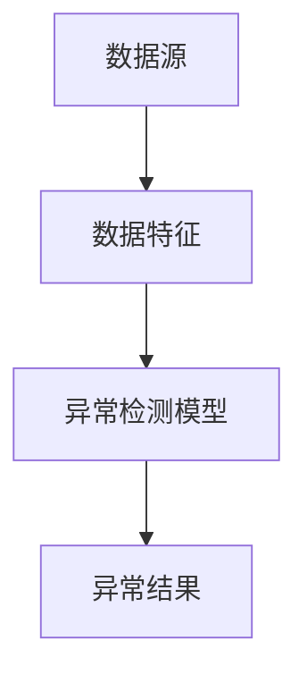
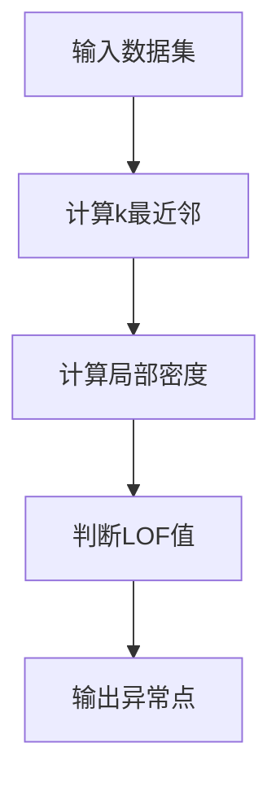
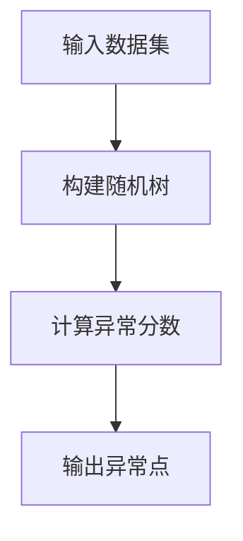
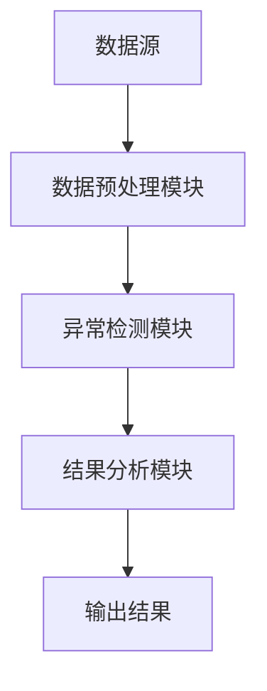

                 


# 《异常检测：识别AI Agent的非正常行为》

---

## 关键词：
异常检测，AI Agent，行为分析，算法原理，系统架构，项目实战

---

## 摘要：
异常检测是识别AI Agent中非正常行为的关键技术，通过分析数据分布和行为模式，发现偏离预期的异常点，从而保障系统的安全性和稳定性。本文从异常检测的背景出发，深入探讨其核心概念、算法原理、系统架构设计以及实际项目中的应用场景，结合具体案例和代码实现，帮助读者全面理解如何有效识别AI Agent的异常行为。

---

# 第一部分: 异常检测的背景与概念

## 第1章: 异常检测的背景与概念

### 1.1 异常检测的定义与背景

#### 1.1.1 什么是异常检测
异常检测（Anomaly Detection）是指通过分析数据，识别出与预期模式或行为不一致的异常点。在AI Agent的场景中，异常检测用于识别其行为中的异常，如未经授权的操作、异常请求或错误行为。

#### 1.1.2 异常检测的重要性
在AI Agent的应用中，异常检测能够：
- 发现潜在的安全威胁
- 提高系统的鲁棒性
- 优化用户体验
- 辅助决策

#### 1.1.3 AI Agent与异常检测的关系
AI Agent通过与环境交互，其行为模式可以通过数据进行建模。异常检测技术能够识别其行为中的偏离，帮助系统及时采取措施。

---

### 1.2 异常检测的核心概念

#### 1.2.1 异常的类型与分类
异常可以分为以下几类：
1. **点异常**：单个数据点与整体分布显著不同。
2. **上下文异常**：在特定条件下出现的异常。
3. **集体异常**：一组数据点共同偏离正常模式。

#### 1.2.2 异常检测的常见场景
- 网络安全中的入侵检测
- 系统故障预测
- 用户行为分析

#### 1.2.3 异常检测的边界与外延
- 异常检测需要结合具体场景，不同场景下的异常定义可能不同。
- 异常检测的结果需要结合上下文进行解释。

---

### 1.3 异常检测的核心要素

#### 1.3.1 数据特征分析
- 数据的分布特征
- 数据的维度与关联性

#### 1.3.2 异常行为模式
- 基于时间序列的异常
- 基于空间关系的异常

#### 1.3.3 异常检测的评价指标
- 精确率（Precision）
- 召回率（Recall）
- F1分数

---

## 第2章: 异常检测的核心概念与联系

### 2.1 异常检测的核心原理

#### 2.1.1 数据分布与异常点
- 正常数据点的分布符合一定的概率模型。
- 异常点偏离了这个概率模型。

#### 2.1.2 异常检测的数学模型
- 基于统计学的模型（如高斯分布）
- 基于机器学习的模型（如聚类、分类）

#### 2.1.3 异常检测的特征提取
- 提取关键特征值
- 组合多维特征进行分析

---

### 2.2 异常检测的核心概念对比

#### 2.2.1 异常检测与正常行为的对比
| 属性 | 正常行为 | 异常行为 |
|------|----------|----------|
| 数据分布 | 符合预期 | 显著偏离 |
| 行为模式 | 稳定 | 不稳定 |

#### 2.2.2 不同异常检测方法的对比
| 方法 | 描述 | 优缺点 |
|------|------|--------|
| LOF | 基于局部密度 | 适合高维数据，但计算复杂度较高 |
| Isolation Forest | 基于树结构 | 计算效率高，适合大规模数据 |

#### 2.2.3 异常检测与数据挖掘的联系
- 异常检测是数据挖掘的重要组成部分。
- 数据挖掘技术为异常检测提供了丰富的工具和方法。

---

### 2.3 异常检测的ER实体关系图



---

## 第3章: 异常检测的算法原理

### 3.1 常见异常检测算法概述

#### 3.1.1 无监督学习方法
- LOF算法
- DBSCAN算法

#### 3.1.2 监督学习方法
- 基于One-Class SVM的异常检测

#### 3.1.3 混合方法
- 结合聚类和分类的异常检测

---

### 3.2 基于密度的异常检测算法

#### 3.2.1 LOF算法原理

LOF算法通过计算局部密度来判断数据点是否为异常点。公式如下：

$$LOF(p) = \frac{\text{local reachability density}(p)}{\text{average local reachability density of the nearest neighborhood of } p}$$

#### 3.2.2 LOF算法的实现步骤



---

### 3.3 基于树结构的异常检测算法

#### 3.3.1 Isolation Forest算法

Isolation Forest通过构建随机树，将数据点隔离到不同的叶子节点中。公式如下：

$$s(x) = \frac{2}{1 + \exp(-\alpha x)}$$

其中，$\alpha$是调节参数。

#### 3.3.2 Isolation Forest的实现步骤



---

# 第四部分: 系统分析与架构设计

## 第4章: 异常检测系统的架构设计

### 4.1 问题场景介绍

AI Agent的异常检测需要考虑以下场景：
- 实时监控AI Agent的行为
- 处理高维数据
- 快速响应异常事件

### 4.2 系统功能设计

#### 4.2.1 数据采集模块
- 收集AI Agent的行为数据

#### 4.2.2 数据预处理模块
- 数据清洗
- 特征提取

#### 4.2.3 异常检测模块
- 选择合适的算法进行异常检测

#### 4.2.4 结果分析模块
- 解释异常结果
- 提供决策支持

---

### 4.3 系统架构设计



---

### 4.4 系统接口设计

- 数据接口：数据输入和输出的接口定义
- 模型接口：算法模型的调用接口
- 结果接口：异常结果的展示接口

---

## 第5章: 异常检测系统的实现

### 5.1 环境安装

```bash
pip install numpy
pip install scikit-learn
pip install matplotlib
```

---

### 5.2 系统核心实现

#### 5.2.1 数据预处理代码

```python
import numpy as np
from sklearn.preprocessing import StandardScaler

# 加载数据
data = np.loadtxt('data.csv', delimiter=',')
# 标准化数据
scaler = StandardScaler()
data_scaled = scaler.fit_transform(data)
```

#### 5.2.2 异常检测代码

```python
from sklearn.neighbors import LocalOutlierFactor

# 使用LOF算法进行异常检测
lof = LocalOutlierFactor(n_neighbors=20, contamination=0.1)
outliers = lof.fit_predict(data_scaled)
```

#### 5.2.3 结果可视化代码

```python
import matplotlib.pyplot as plt

# 可视化结果
plt.scatter(data[:,0], data[:,1], c=outliers, cmap='viridis')
plt.colorbar()
plt.show()
```

---

## 第6章: 总结与展望

### 6.1 本章总结

异常检测是识别AI Agent异常行为的重要技术，结合算法原理和系统架构设计，能够有效发现和处理异常点。

---

### 6.2 未来展望

未来的研究方向包括：
- 更高效的异常检测算法
- 更智能的结果解释方法
- 多模态数据的异常检测

---

## 附录: 最佳实践与注意事项

### 附录A: 小结

- 异常检测需要结合具体场景
- 选择合适的算法和模型
- 定期更新检测模型

---

### 附录B: 注意事项

- 数据预处理是关键
- 异常检测结果需要结合上下文解释
- 定期监控和优化模型

---

通过以上步骤和内容，我们全面分析了异常检测在识别AI Agent非正常行为中的应用，从理论到实践，为读者提供了一套完整的解决方案。

