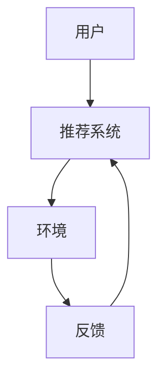
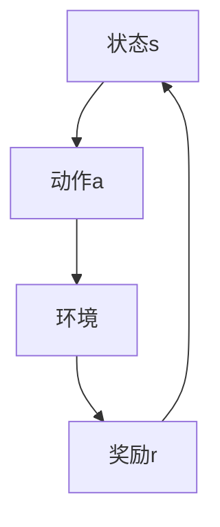
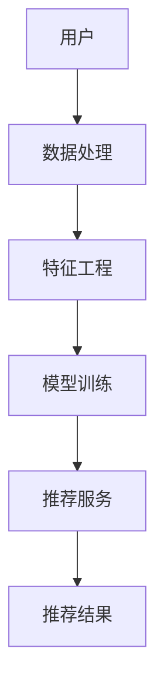

                 


# 强化学习在AI Agent个性化推荐中的应用

> 关键词：强化学习、AI Agent、个性化推荐、推荐系统、马尔可夫决策过程、Q-learning、Actor-Critic算法

> 摘要：本文详细探讨了强化学习在AI Agent个性化推荐系统中的应用。从强化学习的基本原理到其在推荐系统中的具体实现，文章系统地分析了如何利用强化学习提升推荐系统的性能和用户体验。通过理论与实践相结合的方式，本文深入讲解了强化学习算法的核心概念、数学模型以及实际应用场景，为读者提供了一个全面的视角来理解这一前沿技术。

---

# 强化学习与AI Agent个性化推荐的背景

## 第1章：强化学习的基本概念

### 1.1 强化学习的定义与特点
- **定义**：强化学习是一种通过试错机制学习策略的方法，目标是在与环境交互中最大化累积奖励。
- **特点**：基于动作-奖励机制，适用于动态环境和高维状态空间的问题。
- **与监督学习的区别**：强化学习通过奖励信号调整策略，而监督学习通过标签指导分类。

### 1.2 AI Agent的基本结构
- **AI Agent的定义**：智能体通过感知环境、执行动作以实现目标。
- **AI Agent的组成部分**：感知器、决策器、执行器和学习器。
- **推荐系统中的AI Agent**：通过用户行为建模提供个性化推荐。

### 1.3 个性化推荐的背景与目标
- **推荐系统的类型**：基于协同过滤、基于内容的推荐，以及混合推荐。
- **个性化推荐的重要性**：提高用户体验，增加用户粘性和平台收益。
- **个性化推荐的目标**：基于用户行为和偏好，提供精准的内容推荐。

---

# 强化学习的核心原理

## 第2章：强化学习的核心概念

### 2.1 马尔可夫决策过程（MDP）
- **状态（State）**：环境中的情况，影响下一步决策。
- **动作（Action）**：智能体在给定状态下选择的行为。
- **奖励（Reward）**：环境对动作的反馈，指导智能体的决策。
- **策略（Policy）**：决定智能体在不同状态下采取动作的概率分布。

### 2.2 策略评估与优化
- **基于值的方法**：通过评估状态的价值来优化策略。
- **基于策略的方法**：直接优化策略，如策略梯度方法。
- **策略搜索**：通过搜索和评估候选策略来寻找最优策略。

### 2.3 Q-learning算法
- **工作原理**：通过更新Q值表，学习状态-动作对的最优值。
- **优缺点**：离线学习、适合离散动作空间、在线更新。

## 第3章：AI Agent推荐系统的实体关系

### 3.1 实体分析
- **用户**：具有特定偏好的主体，通过行为与系统交互。
- **物品**：推荐的目标，具有可提取的特征。
- **环境**：提供用户行为和物品特征的上下文。
- **推荐系统**：连接用户和物品的桥梁，负责生成推荐。

### 3.2 实体关系ER图
```mermaid
er
  user(User) -[1..n] -> item(Item)
  user -[1] -> interaction(Interaction)
  interaction -[1..n] -> feedback(Feedback)
  user -[1] -> preference(Preference)
```

### 3.3 流程分析


---

# 强化学习算法原理

## 第4章：强化学习的数学模型

### 4.1 动态规划（Dynamic Programming）
- **Bellman方程**：描述状态价值的方程，用于最优策略的计算。
  $$ V(s) = \max_a \left( r(s,a) + \gamma \sum_{s'} P(s'|s,a) V(s') \right) $$
- **策略迭代**：通过交替执行策略评估和策略改进优化策略。
- **值迭代**：直接优化值函数，无需策略改进步骤。

### 4.2 Q-learning算法
- **Q值更新公式**：
  $$ Q(s,a) = (1-\alpha) Q(s,a) + \alpha [r + \gamma \max Q(s',a')] $$
- **探索与利用**：平衡探索新状态和利用已知最优策略。

### 4.3 Actor-Critic算法
- **动作策略（Actor）**：生成动作，参数通过策略梯度优化。
- **价值函数（Critic）**：评估当前状态-动作对的价值，指导策略调整。
- **结合机制**：通过同时优化策略和价值函数，实现更高效的策略更新。

## 第5章：算法实现与流程图

### 5.1 Q-learning流程图


### 5.2 Python代码实现
```python
import numpy as np

class QLearning:
    def __init__(self, state_size, action_size, gamma=0.99, epsilon=0.1, alpha=0.1):
        self.Q = np.zeros((state_size, action_size))
        self.gamma = gamma
        self.epsilon = epsilon
        self.alpha = alpha

    def get_action(self, state):
        if np.random.random() < self.epsilon:
            return np.random.randint(0, action_size)
        else:
            return np.argmax(self.Q[state])

    def update(self, state, action, reward, next_state):
        target = reward + self.gamma * np.max(self.Q[next_state])
        self.Q[state][action] = self.Q[state][action] + self.alpha * (target - self.Q[state][action])
```

---

# 系统分析与架构设计

## 第6章：推荐系统应用场景分析

### 6.1 场景介绍
- **电商推荐**：基于用户购买历史和浏览行为推荐商品。
- **视频推荐**：基于观看历史和偏好推荐视频内容。
- **新闻推荐**：基于阅读历史和主题偏好推荐新闻。

### 6.2 领域模型设计
- **用户建模**：基于用户行为和偏好构建用户画像。
- **特征提取**：从用户行为和物品属性中提取特征。
- **推荐策略**：根据特征选择合适的推荐算法。

## 第7章：系统架构设计

### 7.1 功能模块设计
- **数据处理模块**：清洗和预处理用户行为数据。
- **特征工程模块**：提取用户和物品特征。
- **模型训练模块**：训练强化学习模型生成推荐。
- **推荐服务模块**：根据实时用户行为生成推荐结果。

### 7.2 系统架构图


### 7.3 接口设计与交互流程
```mermaid
sequence
    用户 ->> 推荐服务: 请求推荐
    推荐服务 ->> 数据处理: 获取用户行为
    数据处理 ->> 特征工程: 提取特征
    特征工程 ->> 模型训练: 训练推荐策略
    模型训练 ->> 推荐服务: 返回推荐列表
    推荐服务 ->> 用户: 返回推荐结果
```

---

# 项目实战：强化学习推荐系统实现

## 第8章：项目环境搭建与核心代码实现

### 8.1 环境安装
- **Python 3.8+**
- **安装依赖**：`pip install numpy matplotlib`

### 8.2 核心代码实现
```python
import numpy as np
import matplotlib.pyplot as plt

class AIRecommendationAgent:
    def __init__(self, state_size, action_size, epsilon=0.1, alpha=0.1):
        self.Q = np.zeros((state_size, action_size))
        self.epsilon = epsilon
        self.alpha = alpha

    def get_action(self, state):
        if np.random.random() < self.epsilon:
            return np.random.randint(0, action_size)
        else:
            return np.argmax(self.Q[state])

    def update_Q(self, state, action, reward, next_state):
        target = reward + self.gamma * np.max(self.Q[next_state])
        self.Q[state][action] += self.alpha * (target - self.Q[state][action])

    def decay_epsilon(self):
        self.epsilon = max(0.01, self.epsilon * 0.99)
```

### 8.3 数据预处理与训练
- **数据加载**：读取用户行为数据。
- **特征提取**：提取用户行为特征，如点击、浏览、购买。
- **模型训练**：使用Q-learning算法训练推荐模型。

### 8.4 策略选择与优化
- **策略评估**：通过A/B测试评估推荐策略的效果。
- **参数调优**：调整epsilon和alpha等参数，优化推荐效果。

---

# 总结与展望

## 第9章：总结与注意事项

### 9.1 项目小结
- **实现成果**：基于强化学习的个性化推荐系统实现。
- **关键点回顾**：强化学习的基本原理、推荐系统的实现流程。

### 9.2 注意事项
- **算法选择**：根据具体场景选择合适的强化学习算法。
- **数据处理**：确保数据质量和特征的有效性。
- **模型优化**：通过A/B测试和参数调优提升推荐效果。

## 第10章：拓展阅读与未来方向

### 10.1 拓展阅读
- 推荐阅读相关书籍和论文，深入学习强化学习和推荐系统结合的方法。

### 10.2 未来方向
- **结合深度学习**：探索深度强化学习在推荐系统中的应用。
- **实时推荐**：研究实时强化学习算法，提升推荐的实时性。
- **多目标优化**：在推荐系统中引入多目标优化，平衡用户和平台的目标。

---

# 关于作者

作者：[您的姓名]

联系方式：[您的邮箱]

GitHub：[您的GitHub链接]

---

感谢您的阅读，希望本文能为您提供有价值的信息和启发，助您在强化学习与推荐系统的结合中取得进一步的进展。

