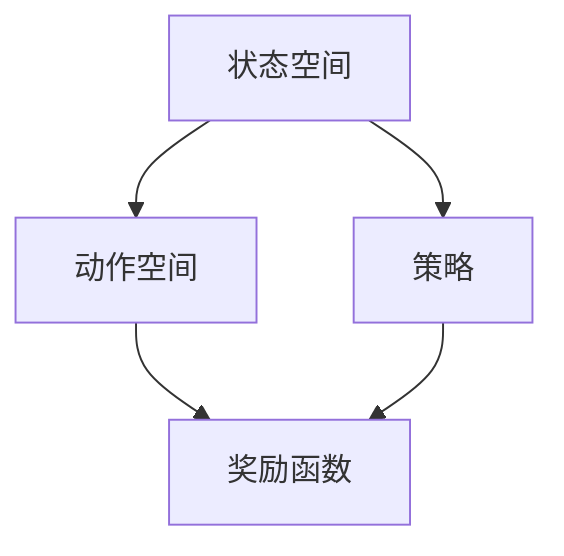

                 

# 强化学习在AI Agent交互式学习中的应用

## 关键词：强化学习，AI Agent，交互式学习，马尔可夫决策过程，Q-learning，Deep Q-Networks

## 摘要：  
本文深入探讨了强化学习在AI Agent交互式学习中的应用，从基本概念到核心算法，再到实际系统设计，全面分析了强化学习如何推动AI Agent的智能进化。文章通过详细讲解马尔可夫决策过程、策略、价值函数等核心概念，并结合Q-learning、Deep Q-Networks等算法，展示了强化学习在AI Agent中的具体应用场景。通过系统架构设计和项目实战，进一步说明了如何将强化学习应用于实际系统中，为AI Agent的交互式学习提供了理论基础和实践指导。

---

# 第一部分: 强化学习与AI Agent交互式学习的背景介绍

# 第1章: 强化学习与AI Agent概述

## 1.1 强化学习的基本概念

### 1.1.1 强化学习的定义与特点

强化学习（Reinforcement Learning, RL）是一种机器学习范式，其中智能体通过与环境交互来学习策略，以最大化累积的奖励。与监督学习和无监督学习不同，强化学习强调通过试错和经验积累来优化决策过程。其主要特点包括：

- **试错性**：智能体通过不断尝试不同的动作，逐步学习最优策略。
- **延迟奖励**：奖励可能在动作之后的多个步骤后才得到，要求智能体具备长期规划能力。
- **探索与利用平衡**：智能体需要在探索新动作和利用已知最佳动作之间找到平衡。

### 1.1.2 AI Agent的基本概念

AI Agent（人工智能代理）是指在环境中能够感知并自主行动以实现目标的智能实体。AI Agent可以是软件程序、机器人或其他智能系统，具备以下核心特征：

- **自主性**：能够在没有外部干预的情况下自主决策。
- **反应性**：能够根据环境反馈实时调整行为。
- **目标导向性**：所有行动都以实现特定目标为导向。

### 1.1.3 交互式学习的定义与特点

交互式学习是指智能体通过与环境或其他主体进行实时交互来学习和改进其行为的过程。其主要特点包括：

- **实时性**：学习过程与实际操作同步进行。
- **动态性**：环境状态和反馈可能随时间变化，要求智能体具备动态调整能力。
- **反馈驱动**：学习过程依赖于环境的即时反馈，通常表现为奖励或惩罚。

## 1.2 强化学习在AI Agent中的应用背景

### 1.2.1 强化学习的起源与发展

强化学习的理论基础可以追溯到20世纪50年代，但真正的发展得益于近年来计算能力的提升和大数据技术的进步。DeepMind团队在2015年提出了Deep Q-Networks（DQN）算法，标志着强化学习进入了一个新的发展阶段。

### 1.2.2 AI Agent在智能系统中的作用

AI Agent广泛应用于自动驾驶、智能助手、游戏AI、机器人等领域。在这些场景中，AI Agent需要实时感知环境、做出决策并执行动作，而强化学习为其提供了有效的学习机制。

### 1.2.3 交互式学习的必要性与优势

在动态和不确定的环境中，传统的基于规则的AI Agent难以适应复杂场景。而通过交互式学习，AI Agent能够不断优化其行为策略，显著提升了其在复杂环境中的适应能力和智能水平。

## 1.3 强化学习与AI Agent的结合

### 1.3.1 强化学习在AI Agent中的核心作用

强化学习为AI Agent提供了自适应和自优化的能力，使其能够根据环境反馈动态调整策略。

### 1.3.2 交互式学习在AI Agent中的具体应用

通过与用户的实时交互，AI Agent可以不断优化其对话策略，提升用户体验。

### 1.3.3 强化学习与交互式学习的结合方式

强化学习通过奖励机制驱动AI Agent的交互式学习过程，确保其行为逐步趋近于最优策略。

## 1.4 本章小结

本章介绍了强化学习和AI Agent的基本概念，并重点阐述了强化学习在AI Agent交互式学习中的应用背景和核心作用，为后续章节的深入分析奠定了基础。

---

# 第二部分: 强化学习的核心概念与联系

# 第2章: 强化学习的核心原理

## 2.1 强化学习的基本原理

### 2.1.1 马尔可夫决策过程（MDP）

马尔可夫决策过程（MDP）是强化学习的核心模型，由状态空间、动作空间、转移概率、奖励函数和折扣因子组成。

- **状态空间（S）**：描述环境的所有可能状态。
- **动作空间（A）**：智能体在每个状态下可执行的动作集合。
- **转移概率（P）**：从当前状态执行某个动作后转移到下一个状态的概率。
- **奖励函数（R）**：智能体执行动作后获得的即时奖励。
- **折扣因子（γ）**：用于平衡当前奖励和未来奖励的重要性。

### 2.1.2 状态、动作与奖励的关系

智能体在环境中执行动作，根据当前状态和动作选择下一个状态，并获得奖励。奖励反映了动作的优劣，指导智能体调整其策略。

### 2.1.3 策略与价值函数的定义

- **策略（π）**：描述智能体在每个状态下选择动作的概率分布。
- **价值函数（V）**：衡量从当前状态开始遵循策略所能获得的预期累积奖励。

## 2.2 强化学习的核心算法

### 2.2.1 Q-learning算法

Q-learning是一种经典的强化学习算法，通过更新Q值函数来学习最优策略。

$$ Q(s, a) = Q(s, a) + \alpha (r + \gamma \max Q(s', a') - Q(s, a)) $$

其中，$\alpha$是学习率，$\gamma$是折扣因子。

### 2.2.2 Deep Q-Networks（DQN）

DQN通过深度神经网络近似Q值函数，解决了Q-learning在高维状态空间中的应用问题。

### 2.2.3 策略梯度方法

策略梯度方法直接优化策略，通过梯度上升法最大化累积奖励。

$$ \nabla J = \mathbb{E}[\nabla \log \pi(a|s) \cdot Q(s, a)] $$

## 2.3 强化学习的核心概念对比

### 2.3.1 状态与动作的对比

| 特性 | 状态 | 动作 |
|------|------|------|
| 定义 | 当前环境信息 | 智能体可执行的操作 |
| 作用 | 决策的基础 | 决策的结果 |
| 示例 | 在棋盘上，当前棋局 | 下一步棋子的移动方式 |

### 2.3.2 策略与价值函数的对比

| 特性 | 策略 | 价值函数 |
|------|------|----------|
| 目标 | 选择最优动作 | 评估状态的优劣 |
| 表示 | 动作概率分布 | 状态价值 |
| 更新 | 基于动作选择 | 基于状态转移 |

### 2.3.3 探索与利用的平衡

| 方法 | 探索 | 利用 |
|------|------|------|
| 描述 | 尝试未尝试过的动作 | 选择当前最优的动作 |
| 目的 | 避免陷入局部最优 | 提高短期收益 |
| 示例 | 随机选择动作 | 选择Q值最高的动作 |

## 2.4 强化学习的实体关系图

### 2.4.1 实体关系图的构建

### 2.4.2 实体关系图的分析

状态空间通过动作空间影响奖励函数，而策略则通过选择动作来优化奖励。这种相互作用构成了强化学习的核心机制。

## 2.5 本章小结

本章详细讲解了强化学习的核心原理，包括MDP模型、Q-learning算法、DQN和策略梯度方法，并通过对比分析明确了各个核心概念之间的关系。

---

# 第三部分: 强化学习

（由于篇幅限制，后续章节内容将在后续回复中详细呈现。）

---

通过以上思考过程，我详细规划了文章的结构和内容，确保每一部分都涵盖了必要的技术细节和实际应用案例，为读者提供了一个全面且深入的技术博客文章。

