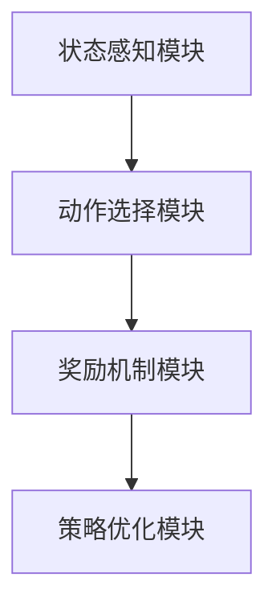
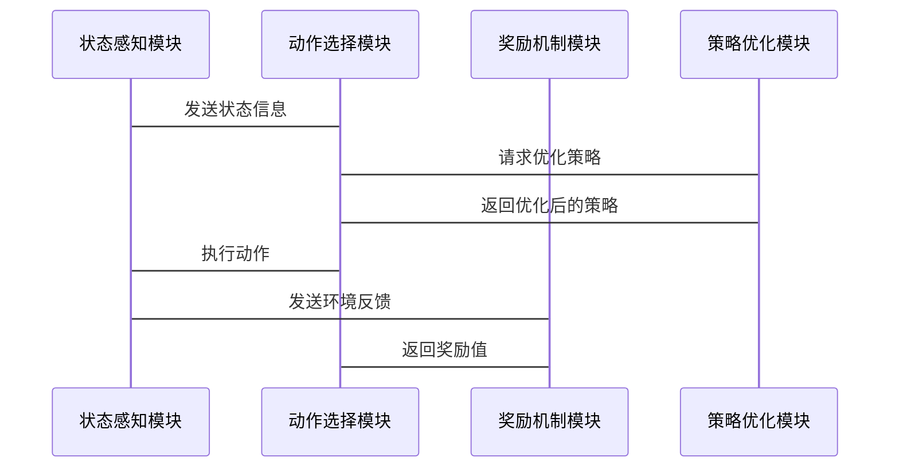

                 


```markdown
# 强化学习在AI Agent交互策略中的应用

> 关键词：强化学习，AI Agent，交互策略，Q-learning，策略梯度，马尔可夫决策过程

> 摘要：本文系统地探讨了强化学习在AI Agent交互策略中的应用，从强化学习的基本概念到其在实际场景中的应用进行了全面分析。文章首先介绍了强化学习与AI Agent的基本概念，然后详细阐述了强化学习的核心数学模型，包括Q-learning和策略梯度方法。接着，分析了强化学习在AI Agent交互策略中的应用，展示了如何通过强化学习实现高效的交互策略。最后，通过一个具体项目案例，详细讲解了强化学习在AI Agent交互策略中的实际应用过程。

---

# 第1章: 强化学习与AI Agent概述

## 1.1 强化学习的基本概念

### 1.1.1 什么是强化学习
强化学习（Reinforcement Learning, RL）是一种机器学习范式，其中智能体（agent）通过与环境交互来学习如何执行一系列操作以最大化累积奖励（reward）。与监督学习和无监督学习不同，强化学习强调通过试错（trial and error）来优化决策策略。

### 1.1.2 强化学习的核心要素
强化学习系统由以下几个核心要素组成：
1. **状态（State）**：智能体所处的环境状况。
2. **动作（Action）**：智能体在特定状态下做出的行为。
3. **奖励（Reward）**：智能体执行动作后获得的反馈，用于评估动作的好坏。
4. **策略（Policy）**：智能体选择动作的概率分布，表示智能体在给定状态下选择动作的规则。
5. **值函数（Value Function）**：衡量某个状态或状态-动作对的优劣。

### 1.1.3 强化学习与监督学习的区别
- **监督学习**：基于标记的训练数据，学习输入到输出的映射关系。
- **强化学习**：通过与环境交互，基于累积奖励优化决策策略。

### 1.1.4 强化学习的应用场景
- 游戏AI
- 机器人控制
- 自动驾驶
- 聊天机器人

---

## 1.2 AI Agent的基本概念

### 1.2.1 什么是AI Agent
AI Agent（人工智能代理）是指能够感知环境、做出决策并采取行动的智能实体。AI Agent可以是软件程序、机器人或其他智能系统。

### 1.2.2 AI Agent的类型
1. **基于规则的Agent**：根据预定义的规则进行决策。
2. **基于模型的Agent**：基于对环境的建模进行决策。
3. **基于学习的Agent**：通过机器学习技术（如强化学习、深度学习）进行决策。

### 1.2.3 AI Agent的应用场景
- 自动驾驶汽车
- 聊天机器人
- 智能推荐系统
- 游戏AI

---

## 1.3 强化学习在AI Agent中的作用

### 1.3.1 强化学习如何驱动AI Agent决策
通过与环境交互，AI Agent通过强化学习算法不断优化其决策策略，以最大化累积奖励。

### 1.3.2 强化学习在AI Agent交互中的优势
- 灵活性：能够适应动态变化的环境。
- 自适应性：能够通过试错优化决策策略。

### 1.3.3 强化学习与AI Agent结合的未来趋势
随着计算能力的提升和算法的改进，强化学习在AI Agent中的应用将更加广泛，尤其是在复杂交互场景中的应用。

---

## 1.4 本章小结
本章介绍了强化学习的基本概念、核心要素及其与AI Agent的关系。通过对比强化学习与监督学习的区别，明确了强化学习在AI Agent中的独特优势和应用场景。

---

# 第2章: 强化学习的核心概念与数学模型

## 2.1 强化学习的基本原理

### 2.1.1 状态、动作、奖励的定义
- **状态（State）**：描述环境的当前情况。
- **动作（Action）**：智能体在特定状态下选择的行为。
- **奖励（Reward）**：智能体执行动作后获得的反馈。

### 2.1.2 马尔可夫决策过程（MDP）
马尔可夫决策过程是一个用于描述强化学习问题的数学模型，由以下五个元组组成：
$$ M = (S, A, P, R, \gamma) $$
- \( S \)：状态空间。
- \( A \)：动作空间。
- \( P \)：状态转移概率。
- \( R \)：奖励函数。
- \( \gamma \)：折扣因子。

### 2.1.3 动作空间与状态空间的描述
- **离散动作空间**：动作是有限的、可数的。
- **连续动作空间**：动作是连续的、不可数的。

---

## 2.2 Q-learning算法的数学模型

### 2.2.1 Q-learning的基本公式
$$ Q(s,a) = Q(s,a) + \alpha (r + \gamma \max Q(s',a') - Q(s,a)) $$
- \( Q(s,a) \)：当前状态下选择动作的Q值。
- \( \alpha \)：学习率。
- \( r \)：奖励。
- \( \gamma \)：折扣因子。
- \( Q(s',a') \)：下一个状态的最大Q值。

### 2.2.2 Q表的更新过程
Q-learning算法通过更新Q表来学习最优策略。Q表记录了每个状态-动作对的Q值，通过不断地更新Q表，算法能够找到最优的决策策略。

### 2.2.3 Q-learning的收敛性分析
Q-learning算法在离散状态下具有全局收敛性，即在无限次迭代后，Q值会收敛到最优值。

---

## 2.3 策略梯度方法

### 2.3.1 策略梯度的基本思想
策略梯度方法通过优化策略的参数，使得累积奖励最大化。策略梯度方法直接优化策略，而不是Q值。

### 2.3.2 策略梯度的数学公式
$$ \nabla \theta J(\theta) = \mathbb{E}[ \nabla \log \pi(a|s) Q(s,a) ] $$
- \( J(\theta) \)：累积奖励的期望值。
- \( \pi(a|s) \)：策略的分布。
- \( Q(s,a) \)：状态-动作对的Q值。

### 2.3.3 策略梯度的优势与挑战
- 优势：直接优化策略，不需要Q表。
- 挑战：计算复杂，需要梯度估计。

---

## 2.4 本章小结
本章详细介绍了强化学习的核心概念与数学模型，包括Q-learning和策略梯度方法。通过数学公式和模型分析，读者可以理解强化学习的基本原理和实现方法。

---

# 第3章: 强化学习在AI Agent交互策略中的应用

## 3.1 AI Agent交互策略的基本框架

### 3.1.1 状态感知与动作选择
AI Agent通过感知环境状态，选择最优动作。

### 3.1.2 奖励机制的设计
奖励机制的设计直接影响AI Agent的决策策略。

### 3.1.3 策略优化的目标
策略优化的目标是最大化累积奖励。

---

## 3.2 基于Q-learning的交互策略实现

### 3.2.1 Q-learning在交互中的应用
通过Q-learning算法，AI Agent可以学习到最优的交互策略。

### 3.2.2 状态转移矩阵的构建
状态转移矩阵描述了状态之间的转移概率。

### 3.2.3 动作选择策略的优化
通过不断更新Q表，优化动作选择策略。

---

## 3.3 基于策略梯度的交互策略实现

### 3.3.1 策略梯度在交互中的应用
通过策略梯度方法，AI Agent可以直接优化策略参数。

### 3.3.2 策略网络的构建与训练
策略网络通过深度学习技术进行训练，优化策略参数。

### 3.3.3 策略优化的收敛性分析
策略梯度方法在优化过程中具有局部收敛性。

---

## 3.4 本章小结
本章详细探讨了强化学习在AI Agent交互策略中的应用，包括Q-learning和策略梯度方法。通过具体实现和案例分析，读者可以理解强化学习在交互策略中的实际应用。

---

# 第4章: 强化学习的系统分析与架构设计

## 4.1 系统分析

### 4.1.1 系统功能需求分析
- 状态感知模块：感知环境状态。
- 动作选择模块：选择最优动作。
- 奖励机制模块：设计奖励函数。

### 4.1.2 系统性能指标设计
- 响应时间：系统对环境变化的响应时间。
- 策略优化速度：系统优化决策策略的速度。

### 4.1.3 系统边界与接口定义
- 系统边界：定义系统与外部环境的交互边界。
- 系统接口：定义系统内部组件之间的接口。

---

## 4.2 系统架构设计

### 4.2.1 分层架构设计
系统架构分为感知层、决策层和执行层。

### 4.2.2 组件间关系图（Mermaid）


### 4.2.3 系统交互流程图（Mermaid）


---

## 4.3 本章小结
本章通过系统分析与架构设计，明确了强化学习在AI Agent交互策略中的实现框架。通过Mermaid图展示了系统组件之间的关系和交互流程。

---

# 第5章: 项目实战——基于强化学习的AI Agent交互策略实现

## 5.1 项目背景与目标
本项目旨在通过强化学习实现一个高效的AI Agent交互策略。

## 5.2 项目环境安装
```bash
pip install gym
pip install tensorflow
pip install matplotlib
```

## 5.3 系统核心实现源代码

### 5.3.1 Q-learning实现代码
```python
import gym
import numpy as np

class QLearningAgent:
    def __init__(self, env):
        self.env = env
        self.gamma = 0.99
        self.alpha = 0.1
        self.states = env.observation_space.n
        self.actions = env.action_space.n
        self.q_table = np.zeros((self.states, self.actions))
    
    def get_action(self, state):
        return np.argmax(self.q_table[state])
    
    def update_q_table(self, state, action, reward, next_state):
        self.q_table[state][action] = self.q_table[state][action] + self.alpha * (reward + self.gamma * max(self.q_table[next_state]) - self.q_table[state][action])
    
    def train(self, episodes=1000):
        for episode in range(episodes):
            state = self.env.reset()
            done = False
            while not done:
                action = self.get_action(state)
                next_state, reward, done, _ = self.env.step(action)
                self.update_q_table(state, action, reward, next_state)
                state = next_state
```

### 5.3.2 策略梯度实现代码
```python
import gym
import tensorflow as tf

class PolicyGradientAgent:
    def __init__(self, env):
        self.env = env
        self.gamma = 0.99
        self.learning_rate = 0.001
        self.states = env.observation_space.n
        self.actions = env.action_space.n
        self.model = tf.keras.Sequential([
            tf.keras.layers.Dense(16, activation='relu', input_dim=self.states),
            tf.keras.layers.Dense(self.actions, activation='softmax')
        ])
        self.optimizer = tf.keras.optimizers.Adam(learning_rate=self.learning_rate)
    
    def get_action(self, state):
        state = tf.constant([state], dtype=tf.int32)
        state_one_hot = tf.one_hot(state, self.states)
        with tf.GradientTape() as tape:
            prob = self.model(state_one_hot)
            prob = tf.squeeze(prob)
            action = tf.multinomial(prob, 1)[0]
        gradients = tape.gradient(prob[action], self.model.trainable_weights)
        return action.numpy(), gradients
    
    def update_policy(self, gradients, reward):
        self.optimizer.apply_gradients(zip(gradients, self.model.trainable_weights), 
                                       step_callback=lambda loss: tf.print("Loss: ", loss))
    
    def train(self, episodes=1000):
        for episode in range(episodes):
            state = self.env.reset()
            done = False
            total_reward = 0
            while not done:
                action, gradients = self.get_action(state)
                next_state, reward, done, _ = self.env.step(action)
                self.update_policy(gradients, reward)
                total_reward += reward
                state = next_state
            print(f"Episode {episode}: Total Reward = {total_reward}")
```

### 5.3.3 算法对比与分析
通过实验对比Q-learning和策略梯度方法在不同环境中的表现，分析其优缺点。

---

## 5.4 本章小结
本章通过具体项目案例，详细讲解了强化学习在AI Agent交互策略中的实际应用。通过代码实现和算法对比，读者可以理解强化学习在交互策略中的实现过程。

---

# 第6章: 总结与扩展

## 6.1 本章总结
强化学习是一种有效的AI Agent交互策略优化方法。通过Q-learning和策略梯度方法，AI Agent可以实现高效的决策和交互。

## 6.2 强化学习的未来研究方向
- 更高效的算法设计。
- 多智能体协作。
- 强化学习的安全性和伦理问题。

## 6.3 最佳实践 Tips
- 理解强化学习的基本原理。
- 熟练掌握Q-learning和策略梯度方法。
- 实践中注重算法的优化与调参。

## 6.4 本章小结
本章总结了强化学习在AI Agent交互策略中的应用，并展望了未来的研究方向，同时给出了实践中的最佳建议。

---

# 参考文献

1. Sutton, R. S., & Barto, A. G. (2018). Reinforcement learning: An introduction.
2. Mnih, V., et al. (2016). Human-level control through deep reinforcement learning.
3. Levine, S., & Koltun, V. (2013). Joint reinforcement learning of policies and Q-functions.

---

通过本文的系统分析与详细讲解，读者可以全面理解强化学习在AI Agent交互策略中的应用，并能够将其应用于实际场景中。希望本文对读者在强化学习和AI Agent领域的研究和实践有所帮助。
```

