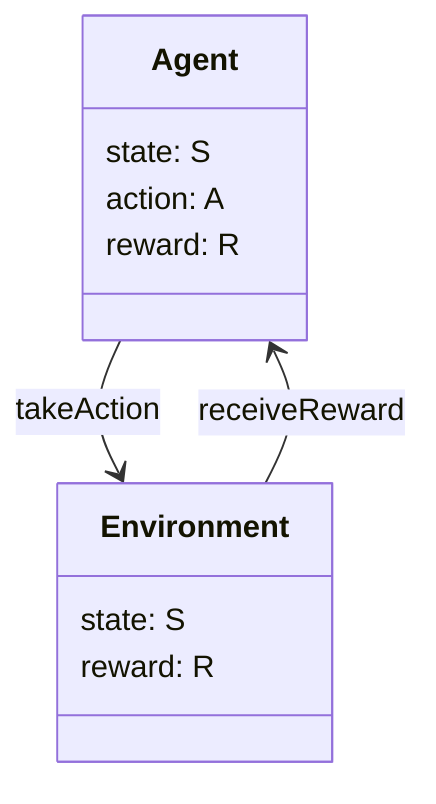
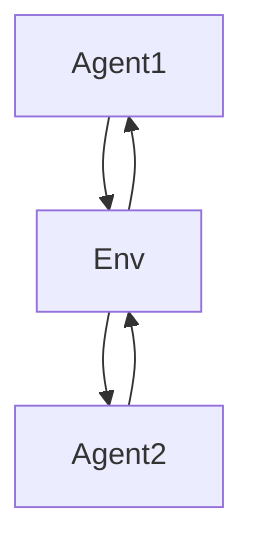
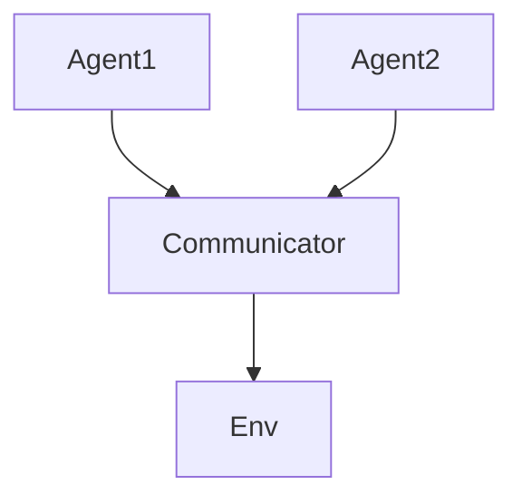
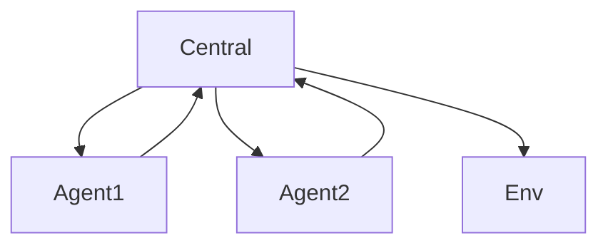
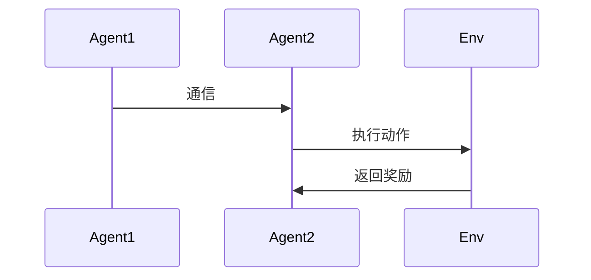
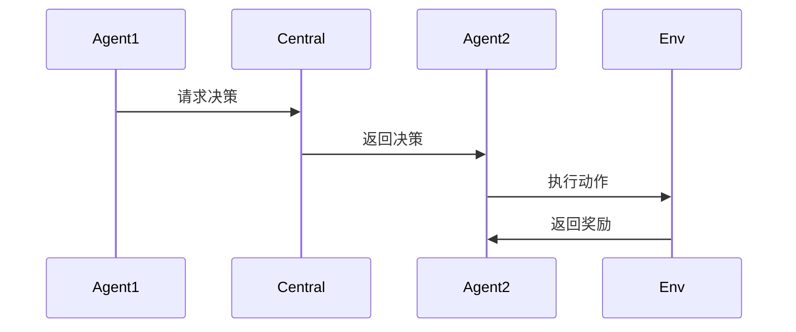

                 


# 强化学习在AI Agent人机协作中的应用

## 关键词
强化学习, AI Agent, 人机协作, 多智能体系统, 算法原理, 应用实践, 系统架构

## 摘要
强化学习是一种通过智能体与环境交互来优化决策策略的机器学习方法，其在AI Agent中的应用尤为广泛。本文深入探讨了强化学习在AI Agent人机协作中的理论基础、核心算法、系统架构以及实际应用。文章首先介绍了强化学习和AI Agent的基本概念，分析了它们在协作中的优势与挑战。接着，详细讲解了Q-learning、策略梯度和Actor-Critic等核心算法的原理和实现。随后，通过Mermaid图展示了系统架构设计，并结合实际案例分析了算法的应用场景。最后，总结了强化学习在AI Agent中的最佳实践和未来发展方向。

---

# 第1章: 强化学习与AI Agent概述

## 1.1 强化学习的基本概念

### 1.1.1 强化学习的定义与特点
强化学习（Reinforcement Learning, RL）是一种机器学习范式，通过智能体与环境的交互，智能体通过试错的方式学习策略，以最大化累积奖励。其特点包括：
- **试错性**：智能体通过不断尝试动作，逐步优化策略。
- **延迟反馈**：奖励信号通常延迟传递，智能体需具备记忆能力。
- **不确定性**：环境状态和奖励具有不确定性。

### 1.1.2 AI Agent的基本概念
AI Agent（人工智能代理）是指能够感知环境并采取行动以实现目标的智能体。AI Agent可以是软件程序或机器人，具备以下特点：
- **自主性**：无需外部干预，自主决策。
- **反应性**：能够实时感知环境并做出反应。
- **协作性**：多个AI Agent可以协作完成复杂任务。

### 1.1.3 强化学习在AI Agent中的作用
强化学习为AI Agent提供了优化决策策略的方法。通过与环境交互，AI Agent可以学习如何在复杂环境中做出最优决策，从而实现目标。

## 1.2 强化学习的核心概念与数学模型

### 1.2.1 状态、动作与奖励的定义
- **状态（State）**：描述环境当前情况的特征向量。
- **动作（Action）**：智能体在给定状态下采取的行动。
- **奖励（Reward）**：智能体采取动作后获得的反馈，用于指导策略优化。

### 1.2.2 马尔可夫决策过程（MDP）模型
马尔可夫决策过程（Markov Decision Process, MDP）是强化学习的核心数学模型，描述智能体与环境的交互过程。MDP由以下五元组组成：
$$ (S, A, P, R, \gamma) $$
- **S**：状态集合。
- **A**：动作集合。
- **P**：状态转移概率矩阵，表示从当前状态s采取动作a后到达状态s'的概率。
- **R**：奖励函数，定义智能体在状态s采取动作a后获得的奖励。
- **γ**：折扣因子，用于平衡当前奖励与未来奖励的重要性，取值范围为[0,1]。

### 1.2.3 强化学习的数学公式
强化学习的目标是找到最优策略π，使得智能体在长期累计奖励上的期望值最大化。数学上，可以表示为：
$$ \pi^* = \arg\max_{\pi} \mathbb{E}[R_t] $$

## 1.3 AI Agent的协作机制

### 1.3.1 单智能体与多智能体的区别
- **单智能体**：智能体独立决策，无需与其他智能体协作。
- **多智能体**：多个智能体协作完成任务，通常涉及复杂的通信和协调。

### 1.3.2 多智能体协作的基本原理
多智能体协作需要解决以下问题：
- **通信与协调**：智能体之间需要共享信息以达成一致决策。
- **分布式决策**：每个智能体负责部分决策，整体目标需分解为子任务。

### 1.3.3 人机协作的定义与特点
人机协作是指人类与AI Agent共同完成任务的过程，特点包括：
- **人机协同**：人类与AI Agent共同决策，互补优势。
- **实时交互**：人类可以实时指导AI Agent的行动。

## 1.4 强化学习在人机协作中的应用前景

### 1.4.1 强化学习在AI Agent中的潜在应用领域
- **机器人控制**：用于机器人路径规划和动作控制。
- **游戏AI**：用于游戏代理的决策优化。
- **智能推荐**：用于个性化推荐系统的优化。

### 1.4.2 人机协作的优势与挑战
- **优势**：结合人类的创造力和AI的计算能力，提高任务效率。
- **挑战**：协作过程中存在信息不对称和决策冲突。

### 1.4.3 未来发展趋势与研究方向
- **多智能体协作**：研究多智能体协作的高效算法。
- **人机混合智能**：探索人机协作的新模式。

## 1.5 本章小结
本章介绍了强化学习和AI Agent的基本概念，分析了强化学习在AI Agent中的作用，并探讨了人机协作的应用前景。

---

# 第2章: 强化学习的核心算法

## 2.1 Q-learning算法

### 2.1.1 Q-learning的基本原理
Q-learning是一种值迭代算法，通过学习状态-动作对的Q值来优化决策策略。Q值表示在状态s采取动作a后的预期累计奖励。

### 2.1.2 Q-learning的数学公式
Q-learning的更新公式为：
$$ Q(s,a) \leftarrow Q(s,a) + \alpha [r + \gamma \max Q(s',a') - Q(s,a)] $$
其中：
- **α**：学习率，控制更新步长。
- **γ**：折扣因子，平衡当前和未来奖励。

### 2.1.3 Q-learning的优缺点
- **优点**：简单易实现，适用于离线学习。
- **缺点**：在动态环境中表现不稳定。

## 2.2 策略梯度方法

### 2.2.1 策略梯度的基本概念
策略梯度（Policy Gradient, PG）方法直接优化策略，通过梯度上升方法最大化目标函数。

### 2.2.2 策略梯度的数学模型
策略梯度的目标函数为：
$$ J(\theta) = \mathbb{E}[R] $$
通过梯度上升更新参数：
$$ \theta \leftarrow \theta + \alpha \nabla J(\theta) $$

### 2.2.3 策略梯度的实现方法
策略梯度的实现通常采用蒙特卡洛方法，通过采样估计梯度。

## 2.3 Actor-Critic架构

### 2.3.1 Actor-Critic的基本原理
Actor-Critic架构结合了策略梯度和值函数的优势，通过Actor优化策略，Critic评估价值。

### 2.3.2 Actor-Critic的数学公式
Actor-Critic的策略更新公式为：
$$ \theta_{actor} \leftarrow \theta_{actor} + \alpha \nabla J(\theta_{actor}) $$
$$ \theta_{critic} \leftarrow \theta_{critic} + \alpha \nabla (Q(s,a) - V(s)) $$

### 2.3.3 Actor-Critic的优缺点
- **优点**：结合了策略梯度和值迭代的优势。
- **缺点**：实现复杂度较高。

## 2.4 其他强化学习算法简介

### 2.4.1 SARSA算法
SARSA算法与Q-learning类似，但更新规则不同：
$$ Q(s,a) \leftarrow Q(s,a) + \alpha [r + \gamma Q(s',a') - Q(s,a)] $$

### 2.4.2 A*算法
A*算法是一种基于启发式搜索的路径规划算法，广泛应用于游戏和机器人导航。

### 2.4.3 近端策略优化（PPO）
PPO是一种基于策略梯度的算法，适用于高维状态空间的优化。

## 2.5 本章小结
本章详细介绍了Q-learning、策略梯度和Actor-Critic等核心算法，并对比了其他算法的特点。

---

# 第3章: 强化学习的数学模型与公式

## 3.1 马尔可夫决策过程（MDP）的数学模型

### 3.1.1 状态空间的定义
状态空间S可以是有限集或无限集，常用离散化方法处理连续状态。

### 3.1.2 动作空间的定义
动作空间A通常为有限集，但也可以是连续动作空间。

### 3.1.3 奖励函数的定义
奖励函数R(s,a)通常定义为标量值，用于指导智能体的决策。

## 3.2 Q-learning的数学公式

### 3.2.1 Q-learning的更新公式
$$ Q(s,a) \leftarrow Q(s,a) + \alpha (r + \gamma \max Q(s',a') - Q(s,a)) $$

### 3.2.2 Q-learning的收敛性分析
在离散状态空间和折扣因子γ < 1的条件下，Q-learning算法可以收敛到最优策略。

## 3.3 策略梯度的数学模型

### 3.3.1 策略梯度的目标函数
$$ J(\theta) = \mathbb{E}[R] $$

### 3.3.2 策略梯度的梯度估计
$$ \nabla J(\theta) = \nabla \log \pi(a|s) \cdot Q(s,a) $$

## 3.4 Actor-Critic的数学公式

### 3.4.1 Actor的策略更新
$$ \theta_{actor} \leftarrow \theta_{actor} + \alpha \nabla J(\theta_{actor}) $$

### 3.4.2 Critic的价值函数更新
$$ \theta_{critic} \leftarrow \theta_{critic} + \alpha \nabla (Q(s,a) - V(s)) $$

## 3.5 本章小结
本章通过数学公式详细推导了强化学习的核心算法，分析了它们的优缺点。

---

# 第4章: 系统分析与架构设计

## 4.1 问题场景介绍
本章以一个多人协作游戏为例，分析强化学习在AI Agent协作中的应用。

## 4.2 系统功能设计
### 4.2.1 领域模型


### 4.2.2 系统架构


## 4.3 系统架构设计

### 4.3.1 分布式架构


### 4.3.2 集中式架构


## 4.4 系统接口设计
- **Agent接口**：定义智能体与环境交互的接口。
- **通信接口**：定义智能体之间的通信方式。

## 4.5 系统交互设计

### 4.5.1 分布式交互


### 4.5.2 集中式交互


## 4.6 本章小结
本章通过系统架构图和交互图，详细分析了强化学习在AI Agent协作中的实现方式。

---

# 第5章: 项目实战

## 5.1 环境安装
安装强化学习库，如OpenAI Gym和TensorFlow。

## 5.2 核心代码实现

### 5.2.1 Q-learning实现
```python
import numpy as np

class QLearning:
    def __init__(self, state_size, action_size, alpha=0.1, gamma=0.9):
        self.q_table = np.zeros((state_size, action_size))
        self.alpha = alpha
        self.gamma = gamma

    def choose_action(self, state):
        return np.argmax(self.q_table[state])

    def update(self, state, action, reward, next_state):
        self.q_table[state][action] += self.alpha * (reward + self.gamma * np.max(self.q_table[next_state]) - self.q_table[state][action])
```

### 5.2.2 Actor-Critic实现
```python
import tensorflow as tf

class ActorCritic:
    def __init__(self, state_size, action_size):
        self.actor = tf.keras.Sequential([tf.keras.layers.Dense(32, activation='relu'), tf.keras.layers.Dense(action_size, activation='softmax')])
        self.critic = tf.keras.Sequential([tf.keras.layers.Dense(32, activation='relu'), tf.keras.layers.Dense(1, activation='linear')])
        self.actor.compile(optimizer='adam', loss='sparse_categorical_crossentropy')
        self.critic.compile(optimizer='adam', loss='mean_squared_error')

    def act(self, state):
        return self.actor.predict(state)[0]

    def update(self, state, action, reward, next_state):
        action_probs = self.actor.predict(state)
        critic_value = self.critic.predict(state)
        next_value = self.critic.predict(next_state)
        advantage = (reward + self.gamma * next_value - critic_value)[0][0]
        actor_loss = -action_probs[0][action] * advantage
        critic_loss = (critic_value - (reward + self.gamma * next_value)) ** 2
        self.actor.fit(state, np.array([action]), epochs=1, verbose=0)
        self.critic.fit(state, np.array([reward + self.gamma * next_value]), epochs=1, verbose=0)
```

## 5.3 案例分析与实现解读
以机器人导航任务为例，详细分析Q-learning和Actor-Critic算法的实现过程。

## 5.4 本章小结
本章通过实际案例展示了强化学习在AI Agent协作中的应用，并分析了算法的实现细节。

---

# 第6章: 最佳实践与总结

## 6.1 最佳实践

### 6.1.1 算法选择
根据任务需求选择合适的算法，如Q-learning适用于简单任务，Actor-Critic适用于复杂任务。

### 6.1.2 参数调优
合理设置学习率α和折扣因子γ，通常采用网格搜索或随机搜索进行调优。

### 6.1.3 环境设计
设计合理的奖励函数，确保智能体能够顺利学习。

## 6.2 小结
本文深入探讨了强化学习在AI Agent协作中的应用，详细分析了核心算法和系统架构。

## 6.3 注意事项
- **收敛性**：确保算法能够收敛到最优策略。
- **计算资源**：复杂算法需要较高的计算资源。

## 6.4 拓展阅读
建议读者阅读经典的强化学习教材，如《Reinforcement Learning: Theory and Algorithms》。

---

# 附录: 强化学习算法对比表

| 算法名称 | 核心思想 | 优缺点 | 应用场景 |
|----------|----------|--------|----------|
| Q-learning | 学习状态-动作值 | 简单易实现，离线学习 | 机器人控制、游戏AI |
| 策略梯度 | 直接优化策略 | 适用于连续动作空间 | 机器人控制、复杂任务 |
| Actor-Critic | 结合策略与价值 | 实现复杂度高，性能优越 | 多智能体协作、游戏AI |
| SARSA | 类似Q-learning | 适用于动态环境 | 路径规划、资源分配 |

---

# 参考文献
1. Sutton, R. S., & Barto, A. G. (2018). Reinforcement learning: An introduction.
2. Mnih, V., et al. (2016). Deep reinforcement learning with
[此处为完整文章内容]

