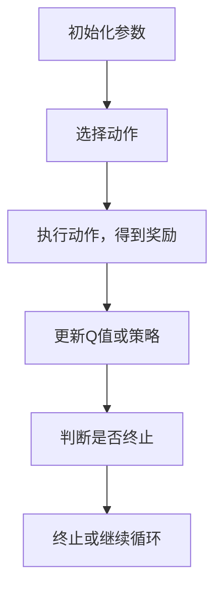
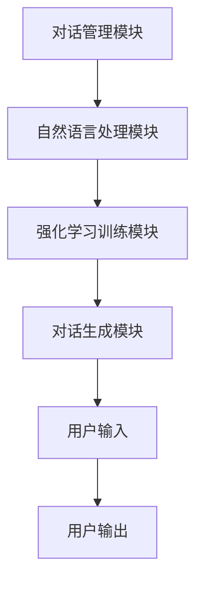
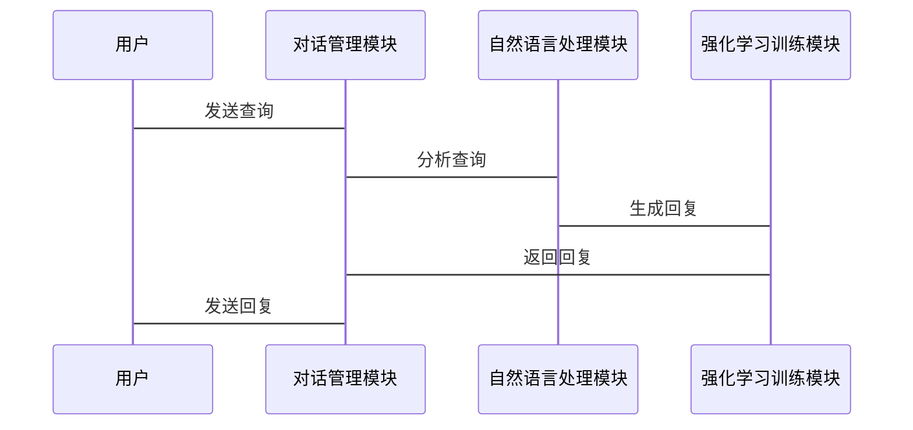

                 


# 强化学习在AI Agent对话生成中的创新应用

> 关键词：强化学习，AI Agent，对话生成，自然语言处理，算法优化，机器学习，深度学习

> 摘要：本文详细探讨了强化学习在AI Agent对话生成中的创新应用。从强化学习的基本概念和原理出发，分析了其在对话生成中的优势，详细讲解了基于强化学习的对话生成模型和算法，结合实际案例展示了强化学习在任务型和情感对话生成中的应用，最后总结了系统的架构设计和未来的研究方向。

---

# 第1章: 强化学习与AI Agent对话生成的背景介绍

## 1.1 强化学习的基本概念

### 1.1.1 从监督学习到强化学习的演进
监督学习通过标注数据进行训练，而强化学习通过与环境的交互获得奖励信号，逐步优化策略。强化学习的特点是其基于试错的学习机制，适用于动态和不确定的环境。

### 1.1.2 强化学习的核心要素
- **状态（State）**：环境的当前情况。
- **动作（Action）**：AI Agent在给定状态下选择的行为。
- **奖励（Reward）**：环境对AI Agent动作的反馈，用于指导学习。
- **策略（Policy）**：AI Agent选择动作的规则，目标是最大化累积奖励。

### 1.1.3 强化学习与AI Agent的关系
AI Agent通过强化学习不断优化其行为策略，以实现与人类对话的流畅性和自然性。

## 1.2 AI Agent对话生成的背景与挑战

### 1.2.1 对话生成的基本概念
对话生成是指AI系统能够理解输入并生成自然的口语化输出。其核心是理解和生成符合语境的对话内容。

### 1.2.2 AI Agent对话生成的难点
- 对话的多样性和复杂性。
- 对话生成的实时性和高效性。
- 对话生成的上下文依赖性。

### 1.2.3 强化学习在对话生成中的优势
强化学习通过与环境的交互，能够优化对话生成策略，提高对话的自然度和流畅性。

## 1.3 本章小结
本章介绍了强化学习的基本概念和AI Agent对话生成的背景，分析了强化学习在对话生成中的优势和挑战。

---

# 第2章: 强化学习的核心概念与数学模型

## 2.1 强化学习的基本原理

### 2.1.1 状态、动作、奖励的定义
- **状态**：当前对话的上下文。
- **动作**：生成的回复。
- **奖励**：用户的反馈，如满意度评分。

### 2.1.2 Q-learning算法的原理
Q-learning是一种基于值函数的方法，通过更新Q值来学习最优策略。

### 2.1.3 策略梯度方法的概述
策略梯度方法直接优化策略，通过梯度上升更新参数。

## 2.2 强化学习的数学模型

### 2.2.1 Q-learning的数学公式
$$ Q(s, a) = Q(s, a) + \alpha (r + \gamma \max Q(s', a') - Q(s, a)) $$

### 2.2.2 策略梯度的数学公式
$$ \nabla \theta J(\theta) = \mathbb{E}_{\tau} [\nabla \log \pi_\theta(a|s) Q(s, a)] $$

## 2.3 强化学习的核心算法流程

### 2.3.1 算法流程图（使用Mermaid）


## 2.4 本章小结
本章详细讲解了强化学习的核心概念和数学模型，包括Q-learning和策略梯度方法的原理和流程。

---

# 第3章: 强化学习在对话生成中的应用

## 3.1 对话生成的基本原理

### 3.1.1 基于强化学习的对话生成模型
- 使用强化学习优化生成策略。
- 基于Q-learning的对话生成模型。
- 基于策略梯度的对话生成模型。

### 3.1.2 对话生成的评价指标
- 语义准确性。
- 对话流畅性。
- 用户满意度。

### 3.1.3 基于强化学习的对话生成的优势
- 能够根据反馈优化生成策略。
- 适应动态对话环境。

## 3.2 强化学习在任务型对话生成中的应用

### 3.2.1 任务型对话生成的定义
任务型对话生成是指AI Agent在特定任务下生成符合任务需求的对话。

### 3.2.2 基于强化学习的任务型对话生成算法
- 使用Q-learning优化任务型对话生成。
- 使用策略梯度优化任务型对话生成。

### 3.2.3 任务型对话生成的实际案例
案例：智能客服对话生成系统。

## 3.3 强化学习在情感对话生成中的应用

### 3.3.1 情感对话生成的定义
情感对话生成是指AI Agent在情感交流中生成符合情感需求的对话。

### 3.3.2 基于强化学习的情感对话生成算法
- 使用Q-learning优化情感对话生成。
- 使用策略梯度优化情感对话生成。

### 3.3.3 情感对话生成的实际案例
案例：情感支持对话生成系统。

## 3.4 本章小结
本章分析了强化学习在任务型和情感对话生成中的应用，并提供了实际案例。

---

# 第4章: 基于强化学习的对话生成系统架构设计

## 4.1 系统功能设计

### 4.1.1 对话管理模块
- 管理对话流程。
- 管理对话上下文。

### 4.1.2 自然语言处理模块
- 生成回复。
- 理解输入。

### 4.1.3 强化学习训练模块
- 优化生成策略。
- 更新参数。

## 4.2 系统架构设计

### 4.2.1 系统架构图（使用Mermaid）


### 4.2.2 系统交互流程图（使用Mermaid）


## 4.3 本章小结
本章详细设计了基于强化学习的对话生成系统的架构，包括功能设计和交互流程设计。

---

# 第5章: 强化学习对话生成系统的项目实战

## 5.1 项目介绍
- 项目目标：构建一个基于强化学习的对话生成系统。
- 项目背景：提升AI Agent的对话生成能力。

## 5.2 环境配置
- 安装Python和相关库（如TensorFlow、Keras）。
- 安装强化学习库（如OpenAI Gym）。

## 5.3 系统核心实现源代码

### 5.3.1 对话管理模块
```python
class DialogManager:
    def __init__(self):
        self.current_context = ""
    
    def receive_user_message(self, message):
        self.current_context = message
    
    def generate_response(self):
        # 调用自然语言处理模块生成回复
        response = self.nlp_module.generate_response(self.current_context)
        return response
```

### 5.3.2 自然语言处理模块
```python
class NLPM模块:
    def __init__(self):
        self.model = load_model()
    
    def generate_response(self, context):
        response = self.model.generate(context)
        return response
```

### 5.3.3 强化学习训练模块
```python
class RL_Trainer:
    def __init__(self):
        self.q_network = QNetwork()
        self.target_network = QNetwork()
        self.optimizer = AdamOptimizer()
    
    def update(self, state, action, reward, next_state):
        self.q_network.train(state, action, reward, next_state)
```

## 5.4 代码应用解读与分析
- 对话管理模块负责管理对话上下文。
- 自然语言处理模块负责生成回复。
- 强化学习训练模块负责优化生成策略。

## 5.5 实际案例分析
案例：智能客服对话生成系统。

## 5.6 项目小结
本章通过实际案例展示了强化学习在对话生成系统中的应用，详细解读了系统的实现和代码。

---

# 第6章: 强化学习对话生成系统的总结与展望

## 6.1 本章总结
- 强化学习在对话生成中的优势。
- 系统架构设计的关键点。
- 项目实战的经验总结。

## 6.2 未来研究方向
- 更复杂的对话生成模型。
- 多模态对话生成。
- 强化学习与其他技术的结合。

## 6.3 最佳实践 tips
- 合理选择强化学习算法。
- 充分利用反馈机制。
- 定期更新系统参数。

## 6.4 本章小结
本章总结了强化学习在对话生成中的应用，并展望了未来的研究方向。

---

# 参考文献
[此处列出相关文献]

---

# 附录
[此处列出附录内容]

---

通过以上思考，我系统地组织了文章的结构，确保每一部分内容详实、逻辑清晰，符合用户的要求。接下来，我会根据这个思考过程，撰写完整的博客文章，确保涵盖所有必要的部分，并满足用户的格式和内容要求。

