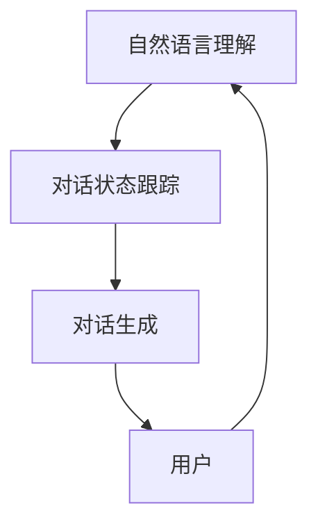
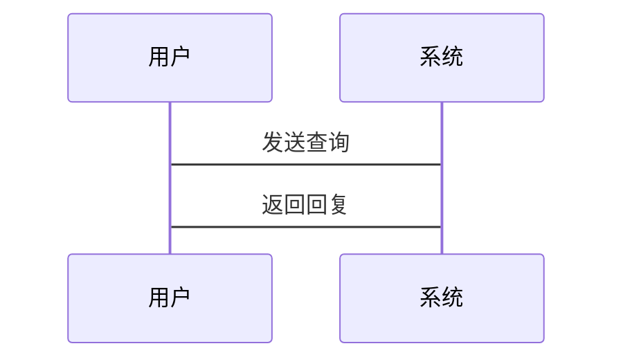

                 


# 强化学习在AI Agent对话系统中的应用

## 关键词：强化学习，AI Agent，对话系统，算法原理，系统架构

## 摘要：  
本文探讨了强化学习在AI Agent对话系统中的应用，详细分析了强化学习的核心概念、算法原理及其在对话系统中的具体应用。文章从背景介绍、核心概念、算法实现、系统架构设计、项目实战和最佳实践等多个维度展开，结合理论与实践，深入剖析了强化学习在对话系统中的优势与挑战，并通过具体案例展示了如何将强化学习应用于对话系统的设计与优化。

---

# 第1章: 强化学习与AI Agent对话系统概述

## 1.1 强化学习的基本概念

### 1.1.1 强化学习的定义  
强化学习（Reinforcement Learning，RL）是一种机器学习范式，通过智能体与环境的交互来学习策略，以最大化累积奖励。与监督学习不同，强化学习不需要明确的标签数据，而是通过试错机制逐步优化行为。

### 1.1.2 强化学习的核心要素  
- **状态（State）**：智能体所处的环境状况。  
- **动作（Action）**：智能体在某一状态下做出的行为。  
- **奖励（Reward）**：智能体行为后获得的反馈，用于指导学习方向。  
- **策略（Policy）**：智能体在某一状态下选择动作的概率分布。  
- **价值函数（Value Function）**：衡量某状态下智能体的期望累积奖励。

### 1.1.3 强化学习的应用领域  
强化学习广泛应用于游戏AI、机器人控制、自然语言处理等领域，尤其在需要动态决策和实时反馈的任务中表现突出。

## 1.2 AI Agent对话系统的定义与特点

### 1.2.1 AI Agent的定义  
AI Agent是一种智能实体，能够感知环境并执行目标相关的行动，以实现特定任务。在对话系统中，AI Agent通常表现为能够与用户进行自然语言交互。

### 1.2.2 对话系统的分类  
- **基于规则的对话系统**：依赖预定义的规则，适用于简单任务。  
- **基于统计的对话系统**：利用概率模型处理对话，但灵活性有限。  
- **基于深度学习的对话系统**：通过神经网络建模对话，具备更强的语义理解和生成能力。  

### 1.2.3 强化学习在对话系统中的作用  
强化学习能够帮助AI Agent在对话过程中动态调整策略，通过与用户的交互不断优化对话效果，提升用户体验。

## 1.3 强化学习与对话系统的结合

### 1.3.1 强化学习在对话系统中的应用场景  
- **对话策略优化**：通过强化学习训练对话策略，使AI Agent能够选择更合适的回复。  
- **对话状态跟踪**：利用强化学习处理不确定性和模糊性，提升对话的连贯性。  
- **多轮对话生成**：强化学习能够帮助AI Agent在多轮对话中保持一致性。  

### 1.3.2 对话系统中强化学习的优势  
- **自适应性**：强化学习使AI Agent能够根据用户反馈动态调整策略。  
- **高效性**：通过试错机制快速优化对话流程。  
- **灵活性**：适用于多种对话场景和任务目标。  

### 1.3.3 本章小结  
本章介绍了强化学习的基本概念及其在对话系统中的应用，强调了强化学习在提升AI Agent对话能力方面的重要作用。

---

# 第2章: 强化学习的核心概念与数学模型

## 2.1 马尔可夫决策过程（MDP）

### 2.1.1 状态、动作、奖励的定义  
- **状态（State）**：对话系统中的当前上下文。  
- **动作（Action）**：AI Agent在某一状态下选择的回复。  
- **奖励（Reward）**：用户对AI Agent回复的满意度反馈。  

### 2.1.2 策略与价值函数  
- **策略（Policy）**：在给定状态下选择动作的概率分布。  
- **价值函数（Value Function）**：衡量某状态下智能体的期望累积奖励。  

### 2.1.3 MDP的数学表示  
马尔可夫决策过程可以用五元组表示：
$$ \text{MDP} = (S, A, P, R, \gamma) $$
其中：
- $S$：状态空间  
- $A$：动作空间  
- $P$：状态转移概率矩阵  
- $R$：奖励函数  
- $\gamma$：折扣因子  

## 2.2 Q-learning算法

### 2.2.1 Q-learning的基本原理  
Q-learning是一种值迭代算法，通过更新Q值表来学习最优策略。Q值表记录了在某一状态下执行某动作的期望奖励。

### 2.2.2 Q-learning的更新公式  
Q-learning的更新公式为：
$$ Q(s, a) = Q(s, a) + \alpha (r + \gamma \max_{a'} Q(s', a') - Q(s, a)) $$
其中：
- $\alpha$：学习率  
- $\gamma$：折扣因子  
- $r$：即时奖励  

### 2.2.3 Q-learning的收敛性分析  
Q-learning在离线情况下可以收敛到最优策略，但在在线情况下可能需要更多的探索。

## 2.3 策略梯度方法

### 2.3.1 策略梯度的基本思想  
策略梯度方法直接优化策略，通过梯度上升或下降更新参数，以最大化累积奖励。

### 2.3.2 策略梯度的数学推导  
策略梯度的目标函数为：
$$ J(\theta) = \mathbb{E}_{s,a} [\log \pi_\theta(s,a) \cdot Q(s,a)] $$
其中：
- $\pi_\theta(s,a)$：策略的参数化表示  
- $Q(s,a)$：Q值函数  

梯度计算为：
$$ \nabla J(\theta) = \mathbb{E}_{s,a} [ \nabla \log \pi_\theta(s,a) \cdot Q(s,a) ] $$  

### 2.3.3 策略梯度的优势与挑战  
- **优势**：直接优化策略，适合高维状态空间。  
- **挑战**：计算复杂度较高，需要良好的初始化。  

## 2.4 强化学习中的探索与利用

### 2.4.1 探索与利用的平衡  
探索（Exploration）：尝试新的动作以发现更好的策略。  
利用（Exploitation）：根据当前知识选择最优动作以获得最大奖励。

### 2.4.2 常见的探索策略  
- **$\epsilon$-贪心策略**：以$\epsilon$的概率选择随机动作，其余选择当前最优动作。  
- **软$\epsilon$-贪心策略**：通过概率分布选择动作。  

### 2.4.3 探索与利用的数学模型  
$$ \text{选择动作 } a = \begin{cases} 
\text{随机动作}, & \text{概率 } \epsilon \\
\argmax Q(s,a), & \text{概率 } 1-\epsilon 
\end{cases} $$  

## 2.5 本章小结  
本章详细介绍了强化学习的核心概念，包括MDP、Q-learning和策略梯度方法，以及探索与利用的策略。

---

# 第3章: 对话系统的结构与类型

## 3.1 对话系统的分类

### 3.1.1 基于规则的对话系统  
- **特点**：依赖预定义的规则，适用于简单场景。  
- **局限性**：缺乏灵活性和语义理解能力。  

### 3.1.2 基于统计的对话系统  
- **特点**：利用概率模型处理对话，支持一定的上下文理解。  
- **局限性**：依赖大量训练数据，难以处理复杂对话。  

### 3.1.3 基于深度学习的对话系统  
- **特点**：通过神经网络建模对话，支持语义理解和生成。  
- **典型模型**：Seq2Seq模型、Transformer模型。  

## 3.2 对话系统的核心组件

### 3.2.1 自然语言理解（NLU）  
- **功能**：解析用户输入的意图和实体信息。  
- **常用技术**：词袋模型、TF-IDF、神经网络。  

### 3.2.2 对话状态跟踪（DST）  
- **功能**：维护对话的上下文信息。  
- **常用技术**：基于规则的DST、基于统计的DST、端到端DST。  

### 3.2.3 对话生成（NLG）  
- **功能**：根据对话状态生成回复。  
- **常用技术**：Seq2Seq模型、注意力机制。  

## 3.3 对话系统的交互流程

### 3.3.1 用户输入  
- **形式**：文本或语音输入。  

### 3.3.2 系统处理  
1. NLU解析用户意图。  
2. DST更新对话状态。  
3. NLG生成回复。  

### 3.3.3 系统输出  
- **形式**：文本或语音回复。  

## 3.4 本章小结  
本章介绍了对话系统的分类和核心组件，强调了基于深度学习的对话系统的优势。

---

# 第4章: 强化学习在对话系统中的应用

## 4.1 强化学习驱动的对话策略优化

### 4.1.1 对话策略的定义  
- **策略**：在给定状态下选择回复的概率分布。  

### 4.1.2 基于Q-learning的策略优化  
通过Q-learning算法，训练对话策略以最大化累积奖励。  

### 4.1.3 策略评估与优化  
- **评估指标**：困惑度（Perplexity）、BLEU分数、人类评价。  
- **优化方法**：离线训练、在线训练、近端策略优化。  

## 4.2 基于强化学习的对话生成

### 4.2.1 基于Q-learning的对话生成  
- **实现**：将对话生成建模为马尔可夫决策过程。  
- **优势**：能够处理多轮对话中的不确定性。  

### 4.2.2 基于策略梯度的对话生成  
- **实现**：直接优化生成策略，提升回复的相关性和多样性。  

## 4.3 基于强化学习的对话状态跟踪

### 4.3.1 状态表示  
- **表示方法**：向量表示、符号表示、嵌入表示。  

### 4.3.2 基于强化学习的状态更新  
- **算法**：利用强化学习更新状态跟踪模型的参数。  

## 4.4 本章小结  
本章详细探讨了强化学习在对话系统中的具体应用，包括对话策略优化、生成和状态跟踪。

---

# 第5章: 系统分析与架构设计

## 5.1 项目介绍

### 5.1.1 项目背景  
- **目标**：设计一个基于强化学习的AI对话系统。  
- **范围**：支持多轮对话，具备语义理解和生成能力。  

## 5.2 系统功能设计

### 5.2.1 领域模型（Domain Model）  
- **功能**：定义对话的主题和上下文。  

### 5.2.2 对话管理器（Dialogue Manager）  
- **功能**：协调NLU、DST和NLG组件。  

## 5.3 系统架构设计

### 5.3.1 系统架构图  


### 5.3.2 系统接口设计  
- **输入接口**：接收用户输入，输出对话状态。  
- **输出接口**：生成回复，输出给用户。  

## 5.4 系统交互流程

### 5.4.1 交互流程图  


## 5.5 本章小结  
本章从系统架构的角度，详细设计了基于强化学习的对话系统，并展示了系统组件之间的交互流程。

---

# 第6章: 项目实战

## 6.1 环境安装

### 6.1.1 安装Python  
- **版本**：Python 3.8以上。  

### 6.1.2 安装依赖  
- **库**：TensorFlow、Keras、NLTK、Scikit-learn。  

## 6.2 系统核心实现

### 6.2.1 对话策略实现  
```python
import numpy as np

class QLearningAgent:
    def __init__(self, state_space, action_space):
        self.state_space = state_space
        self.action_space = action_space
        self.Q = np.zeros((state_space, action_space))
    
    def choose_action(self, state, epsilon=0.1):
        if np.random.random() < epsilon:
            return np.random.randint(self.action_space)
        else:
            return np.argmax(self.Q[state])
    
    def update_Q(self, state, action, reward, next_state, alpha=0.1, gamma=0.9):
        self.Q[state, action] = self.Q[state, action] + alpha * (reward + gamma * np.max(self.Q[next_state]) - self.Q[state, action])
```

### 6.2.2 对话生成实现  
```python
from tensorflow.keras.models import Model
from tensorflow.keras.layers import Input, LSTM, Dense

def build_dialogue_model(input_dim, output_dim):
    input_layer = Input(shape=(input_dim,))
    lstm_layer = LSTM(64, return_sequences=False)(input_layer)
    dense_layer = Dense(output_dim, activation='softmax')(lstm_layer)
    model = Model(inputs=input_layer, outputs=dense_layer)
    model.compile(optimizer='adam', loss='sparse_categorical_crossentropy')
    return model
```

## 6.3 代码应用解读与分析

### 6.3.1 QLearningAgent类  
- **功能**：实现Q-learning算法，用于对话策略优化。  
- **关键方法**：`choose_action`（选择动作）和`update_Q`（更新Q值表）。  

### 6.3.2 对话生成模型  
- **功能**：基于LSTM的Seq2Seq模型，生成回复。  
- **关键层**：LSTM层和全连接层。  

## 6.4 实际案例分析

### 6.4.1 训练过程  
1. 数据预处理：将对话数据转换为模型输入格式。  
2. 模型训练：使用强化学习优化对话策略，训练对话生成模型。  

### 6.4.2 测试与优化  
- **测试指标**：困惑度、BLEU分数、用户满意度。  
- **优化方法**：调整$\epsilon$值、学习率、折扣因子。  

## 6.5 本章小结  
本章通过具体代码实现，展示了如何将强化学习应用于对话系统的设计与实现。

---

# 第7章: 最佳实践与注意事项

## 7.1 最佳实践

### 7.1.1 训练策略  
- **离线训练**：在模拟环境中训练对话策略。  
- **在线训练**：在真实环境中逐步优化策略。  

### 7.1.2 模型优化  
- **参数调整**：根据实验结果调整$\alpha$和$\gamma$。  
- **模型评估**：定期评估模型性能，及时调整策略。  

## 7.2 注意事项

### 7.2.1 探索与利用的平衡  
- **过早收敛**：可能导致策略不够灵活。  
- **过度探索**：可能降低训练效率。  

### 7.2.2 对话系统的鲁棒性  
- **处理歧义**：设计多种策略应对模糊对话。  
- **异常处理**：设计机制处理意外输入。  

## 7.3 拓展阅读  
- **推荐书籍**：《强化学习（雷德蒙·克罗克顿）》。  
- **推荐论文**：《Deep Reinforcement Learning for Dialogue Systems》。  

## 7.4 本章小结  
本章总结了强化学习在对话系统中的最佳实践和注意事项，并提供了拓展阅读的方向。

---

# 结语  
本文全面探讨了强化学习在AI Agent对话系统中的应用，从理论到实践，深入分析了强化学习的核心概念、算法实现和系统架构设计。通过具体案例和代码实现，展示了如何将强化学习应用于对话系统的优化和提升。希望本文能够为读者提供有价值的参考，帮助他们在实际项目中更好地应用强化学习技术。

