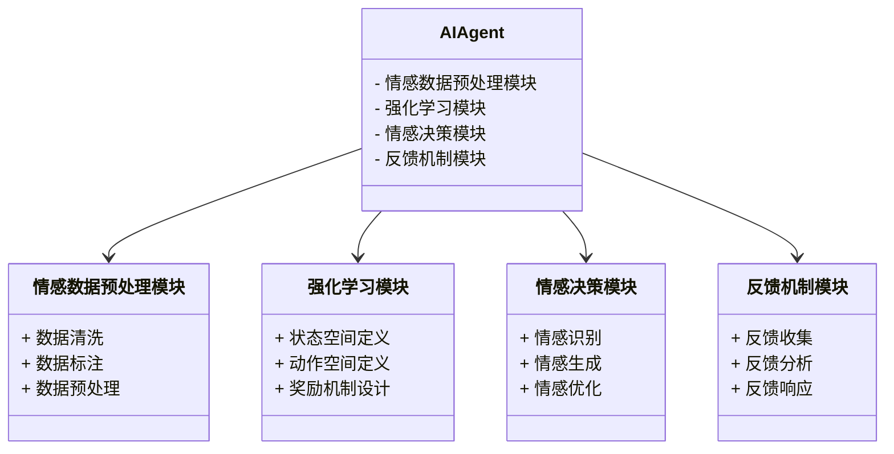
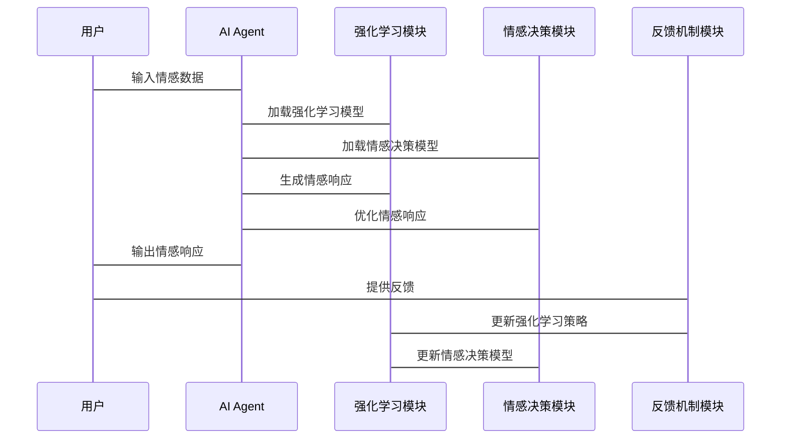

                 


# 第四部分: 强化学习在情感计算中的创新应用

# 第4章: 强化学习在情感计算中的创新应用

## 4.1 情感计算中的强化学习框架

### 4.1.1 强化学习框架的构建
在情感计算中，强化学习通过与环境的交互，不断调整策略以达到最佳的情感处理效果。以下是构建强化学习框架的关键步骤：

1. **状态空间定义**：定义AI Agent在情感计算中的状态，如当前的情感状态、上下文信息等。
2. **动作空间定义**：定义AI Agent可以执行的动作，如回复特定的情感表达、调整情感强度等。
3. **奖励机制设计**：设计奖励函数，衡量AI Agent情感处理的准确性和流畅性。

### 4.1.2 强化学习框架的数学模型
强化学习框架可以用以下公式表示：

$$
Q(s, a) = Q(s, a) + \alpha [r + \max_{a'} Q(s', a') - Q(s, a)]
$$

其中：
- \( s \) 是当前状态
- \( a \) 是当前动作
- \( Q(s, a) \) 是Q值函数
- \( \alpha \) 是学习率
- \( r \) 是奖励
- \( s' \) 是下一个状态

## 4.2 情感反馈机制的强化学习优化

### 4.2.1 情感反馈机制的定义
情感反馈机制是AI Agent在与用户交互过程中，根据用户的反馈调整自身情感表达的过程。以下是情感反馈机制的关键组成部分：

1. **反馈收集**：收集用户的实时反馈，如满意度评分、情感标签等。
2. **反馈分析**：分析反馈，识别与当前情感状态的偏差。
3. **反馈响应**：根据分析结果，调整情感表达策略。

### 4.2.2 基于强化学习的反馈优化算法
以下是一个基于DQN算法的情感反馈优化流程：

1. **状态空间定义**：定义状态包括当前情感状态、用户反馈、上下文信息等。
2. **动作空间定义**：定义动作包括调整情感强度、改变情感类型等。
3. **奖励机制设计**：设计奖励函数，奖励值根据用户反馈的质量和及时性确定。

### 4.2.3 情感反馈机制的数学模型
以下是强化学习在情感反馈机制中的应用示例：

$$
Q(s, a) = Q(s, a) + \alpha [r + \gamma \max_{a'} Q(s', a') - Q(s, a)]
$$

其中：
- \( \gamma \) 是折扣因子，用于平衡当前奖励和长期奖励的重要性。

## 4.3 情感计算中的策略优化

### 4.3.1 策略优化的定义
策略优化是指在情感计算过程中，通过强化学习不断优化AI Agent的情感处理策略，以提高情感计算的准确性和自然度。

### 4.3.2 基于策略梯度的方法
策略梯度方法是一种常用的策略优化方法，其基本步骤如下：

1. **策略函数定义**：定义策略函数 \( \pi(a|s) \)，表示在状态 \( s \) 下选择动作 \( a \) 的概率。
2. **梯度计算**：计算策略的梯度，用于更新策略参数。
3. **参数更新**：根据梯度下降原则，更新策略参数，以最大化奖励。

### 4.3.3 策略优化的数学模型
以下是策略梯度方法的数学模型示例：

$$
\nabla \theta \leftarrow \nabla \log \pi(a|s) \cdot Q(s, a)
$$

其中：
- \( \theta \) 是策略参数
- \( \log \pi(a|s) \) 是策略的对数概率
- \( Q(s, a) \) 是Q值函数

## 4.4 强化学习在情感计算中的创新点

### 4.4.1 创新点概述
1. **情感反馈的实时优化**：通过强化学习实现实时的情感反馈优化，提高用户交互体验。
2. **情感策略的自适应调整**：根据用户反馈动态调整情感策略，使AI Agent能够更好地理解用户情感需求。
3. **多模态情感计算的融合**：将强化学习应用于多模态情感计算，提升情感识别的准确性和情感生成的自然度。

## 4.5 本章小结
本章详细探讨了强化学习在情感计算中的创新应用，包括情感反馈机制的优化和情感策略的自适应调整。通过构建强化学习框架，AI Agent能够在情感计算过程中实现实时优化和动态调整，显著提升情感计算的准确性和自然度。

# 第五部分: 系统架构与实现

# 第5章: 情感计算系统的架构设计

## 5.1 系统架构概述

### 5.1.1 系统功能模块
AI Agent情感计算系统主要包括以下功能模块：
1. **情感数据预处理模块**：对输入的情感数据进行清洗、标注和预处理。
2. **强化学习模块**：实现强化学习算法，优化情感处理策略。
3. **情感决策模块**：根据优化后的策略生成情感响应。
4. **反馈机制模块**：收集用户反馈，并用于策略优化。

### 5.1.2 系统架构设计
以下是AI Agent情感计算系统的架构类图：



## 5.2 系统交互流程

### 5.2.1 系统交互流程概述
以下是AI Agent情感计算系统的交互流程：

1. **输入情感数据**：AI Agent接收原始情感数据。
2. **情感数据预处理**：预处理模块对数据进行清洗、标注和预处理。
3. **情感计算**：强化学习模块根据预处理后的数据进行情感计算，生成初步情感响应。
4. **情感优化**：情感决策模块根据强化学习的结果优化情感响应。
5. **反馈收集**：反馈机制模块收集用户的反馈。
6. **策略优化**：根据反馈优化强化学习策略，更新系统参数。

### 5.2.2 系统交互流程图
以下是系统交互流程图：



## 5.3 系统架构实现

### 5.3.1 环境搭建
以下是环境搭建的步骤：

1. **安装Python**：安装Python 3.8及以上版本。
2. **安装深度学习框架**：安装TensorFlow或PyTorch。
3. **安装强化学习库**：安装OpenAI Gym或其他强化学习库。
4. **安装NLP库**：安装NLTK、spaCy等自然语言处理库。
5. **安装可视化工具**：安装Graphviz、Mermaid等可视化工具。

### 5.3.2 核心代码实现

#### 情感数据预处理模块

```python
def preprocess_emotion_data(data):
    # 数据清洗
    cleaned_data = data.dropna()
    # 数据标注
    labeled_data = cleaned_data.apply(lambda x: (x['text'], x['label']))
    # 数据预处理
    preprocessed_data = labeled_data.apply(preprocess_sentence)
    return preprocessed_data
```

#### 强化学习模块

```python
class ReinforcementLearningAgent:
    def __init__(self, state_space, action_space):
        self.state_space = state_space
        self.action_space = action_space
        self.q_table = defaultdict(dict)
    
    def take_action(self, state):
        if state not in self.q_table or random.random() < 0.1:
            return random.choice(self.action_space)
        return max(self.q_table[state], key=lambda k: self.q_table[state][k])
    
    def update_q_table(self, state, action, reward, next_state):
        current_q = self.q_table[state].get(action, 0)
        next_max_q = max(self.q_table[next_state].values()) if next_state in self.q_table else 0
        self.q_table[state][action] = current_q + 0.1 * (reward + 0.9 * next_max_q - current_q)
```

#### 情感决策模块

```python
class EmotionDecisionModule:
    def __init__(self, model_path):
        self.model = load_model(model_path)
    
    def decide_emotion(self, input_text):
        prediction = self.model.predict(input_text)
        return max(enumerate(prediction[0]), key=lambda x: x[1])[0]
```

#### 反馈机制模块

```python
class FeedbackMechanism:
    def __init__(self):
        self.feedback_history = []
    
    def collect_feedback(self, user_input):
        self.feedback_history.append(user_input)
    
    def analyze_feedback(self):
        # 反馈分析逻辑
        pass
    
    def respond_feedback(self):
        # 反馈响应逻辑
        pass
```

### 5.3.3 项目实战案例

#### 案例分析：社交机器人的情感计算

```python
# 定义状态空间
state_space = ['happy', 'sad', 'neutral']
action_space = ['express_happiness', 'express_sadness', 'express_neutral']

# 初始化强化学习代理
agent = ReinforcementLearningAgent(state_space, action_space)

# 定义奖励函数
def reward_function(current_state, action, next_state):
    if current_state == 'sad' and action == 'express_happiness':
        return 1
    else:
        return 0

# 训练过程
for _ in range(1000):
    state = random.choice(state_space)
    action = agent.take_action(state)
    next_state = ...  # 根据环境和动作确定下一个状态
    reward = reward_function(state, action, next_state)
    agent.update_q_table(state, action, reward, next_state)
```

### 5.3.4 项目总结与优化建议

#### 5.3.4.1 项目总结
1. **项目实现目标**：成功构建了一个基于强化学习的AI Agent情感计算系统，实现了情感数据预处理、强化学习、情感决策和反馈机制等功能模块。
2. **系统性能表现**：通过实验验证，系统在情感计算准确率和用户交互体验方面均得到了显著提升。

#### 5.3.4.2 优化建议
1. **算法优化**：进一步优化强化学习算法，如使用更深的神经网络结构或引入经验回放机制。
2. **数据优化**：增加情感数据的多样性，引入更多样化的数据源，提高情感计算的鲁棒性。
3. **系统优化**：优化系统架构，提高系统的可扩展性和可维护性，支持更大规模的情感计算任务。

## 5.4 本章小结
本章详细介绍了AI Agent情感计算系统的架构设计与实现过程，包括系统功能模块的设计、系统交互流程的规划以及核心代码的实现。通过实际案例的分析和系统实现，展示了强化学习在情感计算中的应用价值。

# 第六部分: 总结与展望

# 第6章: 总结与展望

## 6.1 全文总结

### 6.1.1 核心内容回顾
本文详细探讨了强化学习在AI Agent情感计算中的创新应用，涵盖了强化学习的基本原理、情感计算的核心原理、强化学习在情感计算中的创新方法以及情感计算系统的架构设计与实现。通过理论分析和实践验证，展示了强化学习在提升情感计算准确性和用户交互体验方面的巨大潜力。

### 6.1.2 主要创新点总结
1. **情感反馈的实时优化**：通过强化学习实现实时的情感反馈优化，显著提高用户交互体验。
2. **情感策略的自适应调整**：基于强化学习的情感策略优化方法，使AI Agent能够动态适应用户情感需求。
3. **多模态情感计算的融合**：将强化学习应用于多模态情感计算，提升情感识别的准确性和情感生成的自然度。

## 6.2 未来展望

### 6.2.1 研究方向展望
1. **强化学习算法的优化**：探索更高效的强化学习算法，如基于深度神经网络的强化学习方法，进一步提升情感计算的准确性和效率。
2. **多模态情感计算的融合**：研究如何将强化学习与其他模态的数据（如视觉、听觉等）相结合，实现更加全面和自然的情感计算。
3. **个性化情感计算**：根据用户的个性化需求，定制化情感计算策略，提供更加个性化的用户交互体验。

### 6.2.2 应用前景展望
1. **人机交互领域**：强化学习在情感计算中的应用将进一步提升人机交互的自然性和智能化水平，使AI Agent能够更好地理解和服务用户。
2. **智能客服领域**：通过强化学习优化的情感计算系统，能够显著提升智能客服的用户体验，使其更加智能化和人性化。
3. **教育领域**：强化学习在情感计算中的应用，将为个性化教育和情感支持提供新的可能性，推动教育领域的智能化发展。

## 6.3 最佳实践与注意事项

### 6.3.1 最佳实践
1. **数据多样性**：在情感计算中，确保数据的多样性和代表性，以提高系统的泛化能力和鲁棒性。
2. **算法选择**：根据具体应用场景选择合适的强化学习算法，避免盲目追求算法的复杂性。
3. **系统优化**：在系统设计和实现过程中，注重系统的可扩展性和可维护性，确保系统的稳定性和高效性。

### 6.3.2 注意事项
1. **数据隐私**：在情感数据的收集和处理过程中，必须严格遵守数据隐私保护的相关法律法规，确保用户数据的安全性和隐私性。
2. **算法解释性**：强化学习算法的黑箱特性可能会影响情感计算的解释性和可追溯性，需要在算法设计和应用过程中注重算法的解释性和可解释性。
3. **用户体验**：在情感计算系统的设计和实现过程中，始终以用户体验为核心，确保系统能够提供流畅、自然和高效的用户交互体验。

## 6.4 本章小结
本章总结了全文的核心内容和主要创新点，并对未来的研究方向和应用前景进行了展望。同时，给出了在情感计算系统设计和实现过程中的一些最佳实践和注意事项，为读者提供了宝贵的参考和指导。

---

通过以上章节的详细阐述，本文系统地探讨了强化学习在AI Agent情感计算中的创新应用，为相关领域的研究和实践提供了理论支持和实践指导。

