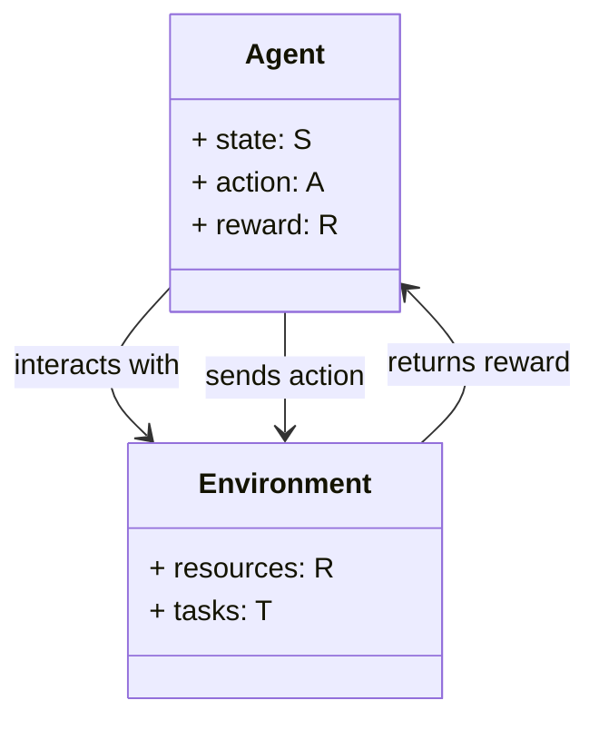
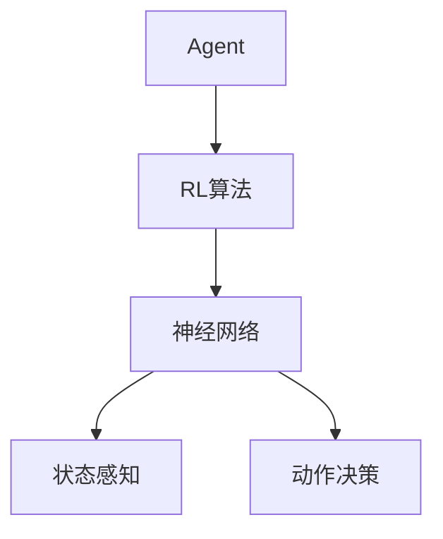
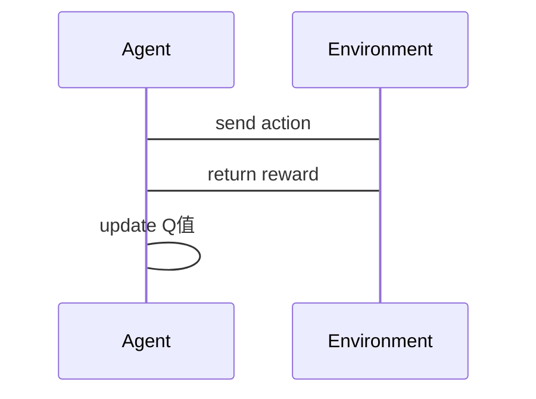

                 


# 强化学习在AI Agent资源调度中的应用

## 关键词

- 强化学习
- AI Agent
- 资源调度
- Q-learning
- Deep Q-Network
- 资源分配

## 摘要

本文系统阐述了强化学习在AI Agent资源调度中的应用，从基础概念到高级算法，详细分析了强化学习在资源调度中的优势与挑战。通过数学建模、系统设计和实战项目，深入探讨了Q-learning、DQN和策略梯度方法在资源调度中的具体应用，展示了如何通过强化学习优化AI Agent的资源分配策略，解决复杂场景下的资源调度问题。

# 第一部分: 强化学习与AI Agent基础

## 第1章: 强化学习与AI Agent概述

### 1.1 强化学习的基本概念

#### 1.1.1 强化学习的定义与特点

强化学习（Reinforcement Learning, RL）是一种机器学习范式，通过智能体与环境的交互，学习最优策略以最大化累积奖励。其特点包括：

- **目标驱动**：通过最大化累积奖励优化决策。
- **在线学习**：通过实时交互更新策略。
- **探索与利用**：平衡新状态的探索和当前最优策略的利用。

#### 1.1.2 AI Agent的基本概念与分类

AI Agent是指在环境中能够感知并自主行动以实现目标的智能体。按智能性可分为：

- **反应式Agent**：基于当前感知做出反应。
- **认知式Agent**：具备复杂推理和规划能力。
- **学习型Agent**：能通过经验改进性能。

#### 1.1.3 强化学习与AI Agent的关系

强化学习为AI Agent提供决策优化机制，使其在动态环境中自主学习最优策略，提升资源调度效率。

### 1.2 强化学习的核心概念

#### 1.2.1 状态、动作、奖励的定义

- **状态（State）**：环境中的当前情况，如资源使用情况。
- **动作（Action）**：Agent采取的行动，如分配资源。
- **奖励（Reward）**：环境对动作的反馈，如资源利用率提升。

#### 1.2.2 马尔可夫决策过程（MDP）

MDP定义为元组$(S, A, P, R, \gamma)$，其中：

- $S$：状态空间。
- $A$：动作空间。
- $P(s'|s,a)$：从状态$s$执行动作$a$转移到状态$s'$的概率。
- $R(s,a)$：从状态$s$执行动作$a$获得的奖励。
- $\gamma$：折扣因子，平衡短期和长期奖励。

#### 1.2.3 策略与价值函数的定义

- **策略（Policy）**：状态到动作的映射，$\pi(a|s)$。
- **价值函数（Value Function）**：衡量状态或状态-动作对的未来奖励总和，如$V(s)$和$Q(s,a)$。

### 1.3 AI Agent在资源调度中的应用背景

#### 1.3.1 资源调度的基本问题

资源调度涉及合理分配计算资源，以满足任务需求，减少资源浪费和提高效率。

#### 1.3.2 强化学习在资源调度中的优势

- **动态适应性**：适应环境变化。
- **全局优化**：优化整体资源分配。
- **高效决策**：快速做出最优决策。

#### 1.3.3 当前研究现状与挑战

- **研究现状**：强化学习已成功应用于云资源调度、任务分配等领域。
- **主要挑战**：
  - 状态空间复杂性。
  - 动作空间多样性。
  - 奖励函数设计。

## 第2章: 强化学习的核心原理

### 2.1 强化学习的基本原理

#### 2.1.1 Q-learning算法

Q-learning通过更新Q值表学习最优策略，公式为：

$$Q(s,a) = Q(s,a) + \alpha [r + \gamma \max Q(s',a') - Q(s,a)]$$

#### 2.1.2 Deep Q-Network（DQN）算法

DQN通过神经网络近似Q值函数，解决高维状态空间问题，引入经验回放和目标网络提升稳定性。

#### 2.1.3 策略梯度方法（Policy Gradient）

策略梯度直接优化策略，使用梯度上升更新参数，公式为：

$$\theta = \theta + \alpha \nabla \text{J}$$

### 2.2 状态空间与动作空间的建模

#### 2.2.1 离散与连续动作空间的对比

- 离散动作空间：动作有限，便于建模。
- 连续动作空间：动作无限，适用于复杂场景。

#### 2.2.2 状态空间的压缩与简化

- 状态压缩：减少状态维度，如使用聚类。
- 状态简化：忽略次要特征，简化模型。

#### 2.2.3 动作空间的设计原则

- 明确性：动作清晰可执行。
- 完备性：覆盖所有可能决策。
- 可行性：确保动作在环境中有效。

### 2.3 奖励机制的设计

#### 2.3.1 奖励函数的定义与设计

- 单目标奖励：如资源利用率最大化。
- 多目标奖励：如资源利用率和响应时间的加权和。

#### 2.3.2 多目标奖励的处理方法

- 奖励加权：$R = w_1 R_1 + w_2 R_2 + ... + w_n R_n$，其中$w$为权重。
- 奖励归一化：标准化各奖励值，确保均衡影响。

#### 2.3.3 奖励稀疏性问题的解决方案

- 增加中间奖励：在关键步骤给予奖励。
- 使用密度奖励：根据状态分布调整奖励。

## 第3章: 强化学习的数学模型与公式

### 3.1 Q-learning算法的数学模型

#### 3.1.1 Q值更新公式

$$Q(s, a) = Q(s, a) + \alpha [r + \gamma \max Q(s', a') - Q(s, a)]$$

其中：
- $\alpha$：学习率。
- $\gamma$：折扣因子。

#### 3.1.2 探索与利用策略的数学表达

探索概率通常基于$\epsilon$，利用公式：

$$P(\text{探索}) = \epsilon$$
$$P(\text{利用}) = 1 - \epsilon$$

### 3.2 策略梯度方法的数学推导

#### 3.2.1 策略函数的定义

$$\pi(a|s) = \text{softmax}(Q(s, a))$$

其中，$Q(s, a)$为Q值函数。

#### 3.2.2 梯度上升算法的数学表达

$$\theta = \theta + \alpha \nabla \text{J}$$

其中，$\text{J}$为目标函数，$\nabla \text{J}$为目标函数对参数$\theta$的梯度。

### 3.3 动作空间与状态空间的数学建模

#### 3.3.1 离散动作空间的表示

$$a \in \{1, 2, ..., n\}$$

其中，$n$为动作总数。

#### 3.3.2 连续动作空间的表示

$$a \in [0, 1]$$

其中，$a$为连续动作值。

## 第四部分: 系统分析与架构设计方案

### 第4章: 系统分析与架构设计

#### 4.1 问题场景介绍

AI Agent需要在动态变化的环境中实时分配计算资源，优化资源利用率和任务响应时间。

#### 4.2 系统功能设计

##### 4.2.1 领域模型设计



##### 4.2.2 系统架构设计



##### 4.2.3 接口设计

- **输入接口**：接收环境状态信息。
- **输出接口**：发送动作决策。
- **反馈接口**：接收奖励信号。

#### 4.3 交互流程设计



## 第五部分: 项目实战

### 第5章: 项目实战

#### 5.1 环境安装

安装Python和相关库：

```bash
pip install numpy matplotlib tensorflow
```

#### 5.2 核心代码实现

```python
import numpy as np
import tensorflow as tf

class Agent:
    def __init__(self, state_size, action_size):
        self.state_size = state_size
        self.action_size = action_size
        self.gamma = 0.99
        self.epsilon = 0.1
        self.model = self.build_model()

    def build_model(self):
        model = tf.keras.Sequential([
            tf.keras.layers.Dense(32, activation='relu', input_shape=(self.state_size,)),
            tf.keras.layers.Dense(self.action_size, activation='linear')
        ])
        return model

    def act(self, state):
        if np.random.random() < self.epsilon:
            return np.random.randint(self.action_size)
        q_values = self.model.predict(state)
        return np.argmax(q_values[0])

    def remember(self, state, action, reward, next_state):
        # 存储经验
        pass

    def replay(self, batch_size):
        # 回放经验并训练模型
        pass

    def train(self, state, action, reward, next_state):
        # 单个经验训练
        pass
```

#### 5.3 代码应用解读与分析

- **网络结构**：两层神经网络，第一层32个神经元，第二层动作空间大小。
- **策略选择**：基于$\epsilon$的探索与利用策略。
- **训练过程**：通过经验回放更新Q值，优化模型参数。

#### 5.4 实际案例分析

以云服务器资源调度为例，训练AI Agent在不同负载下做出最优资源分配决策，如选择分配多少CPU资源给某个任务。

## 第六部分: 最佳实践、小结、注意事项、拓展阅读

### 第6章: 最佳实践

- **训练策略**：平衡探索与利用，避免过早收敛。
- **模型选择**：根据问题复杂度选择合适算法，简单问题用Q-learning，复杂场景用DQN或策略梯度。
- **奖励设计**：多目标场景使用加权或归一化奖励，避免单一目标主导。

### 6.2 小结

通过强化学习，AI Agent能够高效优化资源调度，提升系统性能，适应动态变化的环境。

### 6.3 注意事项

- **收敛性问题**：确保算法能够收敛到最优解。
- **计算效率**：优化代码实现，减少计算开销。
- **实时性要求**：保证决策延迟在可接受范围内。

### 6.4 拓展阅读

- **资源调度算法**：研究其他调度算法，结合强化学习优化性能。
- **多智能体协作**：探索多个AI Agent协作的资源调度问题。
- **强化学习优化**：研究更高效的强化学习算法，提升调度性能。

## 结论

本文详细探讨了强化学习在AI Agent资源调度中的应用，从基础理论到实战项目，系统地分析了如何利用强化学习优化资源分配策略。通过数学建模、系统设计和项目实践，展示了强化学习在资源调度中的强大能力，为未来的AI Agent应用提供了理论和实践基础。

---

# 写作思路说明

## 写作思路说明

### 思路概述

本文围绕强化学习在AI Agent资源调度中的应用，采用“知识框架+算法解析+系统设计+项目实战”的结构，从基础到高级，系统地阐述强化学习在资源调度中的应用。通过清晰的知识框架，读者能够快速掌握核心概念；通过算法解析，理解强化学习的核心原理；通过系统设计和项目实战，掌握如何将强化学习应用于实际资源调度问题。

### 详细思路

1. **知识框架**

   - **第一章：强化学习与AI Agent概述**
     - 介绍强化学习和AI Agent的基本概念，明确它们在资源调度中的应用背景。
     - 通过定义和对比，帮助读者理解强化学习和AI Agent的关系。
   
   - **第二章：强化学习的核心原理**
     - 详细讲解强化学习的基本原理，包括Q-learning、DQN和策略梯度方法。
     - 通过数学公式和算法流程图，清晰呈现强化学习的核心机制。
   
   - **第三章：强化学习的数学模型与公式**
     - 展示强化学习的数学模型，包括Q值更新公式和策略梯度方法的推导。
     - 使用LaTeX公式和图表，帮助读者理解复杂的数学模型。
   
   - **第四章：系统分析与架构设计**
     - 从系统角度分析资源调度问题，设计系统的功能模块和架构。
     - 通过领域模型和架构图，明确系统的各个组成部分及其关系。
   
   - **第五章：项目实战**
     - 提供实际的项目实现，包括环境安装、代码编写和案例分析。
     - 通过具体的代码实现，帮助读者理解如何将强化学习应用于实际问题。
   
   - **第六章：最佳实践、小结、注意事项、拓展阅读**
     - 总结全文，给出最佳实践建议，提醒读者注意常见问题。
     - 指导读者进一步拓展阅读，探索更高级的应用。

2. **内容安排**

   - **理论与实践结合**
     - 理论部分涵盖强化学习的核心原理和数学模型，为实践打下基础。
     - 实践部分通过具体项目，帮助读者将理论应用于实际问题。
   
   - **逐步深入**
     - 从基础概念到高级算法，逐步深入，帮助读者系统地掌握知识。
     - 从单机资源调度到分布式系统，逐步扩展应用场景。
   
   - **图表辅助**
     - 使用流程图、类图和架构图，清晰展示算法流程和系统结构。
     - 使用LaTeX公式，准确表达数学模型，便于读者理解和应用。

3. **写作特点**

   - **条理清晰**
     - 逻辑清晰，层次分明，便于读者逐步深入学习。
   
   - **内容详实**
     - 每个部分都详细展开，确保读者能够全面掌握知识。
   
   - **实践性强**
     - 结合实际项目，提供可执行的代码和详细的实现步骤，帮助读者动手实践。
   
   - **易于理解**
     - 使用通俗易懂的语言，避免过于复杂的术语，便于不同背景的读者理解。

### 总结

本文以“强化学习在AI Agent资源调度中的应用”为主题，通过系统化的知识框架、详细的算法解析和实际的项目案例，帮助读者全面掌握强化学习在资源调度中的应用。从理论到实践，从基础到高级，层层递进，确保读者能够深入理解并实际应用所学知识。

