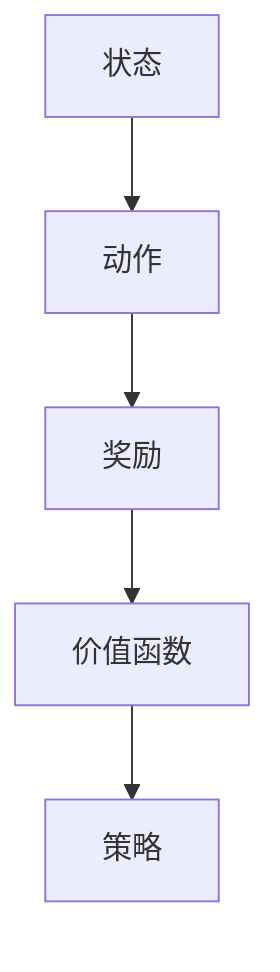
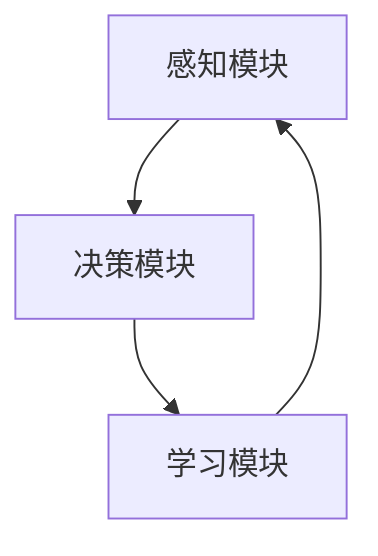
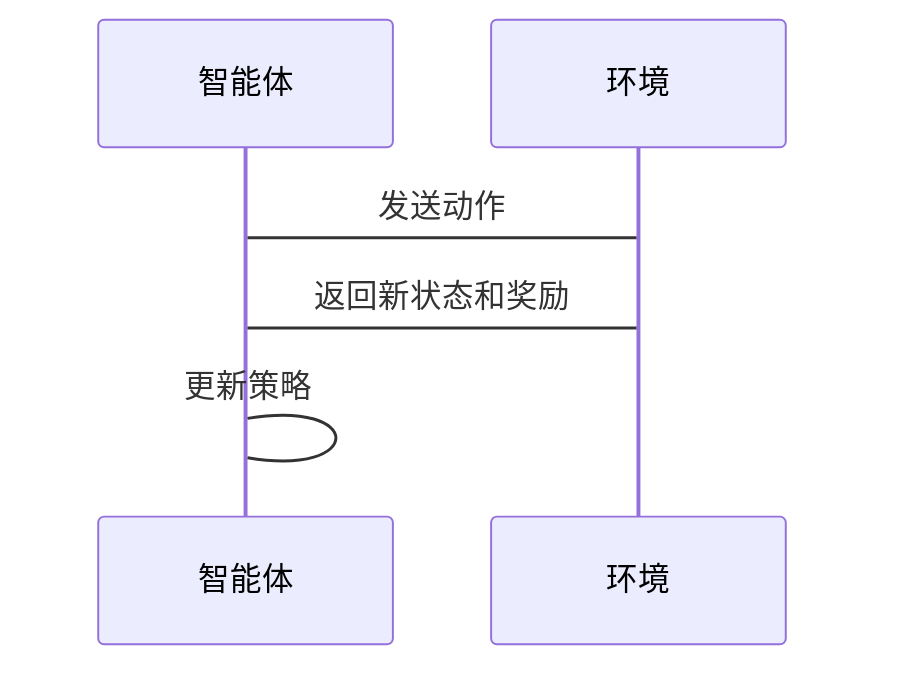

                 


# 强化学习在AI Agent长期规划优化中的应用

## 关键词：强化学习, AI Agent, 长期规划优化, 算法原理, 系统架构, 项目实战

## 摘要：  
强化学习是一种通过试错机制优化智能体行为的机器学习方法，其在AI Agent的长期规划优化中发挥着重要作用。本文从强化学习的基本概念出发，详细探讨其在AI Agent中的应用，分析长期规划优化的核心算法原理，结合实际项目案例，深入讲解系统架构设计与实现。通过本文，读者能够全面理解强化学习在AI Agent长期规划优化中的理论基础与实践应用，掌握相关算法实现与优化技巧。

---

# 第一部分: 强化学习与AI Agent基础

## 第1章: 强化学习的基本概念

### 1.1 强化学习的定义与特点  
强化学习是一种基于试错机制的机器学习方法，通过智能体与环境的交互，逐步优化其行为策略以最大化累积奖励。其核心特点包括：  
1. **目标导向性**：智能体通过探索和利用环境，找到实现目标的最优路径。  
2. **延迟回报**：奖励可能在多个动作之后才显现，需要智能体具备长期规划能力。  
3. **策略优化**：通过调整策略参数，使智能体在复杂环境中做出最优决策。  

### 1.2 AI Agent的定义与类型  
AI Agent（智能体）是能够感知环境并采取行动以实现目标的实体。其主要类型包括：  
1. **反应式Agent**：仅根据当前感知做出反应，无内部状态。  
2. **基于模型的Agent**：维护环境状态模型，用于规划和决策。  
3. **目标导向的Agent**：根据目标函数优化其行为。  

### 1.3 长期规划优化的背景与意义  
长期规划优化是指智能体在复杂环境中，通过多步决策实现全局最优目标。其背景包括：  
1. **复杂环境**：智能体需要在不确定性和动态变化的环境中做出决策。  
2. **资源约束**：优化资源分配，提高效率。  
3. **目标导向**：通过长期规划实现复杂目标。  

其意义在于帮助智能体在复杂任务中做出更优决策，提升系统的整体性能。

---

## 第2章: 强化学习的核心概念与联系  

### 2.1 强化学习的原理  
强化学习的核心是通过与环境交互，逐步优化策略以最大化累积奖励。其关键步骤包括：  
1. **感知环境**：获取当前状态。  
2. **选择动作**：基于当前策略选择动作。  
3. **执行动作**：与环境交互，获得新状态和奖励。  
4. **更新策略**：根据奖励调整策略参数。  

### 2.2 核心概念对比表  
| 概念         | 描述                                                         |  
|--------------|------------------------------------------------------------|  
| 状态         | 智能体与环境交互的当前情况                                   |  
| 动作         | 智能体可以采取的具体行动                                     |  
| 奖励         | 行为的结果评价，用于指导策略优化                             |  
| 策略         | 定义状态到动作的映射，决定智能体如何行动                     |  
| 价值函数     | 预测在特定状态下采取某种行动后的预期累积奖励               |  

### 2.3 实体关系图（ER图）  


---

## 第3章: 强化学习算法原理讲解  

### 3.1 Q-learning算法  
Q-learning是一种基于价值函数的强化学习算法，通过更新Q表实现策略优化。其算法流程如下：  
1. 初始化Q表为零。  
2. 在每个时间步中，根据当前状态选择动作。  
3. 执行动作，获得新状态和奖励。  
4. 更新Q表：$Q(s, a) = Q(s, a) + \alpha [r + \gamma \max Q(s', a')]$。  

#### Q-learning算法的Python实现  
```python
import numpy as np

class QLearning:
    def __init__(self, state_space, action_space, alpha=0.1, gamma=0.99):
        self.state_space = state_space
        self.action_space = action_space
        self.alpha = alpha
        self.gamma = gamma
        self.q_table = np.zeros((state_space, action_space))
    
    def choose_action(self, state, epsilon=0.1):
        if np.random.random() < epsilon:
            return np.random.randint(self.action_space)
        else:
            return np.argmax(self.q_table[state])
    
    def update_q(self, state, action, reward, next_state):
        current_q = self.q_table[state, action]
        next_max_q = np.max(self.q_table[next_state])
        self.q_table[state, action] = current_q + self.alpha * (reward + self.gamma * next_max_q)
```

### 3.2 策略梯度算法  
策略梯度法通过优化策略参数直接最大化累积奖励。其数学模型如下：  
目标函数：$$J(\theta) = \mathbb{E}_{\tau \sim \pi_\theta}[\sum_{t=0}^\infty \gamma^t r_t]$$  
梯度更新：$$\nabla J(\theta) = \mathbb{E}_{\tau}[ \nabla \log \pi_\theta(a_t|s_t) Q_\pi(s_t, a_t)]$$  

#### 策略梯度算法的Python实现  
```python
import torch
import torch.nn as nn

class PolicyGradient:
    def __init__(self, state_dim, action_dim, learning_rate=0.01):
        self.state_dim = state_dim
        self.action_dim = action_dim
        self.actor = nn.Linear(state_dim, action_dim)
        self.actor_optimizer = torch.optim.Adam(self.actor.parameters(), lr=learning_rate)
    
    def get_action(self, state):
        logits = self.actor(torch.FloatTensor(state))
        action_probs = torch.softmax(logits, dim=-1)
        action = torch.multinomial(action_probs, 1).item()
        return action
    
    def update_policy(self, state, action, reward):
        logits = self.actor(torch.FloatTensor(state))
        action_probs = torch.softmax(logits, dim=-1)
        loss = -torch.log(action_probs[action]) * reward
        self.actor_optimizer.zero_grad()
        loss.backward()
        self.actor_optimizer.step()
```

---

## 第4章: 系统分析与架构设计  

### 4.1 问题场景介绍  
考虑一个AI Agent在复杂环境中执行任务，例如自动驾驶或机器人控制。环境动态变化，智能体需要通过长期规划实现目标。

### 4.2 系统功能设计  
- **感知模块**：处理环境输入，获取当前状态。  
- **决策模块**：基于强化学习算法生成动作。  
- **学习模块**：更新策略参数以优化奖励。  

### 4.3 系统架构设计  


### 4.4 系统接口设计  
- **输入接口**：接收环境状态和奖励信号。  
- **输出接口**：输出动作指令。  

### 4.5 交互流程图  


---

## 第5章: 项目实战  

### 5.1 环境安装与配置  
安装必要的库：  
```bash
pip install gym numpy torch
```

### 5.2 核心代码实现  
```python
import gym
import torch
import torch.nn as nn

# 初始化环境
env = gym.make('CartPole-v0')
env.seed(42)

# 定义策略网络
class PolicyNetwork(nn.Module):
    def __init__(self, input_dim, output_dim):
        super(PolicyNetwork, self).__init__()
        self.fc1 = nn.Linear(input_dim, 128)
        self.fc2 = nn.Linear(128, output_dim)
    
    def forward(self, x):
        x = torch.relu(self.fc1(x))
        x = torch.softmax(self.fc2(x), dim=-1)
        return x

# 初始化网络
policy = PolicyNetwork(4, 2)
optimizer = torch.optim.Adam(policy.parameters(), lr=0.001)

# 训练过程
for episode in range(1000):
    state = env.reset()
    total_reward = 0
    while True:
        # 选择动作
        with torch.no_grad():
            action_probs = policy(torch.FloatTensor(state))
        action = torch.multinomial(action_probs, 1).item()
        
        # 执行动作
        next_state, reward, done, _ = env.step(action)
        total_reward += reward
        
        # 更新策略
        optimizer.zero_grad()
        current_probs = policy(torch.FloatTensor(state))
        loss = -torch.log(current_probs[action]) * reward
        loss.backward()
        optimizer.step()
        
        state = next_state
        if done:
            break
```

### 5.3 案例分析与结果展示  
通过训练，智能体能够掌握在CartPole环境中保持平衡的策略。训练过程中的奖励曲线展示了算法的收敛性。

### 5.4 项目小结  
本项目展示了强化学习在AI Agent中的实际应用，验证了算法的有效性。

---

## 第6章: 最佳实践与小结  

### 6.1 小结  
本文详细探讨了强化学习在AI Agent长期规划优化中的应用，从理论到实践全面解析了相关技术和方法。

### 6.2 注意事项  
- 确保环境稳定，避免干扰。  
- 合理设置超参数，如学习率和折扣因子。  
- 定期保存模型，防止训练中断。  

### 6.3 拓展阅读  
- 《Reinforcement Learning: Theory and Algorithms》  
- 《Deep Reinforcement Learning》  

---

# 结语  

通过本文的学习，读者可以全面掌握强化学习在AI Agent长期规划优化中的理论基础与实践应用。希望本文能够为相关领域的研究和开发提供有价值的参考。

