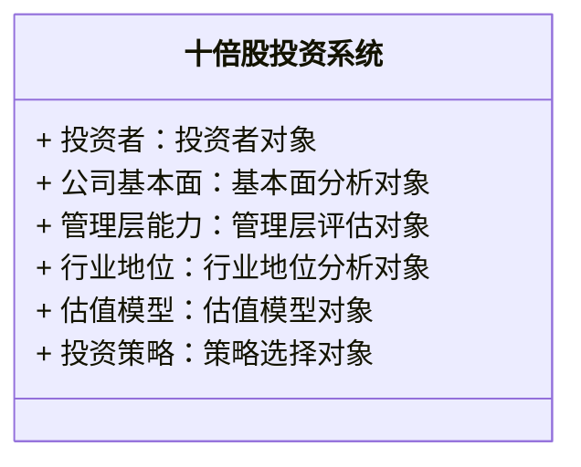
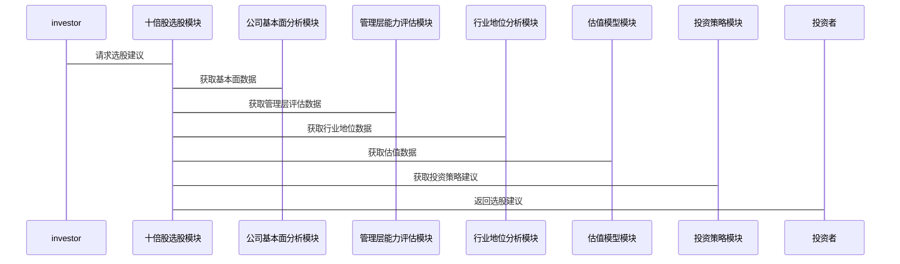

                 


## 《彼得·林奇的十倍股选股法则》

### 关键词：
- 彼得·林奇
- 十倍股
- 股票投资
- 选股法则
- 投资策略

### 摘要：
《彼得·林奇的十倍股选股法则》系统阐述了彼得·林奇的投资理念，详细解析了十倍股的定义、特征、选股标准和投资策略。通过数学模型、图表分析和实际案例，深入探讨了十倍股的投资系统架构、风险管理及实战技巧，为投资者提供了从理论到实践的完整指导。

---

## 目录大纲

### 第一部分：引言
#### 第1章：彼得·林奇与十倍股投资理念
- 1.1 彼得·林奇的背景与投资风格
- 1.2 十倍股的定义与投资目标
- 1.3 本书的核心内容与价值

### 第二部分：十倍股的核心概念
#### 第2章：十倍股的特征与分类
- 2.1 十倍股的定义与核心特征
- 2.2 十倍股与其他股票的对比
- 2.3 十倍股的生命周期与阶段划分

#### 第3章：十倍股的数学模型与特征分析
- 3.1 十倍股的数学模型
  - 3.1.1 十倍股的收益计算公式
  - 3.1.2 十倍股的估值模型
- 3.2 十倍股特征对比表格
- 3.3 十倍股的ER实体关系图（Mermaid流程图）

### 第三部分：彼得·林奇的选股法则
#### 第4章：十倍股的选股标准
- 4.1 公司基本面分析
  - 4.1.1 财务指标分析
  - 4.1.2 行业地位分析
  - 4.1.3 管理层能力评估
- 4.2 市场认知度与投资情绪
- 4.3 估值与成长性的平衡

#### 第5章：十倍股的选股策略
- 5.1 长期投资策略
- 5.2 分阶段投资策略
- 5.3 逆向投资策略
- 5.4 十倍股投资的组合管理

### 第四部分：十倍股投资的系统分析与架构设计
#### 第6章：十倍股投资的系统架构
- 6.1 投资目标与问题场景
- 6.2 系统功能设计（领域模型Mermaid类图）
- 6.3 系统架构设计（Mermaid架构图）
- 6.4 系统接口设计与交互（Mermaid序列图）

### 第五部分：十倍股投资的实战与案例分析
#### 第7章：十倍股投资的实战指南
- 7.1 投资环境的配置与优化
- 7.2 十倍股投资工具的选择与使用
- 7.3 投资计划的制定与执行
- 7.4 投资过程中的风险控制

#### 第8章：十倍股投资的经典案例分析
- 8.1 十倍股的经典案例
- 8.2 案例分析的步骤与方法
- 8.3 案例分析的总结与启示

### 第六部分：十倍股投资的风险
#### 第9章：十倍股投资的风险管理
- 9.1 十倍股投资的风险来源
- 9.2 十倍股风险管理策略
- 9.3 十倍股投资的止损机制
- 9.4 如何避免十倍股投资中的重大损失

#### 第10章：十倍股投资的风险与收益平衡
- 10.1 十倍股投资中的风险与收益分析
- 10.2 如何在十倍股投资中平衡风险与收益
- 10.3 十倍股投资中的心理风险管理

### 第七部分：总结与展望
#### 第11章：总结与展望
- 11.1 本书的核心内容总结
- 11.2 十倍股投资的未来展望
- 11.3 对投资者的建议与鼓励

---

## 正文部分

### 第一部分：引言
#### 第1章：彼得·林奇与十倍股投资理念

**1.1 彼得·林奇的背景与投资风格**

彼得·林奇（Peter Lynch）是美国著名的投资家，被誉为“费城最佳基金经理”。他从1977年到1990年管理富达麦哲伦基金期间，取得了年均29%的回报率，远超市场平均水平。林奇的投资理念强调长期投资、深入研究和寻找具有成长潜力的公司。

**1.2 十倍股的定义与投资目标**

十倍股是指在一定时间内，股价增长超过十倍的股票。林奇认为，寻找十倍股的关键在于发现那些具有持续增长潜力的公司，并在它们的低谷期投资，等待其价值的回归。

**1.3 本书的核心内容与价值**

本书将系统地介绍彼得·林奇的十倍股选股法则，从理论到实践，从分析到案例，帮助投资者掌握如何识别和投资十倍股。

---

### 第二部分：十倍股的核心概念
#### 第2章：十倍股的特征与分类

**2.1 十倍股的定义与核心特征**

十倍股的核心特征包括：
- 高成长性：公司收入和利润持续快速增长。
- 低估值：市场价格低于其内在价值。
- 强大的竞争优势：公司在行业内具有领先地位。

**2.2 十倍股与其他股票的对比**

下表对比了十倍股与其他股票的核心特征：

| 特征                | 十倍股          | 其他股票        |
|---------------------|----------------|----------------|
| 成长性              | 高             | 一般或低        |
| 估值                | 低             | 高或合理        |
| 竞争优势            | 强             | 一般或弱        |
| 市场认知度          | 高             | 低或中          |

**2.3 十倍股的生命周期与阶段划分**

十倍股的生命周期可以分为以下几个阶段：
1. **种子期**：公司处于初创阶段，尚未盈利。
2. **成长期**：公司开始盈利并快速增长。
3. **成熟期**：公司进入稳定增长阶段。
4. **衰退期**：公司增长放缓，股价下跌。

---

#### 第3章：十倍股的数学模型与特征分析

**3.1 十倍股的数学模型**

十倍股的数学模型可以分为以下几个部分：

- **收益计算公式**：
  - 十倍股的年化收益率计算公式为：
    $$ \text{年化收益率} = \left( \frac{\text{最终收益}}{\text{初始投资}} \right)^{\frac{1}{\text{时间}}} - 1 $$

- **估值模型**：
  - 使用市盈率（P/E）和市净率（P/B）来评估股票的合理估值。

**3.2 十倍股特征对比表格**

下表展示了十倍股与其他股票在财务指标上的对比：

| 指标       | 十倍股       | 其他股票     |
|------------|--------------|--------------|
| 市盈率（P/E）| 低于行业平均 | 高于行业平均  |
| 市净率（P/B）| 低于行业平均 | 高于行业平均  |
| 净利润增长率 | 高于30%      | 低于10%       |

**3.3 十倍股的ER实体关系图（Mermaid流程图）**

```mermaid
er
actor 投资者
actor 管理层
actor 行业专家
actor 金融分析师
```

---

### 第三部分：彼得·林奇的选股法则
#### 第4章：十倍股的选股标准

**4.1 公司基本面分析**

- **财务指标分析**：
  - 关注净利润增长率、营业收入增长率、毛利率等指标。
  - 使用财务指标对比表来评估公司的盈利能力：

| 指标         | 十倍股         | 行业平均      |
|--------------|---------------|---------------|
| 净利润增长率 | 高于30%       | 低于10%       |
| 营业收入增长率 | 高于20%       | 低于5%        |

- **行业地位分析**：
  - 选择行业内领先的公司，具有强大的市场占有率和品牌优势。
- **管理层能力评估**：
  - 关注管理层的背景、经验和决策能力。

**4.2 市场认知度与投资情绪**

- 投资者应关注市场对公司的认知度，避免在市场过热时投资，而在市场冷清时寻找机会。

**4.3 估值与成长性的平衡**

- 在选择十倍股时，应综合考虑公司的成长性和估值水平，避免仅关注低估值或高成长性。

#### 第5章：十倍股的选股策略

**5.1 长期投资策略**

- 长期投资的核心在于选择具有持续增长潜力的公司，并耐心等待其价值的实现。

**5.2 分阶段投资策略**

- 分阶段投资是指在公司不同发展阶段逐步增加投资，分散风险。

**5.3 逆向投资策略**

- 逆向投资是指在市场恐慌时买入，市场狂热时卖出。

**5.4 十倍股投资的组合管理**

- 通过分散投资、定期调整投资组合来降低风险。

---

### 第四部分：十倍股投资的系统分析与架构设计
#### 第6章：十倍股投资的系统架构

**6.1 投资目标与问题场景**

- 投资目标：寻找具有十倍增长潜力的股票。
- 问题场景：如何识别十倍股，如何制定投资策略。

**6.2 系统功能设计（领域模型Mermaid类图）**



**6.3 系统架构设计（Mermaid架构图）**


**6.4 系统接口设计与交互（Mermaid序列图）**



---

### 第五部分：十倍股投资的实战与案例分析
#### 第7章：十倍股投资的实战指南

**7.1 投资环境的配置与优化**

- 选择适合自己的投资环境，包括时间和资金的投入。

**7.2 十倍股投资工具的选择与使用**

- 使用专业的投资工具，如金融分析软件，来辅助选股和投资决策。

**7.3 投资计划的制定与执行**

- 制定详细的投资计划，包括投资目标、时间表和风险控制措施。

**7.4 投资过程中的风险控制**

- 定期评估投资组合，及时调整以应对市场变化。

#### 第8章：十倍股投资的经典案例分析

**8.1 十倍股的经典案例**

- 案例1：苹果公司（Apple）
  - 苹果公司在2000年至2010年间，股价从不到10美元增长到超过100美元，实现了十倍的增长。
  - 关键因素：公司推出iPod、iPhone等革命性产品，推动了公司的高速增长。

**8.2 案例分析的步骤与方法**

- 步骤1：分析公司的基本面。
- 步骤2：评估管理层的能力。
- 步骤3：判断公司的行业地位。
- 步骤4：计算公司的估值。

**8.3 案例分析的总结与启示**

- 十倍股的成功投资需要耐心、深入的研究和对市场的敏锐洞察。

---

### 第六部分：十倍股投资的风险
#### 第9章：十倍股投资的风险管理

**9.1 十倍股投资的风险来源**

- 市场风险：市场波动可能导致股价下跌。
- 公司风险：公司自身经营问题可能导致股价下跌。
- 时间风险：投资周期过长可能导致资金流动性问题。

**9.2 十倍股风险管理策略**

- 分散投资：通过投资多个十倍股公司来降低风险。
- 定期评估：定期评估投资组合，及时调整。
- 风险对冲：使用期权等工具对冲部分风险。

**9.3 十倍股投资的止损机制**

- 设置止损点：当股价下跌到一定幅度时，立即卖出。
- 逐步止损：分阶段设置止损点，逐步减少亏损。

**9.4 如何避免十倍股投资中的重大损失**

- 避免追涨杀跌：不盲目跟从市场情绪。
- 严格遵守投资计划：不随意改变投资策略。
- 保持足够的知识储备：持续学习和更新投资知识。

#### 第10章：十倍股投资的风险与收益平衡

**10.1 十倍股投资中的风险与收益分析**

- 十倍股投资的风险较高，但潜在收益也远高于普通股票。

**10.2 如何在十倍股投资中平衡风险与收益**

- 通过分散投资降低风险。
- 选择具有强大竞争优势的公司。
- 保持长期投资心态。

**10.3 十倍股投资中的心理风险管理**

- 避免贪婪和恐惧，保持理性。
- 定期回顾投资组合，调整心态。

---

### 第七部分：总结与展望
#### 第11章：总结与展望

**11.1 本书的核心内容总结**

- 彼得·林奇的十倍股选股法则强调长期投资、深入研究和选择具有强大竞争优势的公司。
- 通过系统化的分析和风险管理，投资者可以更好地实现十倍股的投资目标。

**11.2 十倍股投资的未来展望**

- 随着市场的变化和技术的发展，十倍股的投资机会将不断涌现。
- 投资者需要持续学习，适应市场的变化。

**11.3 对投资者的建议与鼓励**

- 保持耐心和信心，相信长期投资的力量。
- 不断学习和改进，提高自己的投资能力。
- 选择优秀的公司，等待时间的回报。

---

通过以上目录和正文内容的设计，我们可以看到，本书从理论到实践，从分析到案例，全面覆盖了彼得·林奇的十倍股选股法则。通过系统的分析和详细的指导，帮助投资者掌握如何识别和投资十倍股，实现财富的长期增长。

