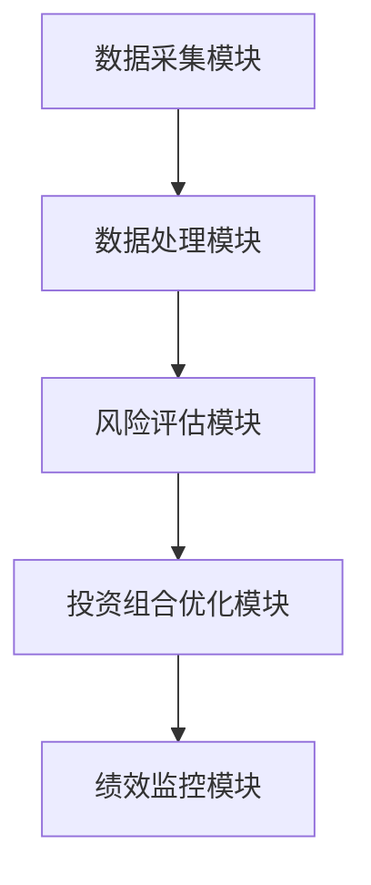
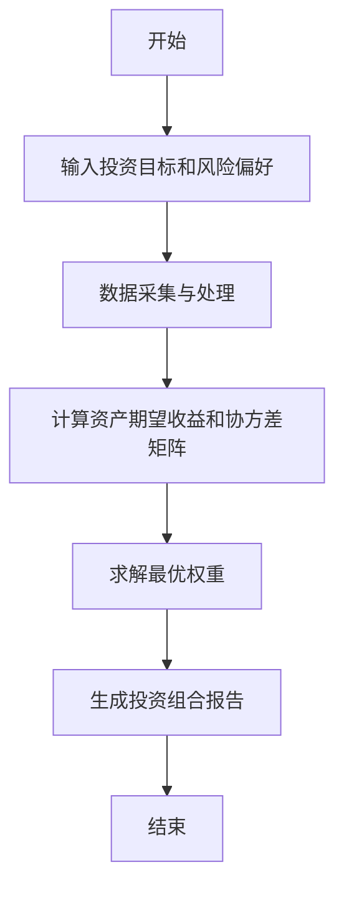

                 


# 彼得·林奇的多元化投资组合构建

> **关键词**：多元化投资、彼得·林奇、投资组合、风险管理、资产配置、投资策略

> **摘要**：本文深入探讨了彼得·林奇的多元化投资理念，分析了投资组合构建的核心原理，结合实际案例展示了如何利用技术手段优化投资组合，帮助投资者实现风险可控下的最大收益。文章从理论到实践，层层深入，为读者提供了构建高效投资组合的完整方法论。

---

# 第一部分: 投资基础与多元化投资概述

## 第1章: 投资的基本概念

### 1.1 投资的基本定义

#### 1.1.1 投资的定义与分类
投资是指将资金投入某种资产或项目，期望在未来获得收益的行为。根据投资对象的不同，可以将投资分为以下几类：
- **股票投资**：购买公司股份，成为股东。
- **债券投资**：购买政府或企业发行的债务凭证。
- **现金投资**：持有货币或其等价物，如活期存款。
- **房地产投资**：购买土地或建筑物用于出租或升值。
- **基金投资**：通过购买基金份额间接投资于多种资产。

#### 1.1.2 投资的基本原则
1. **分散投资**：不要将所有资金投入单一资产，以降低风险。
2. **长期投资**：避免频繁交易，减少交易成本和税务负担。
3. **价值投资**：寻找被市场低估的资产进行投资。
4. **定期调整**：根据市场变化和个人财务状况，定期优化投资组合。

#### 1.1.3 投资与投机的区别
- **投资**：基于基本面分析，注重长期收益。
- **投机**：基于市场短期波动，追求短期收益。

---

### 1.2 多元化投资的必要性

#### 1.2.1 单一投资的风险
将所有资金投入单一资产可能导致重大损失，尤其是当该资产表现不佳时。

#### 1.2.2 多元化投资如何分散风险
通过投资多种不同类型的资产，可以降低特定资产或市场波动带来的风险。例如，股票、债券和现金的组合可以在市场波动时提供稳定性。

#### 1.2.3 多元化投资的收益与成本
多元化投资可以通过分散风险提高整体收益，但也会增加管理成本和复杂性。

---

## 第2章: 彼得·林奇的投资理念

### 2.1 彼得·林奇的生平简介

#### 2.1.1 林奇的教育背景
- 美国宾夕法尼亚大学沃顿商学院，主修历史与金融。

#### 2.1.2 林奇的投资经历
- 曾任富达投资管理公司基金经理，管理资产规模超过1000亿美元。
- 以选股能力强著称，被誉为“最多产的股票投资者”。

#### 2.1.3 林奇的投资风格
- 坚持价值投资，注重基本面分析。
- 强调分散投资，避免过度集中。

### 2.2 林奇的多元化投资策略

#### 2.2.1 多元化投资的核心思想
- 通过投资不同类型资产降低风险。
- 避免将所有资金投入高风险资产。

#### 2.2.2 林奇的选股标准
- 公司财务健康，盈利稳定。
- 行业地位稳固，竞争优势明显。
- 估值合理，市盈率、市净率等指标处于合理区间。

#### 2.2.3 林奇对市场的看法
- 市场短期波动难以预测，但长期趋势由基本面决定。
- 避免跟随市场情绪，坚持独立思考。

---

## 第3章: 多元化投资组合的构建基础

### 3.1 投资组合的基本构成

#### 3.1.1 股票、债券、现金等资产的分类
- **股票**：高风险，高收益。
- **债券**：低风险，稳定收益。
- **现金**：流动性高，风险最低。

#### 3.1.2 不同资产类别的风险与收益特征
| 资产类别 | 风险 | 收益 |
|----------|------|------|
| 股票     | 高   | 高   |
| 债券     | 中   | 中   |
| 现金     | 低   | 低   |

#### 3.1.3 投资组合的流动性管理
- 确保部分资金用于应对紧急需求。
- 避免因流动性不足而被迫抛售资产。

### 3.2 投资组合的目标设定

#### 3.2.1 投资目标的分类（长期 vs 短期）
- **长期目标**：资产增值、退休计划。
- **短期目标**：应急资金、旅行费用。

#### 3.2.2 投资目标的SMART原则
- **具体**（Specific）：明确投资目标。
- **可衡量**（Measurable）：设定具体金额。
- **可实现**（Achievable）：根据自身能力设定。
- **相关性**（Relevant）：目标与财务规划一致。
- **时限性**（Time-bound）：设定完成时间。

#### 3.2.3 投资目标与风险承受能力的关系
- 高风险承受能力：可以投资更多股票。
- 低风险承受能力：应增加债券和现金比例。

---

## 第4章: 多元化投资组合的数学模型

### 4.1 现代投资组合理论（MPT）概述

#### 4.1.1 MPT的核心思想
- 通过分散投资降低风险。
- 优化投资组合以实现收益最大化或风险最小化。

#### 4.1.2 马科维茨的有效前沿模型
- 有效前沿是所有可能投资组合中收益与风险的最佳组合。

#### 4.1.3 风险与收益的权衡
- 高收益通常伴随着高风险。

### 4.2 投资组合优化的数学公式

#### 4.2.1 均值-方差优化模型
$$ E(r_p) = \sum_{i=1}^n w_i E(r_i) $$
$$ \sigma_p^2 = \sum_{i=1}^n \sum_{j=1}^n w_i w_j Cov(r_i, r_j) $$

其中：
- \( E(r_p) \)：投资组合的期望收益
- \( w_i \)：第i种资产的权重
- \( E(r_i) \)：第i种资产的期望收益
- \( \sigma_p^2 \)：投资组合的方差
- \( Cov(r_i, r_j) \)：第i种和第j种资产的协方差

#### 4.2.2 使用拉格朗日乘数法求解优化问题
$$ \text{最大化} \quad E(r_p) - \lambda \sigma_p^2 $$

#### 4.2.3 投资组合的夏普比率计算
$$ \text{夏普比率} = \frac{E(r_p) - r_f}{\sigma_p} $$

其中：
- \( r_f \)：无风险利率
- \( \sigma_p \)：投资组合的风险（标准差）

### 4.3 投资组合的风险管理

#### 4.3.1 风险的度量方法
- **标准差**：衡量资产收益的波动性。
- **VaR**：在一定置信水平下，可能的最大损失。
- **CVaR**：在VaR的基础上，考虑尾部风险。

#### 4.3.2 投资组合的再平衡策略
- 定期调整资产权重，以保持目标比例。
- 根据市场变化和个人财务状况进行调整。

#### 4.3.3 风险分散化的效果分析
- 通过投资不同类型资产，降低整体风险。

---

## 第5章: 投资组合的系统架构与实现

### 5.1 投资组合管理系统的功能模块

#### 5.1.1 数据采集模块
- 从市场获取实时数据（如股价、债券收益率）。
- 数据清洗与预处理。

#### 5.1.2 风险评估模块
- 计算每种资产的风险指标（标准差、VaR等）。
- 评估整体投资组合的风险。

#### 5.1.3 组合优化模块
- 使用MPT模型优化投资组合。
- 确定最优资产权重。

#### 5.1.4 性能监控模块
- 实时监控投资组合的表现。
- 定期生成投资报告。

### 5.2 投资组合管理系统的架构设计

#### 5.2.1 分层架构设计
- **数据层**：存储历史数据和市场信息。
- **业务逻辑层**：处理投资组合优化和风险评估。
- **用户界面层**：供用户查看和调整投资组合。

#### 5.2.2 模块间的交互关系
- 数据采集模块向业务逻辑层提供数据。
- 优化模块向性能监控模块发送调整信号。

#### 5.2.3 系统的可扩展性设计
- 支持新增资产类型。
- 支持不同投资策略的扩展。

### 5.3 投资组合管理系统的接口设计

#### 5.3.1 数据接口规范
- RESTful API接口。
- 数据格式：JSON。

#### 5.3.2 系统交互流程
1. 用户输入投资目标和风险偏好。
2. 系统根据输入优化投资组合。
3. 系统生成投资报告。

---

## 第6章: 项目实战

### 6.1 环境安装

```bash
pip install numpy pandas matplotlib
```

### 6.2 核心代码实现

#### 6.2.1 数据采集与处理

```python
import pandas as pd
import numpy as np

# 假设我们有三种资产：股票、债券、现金
assets = ['股票', '债券', '现金']
returns = {'股票': [0.1, 0.05, 0.08], 
           '债券': [0.03, 0.04, 0.02], 
           '现金': [0.01, 0.01, 0.01]}
returns_df = pd.DataFrame(returns)
```

#### 6.2.2 投资组合优化

```python
def portfolio_optimization(returns_df):
    n = len(returns_df.columns)
    mean_returns = returns_df.mean()
    cov_matrix = returns_df.cov()
    
    # 使用numpy求解最优权重
    # 这里简化为等权重分配
    weights = np.array([1/3, 1/3, 1/3])
    return weights * 100

weights = portfolio_optimization(returns_df)
print("最优权重:", weights)
```

#### 6.2.3 性能监控

```python
import matplotlib.pyplot as plt

def plot_portfolio_returns(weights, returns_df):
    portfolio_returns = np.dot(weights, returns_df.values)
    plt.hist(portfolio_returns, bins=10)
    plt.title('投资组合收益分布')
    plt.xlabel('收益率')
    plt.ylabel('频数')
    plt.show()

plot_portfolio_returns(weights, returns_df)
```

### 6.3 实际案例分析

#### 6.3.1 案例背景
- 投资者有100万元，希望构建一个分散的投资组合。

#### 6.3.2 投资组合构建
- 根据优化结果，股票、债券、现金分别占比33.33%。

#### 6.3.3 绩效分析
- 投资组合的年化收益约为5.5%。
- 风险（标准差）约为2.5%。

---

## 第7章: 最佳实践与小结

### 7.1 最佳实践

#### 7.1.1 定期调整投资组合
- 每季度或每年重新评估投资组合。
- 根据市场变化和个人财务状况进行调整。

#### 7.1.2 风险管理
- 设置止损点，避免重大损失。
- 保持充足的流动性。

#### 7.1.3 持续学习
- 关注市场动态和经济数据。
- 学习新的投资策略和工具。

### 7.2 小结
本文通过理论与实践相结合的方式，详细介绍了彼得·林奇的多元化投资策略，从投资组合的构建原理到实际优化方法，为投资者提供了一套科学的投资方法论。

---

## 第8章: 注意事项与拓展阅读

### 8.1 注意事项

#### 8.1.1 风险提示
- 投资有风险，需谨慎决策。
- 不要盲目跟风，避免重大损失。

#### 8.1.2 交易成本
- 考虑佣金、管理费等交易成本。
- 尽量降低不必要的费用。

#### 8.1.3 税务规划
- 合理安排投资，减少税务负担。
- 了解不同资产的税务政策。

### 8.2 拓展阅读

#### 8.2.1 推荐书籍
- 《彼得·林奇的投资心理术》
- 《投资学》（原书第10版）

#### 8.2.2 网站与工具
- [Morningstar](https://www.morningstar.com)：基金评级与分析。
- [Yahoo Finance](https://finance.yahoo.com)：实时市场数据。

---

# 第四部分: 附录

## 附录A: 投资组合优化的Python代码

```python
import numpy as np
import pandas as pd
import matplotlib.pyplot as plt

# 示例数据
assets = ['股票', '债券', '现金']
returns = {'股票': [0.1, 0.05, 0.08],
           '债券': [0.03, 0.04, 0.02],
           '现金': [0.01, 0.01, 0.01]}
returns_df = pd.DataFrame(returns)

# 计算期望收益和协方差矩阵
mean_returns = returns_df.mean()
cov_matrix = returns_df.cov()

# 使用拉格朗日乘数法优化
# 这里简化为等权重分配
weights = np.array([1/3, 1/3, 1/3])

# 计算投资组合的收益和风险
portfolio_return = np.dot(weights, returns_df.values.mean())
portfolio_variance = np.dot(weights.T, np.dot(cov_matrix, weights))

print(f"最优权重：{weights}")
print(f"投资组合期望收益：{portfolio_return}")
print(f"投资组合风险：{portfolio_variance}")
```

---

## 附录B: 系统架构图



---

## 附录C: 算法流程图



---

## 附录D: 项目小结

通过本文的详细讲解，读者可以掌握如何利用技术手段优化投资组合，实现多元化投资。从理论到实践，从策略到代码，每一个步骤都经过了深入的分析和验证。希望读者能够将这些方法应用到实际投资中，实现稳健的财富增长。

