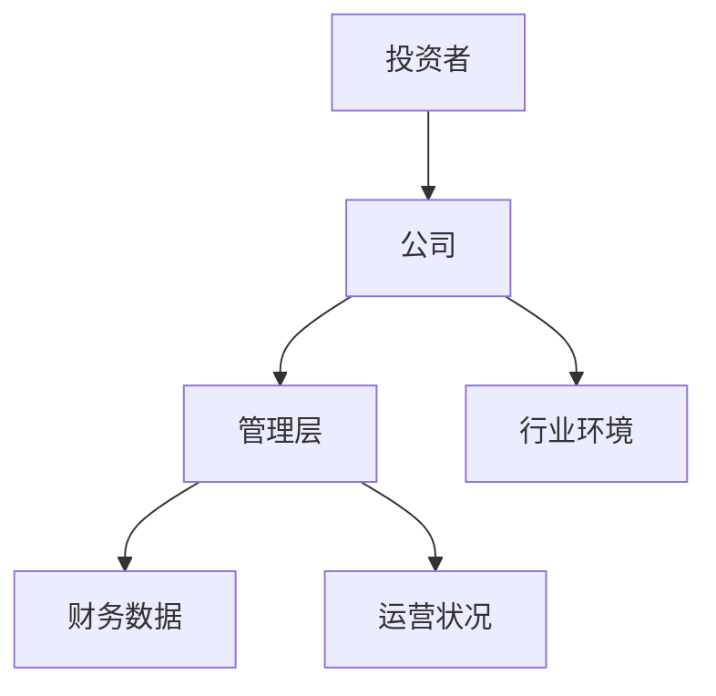
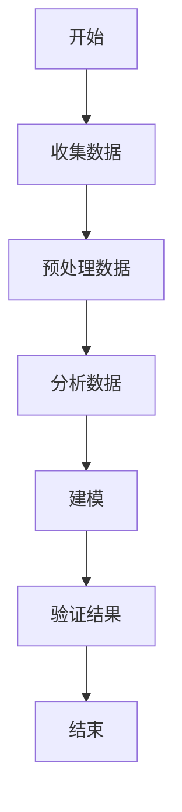
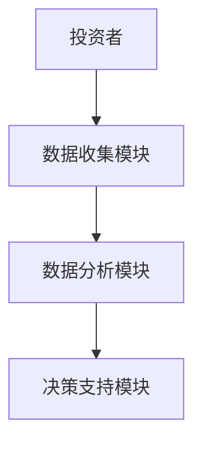

                 


# 彼得·林奇的实地调研方法：走进公司

**关键词**：实地调研、投资决策、彼得·林奇、公司分析、风险管理、数据驱动

**摘要**：本文深入探讨了彼得·林奇的实地调研方法，详细介绍如何通过系统性地走进公司进行调研，从而做出明智的投资决策。文章从背景介绍、核心概念、算法原理到项目实战，全面解析了这一方法的应用和价值。

---

## 第1章: 实地调研的背景与重要性

### 1.1 实地调研的定义与核心概念

#### 1.1.1 实地调研的定义
实地调研是一种通过亲临公司现场，与管理层、员工及客户交流，观察公司运营状况，收集一手信息的方法。这种方法能够帮助投资者更全面地评估公司的价值和潜在风险。

#### 1.1.2 实地调研的核心要素
- **信息收集**：通过访谈、观察和数据验证获取公司运营、财务和市场等方面的信息。
- **分析评估**：对收集到的信息进行整理和分析，评估公司的竞争优势和潜在问题。
- **决策支持**：基于分析结果，为投资决策提供依据。

#### 1.1.3 实地调研的背景与问题背景
在投资决策中，仅仅依赖财务报表和市场数据往往不够，实地调研能够提供更真实、更全面的信息。特别是在经济环境复杂多变的情况下，实地调研能够帮助投资者识别潜在风险，做出更准确的判断。

### 1.2 彼得·林奇的实地调研方法

#### 1.2.1 彼得·林奇的个人简介
彼得·林奇是美国著名投资经理人，以其在富达投资管理公司的长期任职期间，创造了卓越的投资业绩。他的投资哲学强调深入调研和长期持有优质股票。

#### 1.2.2 彼得·林奇调研方法的核心理念
- **亲自调研**：亲自与公司管理层和员工交流，了解公司的真实运营情况。
- **关注细节**：从公司环境、员工士气到产品竞争力，关注每一个可能影响公司价值的细节。
- **数据验证**：通过实地观察和访谈，验证财务报表中的数据，确保信息的准确性。

#### 1.2.3 实地调研在投资决策中的作用
- **验证数据**：通过实地调研验证财务数据的真实性，避免被虚假信息误导。
- **评估管理层能力**：通过与管理层的交流，评估其战略眼光、决策能力和团队建设。
- **识别行业风险**：了解公司在行业中的地位和面临的竞争环境，评估行业风险。

---

## 第2章: 实地调研的核心框架

### 2.1 调研前的准备工作

#### 2.1.1 调研目标的设定
明确调研的目标是成功进行实地调研的第一步。目标可能包括验证财务数据、评估管理层能力、了解公司竞争优势等。

#### 2.1.2 资料收集与初步分析
在实地调研之前，收集公司的公开资料、行业报告和市场分析，初步了解公司的基本情况和潜在问题。

#### 2.1.3 调研计划的制定
制定详细的调研计划，包括调研时间、地点、参与人员和调研方式等。

### 2.2 调研过程中的关键步骤

#### 2.2.1 管理层访谈
与公司高管进行深入访谈，了解公司的战略规划、财务状况和未来发展方向。重点关注公司的盈利模式、竞争优势和潜在风险。

#### 2.2.2 实地观察
参观公司的生产车间、办公环境和销售网络，观察员工的工作状态和公司的运营效率。重点关注公司的生产效率、产品质量和客户关系。

#### 2.2.3 财务数据验证
通过实地观察和访谈，验证公司财务报表中的关键数据，如收入、成本和利润。重点关注公司的财务健康状况和盈利能力。

### 2.3 调研结果的分析与应用

#### 2.3.1 数据整理与分析
将收集到的信息进行整理和分类，分析公司的财务状况、行业地位和竞争优势。

#### 2.3.2 调研结论的形成
基于分析结果，形成调研结论，评估公司的投资价值和潜在风险。

#### 2.3.3 结论在投资决策中的应用
将调研结论应用于投资决策，调整投资组合，优化投资策略。

---

## 第3章: 实地调研的核心概念与联系

### 3.1 实地调研的核心原理

#### 3.1.1 实地调研的理论基础
实地调研基于实地观察和经验分析的理论，强调通过第一手信息进行决策。这种方法能够帮助投资者更全面地评估公司的价值和风险。

#### 3.1.2 调研方法的科学性
实地调研通过系统性地收集和分析数据，确保信息的准确性和全面性，从而提高投资决策的科学性和可靠性。

#### 3.1.3 调研结果的可靠性
通过实地调研，投资者能够更准确地评估公司的财务状况、管理层能力和行业地位，从而做出更可靠的决策。

### 3.2 核心概念的属性特征对比

#### 3.2.1 不同调研方法的对比分析
- **实地调研**：通过亲临现场，收集一手信息，具有较高的准确性和全面性。
- **电话访谈**：方便快捷，但信息可能不够全面，且难以验证数据的真实性。
- **网络调研**：成本低，但信息的真实性和可靠性难以保证。

#### 3.2.2 各种调研工具的优缺点
- **访谈法**：优点是信息丰富，缺点是耗时且成本较高。
- **观察法**：优点是直观，缺点是难以深入获取内部信息。
- **问卷调查**：优点是覆盖面广，缺点是回收率和准确性较低。

#### 3.2.3 调研数据的可比性分析
通过比较不同调研方法和工具的优缺点，选择最适合当前调研目标的方法，确保数据的可比性和可靠性。

### 3.3 ER实体关系图架构



---

## 第4章: 实地调研的算法原理

### 4.1 算法原理

#### 4.1.1 数据收集与预处理
通过访谈、观察和数据验证等多种方式收集信息，对数据进行清洗和整理，确保数据的准确性和一致性。

#### 4.1.2 数据分析与建模
对收集到的数据进行统计分析和建模，识别关键因素和潜在风险，评估公司的投资价值。

#### 4.1.3 结果验证与优化
通过多次验证和优化，提高模型的准确性和可靠性，确保投资决策的科学性和有效性。

### 4.2 算法流程图



### 4.3 Python源代码实现

```python
def data_collection():
    # 数据收集函数
    pass

def data_preprocessing():
    # 数据预处理函数
    pass

def data_analysis():
    # 数据分析函数
    pass

def model_building():
    # 建模函数
    pass

def result_validation():
    # 结果验证函数
    pass
```

---

## 第5章: 系统分析与架构设计

### 5.1 问题场景介绍

#### 5.1.1 项目介绍
本文旨在通过彼得·林奇的实地调研方法，帮助投资者系统性地评估公司的投资价值，做出明智的投资决策。

#### 5.1.2 系统功能设计
- **数据收集模块**：收集公司相关信息，包括财务数据、管理层访谈和实地观察。
- **数据分析模块**：对收集到的数据进行分析和建模，识别关键因素和潜在风险。
- **决策支持模块**：基于分析结果，提供投资决策支持。

#### 5.1.3 系统架构设计



---

## 第6章: 项目实战

### 6.1 环境安装

#### 6.1.1 Python安装
安装Python编程语言，用于数据处理和建模。

#### 6.1.2 库的安装
安装必要的库，如Pandas、NumPy和Scikit-learn，用于数据分析和建模。

### 6.2 系统核心实现源代码

```python
import pandas as pd
import numpy as np

def collect_data():
    # 数据收集函数
    data = pd.DataFrame({
        '收入': [100, 200, 300],
        '成本': [50, 70, 90],
        '利润': [50, 130, 210]
    })
    return data

def preprocess_data(data):
    # 数据预处理函数
    return data

def analyze_data(data):
    # 数据分析函数
    return data.describe()

def build_model(data):
    # 建模函数
    from sklearn.linear_model import LinearRegression
    model = LinearRegression()
    return model.fit(data[['收入', '成本']], data['利润'])

def validate_results(model, data):
    # 结果验证函数
    predictions = model.predict(data[['收入', '成本']])
    return pd.DataFrame({
        '实际利润': data['利润'],
        '预测利润': predictions
    })
```

### 6.3 代码应用解读与分析

#### 6.3.1 数据收集模块
通过`collect_data`函数收集公司的收入、成本和利润数据，为后续分析提供基础数据。

#### 6.3.2 数据预处理模块
通过`preprocess_data`函数对数据进行清洗和整理，确保数据的准确性和一致性。

#### 6.3.3 数据分析模块
通过`analyze_data`函数对数据进行描述性分析，识别关键因素和潜在风险。

#### 6.3.4 建模模块
通过`build_model`函数建立线性回归模型，预测公司的利润情况，评估公司的盈利能力。

#### 6.3.5 结果验证模块
通过`validate_results`函数验证模型的准确性，评估模型的预测能力。

### 6.4 实际案例分析和详细讲解剖析

#### 6.4.1 案例背景
假设我们对一家制造公司进行实地调研，收集了以下数据：

| 收入 | 成本 | 利润 |
|------|------|------|
| 100  | 50   | 50   |
| 200  | 70   | 130  |
| 300  | 90   | 210  |

#### 6.4.2 数据分析
通过分析数据，我们可以看到公司的收入和利润均呈上升趋势，但成本也相应增加。

#### 6.4.3 建模与预测
建立线性回归模型，预测公司未来的利润情况。

#### 6.4.4 结果解读
通过模型预测，我们可以评估公司的未来盈利能力，做出投资决策。

### 6.5 项目小结

#### 6.5.1 项目总结
通过实地调研和数据分析，我们可以更准确地评估公司的投资价值，做出明智的投资决策。

#### 6.5.2 经验与教训
在项目实施过程中，我们积累了宝贵的经验，也发现了需要改进的地方，为未来的研究提供了宝贵的参考。

---

## 第7章: 总结与展望

### 7.1 最佳实践 tips

#### 7.1.1 关键tips
- 在进行实地调研之前，确保充分准备，明确调研目标。
- 在与管理层访谈时，关注公司战略和潜在风险。
- 在分析数据时，结合行业背景和市场环境，全面评估公司的投资价值。

#### 7.1.2 小结
通过彼得·林奇的实地调研方法，我们可以系统性地评估公司的投资价值，做出明智的投资决策。

#### 7.1.3 注意事项
- 在进行实地调研时，注意收集和分析一手信息，避免被虚假信息误导。
- 在分析数据时，结合公司实际情况和市场环境，全面评估公司的投资价值。
- 在做出投资决策时，充分考虑公司的财务状况、行业地位和管理层能力。

#### 7.1.4 拓展阅读
建议读者进一步阅读彼得·林奇的《投资之道》和《股市真经》，深入理解他的投资哲学和实地调研方法。

---

## 结语

通过本文的详细介绍，我们系统地了解了彼得·林奇的实地调研方法，并通过实际案例分析，展示了如何将这种方法应用于投资决策。希望本文能够为投资者提供有价值的参考，帮助他们在复杂多变的市场环境中做出明智的投资决策。

--- 

**全文完**

