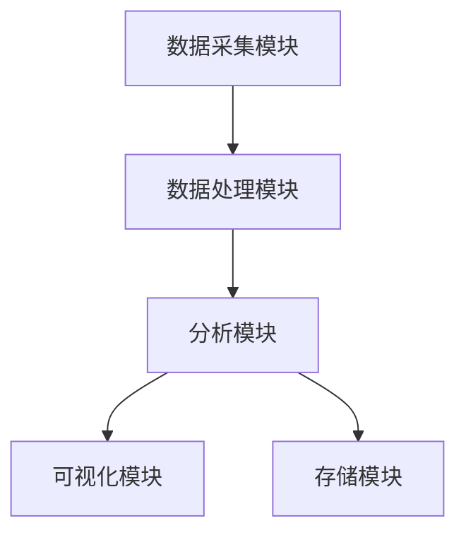

                 


# 彼得·林奇的成长型价值投资方法论

> 关键词：价值投资、成长型、彼得·林奇、投资策略、系统分析

> 摘要：本文将深入探讨彼得·林奇的成长型价值投资方法论，从其核心理念、分析框架到系统化投资策略进行全面解析。通过案例分析和系统设计，结合技术语言和专业方法，为读者提供清晰的投资思路和实践指导。

---

## 第一部分: 价值投资的背景与核心理念

### 第1章: 价值投资的定义与背景

#### 1.1 价值投资的起源与发展
- 投资学的基本概念：资产定价、风险与收益、市场效率。
- 价值投资的起源：本杰明·格雷厄姆的价值投资理论，强调安全边际和内在价值。
- 彼得·林奇的贡献：将成长型投资理念发扬光大，强调企业的成长性和估值的合理性。

#### 1.2 成长型投资的核心特点
- 成长型投资的定义：注重企业未来增长潜力，而非当前估值。
- 与价值型投资的区别：成长型更关注企业的成长性，而价值型更关注估值的合理性。
- 成长型投资的三要素：收入增长率、净利润增长率、ROE（净资产收益率）。

### 第2章: 彼得·林奇的成长型投资方法论

#### 2.1 投资策略的核心要素
- 长期投资与复利效应：通过时间的积累实现财富增长。
- 买入并持有策略：选择优质企业长期持有，避免频繁交易。
- 成长与估值的平衡：在企业成长性和估值之间寻找最佳平衡点。

#### 2.2 成长型投资的分析框架
- 企业基本面分析：收入、利润、现金流、资产负债表。
- 财务指标分析：ROE、毛利率、净利率、研发投入占比。
- 行业分析与竞争分析：行业地位、竞争优势、市场前景。

---

## 第二部分: 成长型投资的系统化分析

### 第3章: 投资系统的构建

#### 3.1 数据收集与处理
- 数据源：公开财报、行业报告、市场数据。
- 数据清洗：处理缺失值、异常值、数据格式统一。
- 数据预处理：标准化、归一化、特征选择。

#### 3.2 分析工具的选择
- 财务分析工具：Excel、PivotTable。
- 数据可视化工具：Tableau、Power BI。
- 系统化分析工具：Python、Pandas、NumPy。

### 第4章: 数据分析与建模

#### 4.1 成长性预测模型的建立
- 模型选择：线性回归、时间序列分析。
- 数据特征：收入增长率、净利润增长率、ROE。
- 模型验证：训练集、测试集、交叉验证。

#### 4.2 估值模型的构建与应用
- 市盈率模型：$$市盈率 = \frac{股价}{每股收益}$$。
- 市净率模型：$$市净率 = \frac{股价}{每股净资产}$$。
- 内在价值模型：$$内在价值 = \text{未来现金流的现值}$$。

### 第5章: 系统架构设计

#### 5.1 系统功能模块划分
- 数据采集模块：爬取财务数据。
- 数据处理模块：清洗、预处理。
- 分析模块：生成财务指标、建立模型。
- 可视化模块：生成图表、报告。

#### 5.2 系统架构图


---

## 第三部分: 成长型投资的实战案例分析

### 第6章: 项目实战

#### 6.1 环境安装与配置
- 安装Python：`python --version`。
- 安装依赖：`pip install pandas numpy matplotlib`。

#### 6.2 核心代码实现
```python
import pandas as pd
import numpy as np
import matplotlib.pyplot as plt

# 示例数据
data = {
    '公司': ['公司A', '公司B', '公司C'],
    '收入增长率': [20, 15, 10],
    '净利润增长率': [15, 10, 5],
    'ROE': [20, 18, 12]
}

df = pd.DataFrame(data)

# 计算综合评分
df['综合评分'] = (df['收入增长率'] + df['净利润增长率'] + df['ROE']) / 3

print(df)
```

#### 6.3 案例分析与解读
- 案例分析：假设分析某科技公司的财务数据，计算其市盈率和ROE。
- 投资组合构建：根据评分模型，选择优质企业构建投资组合。
- 风险管理：设置止损点、分散投资、定期复盘。

---

## 第四部分: 总结与展望

### 第7章: 成长型投资的总结与注意事项

#### 7.1 总结
- 彼得·林奇的成长型投资方法论的核心在于：选择优质企业，长期持有，关注成长性与估值的平衡。
- 系统化分析：通过数据处理、建模和可视化，提高投资决策的科学性。

#### 7.2 注意事项
- 风险管理：避免过度集中，设置止损点。
- 长期视角：成长型投资需要耐心和信心，避免短期波动干扰。
- 持续学习：市场变化快，需不断更新知识和策略。

---

通过以上分析，我们可以看到，彼得·林奇的成长型价值投资方法论不仅是一种投资策略，更是一种系统化、科学化的投资方法。结合技术手段，我们可以更好地实现投资目标，降低风险，提高收益。

