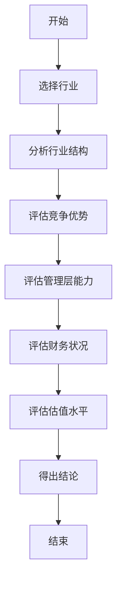
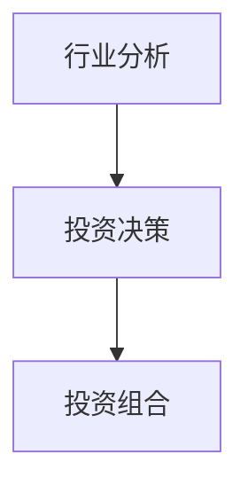
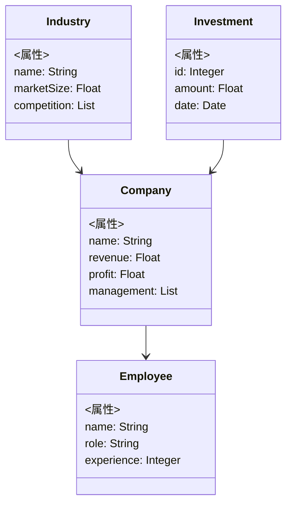
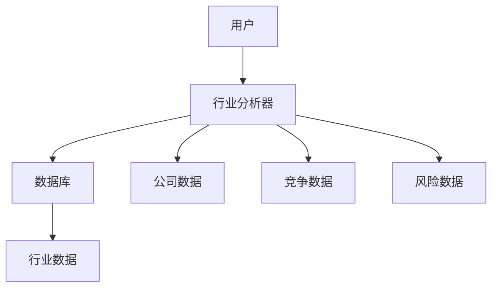

                 


# 彼得·林奇的行业分析方法论

> 关键词：彼得·林奇、行业分析、投资策略、风险管理、数据分析

> 摘要：本文深入探讨彼得·林奇的行业分析方法论，分析其核心概念、算法原理和系统架构，结合实际案例，详细解读如何在投资决策中应用这些方法，提供最佳实践建议。

---

## 第1章: 行业分析的背景与意义

### 1.1 行业分析的核心概念

#### 1.1.1 行业分析的定义与背景

行业分析是通过对特定行业内的市场结构、竞争状况、增长潜力和风险因素进行系统性研究的过程。彼得·林奇作为美国著名的投资专家，以其独特的行业分析方法闻名，他强调深入研究行业动态，寻找具有竞争优势的公司。

#### 1.1.2 行业分析的重要性

行业分析是投资决策中的关键步骤，它帮助投资者识别行业内的增长机会和潜在风险。通过分析行业结构、竞争格局和宏观经济因素，投资者可以更好地评估公司的投资价值。

#### 1.1.3 彼得·林奇的行业分析方法论

林奇的方法论强调对行业进行深入研究，关注行业内的龙头企业，分析公司的财务状况、竞争优势和管理层能力。他通过筛选具有可持续增长潜力的公司，构建投资组合。

### 1.2 彼得·林奇的生平与投资理念

#### 1.2.1 彼得·林奇的生平简介

彼得·林奇是美国富达投资集团的传奇基金经理，管理着麦哲伦基金，取得了卓越的投资业绩。他的投资哲学强调长期价值投资，注重对公司和行业的深入研究。

#### 1.2.2 林奇的投资哲学与方法论

林奇的投资理念是寻找那些具有持续竞争优势、管理优秀且估值合理的公司。他强调行业分析的重要性，认为只有深入了解行业，才能准确评估公司的投资价值。

#### 1.2.3 林奇方法论的核心思想

林奇认为，成功的投资不仅依赖于对公司的分析，还需要对所处行业进行深入研究。他提出了一套系统化的行业分析方法，包括行业结构分析、竞争优势评估和风险因素分析。

### 1.3 行业分析方法论的体系框架

#### 1.3.1 行业分析的基本框架

行业分析的基本框架包括行业结构分析、竞争格局分析、增长潜力评估和风险因素分析。林奇的方法论在此基础上，加入了对公司竞争优势和管理层能力的评估。

#### 1.3.2 林奇方法论的独特性

林奇的独特之处在于他将行业分析与公司分析紧密结合，注重对公司内在价值的评估。他强调长期投资，避免短期市场波动的干扰。

#### 1.3.3 行业分析方法论的应用范围

林奇的方法论适用于多个行业，特别适合那些具有稳定增长潜力和竞争优势的行业。他的方法论不仅适用于股票投资，也可应用于其他类型的投资决策。

---

## 第2章: 行业分析的核心概念与联系

### 2.1 核心概念的定义与属性

#### 2.1.1 行业分析的基本概念

行业分析是对特定行业内的市场结构、竞争状况、增长潜力和风险因素进行系统性研究的过程。核心概念包括行业结构、竞争格局、增长潜力和风险因素。

#### 2.1.2 林奇方法论的核心概念

林奇的方法论强调对公司竞争优势和管理层能力的评估。核心概念包括公司竞争优势、管理层能力、财务状况和估值水平。

#### 2.1.3 行业分析与投资决策的关系

行业分析是投资决策的基础，通过对行业结构和竞争状况的分析，投资者可以更好地评估公司的投资价值。行业分析与投资决策密切相关，影响投资组合的构建。

### 2.2 核心概念的对比分析

#### 2.2.1 行业分析与公司分析的对比

行业分析关注行业整体的结构和趋势，而公司分析关注特定公司的财务状况和竞争优势。两者相辅相成，共同影响投资决策。

#### 2.2.2 林奇方法论与其他投资方法的对比

林奇的方法论强调对公司内在价值的评估，而其他方法如技术分析关注市场走势。林奇的方法论注重基本面分析，与其他方法有显著不同。

#### 2.2.3 行业分析方法的优缺点

优点：行业分析能够帮助投资者识别行业内的增长机会和潜在风险，提高投资决策的准确性。

缺点：行业分析需要大量数据和深入研究，耗费时间和精力。

### 2.3 实体关系图与流程图

#### 2.3.1 行业分析的核心要素ER图

```mermaid
erDiagram
    customer[投资者]
    company[公司]
    industry[行业]
    competition[竞争]
    risk[风险]
    growth[增长]
    customer --> company: 投资
    company --> industry: 所属
    industry --> competition: 包含
    industry --> risk: 包含
    industry --> growth: 包含
```

#### 2.3.2 林奇方法论的流程图



#### 2.3.3 行业分析与投资决策的关系图



---

## 第3章: 行业分析的算法原理

### 3.1 算法原理概述

#### 3.1.1 行业分析的基本原理

行业分析的基本原理是通过对行业内的市场结构、竞争状况和增长潜力进行系统性研究，评估行业内的投资价值。

#### 3.1.2 林奇方法论的算法框架

林奇方法论的算法框架包括以下步骤：

1. **选择行业**：根据宏观经济趋势和市场机会选择投资行业。
2. **分析行业结构**：研究行业的市场结构、竞争格局和市场进入壁垒。
3. **评估竞争优势**：分析公司的竞争优势，包括成本优势、技术优势和品牌优势。
4. **评估管理层能力**：评估公司管理层的能力和决策水平。
5. **评估财务状况**：分析公司的财务状况，包括盈利能力、偿债能力和成长能力。
6. **评估估值水平**：评估公司的估值水平，确保投资具有合理的价格。

#### 3.1.3 行业分析的数学模型

行业分析的数学模型包括行业增长模型、竞争分析模型和估值模型。

### 3.2 算法流程图

#### 3.2.1 行业分析的流程图


#### 3.2.2 算法的数学模型与公式

行业增长模型：

$$ G = \frac{I \times (1 + r)^n}{P} $$

其中，\( G \) 表示行业增长，\( I \) 表示初始投资，\( r \) 表示增长率，\( n \) 表示时间，\( P \) 表示价格。

---

## 第4章: 行业分析的系统分析与架构设计

### 4.1 系统功能设计

#### 4.1.1 领域模型类图



#### 4.1.2 系统架构设计



---

## 第5章: 项目实战

### 5.1 环境安装

需要安装以下工具：

- Python
- Pandas
- NumPy
- Matplotlib
- Jupyter Notebook

### 5.2 核心实现

#### 5.2.1 数据收集

收集目标行业的市场数据、公司财务数据和竞争数据。

#### 5.2.2 数据处理

使用Python代码处理数据，计算行业增长和竞争指标。

#### 5.2.3 分析报告

生成行业分析报告，包括行业结构分析、竞争优势评估和投资建议。

### 5.3 实际案例分析

以科技行业为例，分析行业结构和公司竞争优势。

### 5.4 结果解读

解读分析结果，评估投资价值和潜在风险。

### 5.5 项目小结

总结项目实施过程，提出改进建议。

---

## 第6章: 最佳实践与总结

### 6.1 最佳实践 tips

- 定期更新行业分析，适应市场变化。
- 结合定量分析和定性分析，提高分析准确性。
- 注重风险控制，分散投资组合。

### 6.2 小结

本文系统地介绍了彼得·林奇的行业分析方法论，分析了其核心概念、算法原理和系统架构，并结合实际案例进行了详细解读。林奇的方法论为投资者提供了有效的投资决策工具。

### 6.3 注意事项

- 数据来源的可靠性是关键，确保数据准确。
- 分析过程中需考虑宏观经济因素的影响。
- 风险管理是投资决策的重要组成部分，需高度重视。

### 6.4 拓展阅读

- 彼得·林奇的书籍：《彼得·林奇的投资艺术》
- 其他投资方法论：技术分析、价值投资

---

## 第7章: 数学公式与模型

### 7.1 行业增长模型

$$ G = \frac{I \times (1 + r)^n}{P} $$

### 7.2 竞争分析模型

$$ C = \frac{N \times (1 - e)}{M} $$

### 7.3 估值模型

$$ V = \frac{E}{P/E} $$

---

## 第8章: 系统架构与接口设计

### 8.1 系统架构设计


### 8.2 系统接口设计

- 数据接口：API用于数据获取和分析结果返回。
- 用户接口：图形化界面供用户输入和输出。

---

## 第9章: 项目实战与案例分析

### 9.1 环境安装

安装Python、Pandas、NumPy、Matplotlib和Jupyter Notebook。

### 9.2 核心实现

编写Python代码进行数据处理和分析。

### 9.3 实际案例分析

以科技行业为例，分析行业结构和公司竞争优势。

### 9.4 结果解读

解读分析结果，评估投资价值和潜在风险。

### 9.5 项目小结

总结项目实施过程，提出改进建议。

---

## 第10章: 总结与展望

### 10.1 总结

彼得·林奇的行业分析方法论为投资者提供了有效的工具，帮助他们在复杂的市场环境中做出明智的投资决策。

### 10.2 展望

未来，随着人工智能和大数据技术的发展，行业分析将更加精准和高效。投资者可以利用新技术提升分析能力，捕捉更多的投资机会。

---

通过以上章节的详细分析，我们全面了解了彼得·林奇的行业分析方法论，并通过实际案例和系统设计展示了其应用和实现过程。希望本文能为投资者提供有价值的参考和指导。

