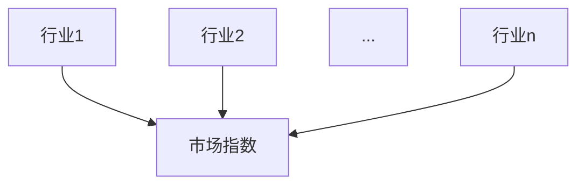
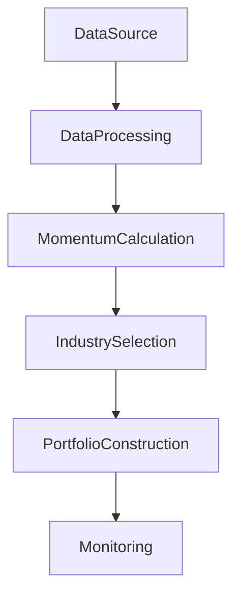

                 


# 彼得·林奇的行业轮动投资策略

## 关键词：
- 彼得·林奇
- 行业轮动
- 投资策略
- 股票投资
- 动量策略

## 摘要：
本文详细探讨了彼得·林奇的行业轮动投资策略，分析了其核心概念、算法原理、系统架构以及实际应用。通过数学模型、图表和代码示例，深入解读了行业轮动的投资逻辑，帮助投资者掌握这一策略的精髓。

---

# 第1章: 行业轮动投资策略的背景与概念

## 1.1 行业轮动投资的定义与核心思想

### 1.1.1 行业轮动投资的定义
行业轮动投资是一种基于行业周期性波动的投资策略，通过分析不同行业的表现，选择在特定经济周期中表现最佳的行业进行投资。其核心思想是“顺势而为”，即在不同经济环境下，不同行业会有不同的表现。

### 1.1.2 彼得·林奇的投资理念
彼得·林奇是美国著名投资经理人，他强调长期投资和选择具有竞争优势的公司。行业轮动策略是他投资理念的重要组成部分，他认为行业表现受经济周期影响，通过轮动可以在不同经济阶段中获利。

### 1.1.3 行业轮动在投资策略中的地位
行业轮动策略在投资组合管理中占据重要地位，能够帮助投资者在不同经济周期中优化资产配置，降低风险，同时提高收益。

## 1.2 行业轮动投资的历史发展

### 1.2.1 行业轮动投资的起源
行业轮动投资起源于20世纪70年代，随着金融理论的发展，逐渐成为一种成熟的策略。

### 1.2.2 彼得·林奇的贡献
彼得·林奇通过实践和研究，将行业轮动策略系统化，提出了基于行业周期分析的投资方法。

### 1.2.3 行业轮动投资的现状
目前，行业轮动策略广泛应用于机构投资和个人投资者，成为资产配置的重要工具。

## 1.3 行业轮动投资的适用场景

### 1.3.1 经济周期与行业轮动
不同经济周期下，行业表现不同，例如在经济复苏期，周期性行业表现较好。

### 1.3.2 不同市场环境下的行业轮动策略
牛市和熊市下，行业轮动策略的应用有所不同，需要根据市场环境调整。

### 1.3.3 行业轮动投资的边界与限制
行业轮动策略并非在所有市场环境下都有效，需考虑市场波动性和策略执行成本。

---

# 第2章: 行业轮动投资的核心概念与原理

## 2.1 行业轮动的核心概念

### 2.1.1 行业周期性分析
行业周期性分析是行业轮动策略的基础，通过分析行业生命周期，判断其在不同经济阶段的表现。

### 2.1.2 行业相对强度分析
行业相对强度分析是比较不同行业的表现，选择相对强度高的行业进行投资。

### 2.1.3 行业动量效应
行业动量效应是指行业过去表现好的，未来可能继续表现好的现象，是行业轮动策略的重要依据。

## 2.2 行业轮动的数学模型与公式

### 2.2.1 行业动量计算公式
$$ 动量 = \frac{P_t - P_{t-n}}{P_{t-n}} $$
其中，$P_t$是当前价格，$P_{t-n}$是n期前的价格。

### 2.2.2 行业相对强度计算
$$ 相对强度 = \frac{行业指数收益}{市场指数收益} $$

## 2.3 行业轮动的ER实体关系图


---

# 第3章: 行业轮动投资策略的算法原理

## 3.1 行业轮动策略的算法流程

### 3.1.1 数据获取
从数据源获取各行业的历史价格数据。

### 3.1.2 动量计算
使用动量公式计算各行业的动量值。

### 3.1.3 行业筛选
筛选动量值高于市场平均水平的行业。

### 3.1.4 投资组合构建
将资金分配到筛选出的行业内。

### 3.1.5 监控与调整
定期监控行业表现，调整投资组合。

## 3.2 行业轮动策略的Python实现

### 3.2.1 数据获取与处理
```python
import pandas as pd
import yfinance as yf

# 下载行业指数数据
sectors = ['金融', '科技', '消费', '能源']
industry_data = pd.DataFrame()
for sector in sectors:
    sector_ticker = f'{sector} Sector STO'  # 示例ticker
    data = yf.download(sector_ticker, start='2020-01-01', end='2023-12-31')
    industry_data[sector] = data['Close']
```

### 3.2.2 动量计算与排序
```python
def calculate_momentum(data, window=12):
    # 计算动量
    momentum = (data.iloc[-1] / data.iloc[-window-1]) - 1
    return momentum.sort_values(ascending=False)

# 示例计算
momentum_rank = calculate_momentum(industry_data, 12)
print(momentum_rank)
```

---

# 第4章: 行业轮动投资的系统分析与架构设计

## 4.1 行业轮动投资的系统架构

### 4.1.1 系统功能模块
- 数据获取模块：从数据源获取行业数据。
- 动量计算模块：计算各行业的动量值。
- 行为筛选模块：筛选表现好的行业。
- 投资组合构建模块：根据筛选结果构建投资组合。
- 监控与调整模块：实时监控行业表现，调整投资组合。

### 4.1.2 系统架构设计


---

# 第5章: 行业轮动投资的项目实战

## 5.1 项目环境与工具安装

### 5.1.1 数据获取工具
- 使用yfinance获取行业指数数据。

### 5.1.2 数据分析工具
- 使用Pandas进行数据分析。

### 5.1.3 可视化工具
- 使用Matplotlib进行数据可视化。

## 5.2 核心代码实现

### 5.2.1 行业动量计算
```python
import pandas as pd
import yfinance as yf

# 下载行业数据
sectors = ['金融', '科技', '消费', '能源']
industry_data = pd.DataFrame()
for sector in sectors:
    sector_ticker = f'{sector} Sector STO'
    data = yf.download(sector_ticker, start='2020-01-01', end='2023-12-31')
    industry_data[sector] = data['Close']

# 计算动量
def calculate_momentum(data, window=12):
    momentum = (data.iloc[-1] / data.iloc[-window-1]) - 1
    return momentum.sort_values(ascending=False)

# 示例计算
momentum_rank = calculate_momentum(industry_data, 12)
print("动量排名:", momentum_rank)
```

---

# 第6章: 行业轮动投资的最佳实践

## 6.1 最佳实践 tips
- 定期回顾和调整投资组合。
- 结合宏观经济分析。
- 控制风险，避免过度集中。

## 6.2 小结
行业轮动策略是一种有效的投资策略，通过分析行业周期和动量效应，可以在不同经济阶段中获得超额收益。

## 6.3 注意事项
- 行业轮动策略需要长期坚持，避免短期波动干扰。
- 注意市场风险，合理控制仓位。

## 6.4 拓展阅读
- 彼得·林奇的书籍：《彼得·林奇的投资之道》。
- 相关学术文献：《行业轮动与动量策略的有效性》。

---

通过以上详细内容，您将全面了解彼得·林奇的行业轮动投资策略，掌握其背后的原理和实际应用。

