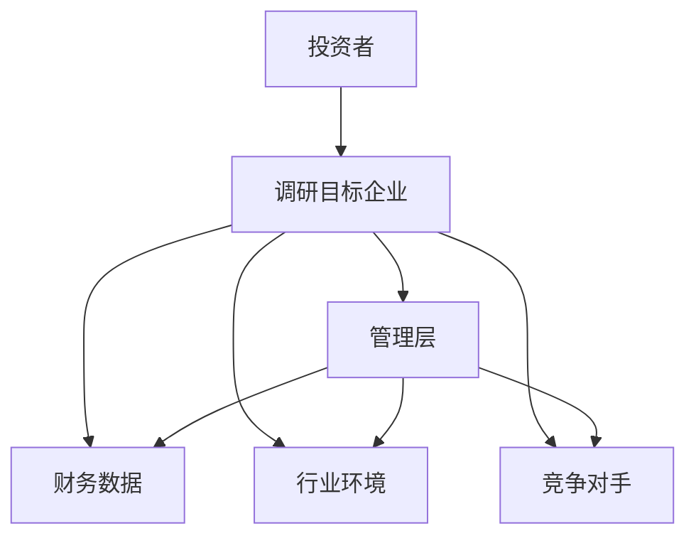
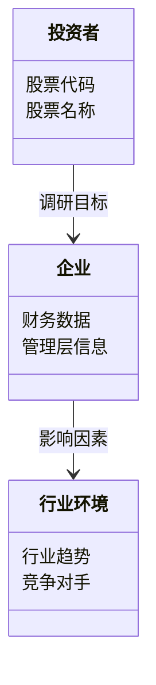
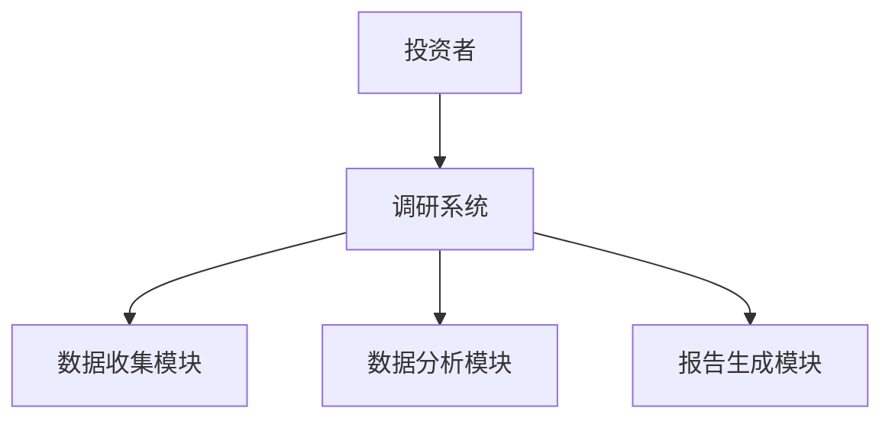

                 


# 彼得林奇的实地调研技巧

> 关键词：彼得·林奇，实地调研，投资分析，数据处理，系统设计

> 摘要：本文详细探讨了彼得·林奇的实地调研技巧，从背景介绍、核心概念到算法原理、系统设计，再到项目实战和最佳实践，全面解析了如何通过实地调研提升投资决策的准确性。

---

# 第一部分: 背景介绍

## 第1章: 实地调研的定义与重要性

### 1.1 实地调研的核心概念

#### 1.1.1 实地调研的定义
实地调研是一种通过亲临现场、访谈管理层、分析财务数据和行业环境等方法，全面了解企业实际情况的投资调研方式。与依赖公开信息的传统调研不同，实地调研注重获取一手数据，帮助投资者做出更准确的投资决策。

#### 1.1.2 实地调研在投资中的重要性
- 提供深入的企业信息，帮助识别潜在风险和机会。
- 帮助投资者更好地理解企业的竞争优势和行业地位。
- 通过实地考察，验证财务数据的真实性，避免信息偏差。

#### 1.1.3 实地调研与其他调研方法的区别
- **传统调研**：依赖公开数据和市场报告，缺乏深入的企业内部信息。
- **实地调研**：通过现场考察、访谈等方式，获取一手数据，更具深度和准确性。

### 1.2 实地调研的背景与问题背景

#### 1.2.1 投资决策中的信息不对称问题
在投资市场中，信息不对称是影响决策的主要障碍。实地调研通过获取企业内部信息，减少这种不对称，提高决策质量。

#### 1.2.2 传统调研方法的局限性
传统调研方法依赖公开数据，难以全面反映企业的实际情况，可能导致决策偏差。

#### 1.2.3 实地调研在解决实际问题中的作用
通过实地调研，投资者能够更准确地评估企业的财务状况、管理层能力和市场竞争力，从而做出更明智的投资决策。

---

## 第2章: 彼得·林奇的实地调研方法

### 2.1 彼得·林奇的调研理念

#### 2.1.1 投资者心态与调研态度
林奇强调投资者应保持积极主动的态度，亲自了解企业的运营情况，而不是仅仅依赖报表数据。

#### 2.1.2 林奇的调研风格与特点
- **深入细致**：林奇注重与管理层的深入交流，了解企业的运营细节。
- **数据驱动**：结合财务数据和实地观察，综合评估企业的价值。

#### 2.1.3 林奇调研方法的核心要素
- **企业基本面分析**：包括收入、利润、资产负债表等财务指标。
- **行业趋势分析**：了解行业的发展趋势和竞争格局。
- **企业竞争优势**：识别企业的核心竞争力，如成本优势、技术优势等。

### 2.2 林奇调研的核心问题

#### 2.2.1 企业基本面分析的核心问题
- 财务状况：评估企业的盈利能力、资产负债情况。
- 管理层能力：了解管理层的战略眼光和执行力。

#### 2.2.2 行业趋势分析的关键点
- 行业增长率：行业是否处于增长期。
- 竞争格局：企业是否具备竞争优势。

#### 2.2.3 企业竞争优势的识别与评估
- 成本优势：企业的生产成本是否具有竞争力。
- 技术优势：企业是否掌握核心技术。

### 2.3 林奇调研的边界与外延

#### 2.3.1 调研的边界条件
- 调研范围：仅限于直接影响投资决策的企业内部信息。
- 时间限制：调研需要在合理的时间内完成，避免过度投入。

#### 2.3.2 调研的外延领域
- 行业研究：扩展到整个行业的分析。
- 竞争对手分析：了解竞争对手的动态。

#### 2.3.3 调研与其他投资策略的关系
实地调研是投资策略的重要组成部分，与其他策略（如技术分析）相结合，可以提高投资决策的全面性。

### 2.4 林奇调研的概念结构与核心要素

#### 2.4.1 调研的基本框架
- 企业分析：财务状况、管理层能力。
- 行业分析：发展趋势、竞争格局。
- 竞争优势：成本、技术等核心竞争力。

#### 2.4.2 核心要素的分解与分析
- 财务数据：收入、利润、资产负债表。
- 管理层：战略眼光、执行力。
- 行业趋势：增长潜力、竞争环境。

#### 2.4.3 调研过程中的关键步骤
1. **制定调研计划**：明确调研目标和方法。
2. **现场考察**：参观企业生产现场，了解运营情况。
3. **管理层访谈**：与CEO、 CFO等高管交流，获取内部信息。
4. **数据验证**：对比公开数据与实地观察结果，确保数据准确性。

---

# 第二部分: 核心概念与联系

## 第3章: 实地调研的核心原理

### 3.1 实地调研的原理与机制

#### 3.1.1 信息收集与分析的原理
实地调研通过收集一手数据，结合分析工具，帮助企业做出更准确的投资决策。

#### 3.1.2 调研数据的处理与应用
- 数据清洗：去除噪音数据，确保数据准确性。
- 数据分析：使用统计方法，识别关键指标。

#### 3.1.3 调研结论的形成过程
- 数据收集：现场考察、访谈。
- 数据分析：整理、分析数据。
- 结论形成：综合分析结果，得出投资建议。

### 3.2 核心概念的属性特征对比

| 调研方法 | 数据来源 | 数据准确性 | 数据全面性 |
|----------|----------|------------|------------|
| 实地调研 | 一手数据 | 高         | 高         |
| 传统调研 | 公开数据 | 中         | 低         |

### 3.3 ER实体关系图



---

## 第4章: 调研数据的分析与处理

### 4.1 数据清洗与预处理

#### 4.1.1 数据清洗的步骤与方法
1. **识别异常值**：剔除明显错误的数据。
2. **填补缺失值**：使用均值、中位数等方法填补缺失数据。
3. **标准化数据**：统一数据格式，确保一致性。

#### 4.1.2 数据预处理的技巧与注意事项
- 数据清洗：避免信息丢失，同时确保数据准确性。
- 数据标准化：统一格式，便于后续分析。

#### 4.1.3 数据分析的数学模型

##### 示例：计算市盈率
市盈率（P/E）公式：
$$ P/E = \frac{\text{股票价格}}{\text{每股收益}} $$

##### 示例：计算市净率
市净率（P/B）公式：
$$ P/B = \frac{\text{股票价格}}{\text{每股净资产}} $$

---

## 第4章: 调研数据的分析与处理（续）

#### 4.1.4 数据分析工具的选择
- **Python**：使用Pandas库进行数据清洗和分析。
- **Excel**：适合小规模数据处理。

#### 4.1.5 数据分析的Python代码示例

##### 示例：读取数据并计算市盈率

```python
import pandas as pd

# 读取数据
data = pd.read_csv('financial_data.csv')

# 计算市盈率
data['PE'] = data['Stock Price'] / data['Earnings Per Share']

# 显示结果
print(data[['Company', 'PE']].head())
```

---

### 4.2 数据分析的数学模型

#### 4.2.1 数据分析模型
- **线性回归**：用于预测变量之间的关系。
- **聚类分析**：识别数据中的相似群体。

#### 4.2.2 数据分析的数学公式

##### 示例：线性回归模型
$$ y = \beta_0 + \beta_1 x + \epsilon $$

其中：
- \( y \) 是因变量。
- \( x \) 是自变量。
- \( \beta_0 \) 是截距。
- \( \beta_1 \) 是回归系数。
- \( \epsilon \) 是误差项。

---

## 第4章: 调研数据的分析与处理（续）

#### 4.2.3 数据分析的案例解读
- **案例**：分析某企业的收入增长趋势。
  ```python
  import matplotlib.pyplot as plt

  # 绘制收入增长趋势图
  data['Revenue'].plot(kind='line')
  plt.title('Revenue Growth Trend')
  plt.xlabel('Year')
  plt.ylabel('Revenue')
  plt.show()
  ```

---

# 第三部分: 算法原理讲解

## 第5章: 调研数据的分析与处理

### 5.1 数据清洗与预处理

#### 5.1.1 数据清洗的步骤与方法
1. 识别并删除重复数据。
2. 填补缺失数据：使用中位数填补。
3. 标准化数据：统一单位。

#### 5.1.2 数据预处理的技巧与注意事项
- 数据清洗：确保数据准确性和完整性。
- 数据标准化：避免因单位不同导致的分析偏差。

#### 5.1.3 数据分析的数学模型

##### 示例：计算市盈率
市盈率（P/E）公式：
$$ P/E = \frac{\text{股票价格}}{\text{每股收益}} $$

##### 示例：计算市净率
市净率（P/B）公式：
$$ P/B = \frac{\text{股票价格}}{\text{每股净资产}} $$

---

## 第5章: 调研数据的分析与处理（续）

#### 5.1.4 数据分析工具的选择
- **Python**：使用Pandas库进行数据清洗和分析。
- **Excel**：适合小规模数据处理。

#### 5.1.5 数据分析的Python代码示例

##### 示例：读取数据并计算市盈率

```python
import pandas as pd

# 读取数据
data = pd.read_csv('financial_data.csv')

# 计算市盈率
data['PE'] = data['Stock Price'] / data['Earnings Per Share']

# 显示结果
print(data[['Company', 'PE']].head())
```

---

### 5.2 数据分析的数学模型

#### 5.2.1 数据分析模型
- **线性回归**：用于预测变量之间的关系。
- **聚类分析**：识别数据中的相似群体。

#### 5.2.2 数据分析的数学公式

##### 示例：线性回归模型
$$ y = \beta_0 + \beta_1 x + \epsilon $$

其中：
- \( y \) 是因变量。
- \( x \) 是自变量。
- \( \beta_0 \) 是截距。
- \( \beta_1 \) 是回归系数。
- \( \epsilon \) 是误差项。

---

## 第5章: 调研数据的分析与处理（续）

#### 5.2.3 数据分析的案例解读
- **案例**：分析某企业的收入增长趋势。
  ```python
  import matplotlib.pyplot as plt

  # 绘制收入增长趋势图
  data['Revenue'].plot(kind='line')
  plt.title('Revenue Growth Trend')
  plt.xlabel('Year')
  plt.ylabel('Revenue')
  plt.show()
  ```

---

# 第四部分: 系统分析与架构设计

## 第6章: 系统分析与架构设计

### 6.1 系统功能设计

#### 6.1.1 领域模型



#### 6.1.2 系统功能模块
- **信息收集模块**：收集企业的财务数据和管理层信息。
- **数据分析模块**：分析数据，计算市盈率、市净率等指标。
- **报告生成模块**：生成调研报告，提出投资建议。

### 6.2 系统架构设计



---

## 第7章: 项目实战

### 7.1 环境安装

#### 7.1.1 安装Python
```bash
python --version
pip install --upgrade pip
```

#### 7.1.2 安装必要的库
```bash
pip install pandas matplotlib
```

### 7.2 核心代码实现

#### 7.2.1 数据收集模块
```python
import pandas as pd

def collect_data():
    # 假设数据存储在CSV文件中
    data = pd.read_csv('financial_data.csv')
    return data

if __name__ == '__main__':
    data = collect_data()
    print("Data collected successfully.")
```

#### 7.2.2 数据分析模块
```python
import pandas as pd

def analyze_data(data):
    # 计算市盈率
    data['PE'] = data['Stock Price'] / data['Earnings Per Share']
    # 计算市净率
    data['PB'] = data['Stock Price'] / data['Book Value Per Share']
    return data

if __name__ == '__main__':
    data = collect_data()
    result = analyze_data(data)
    print(result[['Company', 'PE', 'PB']].head())
```

#### 7.2.3 报告生成模块
```python
import pandas as pd
import matplotlib.pyplot as plt

def generate_report(data):
    # 绘制收入增长趋势图
    data['Revenue'].plot(kind='line')
    plt.title('Revenue Growth Trend')
    plt.xlabel('Year')
    plt.ylabel('Revenue')
    plt.show()

if __name__ == '__main__':
    data = collect_data()
    analyze_data(data)
    generate_report(data)
```

### 7.3 代码解读与分析

#### 7.3.1 数据收集模块
- **功能**：从CSV文件中读取财务数据。
- **实现**：使用Pandas库读取数据并返回。

#### 7.3.2 数据分析模块
- **功能**：计算市盈率和市净率。
- **实现**：基于收集到的数据，进行计算并返回结果。

#### 7.3.3 报告生成模块
- **功能**：绘制收入增长趋势图。
- **实现**：使用Matplotlib库绘制并展示图表。

### 7.4 实际案例分析

#### 7.4.1 案例背景
假设我们对某公司进行实地调研，收集了以下数据：

| Company | Stock Price | Earnings Per Share | Book Value Per Share | Revenue |
|---------|-------------|--------------------|----------------------|---------|
| XYZ     | 50          | 5                 | 10                  | 100     |

#### 7.4.2 数据分析
```python
data = pd.DataFrame({
    'Company': ['XYZ'],
    'Stock Price': [50],
    'Earnings Per Share': [5],
    'Book Value Per Share': [10],
    'Revenue': [100]
})

result = analyze_data(data)
print(result[['Company', 'PE', 'PB']])
```

输出结果：
```
  Company  PE    PB
0    XYZ  10  5.0
```

#### 7.4.3 报告生成
```python
generate_report(data)
```

---

## 第8章: 最佳实践

### 8.1 小结

- 实地调研是投资决策中的重要工具。
- 通过数据清洗、分析和建模，可以更准确地评估企业的价值。
- 系统设计和项目实战帮助我们将理论应用于实际。

### 8.2 注意事项

- 数据清洗时，确保数据的准确性和完整性。
- 数据分析时，结合行业背景和企业实际情况。
- 报告生成时，清晰展示分析结果，便于投资者理解。

### 8.3 拓展阅读

- 《彼得·林奇的投资哲学》
- 《数据分析实战》
- 《系统设计与实现》

---

# 第五部分: 总结

## 第9章: 总结

### 9.1 总结全文
彼得·林奇的实地调研技巧为我们提供了一种通过深入分析企业基本面和行业环境来做出投资决策的方法。通过数据清洗、分析和建模，我们可以更准确地评估企业的价值，从而做出更明智的投资决策。

### 9.2 展望未来
随着技术的进步，实地调研的方法和工具将不断优化，帮助投资者更高效地获取信息，提升投资决策的准确性。

---

# 结语

通过本文的详细讲解，您应该能够掌握彼得·林奇的实地调研技巧，并将其应用于实际投资中。希望本文对您的投资决策有所帮助！

