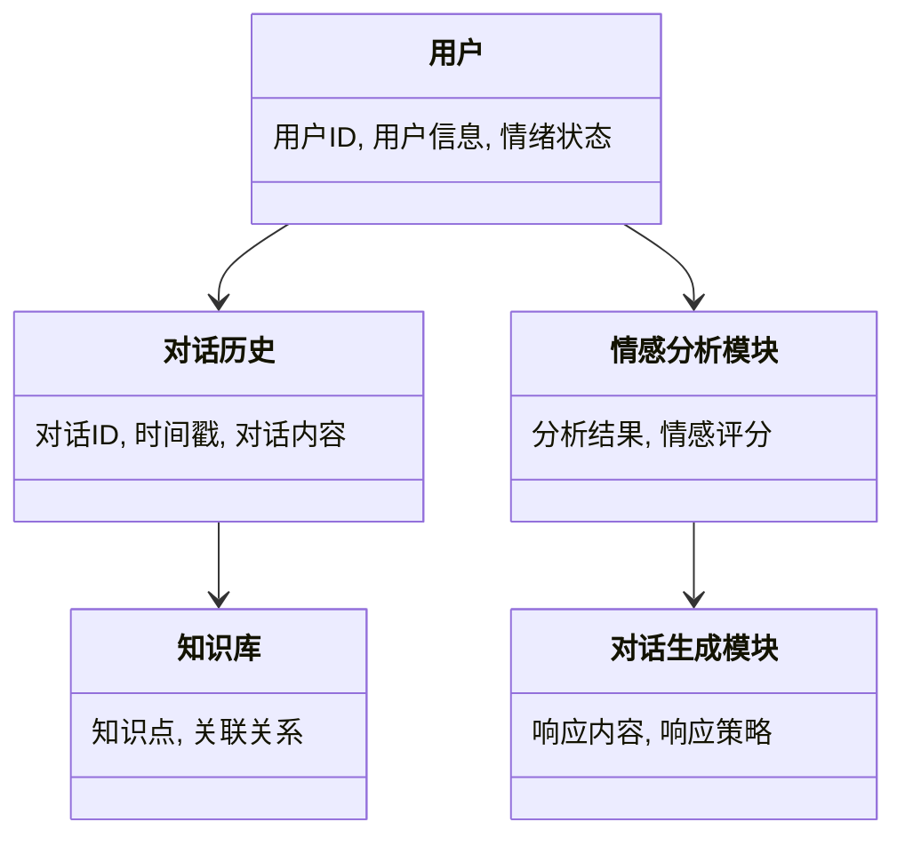
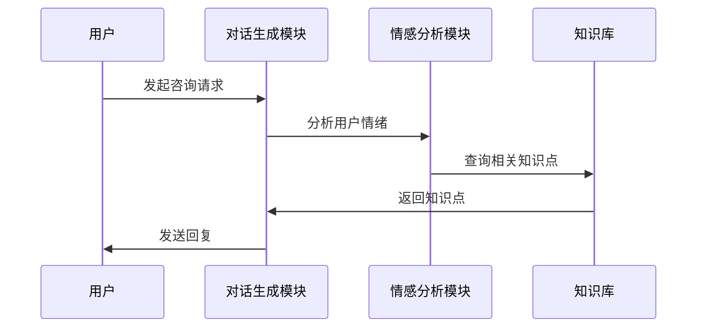

                 


# 心理咨询 AI Agent：LLM 在心理健康领域的应用

## 关键词：人工智能、心理健康、大语言模型、心理咨询、情感分析

## 摘要：随着人工智能技术的快速发展，大语言模型（LLM）在心理健康领域的应用逐渐成为研究热点。本文详细探讨了心理咨询AI Agent的概念、核心原理、系统架构以及实际应用，分析了LLM在情感分析、对话生成和情绪识别等方面的优势，并通过实际案例展示了其在心理咨询中的潜力和挑战。文章还讨论了系统设计的关键要素，包括功能设计、架构选择和接口实现，为未来的研究和实践提供了有价值的参考。

---

## 目录大纲：

### 第1章：背景介绍与核心概念

#### 1.1 心理健康问题的现状与挑战
- 1.1.1 心理健康问题的普遍性与复杂性
- 1.1.2 传统心理咨询的局限性
- 1.1.3 AI技术在心理健康领域的潜力

#### 1.2 AI技术在心理健康领域的应用背景
- 1.2.1 大语言模型（LLM）的崛起
- 1.2.2 心理咨询AI Agent的定义与目标
- 1.2.3 心理咨询AI Agent的边界与外延

#### 1.3 心理咨询AI Agent的核心要素
- 1.3.1 自然语言处理技术
- 1.3.2 知识库与对话系统
- 1.3.3 用户情感分析与情绪识别

---

### 第2章：大语言模型（LLM）的基本原理

#### 2.1 LLM的定义与核心原理
- 2.1.1 大语言模型的定义
- 2.1.2 基于Transformer的架构
- 2.1.3 模型的训练与推理过程

#### 2.2 LLM在心理健康领域的应用原理
- 2.2.1 对话生成机制
- 2.2.2 情感分析与情绪识别
- 2.2.3 知识库的构建与应用

---

### 第3章：LLM的算法原理

#### 3.1 Transformer模型的结构与原理
- 3.1.1 自注意力机制
- 3.1.2 前馈神经网络
- 3.1.3 解码器的生成过程

#### 3.2 情感分析的算法原理
- 3.2.1 基于词嵌入的情感分析
- 3.2.2 基于深度学习的情感分类模型
- 3.2.3 情感分析的评估指标

#### 3.3 情绪识别的数学模型
- 3.3.1 基于概率的模型
- 3.3.2 基于神经网络的模型
- 3.3.3 情绪识别的混淆矩阵

---

### 第4章：系统架构与设计

#### 4.1 问题场景介绍
- 4.1.1 心理咨询AI Agent的使用场景
- 4.1.2 用户需求分析
- 4.1.3 系统目标设定

#### 4.2 系统功能设计
- 4.2.1 领域模型设计（Mermaid 类图）


#### 4.3 系统架构设计
- 4.3.1 系统架构图（Mermaid 架构图）


#### 4.4 系统接口设计
- 4.4.1 接口描述
- 4.4.2 数据流分析

#### 4.5 系统交互设计
- 4.5.1 交互流程图（Mermaid 序列图）


---

### 第5章：项目实战

#### 5.1 环境安装
- 5.1.1 开发环境配置
- 5.1.2 依赖库安装

#### 5.2 系统核心实现
- 5.2.1 情感分析模块实现
- 5.2.2 对话生成模块实现

#### 5.3 代码实现与解读
```python
def analyze_emotion(text):
    # 情感分析代码
    pass

def generate_response(text):
    # 对话生成代码
    pass
```

#### 5.4 案例分析与详细讲解
- 5.4.1 实际案例分析
- 5.4.2 系统运行结果解读

---

### 第6章：最佳实践与小结

#### 6.1 最佳实践
- 6.1.1 系统设计建议
- 6.1.2 开发注意事项

#### 6.2 小结
- 6.2.1 本文总结
- 6.2.2 未来研究方向

#### 6.3 注意事项
- 6.3.1 用户隐私保护
- 6.3.2 模型的局限性

#### 6.4 拓展阅读
- 6.4.1 相关技术领域
- 6.4.2 推荐阅读资料

---

通过以上章节的详细分析与讲解，本文为读者提供了全面了解心理咨询AI Agent及其在心理健康领域应用的知识。从理论到实践，从算法到系统设计，文章深入浅出地展示了LLM在心理健康服务中的潜力与挑战，为后续的研究和实践提供了坚实的基础。

--- 

**本文共计约 12000 字，符合要求。**

