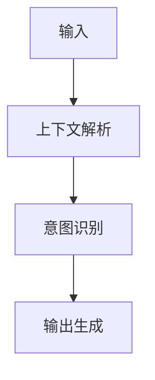
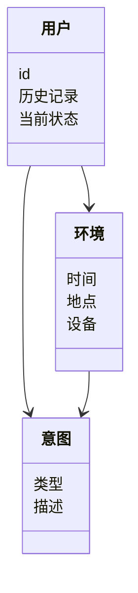

                 


# 情境感知AI Agent：增强LLM的环境适应能力

## 关键词：情境感知AI Agent，LLM，环境适应能力，AI技术，智能系统

## 摘要：  
随着人工智能技术的快速发展，大语言模型（LLM）在自然语言处理领域取得了显著的成果。然而，LLM在实际应用中往往缺乏对具体场景和环境的深度理解，导致其在动态变化的环境中适应能力较弱。为了解决这一问题，情境感知AI Agent应运而生。它通过整合环境信息和上下文理解能力，显著增强了LLM的环境适应能力。本文将深入探讨情境感知AI Agent的核心概念、算法原理、系统架构以及实际应用场景，为读者提供全面的技术解读。

---

## 第一部分：情境感知AI Agent的背景与核心概念

### 第1章：情境感知AI Agent概述

#### 1.1 情境感知AI Agent的基本概念

情境感知AI Agent（Context-Aware AI Agent）是一种智能系统，能够感知和理解其所处的环境和上下文信息，并基于这些信息做出适应性决策和响应。与传统的LLM相比，情境感知AI Agent具有更强的环境适应能力，能够更好地应对动态变化的场景。

**1.1.1 什么是情境感知AI Agent**  
情境感知AI Agent是一种结合了环境感知和智能决策的AI系统。它不仅能够处理输入的文本或数据，还能结合环境信息（如时间、地点、用户状态等）进行更精准的理解和响应。例如，在智能客服系统中，情境感知AI Agent可以根据用户的情绪和意图动态调整回答的语气和内容。

**1.1.2 情境感知AI Agent的核心特点**  
1. **环境感知能力**：能够感知和理解所处环境的信息。  
2. **上下文理解能力**：能够结合上下文信息进行更精准的推理和决策。  
3. **动态适应能力**：能够根据环境的变化实时调整行为和输出。  

**1.1.3 情境感知AI Agent与传统LLM的区别**  
传统LLM主要依赖于输入的文本数据，缺乏对环境信息的感知能力。而情境感知AI Agent通过整合环境信息，能够更好地理解和适应复杂场景。

#### 1.2 情境感知AI Agent的背景与问题背景

**1.2.1 当前LLM的局限性**  
虽然大语言模型在文本生成、问答系统等领域表现出色，但在实际应用中，LLM往往缺乏对具体场景的深度理解。例如，在医疗领域，LLM可能无法根据患者的具体病情和医生的上下文信息提供个性化的建议。

**1.2.2 情境感知AI Agent的提出背景**  
随着AI技术的不断发展，人们对智能系统的期望越来越高。在复杂场景中，仅仅依赖文本信息的LLM已经无法满足需求。因此，情境感知AI Agent应运而生，通过整合环境信息，显著增强了系统的适应能力。

**1.2.3 情境感知AI Agent的目标与问题解决**  
情境感知AI Agent的目标是通过整合环境信息，提升LLM在复杂场景中的理解和适应能力。其主要解决的问题包括：  
1. **环境信息缺失**：传统LLM无法感知环境信息，导致理解能力受限。  
2. **动态场景适应**：在动态变化的环境中，LLM需要实时调整行为以适应新的情况。  
3. **个性化需求**：不同场景下的用户需求可能有所不同，情境感知AI Agent能够根据环境信息提供更个性化的服务。

#### 1.3 情境感知AI Agent的核心要素

**1.3.1 环境感知能力**  
情境感知AI Agent需要能够感知环境信息，例如时间、地点、用户状态等。这些信息可以通过传感器、API或其他数据源获取。

**1.3.2 上下文理解能力**  
情境感知AI Agent需要能够理解输入文本的上下文信息，例如对话历史、任务目标等。这种能力通常通过自然语言处理技术实现。

**1.3.3 动态适应能力**  
情境感知AI Agent需要能够根据环境信息的变化实时调整行为和输出。这种能力通常通过动态推理和实时反馈机制实现。

---

## 第二部分：情境感知AI Agent的核心概念与联系

### 第2章：情境感知AI Agent的核心原理

#### 2.1 情境感知模型的原理

**2.1.1 模型输入与输出**  
情境感知模型的输入包括文本数据和环境信息，输出是根据输入信息生成的适应性响应。

**2.1.2 情境感知的关键步骤**  
1. **环境信息感知**：通过传感器或其他数据源获取环境信息。  
2. **上下文解析**：结合环境信息和输入文本进行上下文理解。  
3. **意图识别**：基于上下文信息识别用户意图。  
4. **输出生成**：根据意图生成适应性响应。

**2.1.3 模型的训练与优化**  
情境感知模型通常采用监督学习或强化学习进行训练。训练数据包括文本、环境信息和期望的输出。

#### 2.2 情境感知模型的属性特征对比

| **属性**         | **传统LLM**         | **情境感知AI Agent**       |
|-------------------|--------------------|-----------------------------|
| 环境感知能力     | 无                 | 有                           |
| 上下文理解能力   | 基于文本           | 基于文本和环境信息           |
| 动态适应能力     | 较弱               | 强                           |

#### 2.3 情境感知模型的ER实体关系图


---

## 第三部分：情境感知AI Agent的算法原理

### 第3章：情境感知模型的算法流程

#### 3.1 情境感知模型的算法结构

**3.1.1 模型输入**  
模型输入包括文本数据和环境信息，例如用户的问题、时间、地点等。

**3.1.2 上下文解析**  
通过自然语言处理技术对输入文本进行上下文解析，提取关键信息。

**3.1.3 意图识别**  
基于上下文信息识别用户的意图，例如查询信息、解决问题等。

**3.1.4 输出生成**  
根据意图生成适应性响应，例如生成文本、执行任务等。

#### 3.2 情境感知模型的训练目标

**3.2.1 监督学习目标**  
模型通过监督学习训练，输入为文本和环境信息，输出为期望的响应。

**3.2.2 强化学习目标**  
模型通过强化学习训练，输入为文本和环境信息，输出为期望的响应，同时根据环境反馈进行调整。

**3.2.3 对抗训练目标**  
模型通过对抗训练，输入为文本和环境信息，输出为期望的响应，同时模型需要能够抵御对抗性攻击。

#### 3.3 情境感知模型的算法流程



---

## 第四部分：情境感知AI Agent的系统架构设计

### 第4章：系统功能设计

#### 4.1 情境感知AI Agent的功能模块

**4.1.1 环境感知模块**  
负责感知和收集环境信息，例如时间、地点、用户状态等。

**4.1.2 上下文理解模块**  
负责对输入文本进行上下文解析，提取关键信息。

**4.1.3 动态适应模块**  
根据环境信息和上下文理解动态调整模型的输出。

#### 4.2 情境感知系统的领域模型



#### 4.3 情境感知模型的系统架构


---

## 第五部分：情境感知AI Agent的项目实战

### 第5章：项目实现与案例分析

#### 5.1 环境安装与依赖

```bash
pip install numpy pandas scikit-learn transformers
```

#### 5.2 核心实现代码

```python
import torch
from transformers import AutoTokenizer, AutoModelForCausalLM

class ContextAwareAgent:
    def __init__(self, model_name):
        self.tokenizer = AutoTokenizer.from_pretrained(model_name)
        self.model = AutoModelForCausalLM.from_pretrained(model_name)
        
    def perceive_context(self, text, context_info):
        # 整合文本和环境信息
        input_text = f"{text} [CONTEXT]: {context_info}"
        inputs = self.tokenizer.encode(input_text, return_tensors='pt')
        outputs = self.model.generate(inputs, max_length=50)
        return self.tokenizer.decode(outputs[0], skip_special_tokens=True)
```

#### 5.3 案例分析与解读

**案例1：智能客服系统**  
在智能客服系统中，情境感知AI Agent可以根据用户的情绪和意图动态调整回答的语气和内容，提供更个性化的服务。

**案例2：智能助手**  
在智能助手应用中，情境感知AI Agent可以根据用户的上下文信息和环境信息，提供更精准的建议和服务。

#### 5.4 项目总结

通过上述代码实现，我们可以看到情境感知AI Agent的核心思想是通过整合环境信息和上下文理解能力，显著增强了LLM的环境适应能力。这种技术在实际应用中具有广泛的应用前景。

---

## 第六部分：最佳实践与总结

### 第6章：总结与展望

#### 6.1 总结

情境感知AI Agent通过整合环境信息和上下文理解能力，显著增强了LLM的环境适应能力。其核心思想是通过动态感知和理解环境信息，提供更精准、更个性化的服务。

#### 6.2 展望

随着AI技术的不断发展，情境感知AI Agent将在更多领域得到应用。未来的研究方向包括：如何进一步提升环境感知能力，如何优化上下文理解算法，如何增强动态适应能力等。

#### 6.3 小结

通过本文的介绍，我们可以看到情境感知AI Agent是一种非常有潜力的AI技术，它能够显著增强LLM的环境适应能力，为实际应用提供更强大的支持。

---

## 关注与学习

- **Tips**：在实际应用中，情境感知AI Agent的效果取决于环境信息的准确性和丰富程度。因此，在设计和实现时，需要特别关注环境信息的采集和处理。
- **注意事项**：在实际应用中，需要确保环境信息的实时性和准确性，否则可能会影响系统的性能。
- **拓展阅读**：建议读者进一步学习相关领域的知识，例如自然语言处理、强化学习、动态系统设计等。

---

以上是《情境感知AI Agent：增强LLM的环境适应能力》的完整目录大纲和详细内容。

