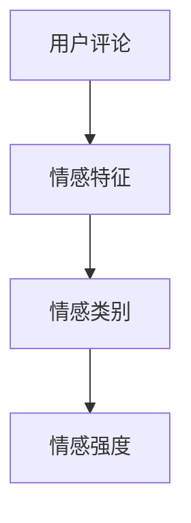
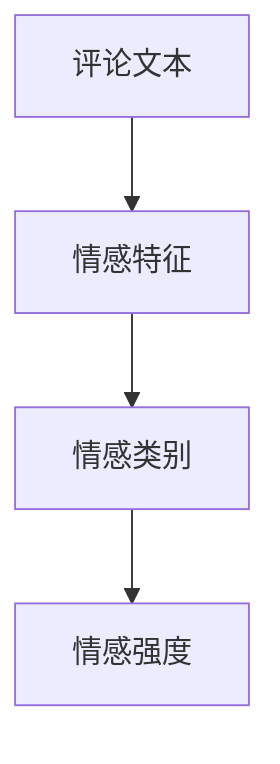
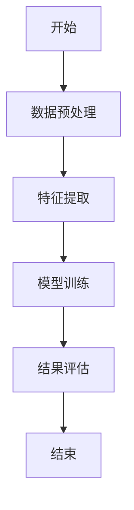
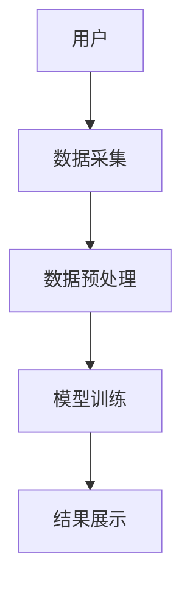

                 


```markdown
# 第一部分: 情感分析AI Agent概述

## 第1章: 情感分析的背景与核心概念

### 1.1 问题背景

#### 1.1.1 情感分析的基本概念
情感分析是一种通过计算机技术来识别和分类文本中情感倾向的方法。它可以将文本分为积极、消极或中性等类别，帮助企业了解用户对特定产品或服务的看法。

#### 1.1.2 问题背景与应用领域
在社交媒体上，每天都有大量的用户评论和反馈。通过情感分析，企业可以快速了解用户对其产品或服务的满意度，从而做出相应的改进和决策。

#### 1.1.3 情感分析的边界与外延
情感分析的边界通常包括文本的情感倾向分类，而外延则涉及情感强度分析、情感主题分析等更高级的任务。

### 1.2 核心概念与联系

#### 1.2.1 情感分析的原理
情感分析的核心在于识别文本中的情感特征，这些特征可以通过统计方法或机器学习模型进行分类。

#### 1.2.2 核心概念对比表
| 方法        | 优点                     | 缺点                     |
|-------------|--------------------------|--------------------------|
| 传统方法    | 实现简单，易于理解       | 准确率较低               |
| 现代方法    | 准确率高，适用于大规模数据 | 实现复杂，计算资源消耗大 |

#### 1.2.3 ER实体关系图


---

## 第2章：情感分析的核心概念与联系

### 2.1 情感分析的原理

#### 2.1.1 特征提取
特征提取是情感分析的关键步骤，常用的特征包括词袋模型、TF-IDF等。

#### 2.1.2 模型训练
模型训练是基于特征数据进行分类器的训练，常用算法包括朴素贝叶斯、支持向量机（SVM）等。

#### 2.1.3 结果评估
结果评估通过准确率、召回率、F1分数等指标来衡量模型的性能。

### 2.2 核心概念对比表
| 情感分析方法 | 输入数据类型 | 输出结果类型 |
|--------------|--------------|--------------|
| 基于规则     | 文本         | 情感类别     |
| 基于统计     | 文本         | 情感类别     |
| 基于深度学习 | 文本         | 情感类别     |

### 2.3 ER实体关系图


---

## 第三部分：情感分析算法原理

### 第3章：情感分析算法原理

#### 3.1 情感分析的算法流程


#### 3.2 情感分析的数学模型

##### 3.2.1 朴素贝叶斯分类
朴素贝叶斯分类基于条件概率公式：
$$ P(y|x) = \frac{P(x|y)P(y)}{P(x)} $$
其中，$y$ 是情感类别，$x$ 是特征向量。

---

## 第四部分：情感分析系统设计

### 第4章：情感分析系统设计

#### 4.1 项目背景
本项目旨在构建一个基于LLM的情感分析系统，用于实时监控社交媒体上的用户评论。

#### 4.2 系统功能设计

##### 4.2.1 数据采集
数据采集模块负责从社交媒体平台获取评论数据。

##### 4.2.2 数据预处理
数据预处理包括分词、去除停用词等步骤。

##### 4.2.3 模型训练
模型训练使用深度学习模型，如BERT，进行情感分类。

##### 4.2.4 结果展示
结果展示模块以可视化的方式呈现情感分析的结果。

#### 4.3 系统架构设计


---

## 第五部分：情感分析项目实战

### 第5章：情感分析项目实战

#### 5.1 环境安装
需要安装的库包括：
- Python
- TensorFlow
- Keras
- NLTK

#### 5.2 系统核心实现
以下是基于Python的情感分析代码示例：
```python
import numpy as np
from sklearn.feature_extraction.text import TfidfVectorizer
from sklearn.naive_bayes import MultinomialNB

# 数据预处理
text = ["This is a good product.", "This is a bad product."]

# 特征提取
vectorizer = TfidfVectorizer()
X = vectorizer.fit_transform(text)

# 模型训练
model = MultinomialNB()
model.fit(X, [1, 0])

# 模型预测
new_text = ["I love this product."]
X_new = vectorizer.transform([new_text])
预测结果 = model.predict(X_new)
print(预测结果)
```

#### 5.3 实际案例分析
以分析社交媒体评论为例，展示如何通过情感分析识别用户的正面或负面情感。

---

## 第六部分：情感分析的最佳实践

### 6.1 性能优化
优化数据预处理步骤，选择合适的特征提取方法，以及调整模型参数，可以显著提高情感分析的准确率。

### 6.2 模型调优
使用交叉验证等技术进行模型调优，选择最佳模型参数。

### 6.3 部署建议
将情感分析模型部署到生产环境，提供API接口，供其他系统调用。

---

## 结语

情感分析AI Agent的应用前景广阔，随着技术的不断发展，其准确性和效率将不断提高。本文通过详细讲解情感分析的核心概念、算法原理和系统设计，为读者提供了一个全面的视角。未来，情感分析将与更多领域结合，为企业和个人提供更智能化的服务。
```

