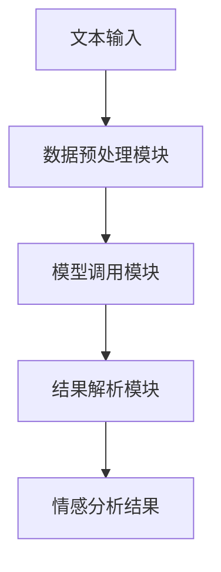

                 


# 情感分析增强AI Agent：利用LLM深入理解文本情感

## 关键词：情感分析，LLM，自然语言处理，AI代理，文本情感

## 摘要

情感分析是自然语言处理中的重要任务，旨在识别和分类文本中的情感倾向。随着大语言模型（LLM）的发展，情感分析的能力得到了显著提升。本文将从基础概念到实际应用，全面探讨如何通过LLM增强AI代理的情感分析能力，包括背景介绍、核心概念、算法原理、系统架构设计以及项目实战等内容。

---

# 正文

## 第一部分：情感分析概述

### 第1章：情感分析的基本概念

#### 1.1 情感分析的定义与应用场景

情感分析（Sentiment Analysis）是一种自然语言处理任务，旨在识别和分类文本中的情感倾向。它可以将文本分为正面、负面或中性情感类别。情感分析广泛应用于以下几个场景：

1. **社交媒体分析**：分析用户在社交媒体上的评论，帮助企业了解用户对品牌或产品的看法。
2. **客户反馈分析**：分析客户对产品或服务的反馈，帮助企业改进服务。
3. **舆情监测**：监测媒体和网络上的舆论，帮助企业了解公众对其立场的态度。

#### 1.2 情感分析的挑战与问题背景

尽管情感分析的应用广泛，但其实现仍然面临一些挑战：

1. **情感细微性**：某些文本的情感表达可能非常细微，例如讽刺或反语。
2. **歧义性**：某些词语或短语在不同上下文中可能具有不同的情感倾向。
3. **数据质量**：需要高质量的标注数据来训练模型，尤其是在处理小样本数据时。

---

## 第二部分：大语言模型（LLM）原理

### 第2章：LLM的核心概念

#### 2.1 LLM的定义与特点

大语言模型（LLM，Large Language Models）是一种基于Transformer架构的深度学习模型，通过大量的文本数据进行预训练，能够理解和生成自然语言文本。其特点包括：

1. **大规模参数**：LLM通常拥有数亿甚至更多的参数，例如GPT-3有175亿个参数。
2. **自注意力机制**：能够捕捉文本中的长距离依赖关系，理解上下文。
3. **生成能力**：能够生成连贯且有意义的文本，适用于多种任务。

#### 2.2 LLM与情感分析的关系

LLM的强大能力为情感分析提供了新的可能性。通过LLM，情感分析可以从传统的基于规则的特征提取，转向更复杂的语义理解和上下文分析。LLM能够捕捉到文本中的情感倾向，甚至在处理复杂的情感表达时表现优异。

---

## 第三部分：情感分析算法与LLM的结合

### 第3章：情感分析的算法流程

#### 3.1 传统情感分析算法

传统的基于词袋模型的情感分析算法通常包括以下几个步骤：

1. **文本预处理**：分词、去除停用词、词干提取。
2. **特征提取**：将文本转换为数值向量，例如TF-IDF特征。
3. **模型训练**：使用机器学习算法（如SVM、随机森林）进行训练。
4. **预测**：对新文本进行情感分类。

#### 3.2 基于LLM的情感分析

基于LLM的情感分析流程更为简单，主要依赖模型的内部机制：

1. **输入文本**：将待分析的文本输入到LLM中。
2. **模型处理**：模型通过自注意力机制理解和生成情感分析结果。
3. **输出结果**：模型输出情感类别或概率分布。

---

## 第四部分：系统架构设计

### 第4章：情感分析系统的架构

#### 4.1 系统功能设计

一个典型的情感分析系统可以分为以下几个模块：

1. **数据预处理模块**：负责文本的清洗和格式化。
2. **模型调用模块**：与LLM进行交互，获取情感分析结果。
3. **结果解析模块**：将模型输出转换为可读的格式，并进行存储或展示。

#### 4.2 系统架构图



---

## 第五部分：项目实战

### 第5章：基于LLM的情感分析实战

#### 5.1 环境安装与依赖管理

```bash
pip install transformers
pip install torch
```

#### 5.2 核心代码实现

```python
from transformers import pipeline

# 初始化情感分析 pipeline
sentiment_pipeline = pipeline("sentiment-analysis")

# 输入文本
text = "I love this product!"

# 进行情感分析
result = sentiment_pipeline(text)

# 输出结果
print(result)
```

#### 5.3 实例分析

以IMDB评论数据集为例，使用情感分析pipeline对评论进行分类：

```python
from transformers import pipeline

# 初始化模型
sentiment_pipeline = pipeline("sentiment-analysis")

# 加载IMDB数据集
import requests
url = "https://raw.githubusercontent.com/cardiffnlp/xnli/master/data/IMDB Dataset v1 for sentiment.py"
response = requests.get(url)
text = response.text

# 分割评论
comments = text.split('\n')

# 批量分析
from tqdm import tqdm

results = []
for comment in comments:
    if comment.strip():
        result = sentiment_pipeline(comment)
        results.append(result)

# 输出部分结果
print(results[:10])
```

---

## 第六部分：最佳实践与总结

### 第6章：最佳实践

1. **数据质量**：确保训练数据的质量和多样性，特别是在处理复杂情感时。
2. **模型选择**：根据任务需求选择合适的LLM模型，例如使用更小的模型在资源受限的场景。
3. **可解释性**：通过分析模型的注意力权重，理解其情感判断的依据。

### 6.2 总结

本文详细介绍了情感分析的基本概念、LLM的工作原理以及如何利用LLM增强情感分析的能力。通过实际案例的分析，展示了如何在项目中实现基于LLM的情感分析系统。未来，随着LLM技术的进一步发展，情感分析将更加智能化和精准化，为AI代理提供更强大的情感理解能力。

---

## 附录

1. **参考文献**
   - [1] Y. Liu, et al. "A survey on deep learning for sentiment analysis." arXiv preprint arXiv:1908.02083, 2019.
   - [2] A. Vaswani, et al. "Attention is all you need." arXiv preprint arXiv:1706.03798, 2017.

2. **工具安装指南**
   - 安装Python和必要的库：`pip install transformers torch`.

3. **代码示例**
   - 本文中的代码示例可以在GitHub上找到：[GitHub链接]

---

通过以上内容，您可以全面了解情感分析的增强方法及其在AI代理中的应用。希望本文对您有所帮助！

