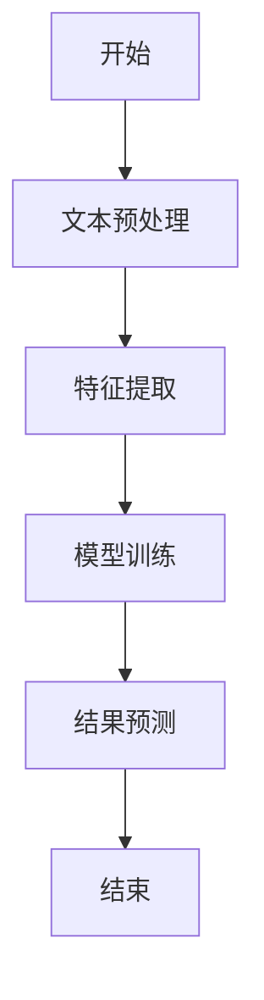
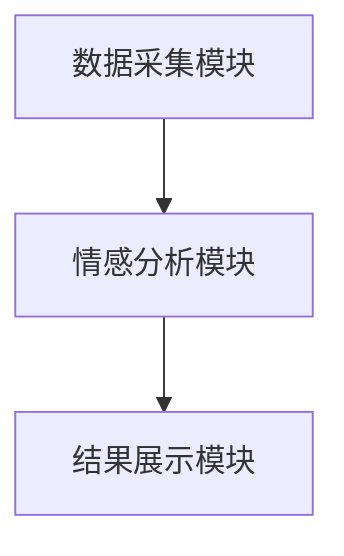

                 


# 情感分析技术在投资决策中的应用与优化

> 关键词：情感分析，投资决策，自然语言处理，机器学习，股票市场

> 摘要：本文深入探讨了情感分析技术在投资决策中的应用与优化，从情感分析的基本概念到其在股票市场中的实际应用，再到优化策略和系统实现，结合具体案例和代码实现，全面分析了情感分析在投资决策中的潜力与挑战。

---

## 第一部分: 情感分析技术的背景与基础

### 第1章: 情感分析技术概述

#### 1.1 情感分析的基本概念
情感分析是一种自然语言处理技术，旨在识别和分类文本中的情感倾向。它通过分析文本内容，判断作者的情感态度，如正面、负面或中性。情感分析广泛应用于社交媒体分析、产品 reviews 分析、客户反馈处理等领域。

**投资决策中的情感分析应用**  
在投资决策中，情感分析主要用于分析市场情绪，帮助投资者预测市场走势。例如，通过分析新闻、社交媒体和财经论坛中的文本，投资者可以了解市场参与者的情绪变化，从而做出更明智的投资决策。

#### 1.2 情感分析的核心要素
- **文本数据**：情感分析的基础是文本数据，包括新闻标题、社交媒体帖子、评论等。
- **情感倾向**：通过分析文本，确定其情感倾向（正面、负面或中性）。
- **情感强度**：量化情感的强度，例如“非常高兴”比“有点高兴”情感强度更高。

#### 1.3 情感分析的分类与应用场景
- **细粒度情感分析**：区分更具体的情感类别，如“高兴”、“悲伤”等。
- **混合情感分析**：处理包含多种情感的文本。
- **领域特定情感分析**：针对特定领域（如金融、医疗）进行情感分析。

### 第2章: 情感分析的核心概念与联系

#### 2.1 情感分析的核心原理
- **基于规则的情感分析**：使用预定义的规则和情感词典，识别文本中的情感词汇，统计正面和负面词汇的数量，判断情感倾向。
- **基于统计模型的情感分析**：利用机器学习算法（如朴素贝叶斯、支持向量机）训练情感分类器。
- **基于深度学习的情感分析**：使用神经网络（如LSTM、BERT）捕捉文本的情感特征。

**对比分析**  
下表对比了三种情感分析方法的核心特点：

| 方法         | 基础原理               | 优点                     | 缺点                     |
|--------------|------------------------|--------------------------|--------------------------|
| 基于规则     | 预定义规则和情感词典     | 实现简单，速度快           | 需手动维护规则，灵活性差 |
| 基于统计模型  | 统计学习和特征工程       | 高精度，可扩展            | 需大量标注数据           |
| 基于深度学习  | 神经网络和上下文特征     | 高精度，自动提取特征       | 需大量计算资源，实现复杂 |

#### 2.2 情感分析与投资决策的关联
- **市场情绪分析**：通过分析新闻、社交媒体等文本，判断市场情绪，预测股票价格走势。
- **情绪与收益关系**：研究表明，市场情绪与股票收益存在相关性，例如，过度乐观的情绪可能导致市场回调。

### 第3章: 情感分析的核心算法与实现

#### 3.1 情感分析的算法原理
- **朴素贝叶斯模型**：基于概率论，计算文本属于某个类别的概率。常用算法包括文本预处理、特征提取和模型训练。
- **支持向量机模型**：通过构建高维特征空间，找到最佳分割超平面，分类文本情感。
- **循环神经网络模型**：利用 LSTM 捕捉文本的情感特征，适合处理长文本序列。

**算法流程图**  
以下是情感分析算法的流程图：



#### 3.2 情感分析的数学模型
- **朴素贝叶斯模型**：计算条件概率 P(class|text)，通过贝叶斯定理求解。
  $$ P(class|text) = \frac{P(text|class) \cdot P(class)}{P(text)} $$

- **支持向量机模型**：通过线性或非线性分类器，找到最佳分割超平面。

- **循环神经网络模型**：使用 LSTM 捕捉文本的时序特征，模型结构如下：

  ```python
  import tensorflow as tf
  from tensorflow.keras.layers import LSTM, Dense, Embedding

  model = tf.keras.Sequential([
      Embedding(input_dim=词汇表大小, output_dim=嵌入维度),
      LSTM(units= lstm单元数),
      Dense(units=1, activation='sigmoid')
  ])
  ```

#### 3.3 情感分析的实现流程
1. **文本预处理**：去除停用词、分词、去标点符号等。
2. **特征提取**：使用词袋模型或词嵌模型提取文本特征。
3. **模型训练**：使用训练数据训练情感分类器。
4. **结果评估**：通过准确率、召回率、F1 分数等指标评估模型性能。

---

## 第二部分: 情感分析技术在投资决策中的应用

### 第4章: 情感分析在股票市场中的应用

#### 4.1 股票市场的基本概念
股票市场是投资者进行股票交易的场所，市场参与者包括个人投资者、机构投资者、券商等。股票价格受多种因素影响，包括公司业绩、宏观经济指标、市场情绪等。

#### 4.2 情感分析在股票市场中的作用
- **预测股票价格走势**：通过分析新闻、社交媒体等文本，预测市场情绪，进而预测股票价格。
- **风险评估**：通过分析市场情绪，评估投资风险，制定投资策略。

#### 4.3 情感分析与股票市场的关系
市场情绪是影响股票价格的重要因素。当市场情绪过于乐观时，股票价格可能被高估；当市场情绪过于悲观时，股票价格可能被低估。

---

## 第三部分: 情感分析技术的优化与提升

### 第5章: 情感分析的优化与提升策略

#### 5.1 情感分析的优化策略
- **数据增强**：通过数据增强技术，增加训练数据的多样性，提高模型的泛化能力。
- **模型融合**：结合多种情感分析模型，提高预测准确率。
- **实时分析**：通过实时监控市场情绪，及时调整投资策略。

#### 5.2 情感分析模型的调优
- **超参数优化**：通过网格搜索等方法，优化模型的超参数。
- **特征工程**：提取更有区分度的特征，提高模型性能。
- **模型解释性**：通过模型解释技术，理解模型的决策过程，提高模型的可信度。

---

## 第四部分: 情感分析技术的系统架构与实现

### 第6章: 系统架构与实现

#### 6.1 系统设计
- **模块划分**：系统分为数据采集模块、情感分析模块、结果展示模块。
- **功能设计**：数据采集模块负责采集股票市场的相关文本数据；情感分析模块负责对文本进行情感分析；结果展示模块展示分析结果。

#### 6.2 系统架构
以下是系统架构图：



---

## 第五部分: 项目实战

### 第7章: 项目实战

#### 7.1 环境安装
- **Python 3.8+**
- **TensorFlow 2.0+**
- **jieba 分词工具**

#### 7.2 核心代码实现
以下是情感分析模型的实现代码：

```python
import jieba
import tensorflow as tf
from tensorflow.keras import layers

# 文本预处理
def preprocess(text):
    words = jieba.lcut(text)
    return ' '.join(words)

# 情感分析模型
model = tf.keras.Sequential([
    layers.Embedding(input_dim=词汇表大小, output_dim=嵌入维度),
    layers.Bidirectional(layers.LSTM(64)),
    layers.Dense(1, activation='sigmoid')
])

# 训练模型
model.compile(optimizer='adam', loss='binary_crossentropy', metrics=['accuracy'])
model.fit(X_train, y_train, epochs=10, batch_size=32)
```

#### 7.3 案例分析
以下是一个情感分析案例：

**输入文本**：市场情绪高涨，投资者信心充足。
**情感分析结果**：正面情绪，情感强度高。

**投资决策**：根据市场情绪预测，股票价格可能会上涨，建议买入。

---

## 第六部分: 总结与展望

### 第8章: 总结与展望

#### 8.1 总结
情感分析技术在投资决策中的应用潜力巨大，可以帮助投资者更好地理解市场情绪，做出更明智的投资决策。

#### 8.2 展望
未来，情感分析技术将更加智能化和精准化，结合更多数据源（如语音、图像）进行多模态情感分析，进一步提升投资决策的准确性。

---

通过以上内容，我们可以看到情感分析技术在投资决策中的重要性，以及其在实际应用中的潜力。希望本文能为读者提供有价值的见解和启发。

