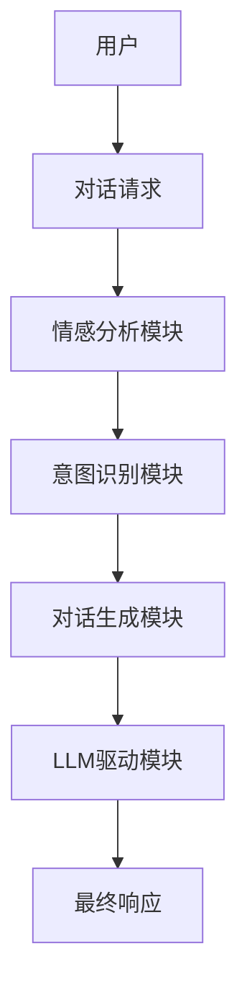
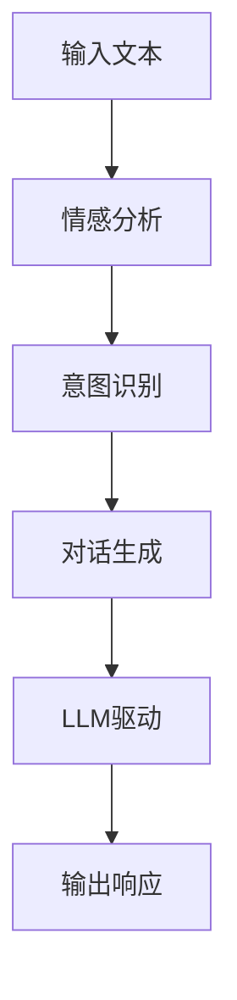
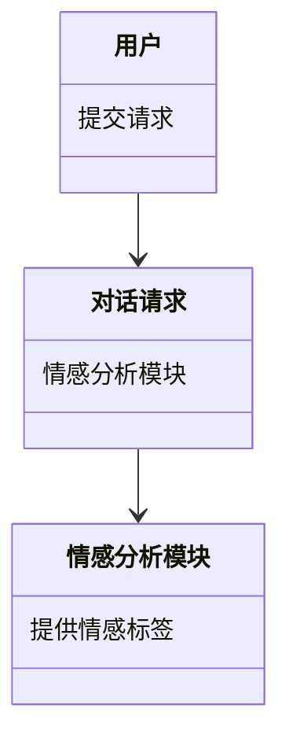
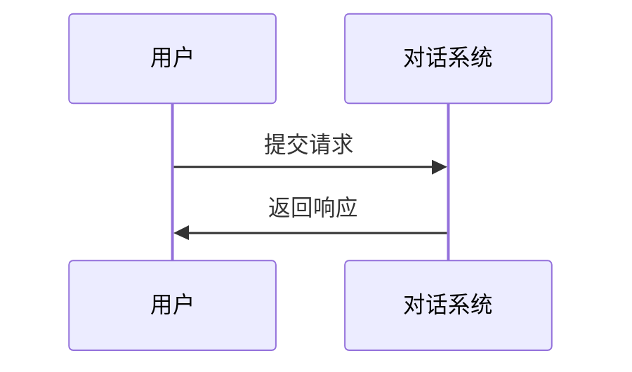

                 


# 情感智能对话系统AI Agent：LLM驱动的深度交互

> 关键词：情感智能对话系统、LLM、深度交互、情感计算、自然语言处理

> 摘要：本文详细探讨了情感智能对话系统的核心概念、算法原理、系统架构以及实际应用。通过分析情感计算与自然语言处理的结合，阐述了深度交互的实现原理和应用价值。本文还提供了具体的项目案例和系统设计，帮助读者更好地理解和应用情感智能对话系统。

---

## 第一部分: 情感智能对话系统背景与概念

### 第1章: 情感智能对话系统概述

#### 1.1 情感智能对话系统的定义与背景

情感智能对话系统是一种结合了自然语言处理和情感计算的AI系统，能够理解并回应用户的情感需求，实现深度交互。它不仅仅是回答问题，还能识别和理解用户的情感状态，从而提供更个性化的服务。

**1.1.1 情感智能对话系统的定义**  
情感智能对话系统是一种基于大语言模型（LLM）的AI代理，能够通过分析用户的语言和情感状态，生成自然、连贯且符合情感需求的对话响应。它不仅能够处理文本信息，还能捕捉用户的情感，如快乐、悲伤、愤怒等，从而提供更个性化的服务。

**1.1.2 情感智能对话系统的背景与现状**  
近年来，随着AI技术的发展，特别是大语言模型（如GPT系列）的兴起，情感智能对话系统逐渐成为研究热点。它广泛应用于客服、教育、医疗等领域，提高了用户体验和服务效率。例如，在客服领域，情感智能对话系统可以快速响应用户问题，识别用户情绪，并提供相应的解决方案。

**1.1.3 情感智能对话系统的核心问题与挑战**  
情感智能对话系统面临的问题包括准确理解用户情感、保持对话连贯性以及处理复杂的情感需求。挑战主要在于如何在大规模数据下实现高效的情感分析和生成自然的对话响应。此外，如何处理多轮对话中的上下文依赖性也是一个重要挑战。

#### 1.2 情感智能对话系统的关键技术

**1.2.1 大语言模型（LLM）的基本概念**  
大语言模型（LLM）是情感智能对话系统的核心技术，它通过大量数据训练，能够生成连贯且有意义的文本。LLM不仅能够处理单轮对话，还能通过上下文理解多轮对话，生成自然的回应。

**1.2.2 情感计算与自然语言处理的结合**  
情感计算涉及识别和理解用户的情感，而自然语言处理则负责文本的理解和生成。两者的结合使得系统能够更准确地捕捉用户情感，并生成相应的回应。

**1.2.3 深度交互的核心技术与实现**  
深度交互依赖于多轮对话和上下文理解。系统需要维护对话历史，确保每一步回应都基于前文信息，保持连贯性。

#### 1.3 情感智能对话系统的应用价值

**1.3.1 情感智能对话系统的应用场景**  
情感智能对话系统广泛应用于多个领域，包括客服支持、教育辅助、心理健康咨询等。例如，在客服领域，系统可以快速响应用户问题，提高服务效率。

**1.3.2 情感智能对话系统对企业与个人的影响**  
对企业而言，情感智能对话系统可以降低人力成本，提高客户满意度；对个人而言，提供便捷高效的服务，改善用户体验。

**1.3.3 情感智能对话系统的未来发展趋势**  
随着技术进步，情感智能对话系统将更加智能化，能够处理更复杂的情感需求，并在更多领域得到应用。

---

### 第2章: 情感智能对话系统的概念模型

#### 2.1 情感智能对话系统的核心概念

**2.1.1 情感计算的定义与特征**  
情感计算是指通过分析用户的情感状态，如情绪、态度和意图，来生成适当的回应。其特征包括实时性、准确性、适应性等。

**2.1.2 对话系统的定义与特征**  
对话系统是一种能够与用户进行自然语言交流的系统，特征包括交互性、连贯性和智能化。

**2.1.3 深度交互的核心概念与实现**  
深度交互强调多轮对话，保持上下文理解，确保每次回应都与前文相关联。

#### 2.2 情感智能对话系统的概念属性对比

| 比较项       | 情感计算       | 传统NLP       | 对话系统       | 传统问答系统   |
|--------------|---------------|---------------|---------------|---------------|
| 核心目标     | 情感识别       | 文本处理       | 交互对话       | 简单问答       |
| 技术基础     | 情感分析算法   | 词袋模型       | 对话生成算法   | 信息检索       |
| 应用场景     | 情感咨询、客服 | 文档分类       | 联网对话       | 问题解答       |
| 数据需求     | 带情感标注的数据| 纯文本数据     | 对话历史数据   | 结构化知识库   |

#### 2.3 情感智能对话系统的ER实体关系图



---

### 第3章: 情感智能对话系统的算法原理

#### 3.1 情感计算算法原理

**3.1.1 情感计算的基本原理**  
情感计算通常采用机器学习算法，如支持向量机（SVM）或深度学习模型（如LSTM、BERT）来分析文本中的情感倾向。

**3.1.2 情感计算的关键算法**  
常用的算法包括SVM、LSTM和BERT。例如，使用BERT模型进行情感分析时，首先将文本输入模型，得到每个词的向量表示，然后通过全连接层进行分类。

**3.1.3 情感计算的实现步骤**  
包括数据预处理、特征提取、模型训练和结果评估。

#### 3.2 对话系统算法原理

**3.2.1 对话系统的整体架构**  
对话系统的模块组成包括输入处理、意图识别、对话生成和输出响应。

**3.2.2 对话生成的算法流程**  
从输入到输出的详细流程，包括情感分析、意图识别、生成响应。

**3.2.3 对话系统的优化策略**  
如使用记忆网络、强化学习等方法来优化对话质量。

#### 3.3 深度交互的算法实现

**3.3.1 深度交互的核心算法**  
介绍多轮对话的算法，如基于Transformer的模型，能够处理长上下文。

**3.3.2 深度交互的优化方法**  
如引入领域知识、上下文记忆机制等。

**3.3.3 深度交互的数学模型**  
展示基于Transformer的模型结构，并解释其工作原理。

#### 3.4 情感智能对话系统的算法流程图



---

### 第4章: 情感智能对话系统的数学模型

#### 4.1 情感分析的数学模型

使用词袋模型或嵌入层（如Word2Vec）表示文本，然后通过全连接层进行分类。

模型公式：
$$ y = Wx + b $$
其中，x是输入向量，W是权重矩阵，b是偏置项，y是输出概率。

#### 4.2 对话生成的数学模型

使用序列到序列模型（Seq2Seq），包括编码器和解码器。编码器将输入序列转换为隐藏状态，解码器根据隐藏状态生成输出序列。

编码器公式：
$$ h_i = LSTM(x_i, h_{i-1}) $$
解码器公式：
$$ y_i = LSTM(h, y_{i-1}) $$

#### 4.3 深度交互的数学模型

使用Transformer模型，包含自注意力机制和前馈网络。

注意力机制公式：
$$ \alpha_i = \text{softmax}(QK^T/\sqrt{d_k}) $$
其中，Q是查询向量，K是键向量，$d_k$是向量维度。

---

### 第5章: 情感智能对话系统的系统分析与架构设计

#### 5.1 系统分析

**5.1.1 问题场景介绍**  
以医疗咨询对话系统为例，分析其需求和挑战。

**5.1.2 项目介绍**  
简要介绍项目的背景、目标和范围。

#### 5.2 系统功能设计

**5.2.1 领域模型设计**  
使用Mermaid类图展示系统的主要功能模块，如情感分析模块、意图识别模块等。



**5.2.2 系统架构设计**  
使用Mermaid架构图展示系统的整体架构，包括前端、后端和数据库。

```mermaid
rectangle 前端 {
    用户界面
}
rectangle 后端 {
    对话系统
}
rectangle 数据库 {
    对话历史、情感数据
}
前端 --> 后端
后端 --> 数据库
```

#### 5.3 系统接口设计

**5.3.1 接口设计**  
定义系统的主要接口，如提交请求接口、获取情感标签接口等。

**5.3.2 交互流程设计**  
使用Mermaid序列图展示用户与系统之间的交互流程。



---

### 第6章: 情感智能对话系统的项目实战

#### 6.1 环境安装

安装必要的库，如Python、TensorFlow、Keras等。

```bash
pip install python python-tensorflow keras
```

#### 6.2 核心实现

代码实现情感分析模块、意图识别模块和对话生成模块。

```python
import numpy as np
from tensorflow import keras

# 情感分析模型
model = keras.Sequential([
    keras.layers.Dense(16, activation='relu'),
    keras.layers.Dense(2, activation='softmax')
])
model.compile(optimizer='adam', loss='sparse_categorical_crossentropy', metrics=['accuracy'])

# 对话生成模型
encoder = keras.Model(inputs=...)
decoder = keras.Model(inputs=...)
```

#### 6.3 实际案例分析

以医疗咨询为例，展示系统如何处理用户的查询，生成情感化的回应。

```python
user_input = "我感到焦虑"
# 情感分析
prediction = model.predict(user_input)
# 生成回应
response = decoder.generate(user_input, prediction)
```

#### 6.4 项目小结

总结项目实现的关键点，如模型选择、数据预处理和系统优化。

---

### 第7章: 总结与展望

#### 7.1 总结

回顾文章的主要内容，强调情感智能对话系统的核心技术和应用价值。

#### 7.2 未来挑战与发展方向

讨论当前技术的不足，如情感分析的准确性、对话系统的流畅性，以及未来可能的研究方向，如多模态交互、更复杂的上下文理解。

#### 7.3 最佳实践 tips

提供一些实用的建议，如选择合适的模型、优化数据质量、定期更新系统等。

---

通过以上详细的内容，本文系统地介绍了情感智能对话系统的各个方面，从基本概念到算法实现，再到系统设计和项目实战，帮助读者全面理解和应用这一技术。

