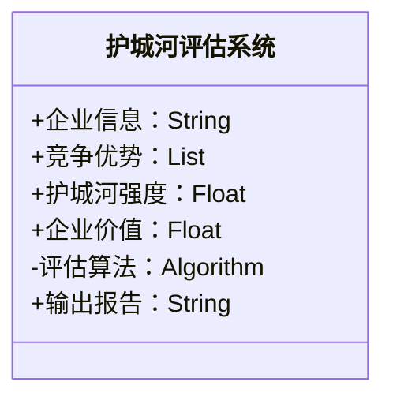
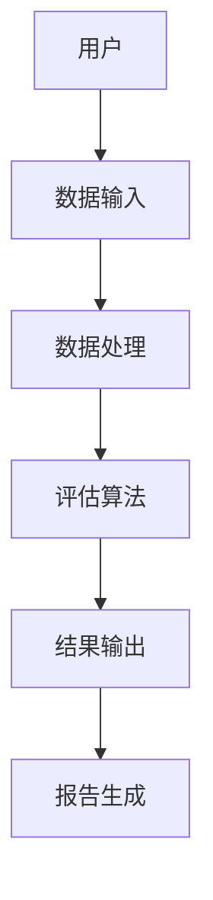

                 


# 戴维·多德的护城河评估体系

## 关键词：护城河评估体系、戴维·多德、价值投资、企业估值、竞争优势、投资策略

## 摘要：  
戴维·多德的护城河评估体系是一种通过分析企业的竞争优势、市场地位和长期价值潜力，来评估企业内在价值的方法。本文将详细介绍护城河评估体系的核心概念、数学模型、系统架构以及实际应用案例，帮助读者全面理解这一投资策略的精髓。

---

## 正文

### 第一部分：引言与背景

#### 第1章：护城河评估体系的背景与意义

##### 1.1 护城河评估体系的背景

在现代投资学中，护城河的概念起源于价值投资理论。戴维·多德（Benjamin Graham）是价值投资的鼻祖，他提出了“安全边际”和“内在价值”等核心理念。护城河评估体系的核心在于识别企业的竞争优势，并通过这些优势来判断企业是否具备长期的盈利能力。这种评估方法不仅适用于企业估值，还被广泛应用于投资策略的制定。

##### 1.2 戴维·多德与护城河理论

戴维·多德在其著作《安全边际》中，首次系统地提出了护城河理论。他认为，企业的竞争优势是其长期盈利能力的关键因素。护城河可以是经济上的（如成本优势）、竞争性的（如品牌优势）或法律性的（如专利）。通过识别这些竞争优势，投资者可以更好地评估企业的内在价值，从而做出更为明智的投资决策。

---

### 第二部分：核心概念与理论基础

#### 第2章：护城河的定义与类型

##### 2.1 护城河的定义

护城河是指企业为防止竞争对手侵蚀其市场份额而建立的长期竞争优势。它不仅包括企业的技术优势，还包括品牌影响力、客户忠诚度、成本控制能力等多方面的优势。以下是几种主要的护城河类型：

| 护城河类型 | 核心特征 | 示例企业 |
|------------|-----------|----------|
| 经济护城河 | 成本优势、规模效应 | 麦当劳、可口可乐 |
| 竞争性护城河 | 品牌优势、网络效应 | 苹果、谷歌 |
| 法律性护城河 | 专利、特许经营权 | 辉瑞、迪士尼 |
| 时间性护城河 | 历史积淀与经验优势 | 花旗银行、通用电气 |

##### 2.2 护城河与企业价值的关系

护城河的强弱直接影响企业的市场地位和盈利能力。一个强大的护城河能够为企业提供更高的定价权、更低的边际成本以及更稳定的现金流。因此，评估护城河的深度和广度是判断企业内在价值的重要指标。

---

#### 第3章：护城河评估的核心要素

##### 3.1 企业竞争优势的识别

竞争优势是护城河的核心要素。戴维·多德认为，投资者需要通过对企业的产品、技术、管理团队、市场地位等多方面的分析，识别其独特的竞争优势。

##### 3.2 护城河的宽度与深度

- **宽度**：指护城河的广度，即竞争优势的覆盖面。
- **深度**：指护城河的强度，即竞争优势的持久性。

##### 3.3 护城河的可持续性与可扩展性

可持续性是指竞争优势在市场环境变化中的适应能力，可扩展性则是指竞争优势能否在更大范围内复制。

---

### 第三部分：护城河评估的数学模型与算法

#### 第4章：护城河评估的数学模型

##### 4.1 企业价值评估公式

企业价值（EV）可以通过以下公式计算：

$$ EV = \frac{FCF}{WACC} $$

其中：
- FCF = 自由现金流
- WACC = 加权平均资本成本

护城河的强弱会影响企业的FCF和WACC。例如，强大的护城河可以降低WACC，提高FCF。

##### 4.2 护城河强度评估模型

护城河强度指数（HI）的计算公式为：

$$ HI = \sum (权重 \times 评分) $$

权重根据护城河类型的相对重要性确定，评分则基于企业竞争优势的实际情况打分。

---

### 第四部分：系统分析与架构设计

#### 第5章：系统功能设计与架构

##### 5.1 领域模型

以下是领域模型的类图：



##### 5.2 系统架构设计

以下是系统架构的mermaid图：



##### 5.3 系统接口设计

系统主要接口包括：
- 数据输入接口：接收企业信息和竞争优势数据。
- 评估接口：执行护城河强度评估算法。
- 输出接口：生成评估报告。

---

### 第五部分：项目实战

#### 第6章：项目实战与案例分析

##### 6.1 环境安装

安装Python和相关库：
```bash
pip install numpy pandas matplotlib
```

##### 6.2 核心代码实现

以下是护城河评估算法的Python代码：

```python
def calculate_h护城河强度(企业信息):
    # 示例代码
   竞争优势 = 企业信息['竞争优势']
    权重 = {'经济护城河': 0.4, '竞争性护城河': 0.3, '法律性护城河': 0.2, '时间性护城河': 0.1}
    护城河强度 = 0
    for 类型 in 竞争优势:
        护城河强度 += 权重[类型] * 竞争优势[类型]
    return 护城河强度

企业信息 = {
    '名称': '苹果',
    '竞争优势': {
        '经济护城河': 0.8,
        '竞争性护城河': 0.9,
        '法律性护城河': 0.7,
        '时间性护城河': 0.6
    }
}

print(calculate_h护城河强度(企业信息))
```

##### 6.3 案例分析

以苹果公司为例，计算其护城河强度：
$$ HI = 0.4 \times 0.8 + 0.3 \times 0.9 + 0.2 \times 0.7 + 0.1 \times 0.6 = 0.32 + 0.27 + 0.14 + 0.06 = 0.79 $$

---

### 第六部分：总结与展望

#### 第7章：总结与展望

##### 7.1 总结

戴维·多德的护城河评估体系为企业估值和投资决策提供了重要的理论支持。通过识别企业的竞争优势，投资者可以更好地判断企业的内在价值和长期发展潜力。

##### 7.2 最佳实践 tips

- **深入分析企业的竞争优势**：护城河的强弱直接影响企业的长期价值。
- **结合定量与定性分析**：在评估护城河时，既要考虑定量指标，也要结合企业的实际运营情况。
- **持续关注市场变化**：护城河的强度会随市场环境的变化而变化，投资者需要持续关注企业的竞争优势。

##### 7.3 未来展望

随着人工智能和大数据技术的发展，护城河评估体系将更加智能化和精准化。未来的投资决策将更加依赖于数据驱动的分析方法，护城河评估体系也将进一步完善。

---

通过以上内容，我们全面介绍了戴维·多德的护城河评估体系，从理论基础到实际应用，帮助读者更好地理解和应用这一投资策略。

