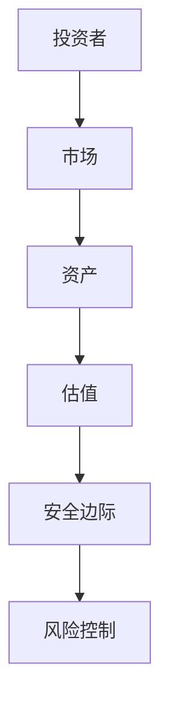
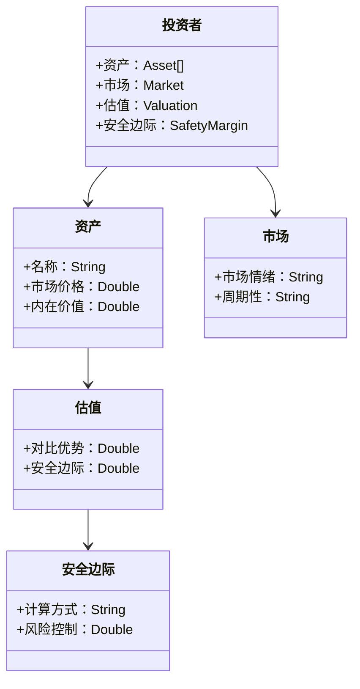
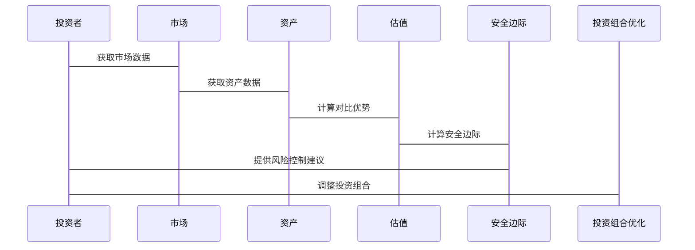

                 


# 《戴维·德雷曼的对比优势投资法》

> 关键词：戴维·德雷曼，对比优势投资法，安全边际，逆向投资，投资哲学，资产配置

> 摘要：本文深入探讨了戴维·德雷曼的对比优势投资法的核心理念、理论基础、数学模型、系统架构以及实际应用。通过分析对比优势投资法的背景、核心概念、算法原理、系统架构和项目实战，本文旨在为投资者提供一种新的视角和方法，帮助他们在复杂多变的市场中做出更明智的投资决策。

---

## 第一部分：对比优势投资法的背景与核心概念

### 第1章：对比优势投资法的起源与核心理念

#### 1.1 对比优势投资法的起源
- **1.1.1 对比优势投资法的定义**
  对比优势投资法是一种基于市场有效性和资产相对价值的投资策略，通过对比不同资产或市场的相对优势，寻找被市场低估的投资机会。

- **1.1.2 对比优势投资法的核心理念**
  对比优势投资法的核心理念是通过分析资产的相对价值，寻找市场中存在明显低估或高估的资产，并在市场波动中进行逆向投资。

- **1.1.3 对比优势投资法与传统投资法的区别**
  与传统投资法相比，对比优势投资法更加注重资产的相对价值和市场情绪，强调在市场低估时买入，在市场高估时卖出。

#### 1.2 戴维·德雷曼的投资哲学
- **1.2.1 投资的长期视角**
  德雷曼认为投资应该以长期视角为主，避免短期市场波动的干扰，注重资产的内在价值和长期增长潜力。

- **1.2.2 安全边际的概念与重要性**
  安全边际是对比优势投资法的核心要素之一，指的是资产的市场价格低于其内在价值的部分。安全边际的存在能够为投资者提供缓冲，减少市场波动带来的风险。

- **1.2.3 逆向投资的策略与实践**
  逆向投资是对比优势投资法的重要策略，即在市场恐慌时买入，在市场狂热时卖出。德雷曼通过分析市场情绪和周期性，寻找逆向投资的最佳时机。

### 第2章：对比优势投资法的核心概念

#### 2.1 对比优势的理论基础
- **2.1.1 对比优势的定义与特征**
  对比优势是指在市场中，某些资产相对于其他资产或市场指数的相对优势。这种相对优势可以通过资产价格与内在价值的对比来衡量。

- **2.1.2 对比优势与市场有效性的关系**
  对比优势的存在基于市场的有效性不足，即市场无法完全反映所有信息。当市场出现失灵或信息不对称时，对比优势投资法能够发现被低估或高估的资产。

- **2.1.3 对比优势在投资决策中的应用**
  对比优势在投资决策中主要用于资产配置、风险管理和投资组合优化。通过分析资产的相对优势，投资者可以做出更明智的投资决策。

#### 2.2 对比优势投资法的数学模型
- **2.2.1 对比优势的计算公式**
  对比优势的计算公式为：
  $$对比优势 = \frac{资产价格}{内在价值}$$
  当资产价格低于内在价值时，对比优势小于1，表示资产被低估；反之，对比优势大于1，表示资产被高估。

- **2.2.2 安全边际的数学模型**
  安全边际的计算公式为：
  $$安全边际 = 内在价值 - 市场价格$$
  安全边际越大，资产的投资价值越高。

- **2.2.3 投资组合优化的数学模型**
  投资组合优化的数学模型可以通过以下步骤实现：
  1. 确定资产的内在价值和市场价格。
  2. 计算资产的对比优势。
  3. 根据对比优势进行资产配置。
  4. 调整投资组合以优化风险和收益。

### 第3章：对比优势投资法的核心要素

#### 3.1 对比优势投资法的要素分析
- **3.1.1 资产质量与估值**
  资产质量是指资产的内在价值，包括盈利能力、成长性和财务健康状况。估值是指资产的市场价格与内在价值的对比。

- **3.1.2 市场情绪与周期性**
  市场情绪是指投资者的心理状态和行为，周期性是指市场在不同阶段的表现。对比优势投资法通过分析市场情绪和周期性，寻找投资机会。

- **3.1.3 安全边际与风险控制**
  安全边际是对比优势投资法的核心要素，用于控制投资风险。通过设置安全边际，投资者可以避免因市场波动带来的损失。

#### 3.2 对比优势投资法的属性特征对比
- **3.2.1 对比优势与价值投资的对比**
  对比优势投资法与价值投资法的对比如下：
  | 对比维度 | 对比优势投资法 | 价值投资法 |
  |----------|-----------------|-------------|
  | 核心理念 | 相对价值分析    | 内在价值分析 |
  | 投资策略 | 逆向投资        | 买入低估资产 |
  | 风险控制 | 安全边际        | 安全边际     |

- **3.2.2 对比优势与成长投资的对比**
  对比优势投资法与成长投资法的对比如下：
  | 对比维度 | 对比优势投资法 | 成长投资法 |
  |----------|-----------------|-------------|
  | 核心理念 | 相对价值分析    | 高成长性    |
  | 投资策略 | 逆向投资        | 买入高成长资产 |
  | 风险控制 | 安全边际        | 风险分散     |

- **3.2.3 对比优势与趋势投资的对比**
  对比优势投资法与趋势投资法的对比如下：
  | 对比维度 | 对比优势投资法 | 趋势投资法 |
  |----------|-----------------|-------------|
  | 核心理念 | 相对价值分析    | 跟随趋势    |
  | 投资策略 | 逆向投资        | 顺势投资    |
  | 风险控制 | 安全边际        | 趋势反转风险 |

### 第4章：对比优势投资法的实体关系图

#### 4.1 对比优势投资法的ER实体关系图
- **投资者**：投资者是对比优势投资法的主体，通过分析资产的相对价值进行投资决策。
- **市场**：市场是投资者进行交易的场所，市场情绪和周期性对投资者的决策有重要影响。
- **资产**：资产是投资者投资的对象，包括股票、债券、基金等。
- **估值**：估值是资产的市场价格与内在价值的对比，用于衡量资产的相对优势。
- **安全边际**：安全边际是资产的内在价值与市场价格的差额，用于控制投资风险。

#### 4.2 对比优势投资法的Mermaid流程图


---

## 第二部分：系统的分析与架构设计

### 第5章：系统的分析与架构设计

#### 5.1 问题场景介绍
- 对比优势投资法的应用场景包括资产配置、风险管理、投资组合优化等。

#### 5.2 系统功能设计
- **领域模型类图**


- **系统架构图**
```mermaid
rectangle 数据层 {
    数据库
}
rectangle 业务逻辑层 {
    投资者
    资产
    市场
    估值
    安全边际
}
rectangle 表现层 {
    投资决策
    风险管理
    投资组合优化
}
数据层 --> 业务逻辑层
业务逻辑层 --> 表现层
```

- **系统接口设计**
  - 数据接口：投资者与市场、资产之间的数据交互。
  - 业务接口：投资者与估值、安全边际之间的业务逻辑交互。
  - 表现接口：投资者与投资决策、风险管理、投资组合优化之间的表现层交互。

- **系统交互序列图**


---

## 第三部分：项目实战

### 第6章：项目实战

#### 6.1 环境安装与配置
- **工具安装**：安装Python、Jupyter Notebook、Mermaid、Latex等工具。
- **数据获取**：获取历史市场数据、资产数据等。

#### 6.2 核心实现源代码
```python
# 计算对比优势
def calculate对比优势(市场价格, 内在价值):
    return 内在价值 / 市场价格

# 计算安全边际
def calculate_安全边际(内在价值, 市场价格):
    return 内在价值 - 市场价格

# 投资组合优化
def optimize_portfolio(assets, 市场价格, 内在价值):
    对比优势 = {}
    for asset in assets:
        对比优势[asset] = calculate_对比优势(市场价格[asset], 内在价值[asset])
    # 根据对比优势进行排序
    sorted_assets = sorted(assets, key=lambda x: 对比优势[x], reverse=True)
    return sorted_assets
```

#### 6.3 投资组合管理
- **实战策略**：根据对比优势和安全边际进行资产配置。
- **案例分析**：以德雷曼的经典投资案例为例，详细分析其投资决策过程。

---

## 第四部分：总结与展望

### 第7章：总结与展望

#### 7.1 核心要点回顾
- 对比优势投资法的核心理念是通过分析资产的相对价值，寻找被市场低估的投资机会。
- 安全边际是对比优势投资法的核心要素，用于控制投资风险。
- 逆向投资是对比优势投资法的重要策略，即在市场低估时买入，在市场高估时卖出。

#### 7.2 对比优势投资法的优缺点
- **优点**：能够发现被市场低估的资产，通过逆向投资获得超额收益。
- **缺点**：需要投资者具备较高的市场分析能力和心理素质，能够承受短期市场波动的压力。

#### 7.3 对比优势投资法的未来展望
- 随着市场的不断发展，对比优势投资法将更加注重资产的相对价值和市场情绪的分析。
- 未来，对比优势投资法将与量化投资、人工智能等技术结合，进一步提升投资效率和准确性。

---

通过本文的详细讲解，读者可以全面理解戴维·德雷曼的对比优势投资法的核心理念、理论基础、数学模型、系统架构和实际应用。这种方法不仅能够帮助投资者在复杂多变的市场中做出更明智的投资决策，还能够通过系统的分析和优化，实现长期稳健的投资收益。

