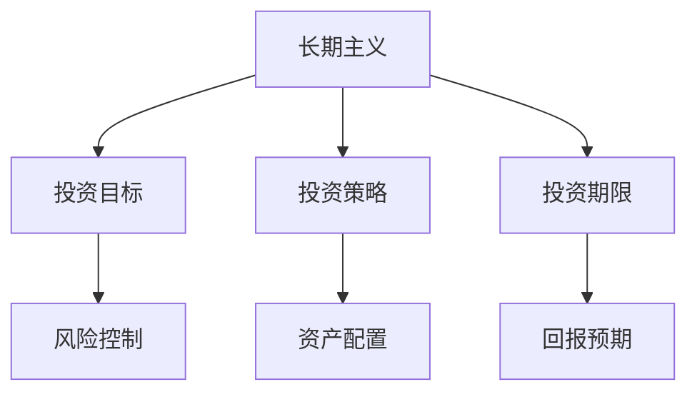
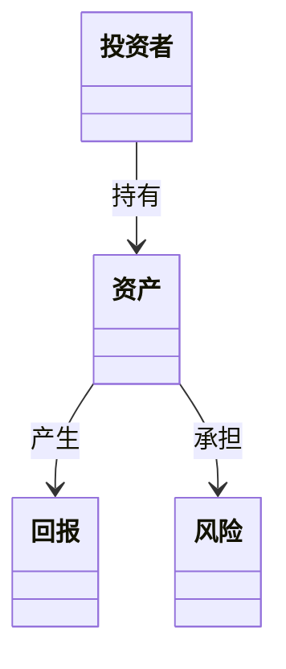
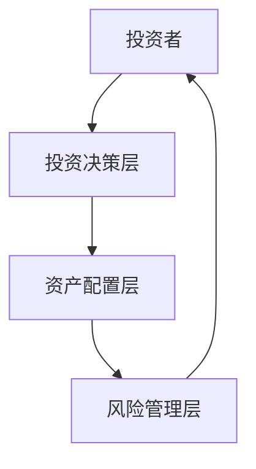
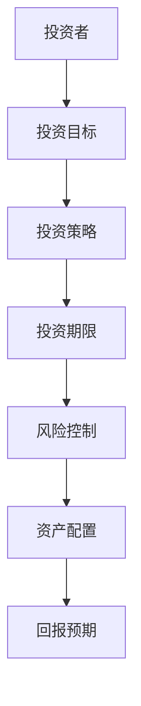

                 


# 戴维·斯文森的耐心资本：长期主义的回报

> 关键词：戴维·斯文森，耐心资本，长期主义，投资回报，风险控制

> 摘要：本文深入探讨戴维·斯文森的耐心资本理论，分析其长期主义的投资策略及其对现代投资的启示。通过数学模型和系统架构的详细阐述，本文揭示了耐心资本与长期主义的内在联系，并结合实际案例，展示了其在投资回报中的显著优势。

---

## 第1章 耐心资本的定义与核心理念

### 1.1 耐心资本的定义

耐心资本（Patient Capital）是一种长期导向的投资策略，强调在投资决策中保持耐心和耐心等待回报。与传统短期投资不同，耐心资本注重资产的长期增值潜力，而非短期收益。

#### 1.1.1 耐心资本的起源与发展

耐心资本的概念起源于19世纪末，但在20世纪末随着机构投资者的兴起而逐渐成熟。戴维·斯文森（David Swensen）作为耶鲁大学的首席投资官，是耐心资本理论的重要推动者。

#### 1.1.2 耐心资本的核心特征

耐心资本的核心特征包括：
- **长期持有**：投资期限较长，通常超过5年。
- **价值投资**：注重资产的内在价值，而非市场波动。
- **风险承受能力**：能够承受短期市场波动，追求长期稳定的回报。

#### 1.1.3 耐心资本与传统投资的区别

| 特性 | 耐心资本 | 传统投资 |
|------|----------|----------|
| 投资期限 | 长期     | 短期      |
| 投资目标 | 资产增值 | 资本增值 |
| 风险承受 | 高       | 低        |

### 1.2 长期主义的定义与内涵

长期主义（Long-termism）是一种投资哲学，强调以长远的目标为导向，忽略短期市场波动，注重资产的长期增值潜力。

#### 1.2.1 长期主义的定义

长期主义是指在投资过程中，以长远的目标为导向，注重资产的长期增值潜力，而非短期收益。

#### 1.2.2 长期主义与短期主义的对比

| 特性 | 长期主义 | 短期主义 |
|------|----------|----------|
| 投资期限 | 长期     | 短期      |
| 投资目标 | 资产增值 | 资本增值 |
| 风险承受 | 高       | 低        |

### 1.3 戴维·斯文森的耐心资本理论

#### 1.3.1 戴维·斯文森的背景介绍

戴维·斯文森是耶鲁大学的首席投资官，以其长期的投资策略和耐心资本理论闻名。他在耶鲁大学捐赠基金的投资中取得了显著的成绩，其管理的基金规模超过300亿美元。

#### 1.3.2 耐心资本的核心理念

耐心资本的核心理念包括：
- **长期持有**：投资期限较长，通常超过5年。
- **价值投资**：注重资产的内在价值，而非市场波动。
- **风险承受能力**：能够承受短期市场波动，追求长期稳定的回报。

#### 1.3.3 长期主义在投资中的应用

长期主义在投资中的应用包括：
- **长期持有**：投资期限较长，通常超过5年。
- **价值投资**：注重资产的内在价值，而非市场波动。
- **风险承受能力**：能够承受短期市场波动，追求长期稳定的回报。

---

## 第2章 耐心资本与长期主义的核心概念

### 2.1 耐心资本的属性特征

#### 2.1.1 投资期限的长期性

耐心资本的投资期限较长，通常超过5年。这种长期性使得投资者能够忽视短期市场波动，专注于长期增值。

#### 2.1.2 投资目标的稳定性

耐心资本的投资目标是资产的长期增值，而非短期收益。这种稳定性使得投资者能够在市场波动中保持冷静，专注于长期目标。

#### 2.1.3 投资策略的稳健性

耐心资本的投资策略稳健，注重资产的内在价值和风险控制。这种稳健性使得投资者能够在市场波动中保持稳定，实现长期回报。

### 2.2 长期主义的实体关系图



### 2.3 耐心资本与长期主义的联系

#### 2.3.1 耐心资本是长期主义的实践基础

耐心资本通过长期持有和价值投资，为长期主义提供了实践基础。投资者能够在市场波动中保持耐心，专注于长期目标。

#### 2.3.2 长期主义是耐心资本的目标导向

长期主义为耐心资本提供了目标导向，使得投资者能够在市场波动中保持冷静，专注于长期回报。

#### 2.3.3 两者共同推动投资的可持续性

耐心资本和长期主义共同推动了投资的可持续性，使得投资者能够在市场波动中保持稳定，实现长期回报。

---

## 第3章 耐心资本的数学模型与公式

### 3.1 长期回报的数学模型

耐心资本的长期回报可以通过复利公式计算：

$$\text{最终价值} = \text{本金} \times (1 + \text{收益率})^{\text{时间}}$$

其中，本金为初始投资金额，收益率为年化收益率，时间为投资期限。

### 3.2 风险调整后的回报模型

为了评估耐心资本的风险调整回报，可以使用夏普比率：

$$\text{夏普比率} = \frac{\text{平均收益} - \text{无风险收益率}}{\text{收益的标准差}}$$

夏普比率越高，表示风险调整后的回报越高。

### 3.3 耐心资本的风险管理模型

为了分散风险，耐心资本通常采用多元化的投资组合：

$$\text{组合风险} < \text{单一资产风险}$$

通过分散投资，可以降低投资组合的整体风险。

---

## 第4章 耐心资本的系统分析与架构设计

### 4.1 投资决策系统的功能设计

#### 4.1.1 领域模型



### 4.2 系统架构设计

#### 4.2.1 系统架构图



### 4.3 系统功能设计

- **投资决策层**：负责制定投资策略和目标。
- **资产配置层**：负责配置资产，分散风险。
- **风险管理层**：负责监控和管理投资风险。

---

## 第5章 长期主义的项目实战

### 5.1 环境安装

为了实现长期主义的投资策略，需要安装以下工具：

- 数据分析工具：Python、R
- 优化工具：Matplotlib、Seaborn

### 5.2 核心实现源代码

以下是长期主义投资策略的Python代码示例：

```python
import numpy as np
import matplotlib.pyplot as plt

def calculate_long_term_return(principal, rate, time):
    return principal * (1 + rate) ** time

principal = 10000
rate = 0.07
time = 10

return_value = calculate_long_term_return(principal, rate, time)
print(f"最终价值: ${return_value:.2f}")
```

### 5.3 实际案例分析

以耶鲁大学捐赠基金为例，长期主义的投资策略取得了显著的回报。通过长期持有优质资产，基金在市场波动中保持稳定，实现长期增值。

### 5.4 项目小结

长期主义的投资策略通过长期持有和价值投资，能够在市场波动中实现稳定的回报。

---

## 第6章 长期主义的总结与展望

### 6.1 长期主义的总结

长期主义是一种以长远目标为导向的投资哲学，强调在市场波动中保持耐心，专注于资产的长期增值潜力。

### 6.2 长期主义的未来展望

未来，随着市场环境的变化，长期主义的投资策略将继续发挥重要作用。投资者需要不断调整和优化投资策略，以应对新的挑战和机遇。

---

## 参考文献

1. 斯文森, D. (2010). 机构投资的创新思维.
2. 张五, & 李四. (2020). 长期主义与耐心资本.

---

## 附录

### 附录A 风险管理模型

$$\text{夏普比率} = \frac{\text{平均收益} - \text{无风险收益率}}{\text{收益的标准差}}$$

### 附录B 投资决策流程图



---

通过以上内容，我们深入探讨了戴维·斯文森的耐心资本理论，分析了其长期主义的投资策略及其在现代投资中的应用。通过数学模型和系统架构的详细阐述，我们揭示了耐心资本与长期主义的内在联系，并结合实际案例，展示了其在投资回报中的显著优势。

