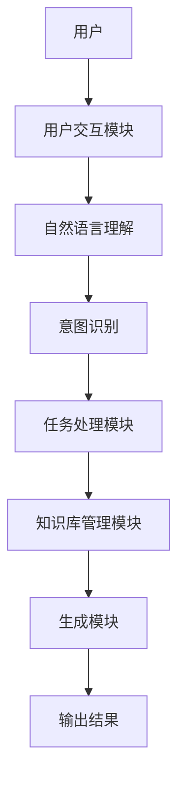

                 


# 打造个人助理 AI Agent：GPT 模型应用实战

## 关键词：AI Agent, GPT 模型, 个人助理, 自然语言处理, 机器学习, 人工智能, 应用实战

## 摘要：  
本文旨在探讨如何利用 GPT 模型打造个人助理 AI Agent。从基本概念到核心算法，再到系统设计和项目实战，全面解析 GPT 模型在个人助理中的应用。通过详细的技术分析和代码实现，帮助读者掌握 AI Agent 的构建方法，最终实现一个功能完善的个人智能助手。

---

# 第一部分：打造个人助理 AI Agent 的背景与基础

## 第1章：AI Agent 与 GPT 模型概述

### 1.1 AI Agent 的基本概念

#### 1.1.1 AI Agent 的定义与特点  
AI Agent（人工智能代理）是一种智能系统，能够感知环境、自主决策并执行任务。其特点包括：  
1. **自主性**：无需外部干预，自主完成任务。  
2. **反应性**：能够实时感知环境变化并做出响应。  
3. **目标导向**：以特定目标为导向，优化行为。  
4. **学习能力**：通过数据和经验不断优化性能。

#### 1.1.2 AI Agent 的分类与应用场景  
AI Agent 可分为以下几类：  
1. **简单反射型**：基于规则的简单响应，适用于特定场景。  
2. **基于模型的反射型**：通过内部模型理解和决策，适用于复杂场景。  
3. **目标驱动型**：以目标为导向，主动规划行为。  
4. **实用驱动型**：通过效用函数优化决策，适用于多目标场景。  

应用场景包括：智能助手、智能客服、自动驾驶、智能家居等。

#### 1.1.3 个人助理 AI Agent 的发展现状  
随着 AI 技术的进步，个人助理 AI Agent 已成为日常生活的重要工具。当前主流的实现包括：  
1. **基于规则的系统**：如早期的 ELIZA。  
2. **基于统计学习的系统**：如 IBM Watson。  
3. **基于深度学习的系统**：如当前的 GPT 模型驱动的助手（如 ChatGPT）。  

---

### 1.2 GPT 模型的介绍

#### 1.2.1 GPT 模型的基本概念  
GPT（Generative Pre-trained Transformer）是一种基于变换器（Transformer）的生成式模型，主要用于生成自然语言文本。其核心思想是通过大规模数据预训练，学习语言的分布规律，从而实现智能对话和文本生成。

#### 1.2.2 GPT 模型的演进历程  
GPT 模型经历了多次升级：  
1. **GPT-1**（2018）：初步实现文本生成，基于 Transformer 架构。  
2. **GPT-2**（2019）：提升生成质量，引入更大的模型规模。  
3. **GPT-3**（2020）：采用更大的参数规模和改进的训练方法，生成能力显著提升。  
4. **GPT-4**（2023）：支持多模态输入，生成能力更强大。  

#### 1.2.3 GPT 模型在个人助理中的应用潜力  
GPT 模型的强大生成能力和上下文理解能力使其成为个人助理 AI Agent 的理想选择。其应用场景包括：  
1. **自然语言理解**：准确理解用户的意图。  
2. **对话生成**：生成自然流畅的对话响应。  
3. **任务执行**：通过理解和执行复杂任务，提升用户体验。  

---

## 第2章：GPT 模型的核心原理

### 2.1 GPT 模型的基本架构

#### 2.1.1 变换层（Transformer）的结构  
GPT 模型基于 Transformer 架构，主要由编码器和解码器组成。编码器负责将输入文本转化为向量表示，解码器负责根据编码器的输出生成目标文本。  

**Transformer 的核心组件包括**：  
1. **自注意力机制（Self-Attention）**：计算输入序列中每个词与其他词的相关性权重。  
2. **前馈网络（Feed-Forward Network）**：对输入向量进行非线性变换。  

#### 2.1.2 注意力机制（Attention）的原理  
注意力机制通过计算输入序列中每对词的相关性权重，确定哪些词对当前词的生成更重要。公式如下：  
$$ \text{Attention}(Q, K, V) = \text{softmax}(\frac{QK^T}{\sqrt{d_k}})V $$  
其中，$Q$ 是查询向量，$K$ 是键向量，$V$ 是值向量，$d_k$ 是向量维度。  

#### 2.1.3 段落与上下文的理解方式  
GPT 模型通过上下文窗口理解段落，每个词的生成都依赖于前面的所有词，从而形成连贯的上下文理解。

---

### 2.2 GPT 模型的训练过程

#### 2.2.1 预训练任务的定义  
GPT 模型采用自监督学习，主要任务是预测文本中的缺失词。通过这种无监督学习方式，模型能够捕获语言的分布规律。

#### 2.2.2 监督学习与无监督学习的结合  
在预训练阶段，模型通过无监督学习学习语言特征；在微调阶段，通过有监督学习适应特定任务（如对话生成）。

#### 2.2.3 模型的调优与微调  
微调阶段通过在特定任务数据上进行训练，优化模型的生成能力。例如，在对话任务中，模型会根据对话历史生成回复。

---

### 2.3 GPT 模型的输出机制

#### 2.3.1 解码器的结构与作用  
解码器负责根据编码器的输出生成目标文本，通过自注意力机制和前馈网络逐步生成每个词。

#### 2.3.2 生成式输出的原理  
生成式输出通过概率分布生成词序列，模型会根据上下文概率选择最可能的词。例如，模型生成“Hello, how are you?”的概率分布，选择概率最高的词依次生成。

#### 2.3.3 模型的可解释性与不确定性  
GPT 模型的输出具有一定的不确定性，特别是在处理复杂任务时。通过可解释性技术（如注意力权重可视化），可以更好地理解模型的决策过程。

---

## 本章小结  
本章详细介绍了 AI Agent 和 GPT 模型的基本概念，分析了 GPT 模型的核心原理，为后续章节的系统设计与实现奠定了基础。

---

# 第三部分：个人助理 AI Agent 的系统设计与实现

## 第3章：AI Agent 的系统架构设计

### 3.1 系统功能模块划分

#### 3.1.1 用户交互模块  
负责接收用户输入并输出响应，包括自然语言处理和对话生成。  

#### 3.1.2 任务处理模块  
负责解析用户意图并执行任务，如查询信息、安排日程等。  

#### 3.1.3 知识库管理模块  
管理和更新知识库，支持模型的长期记忆功能。  

### 3.2 系统架构图  



### 3.3 系统接口设计

#### 3.3.1 用户输入接口  
支持文本和语音输入，通过 REST API 接收请求。  

#### 3.3.2 任务执行接口  
与第三方服务（如日历、邮件系统）交互，执行具体任务。  

#### 3.3.3 第三方服务调用接口  
通过 API 调用天气预报、新闻检索等服务。  

### 3.4 本章小结  
本章通过模块划分和架构设计，明确了 AI Agent 的系统结构和功能流程。

---

## 第4章：个人助理 AI Agent 的功能实现

### 4.1 环境搭建

#### 4.1.1 安装 Python 和依赖库  
安装 Python 3.8+，并使用 pip 安装以下库：  
- `transformers`：用于加载 GPT 模型。  
- `torch`：用于模型训练和推理。  
- `beautifulsoup4`：用于网页抓取。  

### 4.2 核心代码实现

#### 4.2.1 加载 GPT 模型

```python
from transformers import GPT2LMHeadModel, GPT2Tokenizer

# 加载 GPT-2 模型和分词器
model_name = "gpt2"
model = GPT2LMHeadModel.from_pretrained(model_name)
tokenizer = GPT2Tokenizer.from_pretrained(model_name)
```

#### 4.2.2 自然语言理解与生成

```python
def generate_response(prompt):
    inputs = tokenizer.encode(prompt, return_tensors="pt")
    outputs = model.generate(inputs, max_length=50, num_beams=5, temperature=0.7)
    response = tokenizer.decode(outputs[0], skip_special_tokens=True)
    return response
```

#### 4.2.3 任务执行与反馈

```python
import requests

def get_weather(city):
    api_key = "your_api_key"
    url = f"http://api.openweathermap.org/data/2.5/weather?q={city}&units=metric&appid={api_key}"
    response = requests.get(url)
    return response.json()

# 示例：获取天气信息
weather = get_weather("London")
print(weather["main"]["temp"])
```

---

### 4.3 案例分析

#### 4.3.1 对话生成案例  
输入：  
```plaintext
"今天天气怎么样？"
```  
输出：  
```plaintext
"今天伦敦的气温是 18 度，天气晴朗。"
```

#### 4.3.2 多轮对话案例  
输入：  
```plaintext
"你今天忙吗？"
```  
输出：  
```plaintext
"我是一个 AI，没有忙与闲的概念，随时为你服务。"
```

---

## 本章小结  
本章通过代码实现，展示了如何利用 GPT 模型构建个人助理 AI Agent 的核心功能，包括自然语言理解、对话生成和任务执行。

---

## 第5章：最佳实践与总结

### 5.1 小结  
本文详细介绍了如何利用 GPT 模型打造个人助理 AI Agent，从核心原理到系统设计，再到项目实战，全面解析了 AI Agent 的构建过程。

### 5.2 注意事项  
1. **数据隐私**：确保用户数据的安全性和隐私性。  
2. **模型调优**：根据具体任务调整模型参数，提升生成质量。  
3. **性能优化**：通过并行计算和模型剪裁优化推理效率。  

### 5.3 拓展阅读  
1. **GPT 模型的论文**：[《Attention Is All You Need》](https://arxiv.org/abs/1706.03798)。  
2. **AI Agent 的相关书籍**：《人工智能：一种现代的方法》。  

---

# 结语  
通过本文的指导，读者可以掌握利用 GPT 模型构建个人助理 AI Agent 的方法，进一步探索 AI 技术的应用潜力。

