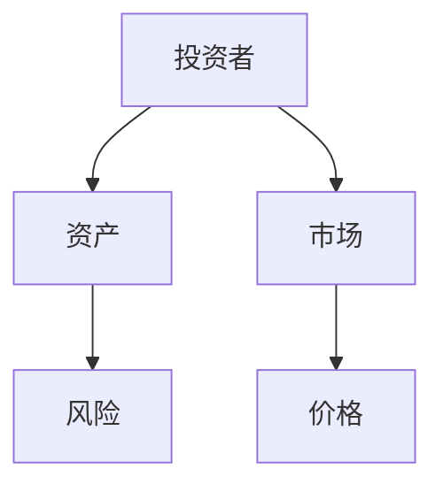
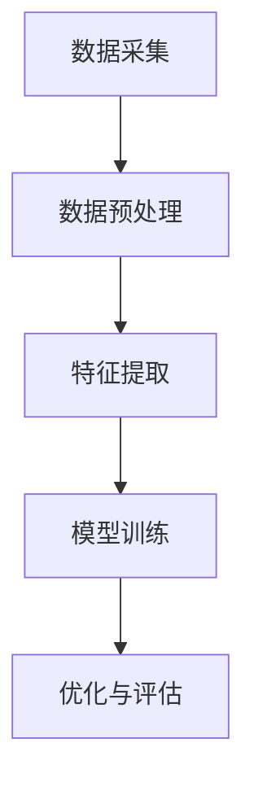
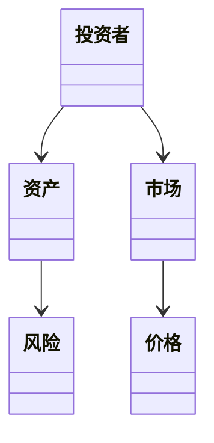
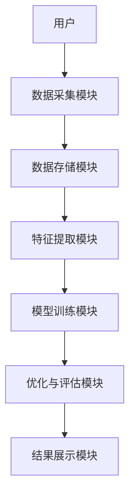
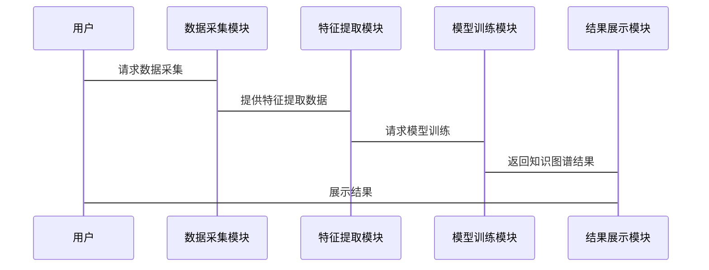

                 


# 打造全面的投资理财知识图谱：方法与工具

---

## 关键词：  
投资理财、知识图谱、资产配置、风险管理、数据挖掘、机器学习

---

## 摘要：  
投资理财是个人和机构实现财富增长的重要手段，而知识图谱作为人工智能领域的核心技术，为投资理财提供了新的可能性。本篇文章将从投资理财的核心概念出发，结合知识图谱的构建方法与工具，详细阐述如何通过技术手段构建全面的投资理财知识图谱，帮助投资者更好地理解和优化投资策略。文章内容涵盖投资理财的知识体系、知识图谱的算法原理、系统架构设计以及实际案例分析，旨在为读者提供一套完整的技术解决方案。

---

# 第1章: 投资理财知识图谱的背景与意义

## 1.1 投资理财的定义与现状  
### 1.1.1 投资理财的定义  
投资理财是指通过合理配置资产，利用金融工具实现财富保值与增值的活动。它涵盖了股票、债券、基金、房地产等多种投资方式。  

### 1.1.2 当前投资理财的发展现状  
随着经济全球化和金融市场的快速发展，投资理财已成为个人和机构财富管理的重要手段。然而，市场波动、信息不对称等问题也给投资者带来了挑战。  

### 1.1.3 投资理财的目标人群与需求分析  
目标人群包括个人投资者、机构投资者以及财富管理机构。投资者的需求主要集中在风险控制、收益最大化、资产配置优化等方面。  

## 1.2 投资理财知识图谱的构建意义  
### 1.2.1 知识图谱的定义与特点  
知识图谱是一种以图结构形式表示知识的工具，具有语义丰富、关联性强、可扩展性好的特点。  

### 1.2.2 投资理财知识图谱的核心价值  
投资理财知识图谱能够帮助投资者快速获取信息、优化决策、降低风险。它能够将分散的知识点连接起来，形成一个完整的知识网络。  

### 1.2.3 知识图谱在投资理财中的应用场景  
包括风险评估、资产配置优化、投资策略推荐、市场趋势预测等。  

## 1.3 本章小结  
本章介绍了投资理财的基本概念与发展现状，并重点阐述了知识图谱在投资理财中的重要性及其应用场景。

---

# 第2章: 投资理财核心概念与联系

## 2.1 投资理财的核心概念  
### 2.1.1 资产配置  
资产配置是根据投资者的风险承受能力、投资目标和市场环境，将资金分配到不同资产类别中的过程。  

### 2.1.2 风险管理  
风险管理是指通过识别、评估和控制投资中的风险，以实现收益与风险的最佳匹配。  

### 2.1.3 投资组合优化  
投资组合优化是指通过数学方法优化资产配置，以实现收益最大化或风险最小化的目标。  

## 2.2 投资理财核心概念的联系  
### 2.2.1 资产配置与投资组合的关系  
资产配置是投资组合优化的基础，而投资组合优化是资产配置的具体实现方式。  

### 2.2.2 风险管理与收益优化的平衡  
在投资理财中，风险管理是实现收益优化的前提条件，只有在控制风险的前提下，才能追求更高的收益。  

### 2.2.3 不同投资策略的对比分析  
通过对比主动投资与被动投资、短期投资与长期投资等策略，分析其优缺点及适用场景。  

## 2.3 投资理财核心概念的ER实体关系图  


## 2.4 本章小结  
本章通过对比分析投资理财的核心概念，揭示了它们之间的内在联系，并通过ER实体关系图直观展示了各概念之间的关联。

---

# 第3章: 投资理财知识图谱的算法原理

## 3.1 知识图谱构建的算法原理  
### 3.1.1 数据采集与预处理  
从多种数据源（如新闻、财报、市场数据等）采集投资理财相关数据，并进行清洗和格式化处理。  

### 3.1.2 特征提取与表示  
通过文本挖掘、自然语言处理等技术，提取数据中的关键词、实体关系等特征，并进行向量化表示。  

### 3.1.3 知识图谱构建与优化  
基于提取的特征，构建知识图谱，并通过图嵌入、规则推理等方法优化图谱的质量。  

## 3.2 投资理财知识图谱构建的流程图  


## 3.3 投资理财知识图谱构建的Python代码实现  
```python
import pandas as pd
from sklearn.feature_extraction.text import TfidfVectorizer

# 示例数据
data = pd.DataFrame({'text': ['投资', '理财', '资产配置', '风险管理']})

# 特征提取
vectorizer = TfidfVectorizer()
X = vectorizer.fit_transform(data['text'])
```

## 3.4 投资理财知识图谱构建的数学模型  
### 3.4.1 矩阵分解模型  
$$ X = W \cdot H $$  

### 3.4.2 非负矩阵分解模型  
$$ X = W \cdot H, W > 0, H > 0 $$  

## 3.5 本章小结  
本章详细介绍了投资理财知识图谱的构建算法，包括数据处理、特征提取、模型训练等步骤，并通过代码和数学公式展示了实现过程。

---

# 第4章: 投资理财知识图谱的系统分析与架构设计

## 4.1 项目背景介绍  
### 4.1.1 项目目标  
构建一个全面的投资理财知识图谱，支持投资策略优化、风险评估等功能。  

### 4.1.2 项目范围  
涵盖股票、基金、债券等多种投资方式，支持多语言、多市场的数据处理。  

## 4.2 系统功能设计  
### 4.2.1 领域模型设计  


### 4.2.2 系统架构设计  


## 4.3 系统接口设计  
### 4.3.1 接口定义  
- 数据采集接口：从不同数据源获取投资理财数据。  
- 特征提取接口：提取文本特征并生成向量表示。  
- 模型训练接口：训练知识图谱构建模型并输出结果。  

### 4.3.2 系统交互流程图  


## 4.4 本章小结  
本章通过系统架构设计和接口设计，展示了如何将投资理财知识图谱构建技术应用于实际项目中。

---

# 第5章: 投资理财知识图谱的项目实战

## 5.1 环境安装与配置  
### 5.1.1 安装Python与相关库  
- 安装Python：Python 3.8及以上版本。  
- 安装库：`pandas`, `networkx`, `gensim`, `py2neo`等。  

## 5.2 核心代码实现  
### 5.2.1 数据清洗与预处理  
```python
import pandas as pd
data = pd.read_csv('investment.csv')
data.dropna(inplace=True)
```

### 5.2.2 特征工程与模型训练  
```python
from gensim.models import Word2Vec
model = Word2Vec(data['text'], vector_size=100, window=5, min_count=1, workers=4)
```

### 5.2.3 知识图谱构建与可视化  
```python
import networkx as nx
G = nx.Graph()
G.add_nodes_from(['投资', '理财', '资产配置', '风险管理'])
G.add_edges_from([('投资', '理财'), ('资产配置', '风险管理')])
nx.draw(G, with_labels=True)
```

## 5.3 案例分析与解读  
### 5.3.1 案例背景  
以股票投资为例，构建投资理财知识图谱，帮助投资者分析市场趋势和风险。  

### 5.3.2 数据分析与可视化  
使用历史股价数据，结合知识图谱分析，生成投资建议。  

## 5.4 本章小结  
本章通过实际案例展示了投资理财知识图谱的构建过程，并通过可视化技术直观呈现了分析结果。

---

# 第6章: 投资理财知识图谱的最佳实践

## 6.1 小结  
总结全文内容，强调投资理财知识图谱的重要性和实际应用价值。  

## 6.2 注意事项  
### 6.2.1 数据质量控制  
确保数据的准确性和完整性。  

### 6.2.2 模型优化与调参  
通过交叉验证等方法优化模型性能。  

## 6.3 拓展阅读  
推荐相关书籍和论文，鼓励读者深入学习投资理财和知识图谱领域知识。  

---

# 结语  
投资理财知识图谱的构建为投资者提供了全新的工具和方法，帮助他们在复杂多变的市场中做出更明智的决策。通过技术手段与投资策略的结合，投资者可以更好地实现财富增长的目标。

--- 

注：本文目录和内容仅为示例，实际撰写时可根据具体需求进一步扩展和优化。

