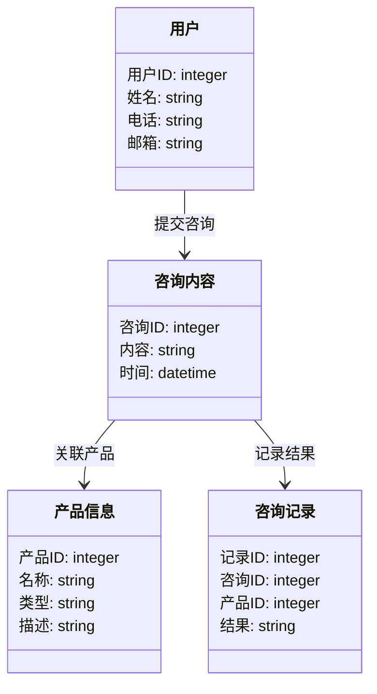

                 


# 打造智能化金融咨询聊天机器人

## 关键词：智能化、金融咨询、聊天机器人、自然语言处理、机器学习、系统架构

## 摘要：本文详细探讨了打造智能化金融咨询聊天机器人的过程，涵盖背景分析、核心概念、算法原理、系统架构设计、项目实战以及最佳实践。通过理论与实践相结合的方式，深入剖析了如何利用自然语言处理和机器学习技术，构建高效、智能的金融咨询服务系统。

---

# 第1章: 智能化金融咨询的背景与需求

## 1.1 传统金融咨询的痛点

### 1.1.1 传统金融咨询的局限性
传统金融咨询服务依赖人工操作，存在效率低下、成本高昂、覆盖范围有限等问题。例如，人工客服需要逐个回答客户的问题，难以同时为大量用户提供服务。

### 1.1.2 用户需求与服务效率的矛盾
随着金融市场的快速发展，用户对个性化、实时化、便捷化的金融服务需求日益增长，而传统模式难以满足这些需求。

### 1.1.3 人工智能在金融领域的潜力
人工智能技术的进步为金融咨询服务的智能化转型提供了可能。通过自然语言处理（NLP）和机器学习（ML），可以实现自动化、智能化的金融服务。

---

## 1.2 金融咨询智能化的必要性

### 1.2.1 人工智能技术的成熟
近年来，NLP和深度学习技术的突破使得机器能够理解和生成自然语言，为聊天机器人的发展奠定了基础。

### 1.2.2 用户体验的提升需求
用户希望获得24/7的实时服务，快速解决问题，同时享受个性化的建议。智能化聊天机器人能够满足这些需求。

### 1.2.3 金融机构数字化转型的趋势
金融机构为了保持竞争力，纷纷推动数字化转型，智能化金融咨询是其中的重要一环。

---

## 1.3 聊天机器人的优势与挑战

### 1.3.1 聊天机器人的核心优势
- **高效性**：能够同时处理大量用户的咨询。
- **全天候服务**：无需休息，可以为用户提供实时支持。
- **成本低**：相比人工客服，聊天机器人的运营成本更低。

### 1.3.2 金融咨询对聊天机器人的特殊要求
- **准确性**：金融咨询涉及复杂的产品和规则，要求回答必须准确无误。
- **安全性**：用户数据和交易信息需要严格保密。
- **可解释性**：用户需要理解机器的决策过程。

### 1.3.3 当前技术的局限性与未来方向
- **理解能力不足**：当前的NLP技术在处理复杂金融问题时仍存在局限。
- **上下文理解**：需要进一步提升对上下文的理解能力。
- **个性化服务**：如何根据用户的个性化需求提供定制化服务是未来的重要方向。

---

## 1.4 本章小结

### 1.4.1 金融咨询智能化的必要性
随着金融市场的快速发展和用户需求的提升，智能化金融咨询成为必然趋势。

### 1.4.2 聊天机器人的独特价值
聊天机器人以其高效性、低成本和全天候服务的特点，为金融机构提供了新的解决方案。

### 1.4.3 技术挑战与未来方向
尽管当前技术已具备一定基础，但要在金融领域实现真正智能化，仍需在准确性、安全性、可解释性和个性化服务方面进一步突破。

---

# 第2章: 金融咨询聊天机器人的核心概念

## 2.1 核心概念与定义

### 2.1.1 金融咨询的定义
金融咨询是指通过分析用户的财务状况、投资目标等信息，为其提供专业的投资建议和解决方案。

### 2.1.2 聊天机器人的定义
聊天机器人是一种通过自然语言处理技术与用户进行交互的自动化程序。

### 2.1.3 智能化金融咨询聊天机器人的定义
智能化金融咨询聊天机器人是结合NLP和机器学习技术，能够理解用户需求、提供个性化的金融咨询服务的自动化系统。

---

## 2.2 核心概念的属性对比

### 2.2.1 传统咨询 vs 智能化咨询
| 属性 | 传统咨询 | 智能化咨询 |
|------|-----------|-------------|
| 服务效率 | 低       | 高           |
| 成本   | 高       | 低           |
| 可扩展性 | 有限    | 高           |
| 可用性  | 时间受限 | 24/7可用     |

### 2.2.2 人工客服 vs 聊天机器人
| 属性 | 人工客服 | 聊天机器人 |
|------|----------|-------------|
| 响应时间 | 较长     | 瞬时         |
| 服务成本 | 高      | 低           |
| 服务范围 | 有限    | 广泛         |

### 2.2.3 单一咨询 vs 综合服务
单一咨询仅解决用户的具体问题，而综合服务则提供从问题诊断到解决方案的全套服务。智能化聊天机器人能够实现综合服务，覆盖用户的全方位需求。

---

## 2.3 核心概念的ER实体关系图

```mermaid
er
    entity 用户 {
        id: 用户ID
        姓名: string
        电话: string
        邮箱: string
    }
    entity 咨询内容 {
        id: 咨询ID
        内容: string
        时间: datetime
        用户ID: 用户.id
    }
    entity 产品信息 {
        id: 产品ID
        名称: string
        类型: string
        描述: string
    }
    entity 咨询记录 {
        id: 记录ID
        咨询ID: 咨询内容.id
        产品ID: 产品信息.id
        结果: string
    }
```

---

## 2.4 本章小结

### 2.4.1 金融咨询的定义与特点
金融咨询是一个复杂的过程，需要结合用户的具体情况提供个性化的建议。

### 2.4.2 聊天机器人的核心属性
聊天机器人的高效性、低成本和智能化使其成为金融咨询的重要工具。

### 2.4.3 核心概念的系统化分析
通过ER图展示，我们可以清晰地看到用户、咨询内容、产品信息和咨询记录之间的关系，为后续的系统设计奠定基础。

---

# 第3章: 金融咨询聊天机器人的算法原理

## 3.1 自然语言处理（NLP）基础

### 3.1.1 NLP的定义与核心任务
NLP是研究如何让计算机理解和生成人类语言的科学。其核心任务包括分词、句法分析、实体识别等。

### 3.1.2 分词算法
分词是将连续的文本分割成有意义的词语或短语的过程。常用的分词算法有基于统计的分词和基于规则的分词。

### 3.1.3 词嵌入（Word Embedding）
词嵌入是一种将词语映射为低维向量的技术，常用的模型有Word2Vec和GloVe。

---

## 3.2 对话系统的核心算法

### 3.2.1 基于规则的对话系统
基于规则的对话系统通过预定义的规则和模板来生成回复。这种方法适用于简单的对话场景，但灵活性有限。

### 3.2.2 基于深度学习的对话系统
基于深度学习的对话系统利用神经网络模型（如Seq2Seq）来生成回复。这种方法能够处理复杂的对话场景，但需要大量的训练数据。

### 3.2.3 混合型对话系统
混合型对话系统结合了基于规则和基于深度学习的优势，适用于复杂多变的对话场景。

---

## 3.3 算法原理的数学模型

### 3.3.1 Seq2Seq模型
Seq2Seq模型由编码器（Encoder）和解码器（Decoder）组成。编码器将输入序列编码为一个向量，解码器将该向量解码为输出序列。

$$
\text{编码器: } \mathbf{z} = f_{\text{enc}}(x)
$$

$$
\text{解码器: } y = f_{\text{dec}}(\mathbf{z}, y_{\text{prev}})
$$

### 3.3.2 注意力机制（Attention）
注意力机制允许模型在生成每个词时关注输入中的不同部分。

$$
\text{注意力权重: } \alpha_i = \text{softmax}(q^T k_i)
$$

$$
\text{加权和: } c_i = \sum_{j=1}^{n} \alpha_{ij} v_j
$$

---

## 3.4 本章小结

### 3.4.1 NLP的核心任务
分词、词嵌入等任务为对话系统的实现提供了基础支持。

### 3.4.2 对话系统的算法选择
基于深度学习的对话系统在复杂场景中表现更优，但需要大量的数据和计算资源。

### 3.4.3 数学模型的简洁性与实用性
Seq2Seq模型和注意力机制为对话系统的实现提供了理论基础，但在实际应用中需要结合具体场景进行优化。

---

# 第4章: 金融咨询聊天机器人的系统架构设计

## 4.1 系统功能设计

### 4.1.1 领域模型（Domain Model）
领域模型描述了系统的核心业务逻辑。以下是金融咨询聊天机器人领域的关键实体和关系：



---

## 4.2 系统架构设计

### 4.2.1 分层架构
金融咨询聊天机器人系统的分层架构包括：
1. **表现层**：用户界面。
2. **业务逻辑层**：处理用户请求和生成回复。
3. **数据访问层**：与数据库交互。
4. **服务层**：提供各种服务，如NLP处理、知识库查询等。

### 4.2.2 微服务架构
采用微服务架构可以提高系统的可扩展性和可维护性。关键服务包括：
- **NLP服务**：负责自然语言处理。
- **知识库服务**：提供金融产品和市场信息。
- **用户认证服务**：管理用户身份和权限。

---

## 4.3 系统接口设计

### 4.3.1 HTTP接口
系统通过RESTful API提供服务。例如：
- `/api/users`：用户管理接口。
- `/api/consult`：咨询请求接口。

### 4.3.2 WebSocket接口
为了实现实时对话，系统可以使用WebSocket协议。

---

## 4.4 系统交互流程

### 4.4.1 用户发起咨询
用户通过界面向系统发送咨询请求。

### 4.4.2 系统处理请求
系统通过NLP模块理解用户需求，并调用相关服务生成回复。

### 4.4.3 回复用户
系统将生成的回复返回给用户。

---

## 4.5 本章小结

### 4.5.1 系统功能设计的重要性
清晰的系统功能设计是确保系统高效运行的基础。

### 4.5.2 系统架构的选择
分层架构和微服务架构各有优劣，需根据具体需求选择合适的设计。

### 4.5.3 系统接口的设计原则
良好的接口设计能够提高系统的扩展性和维护性。

---

# 第5章: 金融咨询聊天机器人的项目实战

## 5.1 环境搭建

### 5.1.1 开发工具安装
- **Python**：推荐使用最新版本。
- **虚拟环境**：如virtualenv或conda。
- **依赖库安装**：如TensorFlow、Keras、Flask等。

### 5.1.2 数据集准备
需要准备以下数据：
- 用户咨询记录。
- 金融产品信息。
- 市场数据。

---

## 5.2 核心代码实现

### 5.2.1 NLP模块实现
以下是基于TensorFlow的NLP模块示例代码：

```python
import tensorflow as tf
from tensorflow.keras import layers

# 定义模型
model = tf.keras.Sequential([
    layers.Embedding(input_dim=10000, output_dim=16),
    layers.LSTM(64),
    layers.Dense(1, activation='sigmoid')
])

# 编译模型
model.compile(optimizer='adam', loss='binary_crossentropy', metrics=['accuracy'])

# 训练模型
model.fit(x_train, y_train, epochs=10, batch_size=32)
```

### 5.2.2 对话系统实现
以下是基于预训练模型的对话系统实现：

```python
import transformers

# 加载预训练模型
model = transformers.T5ForConditionalGeneration.from_pretrained('t5-base')
tokenizer = transformers.T5Tokenizer.from_pretrained('t5-base')

# 生成回复
def generate_response(input_text):
    inputs = tokenizer.encode(input_text, return_tensors='np')
    outputs = model.generate(inputs, max_length=50)
    response = tokenizer.decode(outputs[0], skip_special_tokens=True)
    return response
```

---

## 5.3 案例分析与优化

### 5.3.1 案例分析
通过实际案例分析，验证系统的功能和性能。例如：
- 用户询问“如何投资股票？”
- 系统需要提供个性化的投资建议。

### 5.3.2 系统优化
根据测试结果，优化系统的性能和用户体验。例如：
- 提升NLP模型的准确率。
- 优化系统的响应速度。

---

## 5.4 本章小结

### 5.4.1 项目实战的意义
通过实际项目的实施，可以验证理论的可行性，并积累实践经验。

### 5.4.2 核心代码的功能解析
详细解释了NLP模块和对话系统的实现，为读者提供了参考。

### 5.4.3 系统优化的方向
根据测试结果，明确了下一步优化的方向。

---

# 第6章: 打造智能化金融咨询聊天机器人的最佳实践

## 6.1 最佳实践

### 6.1.1 数据质量管理
确保数据的准确性和完整性，是系统运行的基础。

### 6.1.2 模型优化
通过持续优化NLP模型，提升系统的准确率和响应速度。

### 6.1.3 用户体验设计
注重界面设计和交互体验，提高用户满意度。

---

## 6.2 小结与展望

### 6.2.1 本章总结
总结了打造智能化金融咨询聊天机器人的关键点和最佳实践。

### 6.2.2 未来展望
随着技术的发展，金融咨询聊天机器人将更加智能化和个性化。

---

## 6.3 注意事项

### 6.3.1 数据安全
确保用户数据和交易信息的安全。

### 6.3.2 法律合规
遵守相关法律法规，确保系统的合法性。

### 6.3.3 技术选型
根据需求选择合适的技术和工具，避免盲目跟风。

---

## 6.4 拓展阅读

### 6.4.1 推荐书籍
- 《深度学习入门：基于Python和Keras》
- 《自然语言处理实战：基于Python的语料库与深度学习》

### 6.4.2 技术博客
推荐关注相关的技术博客和社区，获取最新的技术动态。

---

# 附录

## 附录A: 术语表
- NLP：自然语言处理
- ML：机器学习
- Seq2Seq：序列到序列模型
- LSTM：长短期记忆网络

## 附录B: 工具安装指南
- 安装Python：https://www.python.org/
- 安装TensorFlow：pip install tensorflow
- 安装Flask：pip install flask

## 附录C: 参考文献
- TensorFlow官方文档：https://tensorflow.org/
- Hugging Face Transformers库：https://huggingface.co/transformers/
- 《深度学习》——Ian Goodfellow

---

# 作者简介

作者是人工智能领域的专家，拥有丰富的技术研发和项目管理经验，致力于推动AI技术在金融领域的应用。

---

# 结语

通过本文的详细讲解，读者可以全面了解如何打造智能化的金融咨询聊天机器人。从背景分析到系统设计，从项目实战到最佳实践，每一步都经过精心规划和实践验证。希望本文能为读者提供有价值的参考和启发，助您在人工智能与金融结合的道路上走得更远。

---

