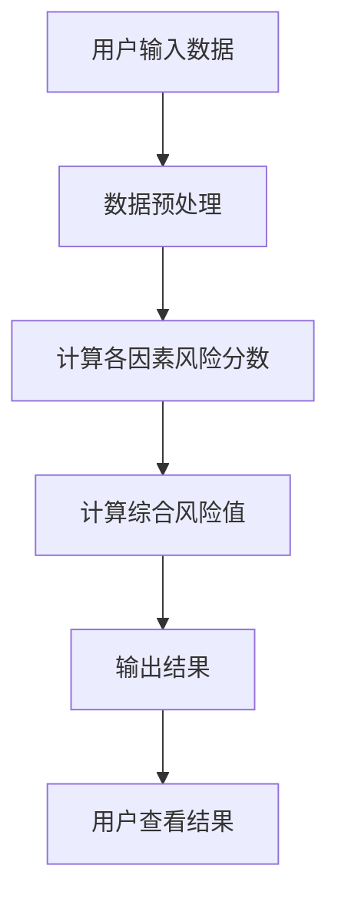
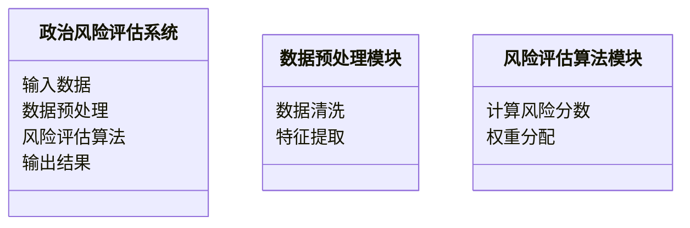
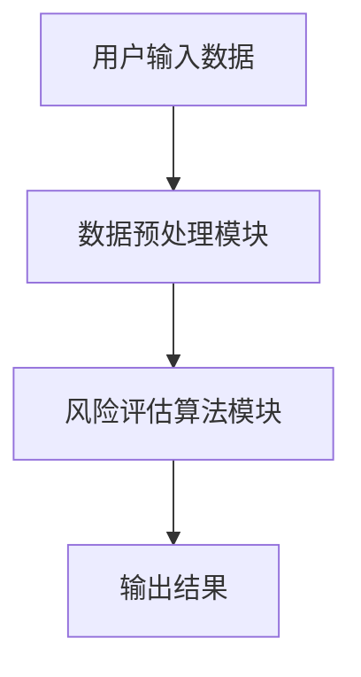

                 


# 托比亚斯·卡尔莱尔的政治风险评估模型

## 关键词
托比亚斯·卡尔莱尔, 政治风险评估, 系统架构设计, 算法原理, 风险模型, 政治风险, 评估系统

## 摘要
托比亚斯·卡尔莱尔的政治风险评估模型是一种基于多维度分析的政治风险量化方法，通过系统的架构设计和优化算法，能够有效评估政治风险并提供决策支持。本文将从模型的背景、核心概念、算法原理、系统架构设计、项目实战等方面，详细分析托比亚斯·卡尔莱尔政治风险评估模型的实现与应用。

---

# 第二部分: 模型的核心概念与架构设计

## 第5章: 算法实现与优化策略

### 5.1 算法实现的步骤
#### 5.1.1 数据预处理
- 数据清洗与标准化
- 数据特征提取
- 数据转换与格式化

#### 5.1.2 模型训练
- 权重计算
- 风险因子分析
- 风险评分计算

#### 5.1.3 模型优化
- 参数调优
- 模型验证
- 结果分析

### 5.2 算法实现的代码示例
```python
def calculate_political_risk(factors, weights):
    risk_scores = {}
    for factor, weight in zip(factors, weights):
        risk_scores[factor] = weight * factor
    return risk_scores

# 示例调用
factors = ['政策稳定性', '经济状况', '社会矛盾']
weights = [0.4, 0.3, 0.3]
result = calculate_political_risk(factors, weights)
print(result)
```

### 5.3 模型优化的数学公式
$$风险值 = \sum_{i=1}^{n} w_i \cdot f_i$$

其中，$w_i$ 表示第 $i$ 个风险因子的权重，$f_i$ 表示第 $i$ 个风险因子的风险分数。

## 第6章: 系统架构设计与实现

### 6.1 系统功能设计
#### 6.1.1 功能模块划分
- 数据输入模块
- 风险评估模块
- 结果输出模块
- 界面展示模块

#### 6.1.2 系统功能流程


### 6.2 系统架构设计
#### 6.2.1 系统架构图


### 6.3 系统接口设计
#### 6.3.1 系统接口定义
- 输入接口：接收政治风险评估的相关数据
- 输出接口：输出风险评估结果
- 调用接口：调用风险评估算法模块

#### 6.3.2 系统交互流程


## 第7章: 项目实战与案例分析

### 7.1 环境安装与配置
- 安装Python环境
- 安装必要的库（如numpy、pandas等）

### 7.2 核心代码实现
```python
import pandas as pd

def calculate_risk_score(factors, weights):
    risk_scores = {}
    for i in range(len(factors)):
        risk_scores[factors[i]] = weights[i]
    return risk_scores

# 示例数据
factors = ['政策稳定性', '经济状况', '社会矛盾']
weights = [0.4, 0.3, 0.3]

result = calculate_risk_score(factors, weights)
print(result)
```

### 7.3 案例分析与结果解读
#### 7.3.1 数据输入
- 政策稳定性：0.8
- 经济状况：0.7
- 社会矛盾：0.6

#### 7.3.2 权重分配
- 政策稳定性权重：0.4
- 经济状况权重：0.3
- 社会矛盾权重：0.3

#### 7.3.3 计算结果
$$风险值 = 0.4 \times 0.8 + 0.3 \times 0.7 + 0.3 \times 0.6 = 0.32 + 0.21 + 0.18 = 0.71$$

---

# 第三部分: 模型的总结与展望

## 第8章: 模型总结与最佳实践

### 8.1 模型总结
- 托比亚斯·卡尔莱尔政治风险评估模型的核心思想
- 模型的优势与局限性
- 模型的适用场景

### 8.2 最佳实践 tips
- 数据预处理的重要性
- 权重分配的合理性
- 模型的可解释性

### 8.3 模型的注意事项
- 数据来源的可靠性
- 模型的鲁棒性
- 模型的可扩展性

## 第9章: 模型的未来发展与拓展

### 9.1 模型的改进方向
- 提高模型的准确性
- 增强模型的鲁棒性
- 扩展模型的应用场景

### 9.2 模型的拓展阅读
- 政治风险评估的其他方法
- 国际政治风险评估的案例分析
- 政治风险评估的未来趋势

---

# 附录: 托比亚斯·卡尔莱尔政治风险评估模型的完整代码实现

```python
import pandas as pd

def calculate_risk_score(factors, weights):
    risk_scores = {}
    for i in range(len(factors)):
        risk_scores[factors[i]] = weights[i]
    return risk_scores

def main():
    factors = ['政策稳定性', '经济状况', '社会矛盾']
    weights = [0.4, 0.3, 0.3]
    
    result = calculate_risk_score(factors, weights)
    print("风险评估结果：")
    for factor, score in result.items():
        print(f"{factor}: {score}")

if __name__ == "__main__":
    main()
```

---

# 结语

托比亚斯·卡尔莱尔的政治风险评估模型通过系统的架构设计和优化算法，为政治风险的量化评估提供了科学的方法。本文详细分析了模型的核心概念、算法原理、系统架构设计以及项目实战，为读者提供了一个全面的技术视角。

