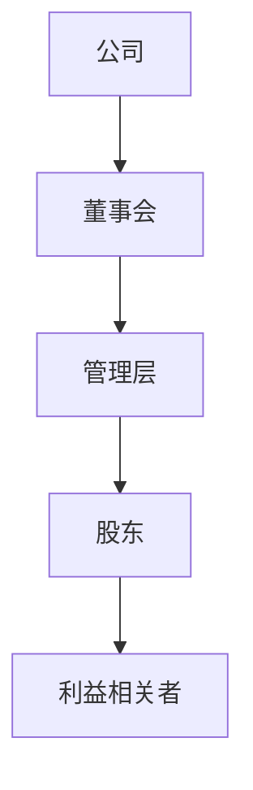
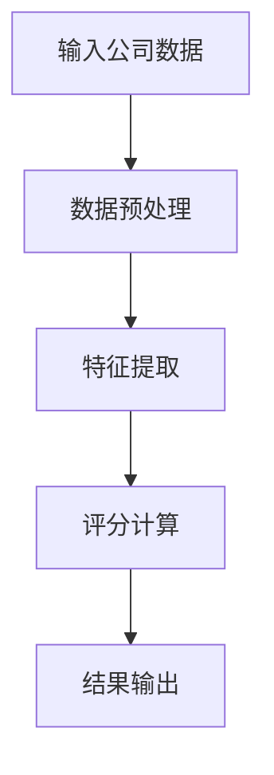
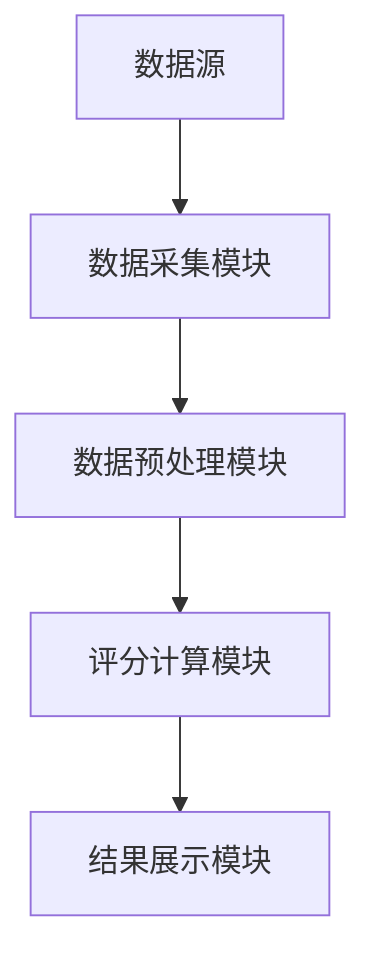

                 


# 托马斯·罗恩的公司治理评分系统

## 关键词
公司治理, 评分系统, 算法设计, 系统架构, 项目实战

## 摘要
托马斯·罗恩的公司治理评分系统是一种基于多维度分析的公司治理评价方法，旨在通过量化指标评估企业的治理效率和健康度。本文从系统原理、算法实现、架构设计、项目实战等多个维度详细解析该评分系统的核心思想和技术实现，探讨其在现代企业治理中的应用价值和实践意义。

---

# 第一部分: 托马斯·罗恩的公司治理评分系统概述

## 第1章: 公司治理的基本概念与背景

### 1.1 公司治理的定义与核心要素
#### 1.1.1 公司治理的定义
公司治理是指通过合理的组织结构、权力分配和制度规范，确保企业目标的实现和利益相关者权益的保护。其核心在于平衡股东、董事会、管理层和利益相关者之间的关系。

#### 1.1.2 公司治理的核心要素
- **组织结构**：包括董事会、管理层和股东大会的职责划分。
- **权力分配**：确保各角色之间的权责清晰。
- **制度规范**：包括公司章程、内部审计、风险管理等制度。
- **透明度与披露**：确保信息的公开性和透明性。

#### 1.1.3 公司治理的边界与外延
公司治理不仅关注内部管理，还涉及外部利益相关者（如股东、债权人、客户和监管机构）的权利保护。其外延包括企业社会责任（CSR）、风险管理、合规性等方面。

### 1.2 托马斯·罗恩评分系统的背景与目标
#### 1.2.1 当前公司治理的主要挑战
- 传统公司治理评价体系过于主观，缺乏量化指标。
- 企业面临的内外部风险日益复杂，需要更精细的评价方法。
- 利益相关者的需求多样化，传统的单一维度评价难以满足需求。

#### 1.2.2 托马斯·罗恩评分系统的提出动机
托马斯·罗恩提出评分系统的初衷是通过量化方法，将公司治理的多个维度（如透明度、董事会效率、风险管理能力等）转化为可量化的指标，从而为企业提供更客观的治理评价。

#### 1.2.3 系统的目标与应用场景
- **目标**：提供一种全面、客观的公司治理评价方法，帮助企业识别治理中的问题并优化管理。
- **应用场景**：适用于企业自我评估、投资者决策支持、监管机构的合规性检查等。

---

## 第2章: 托马斯·罗恩公司治理评分系统的原理与核心概念

### 2.1 系统的评价维度
托马斯·罗恩评分系统将公司治理分为以下几个核心维度：
1. **董事会结构与效率**：包括董事会规模、独立董事比例、董事会会议频率等。
2. **管理层能力与决策**：包括高管团队的经验、决策透明度等。
3. **利益相关者保护**：包括股东权益保护、债权人权益保护等。
4. **风险管理与合规性**：包括企业风险管理能力、合规性检查等。
5. **透明度与信息披露**：包括定期财务报告的及时性、信息的完整性和准确性。

### 2.2 托马斯·罗恩评分系统的评价模型
托马斯·罗恩评分系统采用加权评分法，将各个维度的指标赋予不同的权重，最终计算出综合评分。其模型可以表示为：
$$ \text{总评分} = \sum_{i=1}^{n} w_i \cdot s_i $$
其中，$w_i$ 是第 $i$ 个维度的权重，$s_i$ 是第 $i$ 个维度的评分。

### 2.3 核心概念与联系
#### 2.3.1 实体关系图（ER图）
托马斯·罗恩评分系统涉及的主要实体包括：


#### 2.3.2 核心概念属性特征对比
| 概念       | 属性       | 特征                               |
|------------|------------|------------------------------------|
| 董事会     | 结构       | 分层、分权、独立性                 |
| 管理层     | 职责       | 执行、协调、决策                   |
| 股东       | 权益       | 所有权、收益权、监督权             |
| 利益相关者 | 关系       | 多样化、动态性                     |

---

## 第3章: 托马斯·罗恩评分系统的算法原理

### 3.1 算法流程图
托马斯·罗恩评分系统的算法流程如下：


### 3.2 算法实现代码
以下是一个简化的Python实现示例：
```python
def governance_score(company_data):
    # 数据预处理
    processed_data = preprocess(company_data)
    # 特征提取
    features = extract_features(processed_data)
    # 评分计算
    score = calculate_score(features)
    return score
```

### 3.3 数学模型与公式
#### 3.3.1 基础评分公式
$$ \text{总评分} = \sum_{i=1}^{n} w_i \cdot s_i $$
其中，$w_i$ 是第 $i$ 个维度的权重，$s_i$ 是第 $i$ 个维度的评分。

#### 3.3.2 权重分配示例
$$ w_i = \frac{\text{维度的重要性}}{\sum_{j=1}^{m} \text{维度重要性}_j} $$
例如，董事会结构和风险管理的权重分别为 $0.4$ 和 $0.3$，其余维度的权重按比例分配。

---

## 第4章: 系统分析与架构设计

### 4.1 系统功能设计
托马斯·罗恩评分系统的功能模块包括：
- 数据采集模块：收集企业的组织结构、财务数据、管理流程等信息。
- 评分计算模块：根据输入数据计算各维度的评分。
- 结果展示模块：以图表形式展示评分结果。

### 4.2 系统架构设计
系统的架构设计如下：


### 4.3 接口设计与交互流程
系统的主要接口包括：
- 数据输入接口：用于接收企业的组织结构和财务数据。
- 评分查询接口：允许用户查询企业的综合评分。
- 报告生成接口：生成详细的评分分析报告。

---

## 第5章: 项目实战

### 5.1 环境安装与配置
- **Python版本**：建议使用 Python 3.8 或更高版本。
- **依赖库安装**：
  ```bash
  pip install pandas numpy matplotlib
  ```

### 5.2 核心代码实现
```python
import pandas as pd
import numpy as np

def preprocess(data):
    # 数据清洗与标准化
    processed_data = data.dropna().astype(float)
    return processed_data

def extract_features(data):
    # 特征提取
    features = data[['board_size', 'independent_directors', 'risk_management']]
    return features

def calculate_score(features):
    # 加权评分计算
    weights = [0.4, 0.3, 0.2]
    score = np.dot(features, weights)
    return score

# 示例数据
data = pd.DataFrame({
    'board_size': [9, 8, 10],
    'independent_directors': [0.6, 0.5, 0.7],
    'risk_management': [0.8, 0.6, 0.9]
})

processed_data = preprocess(data)
features = extract_features(processed_data)
scores = calculate_score(features)
print(scores)
```

### 5.3 代码解读与分析
- **preprocess函数**：对输入数据进行清洗和标准化处理。
- **extract_features函数**：提取关键特征，如董事会规模、独立董事比例和风险管理能力。
- **calculate_score函数**：根据特征和权重计算综合评分。

### 5.4 实际案例分析
以某公司为例，假设其数据如下：
```python
data = pd.DataFrame({
    'board_size': [9],
    'independent_directors': [0.6],
    'risk_management': [0.8]
})
```
计算结果为：
$$ \text{总评分} = 9 \times 0.4 + 0.6 \times 0.3 + 0.8 \times 0.2 = 3.6 + 0.18 + 0.16 = 3.94 $$

---

## 第6章: 最佳实践与小结

### 6.1 最佳实践
- 在实际应用中，建议结合企业的具体需求调整评分模型的权重。
- 数据的准确性和完整性对评分结果影响重大，需确保数据来源可靠。
- 定期更新模型，以适应企业治理环境的变化。

### 6.2 小结
托马斯·罗恩的公司治理评分系统通过量化方法，为企业提供了一种科学的治理评价工具。其核心在于将复杂的治理问题转化为可量化的指标，帮助企业优化管理、提升透明度。

### 6.3 注意事项
- 评分系统的结果仅供参考，需结合企业的实际情况进行分析。
- 在使用过程中，需注意数据隐私和合规性问题。

### 6.4 拓展阅读
建议读者进一步阅读托马斯·罗恩的相关著作，深入了解评分系统的理论基础和应用场景。

---

通过以上内容，托马斯·罗恩的公司治理评分系统从理论到实践的完整框架已清晰呈现，为企业的治理优化提供了有力的技术支持。

