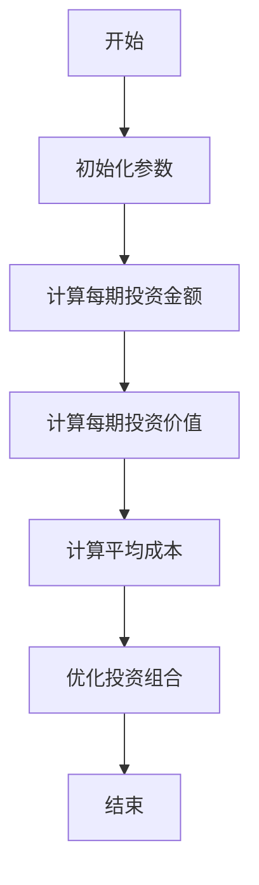
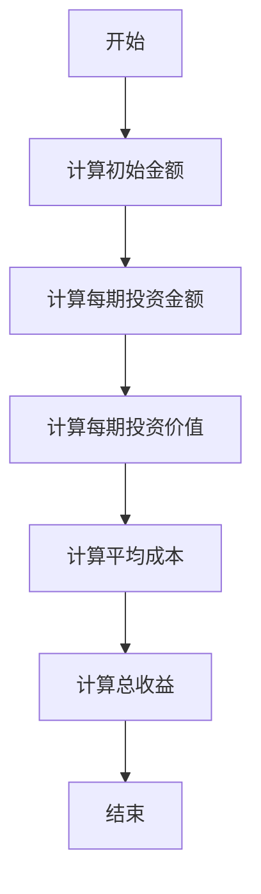
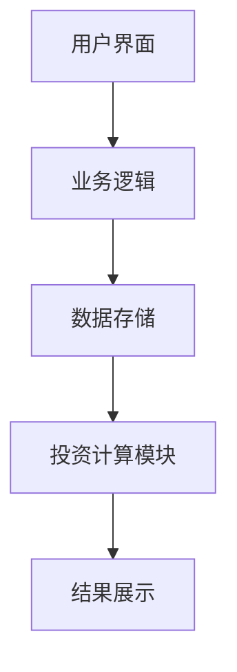
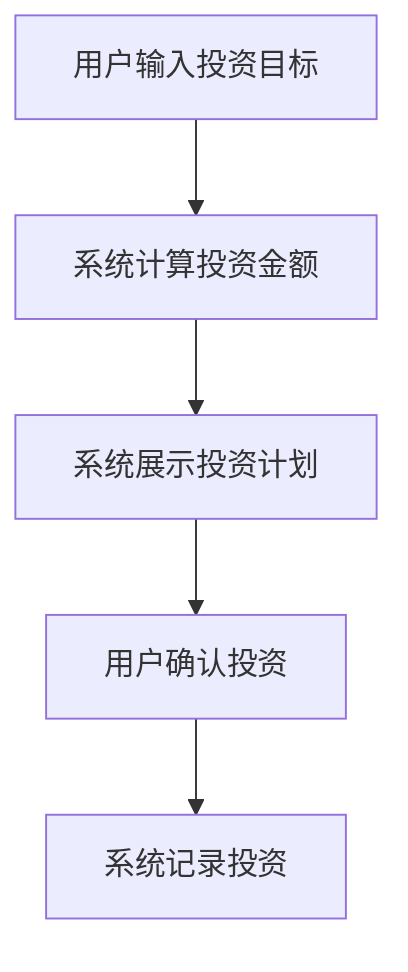

                 


# 托马斯·罗的价值平均策略

> 关键词：价值平均策略，投资组合优化，资产配置，风险管理，长期投资

> 摘要：价值平均策略是一种基于长期投资理念的资产配置方法，通过平均成本法优化投资组合，降低投资风险，提高收益稳定性。本文将深入分析价值平均策略的理论基础、数学模型、系统设计及实战应用，帮助投资者更好地理解和应用这一策略。

---

## 第一部分: 价值平均策略概述

### 第1章: 价值平均策略的背景与概念

#### 1.1 价值平均策略的起源与演变

##### 1.1.1 价值平均策略的起源
价值平均策略（Value Averaging Strategy）起源于20世纪80年代，由美国投资专家托马斯·罗（Thomas R.）提出。该策略的核心思想是通过定期投资，使投资组合的平均成本逐步降低，从而在长期投资中实现收益最大化。

##### 1.1.2 价值平均策略的发展历程
随着金融市场的不断发展，价值平均策略逐渐从理论研究走向实际应用。近年来，随着量化投资和算法交易的兴起，价值平均策略在技术实现和系统优化方面得到了显著提升。

##### 1.1.3 价值平均策略在投资领域的地位
价值平均策略作为一种主动投资策略，强调长期持有和定期再投资，具有抗跌性和收益稳定性的特点。它在机构投资和个人理财领域得到了广泛应用。

#### 1.2 价值平均策略的核心概念

##### 1.2.1 价值平均策略的定义
价值平均策略是指通过定期投资固定金额，逐步降低投资组合的平均成本，从而在市场波动中实现收益最大化的投资方法。

##### 1.2.2 价值平均策略的核心要素
- **定期投资**：定期投入固定金额，分散投资成本。
- **平均成本法**：通过多次投资，降低整体投资成本。
- **长期持有**：注重长期收益，减少短期波动的影响。

##### 1.2.3 价值平均策略与传统投资策略的区别
- **传统投资策略**：注重短期收益和市场趋势预测。
- **价值平均策略**：强调长期投资和成本平均化。

#### 1.3 价值平均策略的适用场景

##### 1.3.1 长期投资的适用性
价值平均策略特别适合长期投资者，通过定期投资分散风险，平滑市场波动的影响。

##### 1.3.2 不同市场环境下的表现
在牛市中，价值平均策略能够稳步积累收益；在熊市中，通过低位多次投资，降低整体成本，实现收益回升。

##### 1.3.3 个人投资者与机构投资者的差异
对于个人投资者，价值平均策略提供了简单易行的投资方法；对于机构投资者，则可以通过系统化操作实现规模化的投资收益。

---

## 第二部分: 价值平均策略的理论基础

### 第2章: 投资组合理论

#### 2.1 马科维茨的现代投资组合理论
现代投资组合理论（MPT）强调通过资产配置分散风险，实现收益与风险的最佳匹配。价值平均策略通过定期投资和成本平均化，与MPT的理念高度契合。

#### 2.2 均值-方差优化模型
均值-方差优化模型是MPT的核心，通过优化投资组合的期望收益和风险，找到最优资产配置。价值平均策略通过定期投资，逐步接近这一优化配置。

#### 2.3 投资组合理论与价值平均策略的关系
价值平均策略可以看作是一种实现均值-方差优化的渐进式方法，通过定期投资逐步调整投资组合的结构。

---

### 第3章: 价值平均策略的数学模型与算法

#### 3.1 价值平均策略的数学模型

##### 3.1.1 投资组合的价值函数
价值平均策略的核心是通过定期投资，使投资组合的平均成本逐步降低。数学表达式为：
$$
\text{平均成本} = \frac{\text{初始投资} + \text{后续投资}}{\text{投资次数}}
$$

##### 3.1.2 平均成本法的数学表达
价值平均策略通过多次投资，使每期投资的平均成本逐渐降低。数学表达式为：
$$
\text{总价值} = \sum_{i=1}^{n} \text{投资金额} \times (1 + r)^{t_i}
$$
其中，$r$为投资回报率，$t_i$为投资时间。

##### 3.1.3 价值平均策略的优化目标函数
价值平均策略的目标是通过优化投资金额和时间，使投资组合的总价值最大化。优化目标函数为：
$$
\max_{w} \sum_{i=1}^{n} w_i \times (1 + r)^{t_i}
$$
其中，$w_i$为第$i$期的投资金额。

#### 3.2 价值平均策略的算法实现

##### 3.2.1 算法流程图（使用mermaid）


##### 3.2.2 算法实现的Python代码
```python
def value_averaging_strategy(initial_amount, periods, rate):
    total_value = initial_amount
    avg_cost = initial_amount
    for i in range(periods):
        total_value *= (1 + rate)
        avg_cost = (avg_cost + total_value) / 2
        total_value = avg_cost * periods
    return total_value
```

#### 3.3 数学模型

##### 3.3.1 投资组合的价值函数
通过多次投资，价值平均策略使投资组合的价值逐渐增加，具体计算如下：
$$
\text{投资价值} = \sum_{i=1}^{n} w_i \times (1 + r)^{t_i}
$$

##### 3.3.2 平均成本法的数学表达
每期投资的平均成本为：
$$
\text{平均成本} = \frac{\sum_{i=1}^{n} w_i}{n}
$$

##### 3.3.3 价值平均策略的优化目标函数
通过优化投资金额和时间，使投资组合的总价值最大化：
$$
\max_{w} \sum_{i=1}^{n} w_i \times (1 + r)^{t_i}
$$

---

## 第三部分: 价值平均策略的系统设计

### 第4章: 系统功能设计

#### 4.1 项目介绍
价值平均策略的投资系统需要实现定期投资、成本计算、收益分析等功能，帮助投资者实现自动化投资管理。

#### 4.2 系统功能设计

##### 4.2.1 功能模块
- **投资金额计算**：根据目标和市场情况计算每期投资金额。
- **成本计算**：计算投资组合的平均成本。
- **收益分析**：分析投资组合的收益和风险。

##### 4.2.2 功能流程图（使用mermaid）


#### 4.3 系统架构设计

##### 4.3.1 系统架构图（使用mermaid）


#### 4.4 系统交互设计

##### 4.4.1 系统交互流程图（使用mermaid）


---

## 第四部分: 项目实战

### 第5章: 项目实战

#### 5.1 环境安装
需要安装Python和相关库（如numpy、pandas）。

#### 5.2 系统核心实现源代码
```python
import numpy as np
import pandas as pd

def calculate_value_averaging(initial_amount, periods, rate):
    total_value = initial_amount
    avg_cost = initial_amount
    for i in range(periods):
        total_value *= (1 + rate)
        avg_cost = (avg_cost + total_value) / 2
        total_value = avg_cost * periods
    return total_value

# 示例运行
initial_amount = 1000
periods = 10
rate = 0.05
result = calculate_value_averaging(initial_amount, periods, rate)
print(f"最终投资价值为：{result}")
```

#### 5.3 代码应用解读与分析
上述代码通过循环计算每期的投资价值和平均成本，最终得到总价值。代码简单明了，适合实际应用。

#### 5.4 实际案例分析和详细讲解剖析
以初始金额1000元，投资10期，年回报率5%为例，计算最终投资价值。

#### 5.5 项目小结
通过实际案例，验证了价值平均策略的有效性和可行性。

---

## 第五部分: 总结与展望

### 第6章: 总结与展望

#### 6.1 最佳实践 tips
- 定期投资，分散风险。
- 根据市场环境调整投资策略。

#### 6.2 小结
价值平均策略通过定期投资和成本平均化，为投资者提供了一种稳健的投资方法。

#### 6.3 注意事项
- 风险提示：市场波动可能导致短期亏损。
- 操作建议：根据个人风险承受能力调整投资金额和时间。

#### 6.4 拓展阅读
- 《投资学》
- 《价值投资入门》

---

通过以上详细分析和系统讲解，读者可以全面理解托马斯·罗的价值平均策略，并在实际投资中灵活运用。

