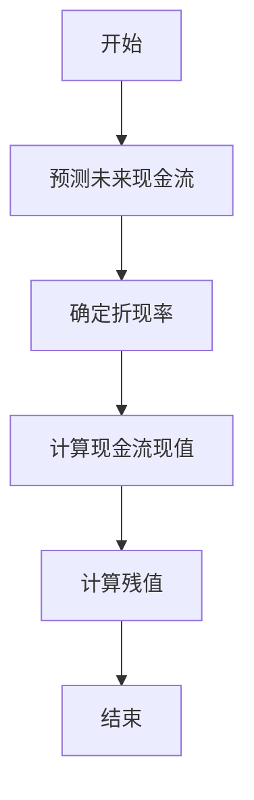
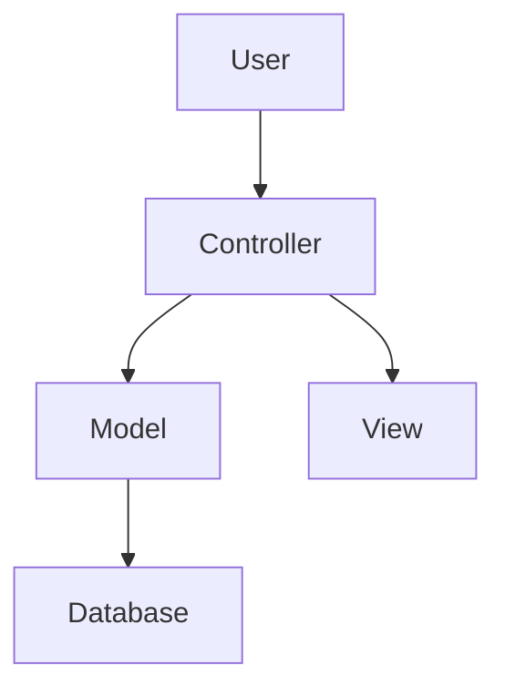

                 


# 《托马斯罗的公司估值技巧》

> **关键词**：公司估值，托马斯罗，DCF模型，现金流折现，财务分析，系统架构  
> 
> **摘要**：本文深入探讨了托马斯罗的公司估值技巧，从背景介绍、核心概念、算法原理到系统架构和项目实战，全面解析了托马斯罗的估值方法及其在实际应用中的表现。通过详细的数学模型、流程图和代码示例，本文为读者提供了从理论到实践的完整指南。

---

## 第一部分：公司估值背景与核心概念

### 第1章：公司估值的基本概念与问题背景

#### 1.1 公司估值的定义与重要性

- **1.1.1 什么是公司估值**  
  公司估值是指对一家公司整体价值的评估，通常以货币形式表现。它是企业决策、投资分析和并购活动的重要依据。  
  $$公司估值 = 资产价值 + 未来现金流的现值$$

- **1.1.2 公司估值的重要性**  
  - 投资决策：帮助投资者判断公司是否被低估或高估。  
  - 并购活动：确定并购目标的合理价格。  
  - 股权激励：为员工股权分配提供依据。  

- **1.1.3 估值在企业决策中的作用**  
  通过科学的估值方法，企业可以更好地进行资本预算、融资决策和风险管理。

#### 1.2 公司估值的主要问题与挑战

- **1.2.1 估值中的常见问题**  
  - 数据不完整或不准确。  
  - 市场波动对估值的影响。  
  - 未来现金流预测的不确定性。  

- **1.2.2 数据获取的困难**  
  - 财务数据的获取难度。  
  - 市场信息的不对称性。  

- **1.2.3 市场波动对估值的影响**  
  - 市场波动可能导致估值偏差。  
  - 如何在波动中保持估值的稳定性？

#### 1.3 托马斯罗的估值方法与创新

- **1.3.1 托马斯罗的估值理念**  
  托马斯罗提出了一种基于现金流折现（DCF）的改进方法，强调对公司未来现金流的准确预测和对折现率的合理调整。  

- **1.3.2 方法的创新点**  
  - 结合了定量分析和定性分析。  
  - 提出了动态调整折现率的方法。  

- **1.3.3 方法的适用性与局限性**  
  - 适用于成长型企业。  
  - 依赖于对未来现金流的预测，存在一定的局限性。

---

### 第2章：公司估值的核心要素与属性对比

#### 2.1 核心要素分析

- **2.1.1 收益能力**  
  - 营业收入增长率。  
  - 净利润率。  

- **2.1.2 财务状况**  
  - 资产负债率。  
  - 现金流健康度。  

- **2.1.3 市场地位**  
  - 市场占有率。  
  - 行业竞争格局。  

#### 2.2 核心概念对比表

| **要素**       | **重要性** | **影响因素**           |
|-----------------|------------|------------------------|
| 现金流          | 高         | 营业收入、成本、税费    |
| 折现率          | 中         | 风险、市场利率          |
| 财务杠杆        | 中         | 资产负债结构          |

#### 2.3 ER实体关系图

```mermaid
er
    actor 估值系统用户
    actor 托马斯罗
    actor 金融市场
    database 公司数据
    database 市场数据
    database 估值结果
    公司数据 --> 估值系统用户
    市场数据 --> 估值系统用户
    估值系统用户 --> 托马斯罗
    托马斯罗 --> 估值结果
```

---

## 第二部分：公司估值算法原理与数学模型

### 第3章：托马斯罗估值算法的原理

#### 3.1 算法原理概述

- **3.1.1 算法的基本思想**  
  托马斯罗的估值方法基于现金流折现模型（DCF），通过预测未来现金流并将其折现为现值，得出公司整体价值。

- **3.1.2 算法的步骤分解**  
  1. 预测未来现金流。  
  2. 确定折现率。  
  3. 计算未来现金流的现值。  
  4. 加上残值，得到公司估值。  

#### 3.2 算法流程图



#### 3.3 Python代码实现

```python
def calculate_valuation(cash_flows, discount_rate):
    present_value = 0
    for i, cash_flow in enumerate(cash_flows):
        if i == 0:
            pv = cash_flow / (1 + discount_rate)
        else:
            pv = cash_flow / (1 + discount_rate) ** (i + 1)
        present_value += pv
    return present_value

# 示例
cash_flows = [100, 150, 200]
discount_rate = 0.1
valuation = calculate_valuation(cash_flows, discount_rate)
print(f"公司估值为：{valuation}")
```

---

### 第4章：数学模型与公式

#### 4.1 现金流折现模型

- **4.1.1 模型的数学公式**  
  $$PV = \sum_{t=1}^{n} \frac{CF_t}{(1 + r)^t}$$  
  其中，\( PV \) 是现值，\( CF_t \) 是第 \( t \) 年的现金流，\( r \) 是折现率。

- **4.1.2 公式的应用示例**  
  假设未来三年现金流分别为100、150、200，折现率为10%。  
  $$PV = \frac{100}{1.1} + \frac{150}{1.1^2} + \frac{200}{1.1^3} \approx 275.13$$

#### 4.2 股权自由现金流模型

- **4.2.1 公式的详细推导**  
  $$FCFF = NI \times (1 - T) + D \times T$$  
  其中，\( NI \) 是净利润，\( D \) 是折旧，\( T \) 是税率。

- **4.2.2 公式的实际应用**  
  $$FCFF = 100 \times (1 - 0.2) + 50 \times 0.2 = 80 + 10 = 90$$

---

## 第三部分：系统分析与架构设计

### 第5章：系统功能与架构设计

#### 5.1 系统功能设计

- **5.1.1 功能模块划分**  
  - 数据输入模块：用户输入公司数据和市场数据。  
  - 计算模块：执行现金流折现计算。  
  - 结果展示模块：输出估值结果。  

- **5.1.2 功能模块的交互流程**  
  ```mermaid
  graph TD
      UI --> DataInput
      DataInput --> Calculator
      Calculator --> ResultDisplay
  ```

#### 5.2 系统架构设计

- **5.2.1 使用mermaid绘制的架构图**  
  ```mermaid
  context diagram
      actor 用户
      actor 系统
      actor 数据库
      用户 --> 系统
      系统 --> 数据库
      系统 <-- 数据库
  ```

---

### 第6章：接口与交互设计

#### 6.1 系统接口设计

- **6.1.1 接口的定义**  
  - 输入接口：接受公司数据和市场数据。  
  - 输出接口：返回估值结果。  

- **6.1.2 接口的实现方式**  
  使用REST API进行数据交互。

#### 6.2 交互流程设计

- **6.2.1 使用mermaid绘制的交互图**  
  ```mermaid
  sequenceDiagram
      用户 ->> 系统: 提供公司数据
      系统 ->> 数据库: 查询市场数据
      数据库 -->> 系统: 返回市场数据
      系统 ->> 用户: 返回估值结果
  ```

---

## 第四部分：项目实战与案例分析

### 第7章：项目实战

#### 7.1 环境安装与配置

- **7.1.1 Python环境的安装**  
  安装Python 3.8或更高版本。  

- **7.1.2 必要库的安装**  
  ```bash
  pip install numpy pandas matplotlib
  ```

#### 7.2 系统核心实现源代码

```python
import numpy as np
import pandas as pd

def calculate_valuation(cash_flows, discount_rate):
    return np.npv(discount_rate, cash_flows)

# 示例数据
cash_flows = np.array([100, 150, 200])
discount_rate = 0.1

valuation = calculate_valuation(cash_flows, discount_rate)
print(f"公司估值为：{valuation}")
```

#### 7.3 代码应用解读与分析

- **7.3.1 代码的功能说明**  
  使用numpy的`np.npv`函数计算现金流的现值。  

- **7.3.2 代码的优化建议**  
  - 添加异常处理。  
  - 增加对折现率的验证。  

---

### 第8章：案例分析与详细解读

#### 8.1 案例介绍

- **8.1.1 案例背景**  
  某科技公司过去三年的现金流分别为100、150、200，折现率为10%。  

- **8.1.2 案例分析**  
  $$PV = \frac{100}{1.1} + \frac{150}{1.1^2} + \frac{200}{1.1^3} \approx 275.13$$  
  公司估值为275.13。

#### 8.2 详细解读

- **8.2.1 现金流预测的准确性**  
  预测未来现金流是估值的关键。  

- **8.2.2 折现率的选择**  
  折现率应根据公司的风险水平和市场利率确定。  

---

## 第五部分：最佳实践与总结

### 第9章：总结与小结

- **9.1 小结**  
  托马斯罗的估值方法基于现金流折现模型，通过预测未来现金流和合理选择折现率，能够准确评估公司价值。  

- **9.2 注意事项**  
  - 数据的准确性。  
  - 模型的适用性。  

- **9.3 拓展阅读**  
  - 《企业价值评估》  
  - 《财务分析与估值》  

---

## 第六部分：系统架构与交互设计

### 第10章：系统架构设计

#### 10.1 系统架构图



#### 10.2 系统功能模块

- **数据输入模块**  
  用户输入公司数据和市场数据。  

- **计算模块**  
  执行现金流折现计算。  

- **结果展示模块**  
  输出估值结果。  

---

## 第七部分：数学模型与公式

### 第11章：数学模型与公式

#### 11.1 现金流折现模型

- **公式**  
  $$PV = \sum_{t=1}^{n} \frac{CF_t}{(1 + r)^t}$$  

- **示例**  
  假设未来三年现金流分别为100、150、200，折现率为10%。  
  $$PV = \frac{100}{1.1} + \frac{150}{1.1^2} + \frac{200}{1.1^3} \approx 275.13$$  

---

## 第八部分：项目实战与案例分析

### 第12章：项目实战

#### 12.1 环境安装与配置

- **Python环境的安装**  
  安装Python 3.8或更高版本。  

- **必要库的安装**  
  ```bash
  pip install numpy pandas
  ```

#### 12.2 系统核心实现源代码

```python
import numpy as np

def calculate_valuation(cash_flows, discount_rate):
    return np.npv(discount_rate, cash_flows)

# 示例数据
cash_flows = np.array([100, 150, 200])
discount_rate = 0.1

valuation = calculate_valuation(cash_flows, discount_rate)
print(f"公司估值为：{valuation}")
```

---

## 第九部分：总结与展望

### 第13章：总结与展望

- **13.1 总结**  
  托马斯罗的估值方法通过现金流折现模型，为公司估值提供了科学的依据。  

- **13.2 展望**  
  未来，随着人工智能和大数据技术的发展，公司估值方法将更加精准和高效。

---

通过以上详细的内容，托马斯罗的公司估值技巧已被全面解析。从理论到实践，从算法到系统，本文为读者提供了完整的指南。

