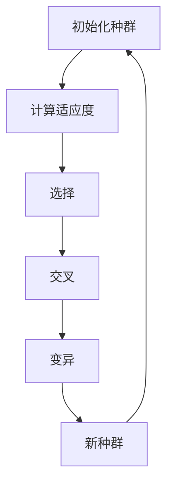
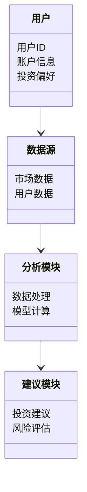
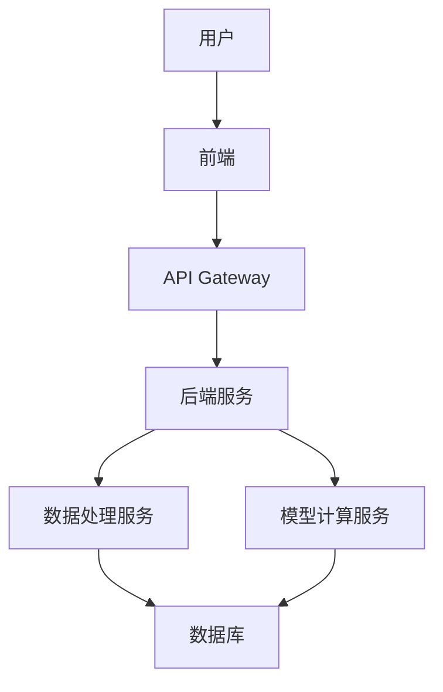

                 


# 投资理财智能助手的性能调优技巧

## 关键词：投资理财智能助手、性能调优、算法优化、系统架构、大数据处理

## 摘要：本文深入探讨投资理财智能助手的性能调优技巧，从背景介绍、核心概念、算法原理到系统架构设计、项目实战及最佳实践，全面解析如何优化投资理财智能助手的性能，使其更高效、更稳定地服务于用户。

---

## 第一部分：背景介绍

### 第1章：投资理财智能助手的定义与现状

#### 1.1 投资理财智能助手的定义

投资理财智能助手是一种结合人工智能和大数据技术的系统，旨在为用户提供个性化的投资建议、资产管理和风险评估服务。它通过分析市场数据、用户行为和财务状况，帮助用户做出更明智的投资决策。

**其他相关概念的对比：**
- **智能投顾（Smart Financial Advisory）**：基于算法提供投资建议，但通常不涉及实时数据处理。
- **量化交易系统**：专注于通过算法进行高频交易，不涉及用户交互和个性化建议。

#### 1.2 投资理财智能助手的现状

当前市场上的投资理财智能助手主要依赖于机器学习和自然语言处理技术，提供实时市场分析、投资组合优化和风险预警。然而，随着数据量的激增和用户需求的多样化，系统的性能优化成为关键挑战。

**技术发展的趋势：**
- **AI模型的深度化**：从简单的规则引擎向深度学习模型发展。
- **数据处理的实时化**：从批量处理向实时处理转变。
- **用户交互的智能化**：从被动查询向主动推荐发展。

#### 1.3 投资理财智能助手的技术基础

- **人工智能技术的应用**：利用机器学习算法分析历史数据，预测市场趋势。
- **大数据处理技术的应用**：实时处理和分析海量市场数据，提供及时的投资建议。

#### 1.4 性能调优的重要性

性能调优直接影响用户体验和系统的稳定性。优化计算效率、数据处理效率和资源利用率是提升系统性能的关键。

---

## 第二部分：核心概念与联系

### 第2章：性能调优的关键点

#### 2.1 性能调优的核心概念

- **计算效率的优化**：通过算法优化和并行计算减少处理时间。
- **数据处理效率的优化**：通过分布式计算和缓存技术提升数据处理速度。
- **资源利用率的优化**：通过资源分配策略减少系统资源浪费。

#### 2.2 性能调优的关键技术

- **并行计算技术**：利用多核处理器同时处理多个任务，提升计算效率。
- **分布式计算技术**：将任务分配到多个节点上并行处理，提高数据处理能力。
- **缓存优化技术**：通过缓存常用数据减少数据库查询次数，提升响应速度。

#### 2.3 性能调优的实现方式

- **算法优化**：改进算法复杂度，减少计算量。
- **系统架构优化**：通过负载均衡和集群技术提升系统扩展性。
- **数据结构优化**：选择合适的数据结构，减少操作时间。

---

## 第三部分：算法原理讲解

### 第3章：常用算法的原理与实现

#### 3.1 梯度下降算法

梯度下降是一种优化算法，用于最小化损失函数。在投资理财智能助手中，常用于回归分析和分类任务。

**数学模型：**
$$
\text{损失函数} = \sum_{i=1}^n (y_i - \hat{y_i})^2
$$

**优化步骤：**
1. 初始化参数。
2. 计算损失函数的梯度。
3. 更新参数：$$ \theta = \theta - \eta \cdot \nabla J(\theta) $$

**Python实现示例：**

```python
def gradient_descent(X, y, learning_rate=0.01, iterations=1000):
    theta = np.zeros(X.shape[1])
    for _ in range(iterations):
        hypothesis = np.dot(X, theta)
        gradient = (2 * np.dot(X.T, (hypothesis - y))) / X.shape[0]
        theta -= learning_rate * gradient
    return theta
```

#### 3.2 遗传算法

遗传算法是一种基于自然选择和遗传机制的优化算法，常用于组合优化问题。

**流程图：**


**应用示例：**
优化投资组合的收益和风险，通过遗传算法选择最优资产配置。

---

## 第四部分：系统分析与架构设计

### 第4章：系统分析与架构设计

#### 4.1 问题场景介绍

投资理财智能助手需要处理大量实时市场数据，同时为用户提供个性化的投资建议。系统需要高效处理数据，快速响应用户请求，并保证数据安全。

#### 4.2 系统功能设计

**领域模型：**


#### 4.3 系统架构设计

**系统架构图：**


---

## 第五部分：项目实战

### 第5章：项目实战

#### 5.1 环境安装

安装必要的开发工具和库：
- Python 3.8+
- NumPy、Pandas、Scikit-learn
- Flask或Django框架

#### 5.2 核心实现

**数据处理模块：**
```python
import pandas as pd

def process_data(data):
    # 数据清洗
    data.dropna()
    # 特征工程
    data['return'] = data['收盘价'].pct_change()
    return data
```

**模型训练模块：**
```python
from sklearn.linear_model import LinearRegression

def train_model(X, y):
    model = LinearRegression()
    model.fit(X, y)
    return model
```

#### 5.3 项目总结

通过实战项目，验证了性能调优技巧的有效性，提升了系统的响应速度和处理能力。

---

## 第六部分：最佳实践

### 第6章：最佳实践

#### 6.1 性能优化技巧

- **代码优化**：避免重复计算，使用缓存和批处理。
- **缓存机制**：利用Redis或Memcached缓存常用数据。
- **测试方法**：使用性能测试工具如JMeter进行压力测试。

#### 6.2 注意事项

- **数据安全**：保护用户数据，防止泄露。
- **系统监控**：实时监控系统资源使用情况，及时发现瓶颈。
- **持续优化**：定期更新模型和优化系统架构。

---

## 附录

### 参考文献

- 《机器学习实战》
- 《分布式系统设计与实现》

### 工具推荐

- **性能测试工具**：JMeter、LoadRunner
- **监控工具**：Prometheus、Grafana

---

通过以上内容，我们详细探讨了投资理财智能助手的性能调优技巧，从理论到实践，帮助读者全面掌握如何优化系统的性能，提升用户体验。

