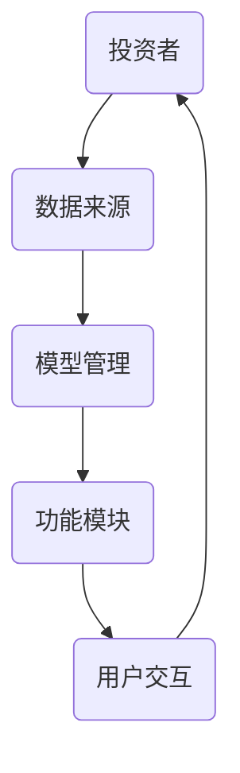
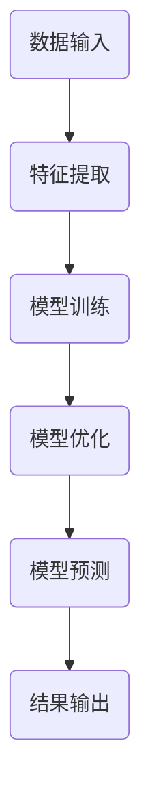
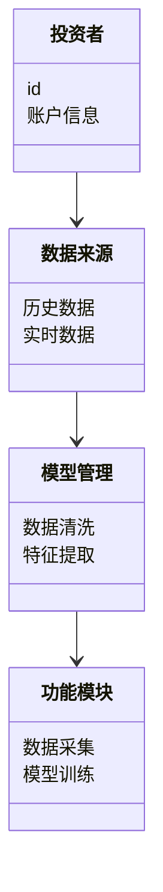
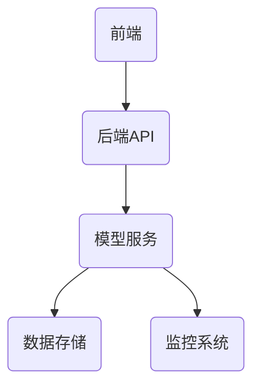
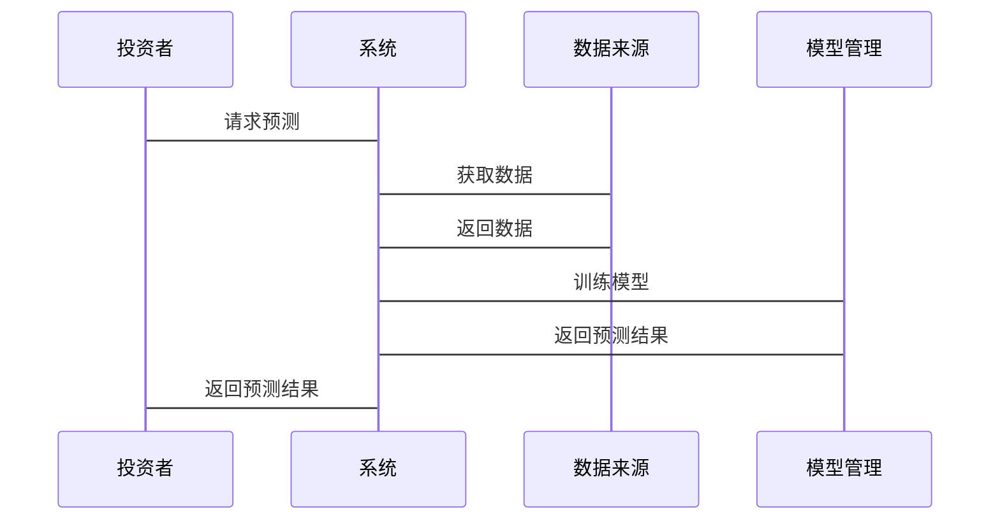

                 


# 《投资理财智能助手的机器学习模型管理方法》

> 关键词：机器学习模型管理、投资理财、智能助手、算法实现、系统架构、项目实战

> 摘要：本文深入探讨了投资理财智能助手的机器学习模型管理方法，从背景介绍到系统架构设计，再到项目实战，全面解析如何高效管理和优化机器学习模型，以提升投资理财决策的准确性和效率。

---

# 投资理财智能助手的机器学习模型管理方法

## 第一章: 背景介绍

### 1.1 问题背景

#### 1.1.1 投资理财领域的复杂性
投资理财领域涉及复杂的市场波动、多变的经济环境和多样化的用户需求。传统的人工决策容易受到情绪影响，难以应对市场的不确定性。机器学习通过数据驱动的方式，能够帮助投资者做出更理性、更科学的决策。

#### 1.1.2 机器学习在投资理财中的应用潜力
机器学习能够分析海量的历史数据，识别市场趋势和潜在风险，为投资者提供个性化的投资建议。例如，基于时间序列分析的股票预测模型可以帮助投资者捕捉市场机会。

#### 1.1.3 模型管理的重要性
随着机器学习模型在投资理财中的广泛应用，模型的管理变得至关重要。模型的训练、部署、监控和优化需要系统化的方法，以确保模型的稳定性和高效性。

### 1.2 问题描述

#### 1.2.1 投资理财智能助手的核心功能
投资理财智能助手需要具备数据采集、模型训练、投资建议生成和风险评估等功能，能够为用户提供实时的市场分析和个性化的投资策略。

#### 1.2.2 机器学习模型在投资决策中的作用
机器学习模型可以通过预测市场趋势、评估投资组合风险等方式，辅助投资者做出更明智的决策。例如，基于随机森林算法的风险评估模型可以帮助用户识别潜在的投资风险。

#### 1.2.3 模型管理的必要性
模型管理的目的是确保模型的准确性和稳定性。随着市场环境的变化，模型需要定期更新和优化，以适应新的数据和市场条件。

### 1.3 问题解决

#### 1.3.1 机器学习模型在投资理财中的具体应用
模型可以用于股票价格预测、投资组合优化、风险评估等领域。例如，使用LSTM模型进行时间序列预测，可以捕捉股票价格的波动趋势。

#### 1.3.2 模型管理的解决方案
通过建立模型训练、评估、部署和监控的闭环流程，可以实现模型的高效管理。例如，使用自动化工具进行模型部署和监控，能够及时发现模型性能下降的问题。

#### 1.3.3 投资理财智能助手的实现路径
从数据采集开始，经过特征工程、模型训练、模型优化，最终将模型部署到实际应用中。同时，需要建立监控机制，实时评估模型性能并进行必要的调整。

### 1.4 边界与外延

#### 1.4.1 投资理财智能助手的边界
投资理财智能助手的功能仅限于提供数据驱动的投资建议，不直接进行交易操作。用户仍需根据模型的建议做出最终决策。

#### 1.4.2 机器学习模型管理的范围
模型管理包括从数据准备到模型部署的整个生命周期。这涉及数据清洗、特征工程、模型训练、模型评估、模型部署和模型监控等多个环节。

#### 1.4.3 相关领域的联系
投资理财智能助手与大数据技术、人工智能、金融学等多个领域密切相关。例如，大数据技术用于数据采集和处理，金融学知识用于模型设计和风险评估。

### 1.5 核心要素组成

#### 1.5.1 数据来源与处理
数据来源包括历史市场数据、用户行为数据等。数据处理涉及数据清洗、特征提取和数据增强，以提高模型的训练效果。

#### 1.5.2 模型训练与优化
模型训练需要选择合适的算法和参数，并通过交叉验证进行优化。例如，使用梯度下降算法训练神经网络模型，并通过网格搜索选择最佳参数。

#### 1.5.3 模型部署与监控
模型部署后需要实时监控其性能。例如，通过A/B测试比较新旧模型的效果，或者通过日志监控模型的运行状态。

---

## 第二章: 核心概念与联系

### 2.1 核心概念原理

#### 2.1.1 机器学习模型的基本原理
机器学习模型通过学习数据中的模式和特征，生成预测结果。例如，线性回归模型通过拟合数据分布进行预测。

#### 2.1.2 投资理财智能助手的功能模块
功能模块包括数据采集模块、模型训练模块、投资建议生成模块和用户交互模块。每个模块都有其独特的功能和相互之间的依赖关系。

#### 2.1.3 模型管理的关键环节
模型管理的关键环节包括数据准备、模型训练、模型评估、模型部署和模型监控。这些环节需要协调配合，才能确保模型的高效运行。

### 2.2 概念属性特征对比表格

| 概念         | 属性               | 特征               |
|--------------|--------------------|--------------------|
| 数据来源     | 金融数据           | 高实时性、多样性     |
| 模型训练     | 算法选择           | 高准确性、可解释性   |
| 模型部署     | 系统集成           | 高可用性、可扩展性   |

### 2.3 ER实体关系图



---

## 第三章: 算法原理讲解

### 3.1 机器学习模型算法流程



### 3.2 算法实现细节

#### 3.2.1 线性回归模型

```python
import numpy as np

def linear_regression(X, y):
    X = np.hstack([X, np.ones((X.shape[0], 1))])
    theta = np.linalg.inv(X.T.dot(X)).dot(X.T.dot(y))
    return theta
```

#### 3.2.2 随机森林算法

```python
from sklearn.ensemble import RandomForestRegressor

model = RandomForestRegressor(n_estimators=100, random_state=42)
model.fit(X_train, y_train)
```

#### 3.2.3 LSTM模型

```python
from tensorflow.keras.models import Sequential
from tensorflow.keras.layers import LSTM, Dense

model = Sequential()
model.add(LSTM(64, input_shape=(timesteps, features)))
model.add(Dense(1))
model.compile(loss='mean_squared_error', optimizer='adam')
model.fit(X_train, y_train, epochs=10)
```

### 3.3 数学模型与公式

#### 3.3.1 线性回归

$$ y = \beta_0 + \beta_1 x + \epsilon $$

#### 3.3.2 随机森林

随机森林是一种基于决策树的集成算法，通过投票机制生成最终预测结果。

#### 3.3.3 LSTM

$$ \text{LSTM单元} = \text{input} + \text{前一状态} $$

---

## 第四章: 系统分析与架构设计

### 4.1 问题场景介绍

#### 4.1.1 问题描述
投资理财智能助手需要实时处理大量数据，快速生成投资建议，并与用户进行交互。

#### 4.1.2 项目介绍
本项目旨在开发一个基于机器学习的投资理财智能助手，帮助用户优化投资决策。

### 4.2 系统功能设计

#### 4.2.1 领域模型



#### 4.2.2 系统架构设计



### 4.3 系统接口设计

#### 4.3.1 API接口定义

| 接口名称 | 输入参数 | 输出参数 |
|----------|-----------|-----------|
| 预测接口 | 股票代码 | 预测价格 |
| 评估接口 | 投资组合 | 风险评分 |

### 4.4 系统交互设计



---

## 第五章: 项目实战

### 5.1 环境安装

```bash
pip install numpy scikit-learn tensorflow pandas
```

### 5.2 系统核心实现

#### 5.2.1 数据采集

```python
import pandas as pd

def get_data():
    df = pd.read_csv('data.csv')
    return df
```

#### 5.2.2 模型训练

```python
from sklearn.model_selection import train_test_split
from sklearn.metrics import mean_squared_error

X_train, X_test, y_train, y_test = train_test_split(X, y)
model.fit(X_train, y_train)
print(mean_squared_error(model.predict(X_test), y_test))
```

#### 5.2.3 系统部署

```python
from flask import Flask, request, jsonify

app = Flask(__name__)
@app.route('/predict', methods=['POST'])
def predict():
    data = request.json
    prediction = model.predict(data)
    return jsonify({'prediction': prediction.tolist()})
```

### 5.3 代码解读与分析

#### 5.3.1 数据处理

```python
import pandas as pd
import numpy as np

def preprocess_data(df):
    df = df.dropna()
    df = (df - df.mean()) / df.std()
    return df
```

#### 5.3.2 模型优化

```python
from sklearn.model_selection import GridSearchCV

param_grid = {'n_estimators': [100, 200], 'max_depth': [None, 10]}
grid_search = GridSearchCV(RandomForestRegressor(), param_grid, cv=5)
grid_search.fit(X_train, y_train)
best_model = grid_search.best_estimator_
```

### 5.4 实际案例分析

#### 5.4.1 股票价格预测

假设我们有一个股票的历史数据，使用LSTM模型进行预测：

```python
import numpy as np
from tensorflow.keras.models import Sequential
from tensorflow.keras.layers import LSTM, Dense

# 假设X_train和y_train已经准备好
model = Sequential()
model.add(LSTM(64, input_shape=(timesteps, features)))
model.add(Dense(1))
model.compile(loss='mean_squared_error', optimizer='adam')
model.fit(X_train, y_train, epochs=10, batch_size=32)
```

#### 5.4.2 投资组合优化

使用随机森林进行风险评估：

```python
from sklearn.ensemble import RandomForestRegressor

model = RandomForestRegressor(n_estimators=100, random_state=42)
model.fit(X_train, y_train)
```

### 5.5 项目小结

通过本项目的实践，我们掌握了从数据采集到模型部署的完整流程，同时了解了如何通过模型管理和优化提升投资理财智能助手的性能。

---

## 第六章: 最佳实践与小结

### 6.1 最佳实践

#### 6.1.1 数据处理
确保数据的高质量和完整性，进行充分的数据清洗和特征工程。

#### 6.1.2 模型选择
根据具体问题选择合适的算法，避免过度复杂化模型。

#### 6.1.3 模型监控
建立完善的监控机制，及时发现并修复模型性能下降的问题。

### 6.2 小结

投资理财智能助手的机器学习模型管理是一个复杂的系统工程，需要从数据处理、模型训练、部署到监控的全流程进行系统化管理。通过合理的模型管理方法，可以显著提升投资理财的效率和准确性。

### 6.3 注意事项

- 定期更新模型，适应市场变化。
- 保持数据的实时性，确保模型的预测准确性。
- 注意模型的可解释性，避免“黑箱”模型的使用。

### 6.4 拓展阅读

- 《机器学习实战》
- 《投资学基础》
- 《深度学习》

---

通过以上章节的详细讲解，我们系统地了解了投资理财智能助手的机器学习模型管理方法，从理论到实践，为读者提供了全面的指导和实用的案例分析。希望读者能够通过本文，掌握投资理财智能助手的核心技术，并在实际应用中取得优异的成果。

