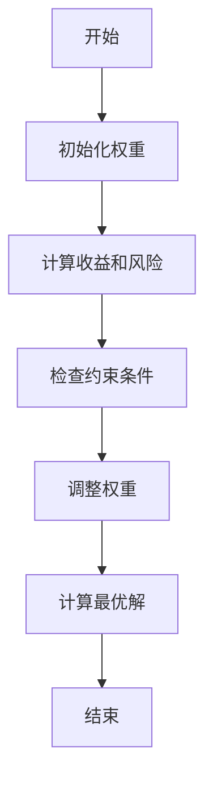
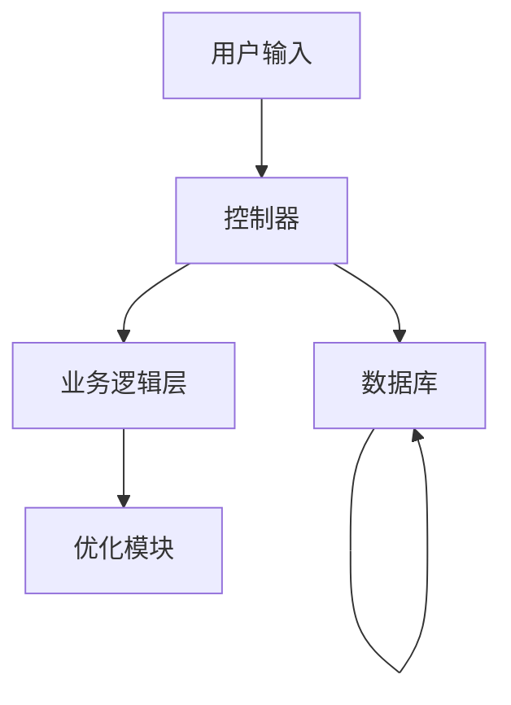

                 


# 《投资组合管理》

## 关键词：
- 投资组合管理
- 资产配置
- 风险管理
- 优化算法
- 现代投资组合理论

## 摘要：
本文系统地介绍了投资组合管理的核心概念、算法原理和实际应用。通过详细分析资产配置、风险管理等关键要素，结合现代投资组合理论（MPT）和优化算法，提供了从理论到实践的全面指导。文章还通过具体案例展示了如何利用Python实现投资组合优化，帮助读者掌握投资组合管理的实际操作技能。

---

## 目录大纲：

### 第1章：投资组合管理概述
- 1.1 投资组合管理的背景与意义
- 1.2 投资组合管理的核心概念
- 1.3 投资组合管理与风险管理的关系

### 第2章：资产配置与风险调整
- 2.1 资产配置的基本原理
- 2.2 风险调整后收益的计算
- 2.3 不同资产类别对风险和收益的影响

### 第3章：现代投资组合理论（MPT）与优化算法
- 3.1 MPT的核心思想与数学模型
- 3.2 均值-方差模型的实现步骤
- 3.3 优化算法的流程图与代码实现

### 第4章：投资组合管理系统的架构设计
- 4.1 系统功能模块设计
- 4.2 数据库设计与系统架构图
- 4.3 系统接口设计与交互流程

### 第5章：项目实战：投资组合优化
- 5.1 环境安装与数据准备
- 5.2 核心代码实现
- 5.3 实际案例分析与结果解读

### 第6章：最佳实践与小结
- 6.1 投资组合管理的注意事项
- 6.2 实际应用中的常见问题与解决方案
- 6.3 拓展阅读与进一步学习的方向

---

## 第1章：投资组合管理概述

### 1.1 投资组合管理的背景与意义

#### 背景介绍：
投资组合管理是金融领域中的核心实践，旨在通过科学的资产配置和风险管理，帮助投资者在不同市场环境下实现投资目标。随着金融市场的发展，投资组合管理的重要性日益凸显。

#### 核心概念：
- **投资组合**：一组金融资产的集合，旨在通过多样化的投资降低风险。
- **风险调整后收益**：衡量资产或投资组合收益与风险的比值，帮助投资者做出更明智的决策。

#### 问题背景：
在金融市场中，投资者面临多样化的选择，如何在风险可控的前提下实现收益最大化，是投资组合管理的核心问题。

#### 问题解决：
通过资产配置和优化算法，投资组合管理能够在不同市场环境下优化资产组合，降低风险，提高收益。

#### 边界与外延：
- **边界**：主要关注金融资产的投资组合优化，不涉及房地产、艺术品等另类资产。
- **外延**：与风险管理、资产定价等密切相关，是金融学的重要分支。

#### 概念结构：
- **核心要素**：资产、权重、收益、风险。
- **核心目标**：最大化收益、最小化风险。

---

## 第2章：资产配置与风险调整

### 2.1 资产配置的基本原理

#### 资产配置的核心思想：
通过将资金分配到不同资产类别（如股票、债券、现金等），降低投资组合的波动性，实现风险分散。

#### 资产类别对比：
| 资产类别 | 风险特征 | 收益特征 |
|----------|----------|----------|
| 股票     | 高       | 高       |
| 债券     | 中       | 稳定     |
| 现金     | 低       | 低       |

#### 资产配置策略：
- **战略资产配置**：长期固定的资产分配。
- **战术资产配置**：根据市场变化进行短期调整。

---

## 第3章：现代投资组合理论（MPT）与优化算法

### 3.1 MPT的核心思想与数学模型

#### 核心思想：
通过优化资产组合，实现收益最大化和风险最小化的平衡。

#### 数学模型：
$$\text{Minimize } \sigma^2 \text{ subject to } \mathbf{w}^T \mathbf{μ} = \text{target return}$$

#### 优化算法流程图：


### 3.2 均值-方差模型的实现步骤

#### 步骤分解：
1. **输入数据**：历史收益率数据。
2. **计算均值和方差**：使用Python计算各资产的期望收益和协方差矩阵。
3. **优化模型**：使用`scipy.optimize.minimize`进行优化。
4. **输出结果**：最优权重和最小方差。

#### Python代码实现：
```python
import numpy as np
from scipy.optimize import minimize

def portfolio_optimization(returns):
    n = len(returns.columns)
    mu = returns.mean().values
    sigma = returns.cov().values

    def objective(weights):
        return (weights.T @ sigma @ weights)[0,0]

    constraints = [{'type': 'eq', 'fun': lambda w: np.sum(w) - 1}]
    bounds = [(0, 1) for _ in range(n)]

    result = minimize(objective, np.ones(n)/n, method='SLSQP', constraints=constraints, bounds=bounds)
    return result.x
```

#### 结果分析：
- 最优权重：每个资产的配置比例。
- 最小方差：投资组合的风险最小值。

---

## 第4章：投资组合管理系统的架构设计

### 4.1 系统功能模块设计

#### 功能模块：
- 数据采集：获取资产的收益率数据。
- 风险评估：计算各资产的风险指标。
- 优化模块：实现投资组合优化算法。
- 报告生成：输出优化结果和分析报告。

#### 功能流程图：


---

## 第5章：项目实战：投资组合优化

### 5.1 环境安装与数据准备

#### 环境安装：
- 安装Python和必要的库：`numpy`, `pandas`, `scipy`.

#### 数据准备：
- 下载股票的历史收益率数据。

### 5.2 核心代码实现

#### 数据预处理：
```python
import pandas as pd

# 读取数据
data = pd.read_csv('stock_returns.csv')
returns = data.pct_change().dropna()
```

#### 优化实现：
```python
def portfolio_optimization(returns):
    n = len(returns.columns)
    mu = returns.mean().values
    sigma = returns.cov().values

    def objective(weights):
        return (weights.T @ sigma @ weights)[0,0]

    constraints = [{'type': 'eq', 'fun': lambda w: np.sum(w) - 1}]
    bounds = [(0, 1) for _ in range(n)]

    result = minimize(objective, np.ones(n)/n, method='SLSQP', constraints=constraints, bounds=bounds)
    return result.x
```

### 5.3 实际案例分析与结果解读

#### 案例分析：
假设我们有三只股票的历史收益率数据，运行上述代码，得到最优权重。

#### 结果解读：
- 最优权重表示每只股票在投资组合中的配置比例。
- 通过回测，验证优化后的投资组合在不同市场环境下的表现。

---

## 第6章：最佳实践与小结

### 6.1 注意事项
- 数据质量：确保输入数据的准确性和完整性。
- 模型假设：优化模型基于假设，实际操作中需考虑市场摩擦和交易成本。

### 6.2 常见问题与解决方案
- **问题**：优化结果不理想。
  - **解决方案**：检查数据质量，调整优化约束条件。

### 6.3 拓展阅读
- 推荐阅读《投资学》（作者：彼得·林奇）和《Python金融计算》（作者：埃里克·坎宁安）。

---

以上是《投资组合管理》的完整目录大纲和部分详细内容。接下来，我会根据这个大纲逐步展开每一部分的内容，确保文章逻辑清晰、内容详实。

