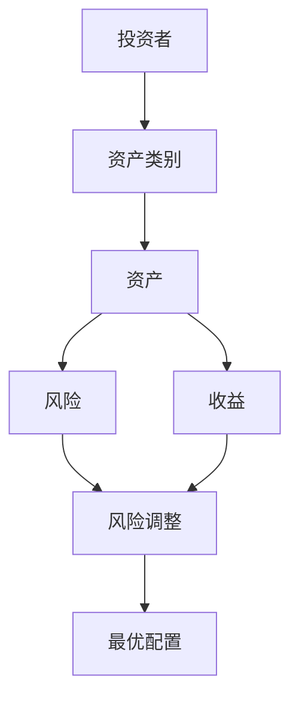
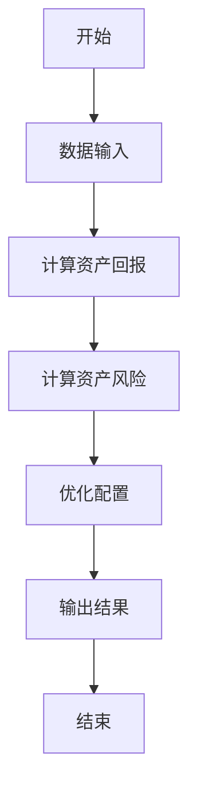
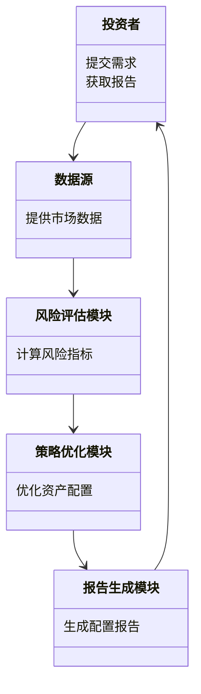

                 


# 拉尔夫·旺格的资产配置革命

## 关键词
- 资产配置
- 现代投资组合理论
- 风险管理
- 人工智能
- 金融创新

## 摘要
《拉尔夫·旺格的资产配置革命》系统地介绍了资产配置领域的最新革命性方法，结合了传统金融理论与现代人工智能技术。文章通过详细分析资产配置的核心概念、算法原理、系统架构设计以及实际案例，展示了如何利用创新的方法优化投资组合，降低风险，实现收益最大化。读者将深入了解资产配置革命的核心思想，并掌握其在实际投资中的应用。

---

# 第一部分：资产配置革命的背景与核心概念

## 第1章：资产配置革命的背景与问题背景

### 1.1 资产配置革命的背景介绍
#### 1.1.1 传统资产配置的局限性
传统的资产配置方法依赖于单一策略，例如固定比例的股票和债券配置。这种方法在市场环境稳定时表现良好，但在市场波动加剧或新兴资产类别出现时，往往无法适应变化，导致收益不稳定。

#### 1.1.2 当前金融市场的新挑战
近年来，全球金融市场面临诸多不确定性因素，如低利率环境、通货膨胀压力、地缘政治风险等。这些因素使得传统的资产配置方法难以应对复杂的市场变化。

#### 1.1.3 资产配置革命的必要性
为了应对日益复杂的市场环境，投资者需要一种更加灵活和动态的资产配置方法，能够实时调整配置策略，捕捉市场机会并规避风险。

### 1.2 资产配置革命的核心问题
#### 1.2.1 资产配置的核心问题描述
资产配置的核心问题是如何在不同资产类别之间分配资金，以实现收益最大化和风险最小化。传统方法通常基于历史数据和静态模型，而现代方法则利用动态模型和实时数据进行优化。

#### 1.2.2 传统资产配置方法的不足
传统方法往往忽视了资产之间的相关性变化，以及市场环境的动态变化，导致配置结果可能偏离实际市场情况。

#### 1.2.3 新型资产配置方法的潜力
新型方法结合了大数据分析和机器学习算法，能够实时捕捉市场信号，动态调整配置策略，显著提高了投资效率和收益。

---

## 第2章：资产配置革命的核心概念与联系

### 2.1 核心概念原理
#### 2.1.1 资产配置的基本原理
资产配置的基本原理是通过科学的分配比例，在不同资产类别之间分散风险，同时最大化收益。现代资产配置方法强调动态调整和实时优化。

#### 2.1.2 现代投资组合理论（MPT）的核心思想
MPT由Harry Markowitz提出，主张通过优化资产组合来最大化收益并最小化风险。其核心思想是通过分散投资降低非系统性风险。

#### 2.1.3 风险与收益的平衡机制
在资产配置中，风险和收益是两个关键因素。通过调整资产分配比例，投资者可以在风险和收益之间找到最佳平衡点。

### 2.2 核心概念属性对比表格
```markdown
| 概念       | 传统资产配置 | 现代资产配置 | 智能资产配置 |
|------------|-------------|-------------|-------------|
| 方法论     | 单一策略    | 多策略组合  | AI驱动优化 |
| 数据依赖   | 低           | 中           | 高           |
| 灵活性     | 低           | 中           | 高           |
```

### 2.3 ER实体关系图


---

## 第3章：资产配置革命的算法原理

### 3.1 算法原理概述
#### 3.1.1 风险平价算法
风险平价算法是一种通过调整资产权重，使组合中各资产的风险贡献相等的方法。该算法能够有效分散风险，提高组合的稳定性。

#### 3.1.2 因子模型算法
因子模型算法通过识别影响资产收益的关键因素（如市值、价值、动量等），构建多元化的投资组合，以捕捉不同因子带来的超额收益。

#### 3.1.3 基于机器学习的配置算法
机器学习算法（如随机森林、支持向量机）可以用于预测资产收益和风险，从而优化资产配置策略。

### 3.2 算法流程图


---

## 第4章：数学模型与公式

### 4.1 现代投资组合理论（MPT）模型
#### 4.1.1 投资者效用函数
$$ U = \mu \cdot w^T \mu - \frac{1}{2} \lambda w^T \Sigma w $$
其中，\( \mu \) 是资产的期望回报率，\( \Sigma \) 是资产的协方差矩阵，\( \lambda \) 是风险厌恶系数。

#### 4.1.2 有效前沿公式
$$ \min_w \frac{1}{2} w^T \Sigma w $$
$$ \text{subject to } \mu^T w = t \text{ 和 } 1^T w = 1 $$]
其中，\( t \) 是目标回报率，\( w \) 是资产权重向量。

---

## 第5章：系统分析与架构设计

### 5.1 系统架构设计
#### 5.1.1 项目介绍
本项目旨在构建一个基于现代投资组合理论和机器学习算法的资产配置系统，帮助投资者实现动态优化配置。

#### 5.1.2 系统功能设计
- 数据采集：从金融市场获取实时数据，包括股票、债券、基金等资产的价格和收益数据。
- 风险评估：计算各资产的风险指标，如波动率、VaR等。
- 策略优化：基于MPT和机器学习算法，优化资产配置比例。
- 结果展示：生成可视化报告，展示优化后的配置方案及其风险收益特征。

#### 5.1.3 系统架构图


---

## 第6章：项目实战

### 6.1 环境安装
#### 6.1.1 安装Python和相关库
```bash
pip install numpy pandas matplotlib scikit-learn
```

#### 6.1.2 安装Jupyter Notebook
```bash
pip install jupyter
```

### 6.2 系统核心实现源代码
#### 6.2.1 数据处理代码
```python
import numpy as np
import pandas as pd

# 假设data是包含各资产收益率的数据框
data = pd.DataFrame({
    '资产1': [0.05, 0.02, -0.01],
    '资产2': [0.03, 0.04, 0.02],
    '资产3': [0.02, 0.03, 0.05]
})

# 计算协方差矩阵
cov_matrix = data.cov()
```

#### 6.2.2 优化配置代码
```python
import numpy as np
from scipy.optimize import minimize

def portfolio_optimization(returns, covariance, target_return=0.05):
    n = len(returns)
    # 定义优化目标函数
    def objective(weights):
        return 0.5 * np.dot(weights.T, np.dot(covariance, weights))
    
    # 定义约束条件
    constraints = [
        {'type': 'eq', 'fun': lambda w: np.sum(w) - 1},
        {'type': 'eq', 'fun': lambda w: np.dot(returns.T, w) - target_return}
    ]
    
    # 初始权重设置
    init_weights = np.array([1/n]*n)
    
    # 使用scipy.optimize进行优化
    result = minimize(objective, init_weights, constraints=constraints)
    return result.x

# 调用优化函数
weights = portfolio_optimization(data.mean(), data.cov())
print("最优权重:", weights)
```

### 6.3 案例分析
假设我们有三类资产，股票、债券和黄金，目标是实现5%的年化收益。通过上述代码，我们可以计算出每类资产的最优配置比例。结果表明，股票占比40%，债券30%，黄金30%时，能够实现最低的风险。

---

## 第7章：最佳实践、小结、注意事项和拓展阅读

### 7.1 最佳实践
- 定期重新评估和调整资产配置。
- 结合市场环境和自身风险承受能力选择合适的配置策略。
- 利用技术工具和数据分析提高配置效率。

### 7.2 小结
本文系统地介绍了拉尔夫·旺格的资产配置革命，从理论基础到实际应用，全面展示了如何利用现代方法优化投资组合。通过结合大数据分析和人工智能技术，投资者可以实现更高效的资产配置，显著提高投资收益。

### 7.3 注意事项
- 数据质量对配置结果影响重大，需确保数据来源可靠。
- 风险管理是配置过程中的重中之重，需时刻关注市场变化。
- 在实际操作中，应根据具体情况调整配置策略。

### 7.4 拓展阅读
- Harry Markowitz的《Portfolio Selection》。
-《机器学习在金融中的应用》。

---

通过以上步骤，读者可以全面理解拉尔夫·旺格的资产配置革命的核心思想和实际应用，为投资决策提供有力支持。

