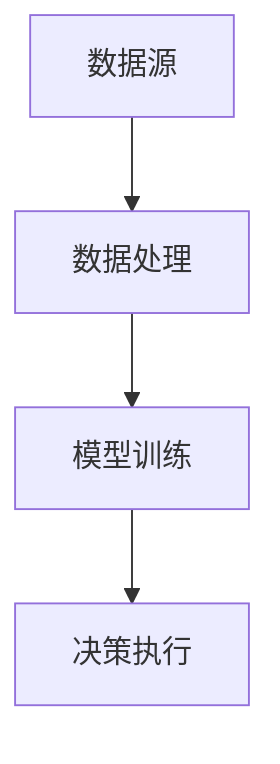
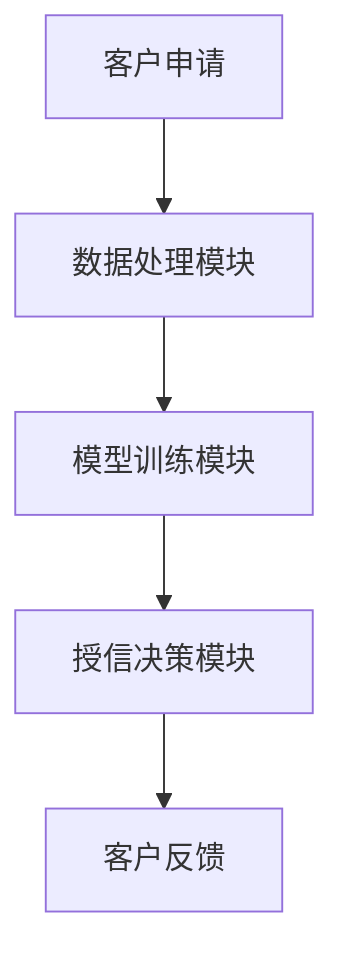
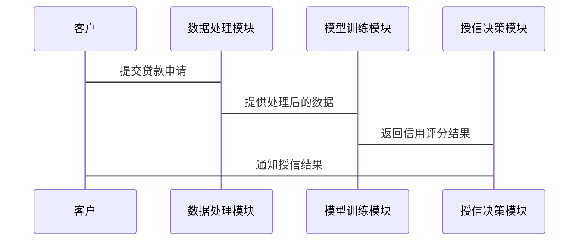

                 


# 探讨人工智能在金融领域的伦理考量

## 关键词
人工智能、金融领域、伦理考量、数据隐私、算法偏见、透明度

## 摘要
人工智能在金融领域的应用日益广泛，但其带来的伦理问题也逐渐凸显。本文将从人工智能的基本概念、金融中的应用场景入手，详细分析数据隐私、算法偏见、透明度等问题，并探讨如何通过技术手段解决这些伦理挑战。通过实际案例分析和系统设计，本文旨在为金融领域的从业者提供伦理考量的框架和实践指南。

---

# 第一部分：人工智能在金融领域的背景介绍

## 第1章：人工智能的基本概念

### 1.1 人工智能的定义与特点

#### 1.1.1 人工智能的定义
人工智能（Artificial Intelligence, AI）是指计算机系统模拟人类智能的能力，包括学习、推理、问题解决等。AI的核心在于通过数据和算法，使计算机能够执行复杂的任务。

#### 1.1.2 人工智能的核心特点
- **数据驱动**：AI依赖大量数据进行训练和推理。
- **算法复杂**：涉及机器学习、深度学习等复杂算法。
- **适应性**：能够根据反馈不断优化。

#### 1.1.3 人工智能与机器学习的区别
- **AI**：广泛概念，涵盖所有模拟人类智能的技术。
- **机器学习**：AI的子领域，专注于通过数据训练模型。

### 1.2 人工智能在金融中的应用

#### 1.2.1 金融领域的常见应用场景
- **风险管理**：预测信用违约、评估市场风险。
- **客户服务**：智能客服、个性化推荐。
- **投资决策**：算法交易、市场预测。

#### 1.2.2 人工智能在金融中的优势
- **高效性**：快速处理大量数据。
- **准确性**：减少人为错误。
- **创新性**：提供新的服务模式。

#### 1.2.3 人工智能在金融中的挑战
- **数据隐私**：如何保护用户数据。
- **算法偏见**：模型可能存在的偏见。
- **监管合规**：如何符合金融法规。

---

## 第2章：人工智能在金融中的伦理问题背景

### 2.1 金融行业的伦理挑战

#### 2.1.1 金融行业的核心伦理问题
- **客户信任**：金融行业的信任基础至关重要。
- **公平性**：确保所有客户得到公平对待。
- **透明度**：客户需要了解服务背后的逻辑。

#### 2.1.2 人工智能在金融中的伦理风险
- **数据隐私泄露**：未经授权的数据使用可能导致隐私问题。
- **算法偏见**：模型可能因为训练数据中的偏差而产生不公平结果。
- **透明度不足**：复杂的算法可能难以解释，影响客户的信任。

#### 2.1.3 伦理问题的复杂性
- **利益冲突**：企业利润与客户利益之间的平衡。
- **技术与伦理的动态平衡**：技术进步可能带来新的伦理挑战。

---

## 第3章：人工智能在金融中的伦理框架

### 3.1 伦理框架的构建

#### 3.1.1 伦理框架的定义
伦理框架是指导AI在金融中应用的规范和原则，确保技术的使用符合伦理标准。

#### 3.1.2 构建伦理框架的步骤
1. **识别核心问题**：数据隐私、算法公平性等。
2. **制定原则**：透明、公平、隐私保护。
3. **具体实施**：将原则转化为技术实现。

#### 3.1.3 伦理框架的核心要素
- **数据隐私**：确保数据的收集和使用符合隐私法规。
- **算法公平性**：避免模型的偏见。
- **透明度**：向用户解释AI决策的逻辑。

---

### 3.2 伦理框架在金融中的应用

#### 3.2.1 数据隐私保护
- **数据加密**：保护数据在传输和存储中的安全。
- **数据匿名化**：去除个人身份信息。

#### 3.2.2 算法公平性保障
- **数据预处理**：平衡不同群体的数据分布。
- **模型后处理**：调整模型输出以消除偏见。

#### 3.2.3 透明度与可解释性提升
- **模型解释工具**：帮助用户理解AI决策过程。
- **用户教育**：提升客户对AI的理解和信任。

---

# 第二部分：人工智能在金融领域的核心概念与联系

## 第4章：人工智能的核心概念原理

### 4.1 人工智能的核心原理

#### 4.1.1 机器学习的基本原理
机器学习通过训练数据，使模型能够识别模式并做出预测。

#### 4.1.2 深度学习的基本原理
深度学习使用多层神经网络，能够处理更复杂的模式识别任务。

#### 4.1.3 自然语言处理的基本原理
NLP使计算机能够理解和生成人类语言，常用于情感分析和文本分类。

---

### 4.2 人工智能在金融中的应用原理

#### 4.2.1 金融预测的原理
通过历史数据训练模型，预测股票价格波动。

#### 4.2.2 风险评估的原理
利用客户数据和行为模式，评估信用风险。

#### 4.2.3 客户画像的原理
通过分析客户行为数据，构建客户画像以提供个性化服务。

---

## 第5章：人工智能与金融的核心联系

### 5.1 人工智能如何影响金融决策

#### 5.1.1 数据驱动的决策
AI通过分析大量数据，提供更精准的决策支持。

#### 5.1.2 智能化服务的提供
AI实现自动化客户服务，提升用户体验。

#### 5.1.3 风险管理的优化
通过实时数据分析，优化风险管理策略。

---

### 5.2 人工智能如何改变金融服务模式

#### 5.2.1 个性化服务的实现
根据客户需求，提供定制化金融产品。

#### 5.2.2 自动化交易的兴起
AI算法实现高频交易，提高交易效率。

#### 5.2.3 金融监管的创新
利用AI技术实时监控市场，预防金融犯罪。

---

# 第三部分：人工智能在金融中的伦理问题分析

## 第6章：数据隐私与安全

### 6.1 数据隐私的定义与重要性

#### 6.1.1 数据隐私的基本概念
数据隐私指个人对自身数据的控制权，确保数据不会被滥用。

#### 6.1.2 数据隐私在金融中的重要性
金融数据涉及个人资产和交易记录，泄露可能导致严重后果。

#### 6.1.3 数据隐私的法律要求
遵循GDPR等法规，确保数据处理合法合规。

---

### 6.2 数据隐私的保护措施

#### 6.2.1 数据加密技术
- **加密方法**：对称加密（AES）和非对称加密（RSA）。
- **应用场景**：保护传输中的数据。

#### 6.2.2 数据匿名化处理
- **技术手段**：去标识化、数据扰动。
- **效果**：降低数据被识别的风险。

---

## 第7章：算法偏见与公平性

### 7.1 算法偏见的定义与来源

#### 7.1.1 算法偏见的定义
算法偏见指AI系统在决策过程中产生的不公平结果，通常源于训练数据的偏差。

#### 7.1.2 算法偏见的来源
- **数据偏差**：训练数据中某些群体的代表性不足。
- **算法设计**：模型设计时的固有假设。

---

### 7.2 算法公平性的实现

#### 7.2.1 数据预处理方法
- **重新采样**：平衡不同群体的数据分布。
- **特征调整**：去除可能导致偏见的特征。

#### 7.2.2 模型后处理方法
- **阈值调整**：在分类任务中调整分类阈值，平衡不同群体的误判率。
- **对抗训练**：通过对抗网络消除偏见。

---

## 第8章：透明度与可解释性

### 8.1 透明度的定义与重要性

#### 8.1.1 透明度的定义
透明度指AI系统决策过程的清晰和可理解性。

#### 8.1.2 透明度在金融中的重要性
- **客户信任**：透明的决策过程增强客户信任。
- **监管合规**：符合金融监管机构的透明度要求。

---

### 8.2 提高透明度的方法

#### 8.2.1 可解释模型的选择
- **线性模型**：如逻辑回归，易于解释。
- **可解释性模型**：如LIME，用于解释复杂模型的输出。

#### 8.2.2 透明化信息披露
- **模型说明**：向客户解释AI决策的逻辑。
- **案例说明**：提供实际案例帮助理解。

---

## 第9章：算法的透明度与可解释性实现

### 9.1 透明度的挑战

#### 9.1.1 复杂模型的解释难度
深度学习模型通常被视为“黑箱”，难以解释。

#### 9.1.2 用户认知限制
普通用户可能无法理解复杂的解释。

---

### 9.2 提高可解释性的技术

#### 9.2.1 使用可解释模型
- **线性回归**：用于信用评分。
- **决策树**：用于客户分类。

#### 9.2.2 可视化工具
- **特征重要性分析**：展示各特征对模型影响的大小。
- **决策路径展示**：展示模型如何做出决策。

---

# 第四部分：人工智能在金融中的系统分析与架构设计

## 第10章：系统分析与架构设计

### 10.1 问题场景介绍

#### 10.1.1 项目介绍
设计一个AI驱动的信用评分系统，评估客户信用风险。

#### 10.1.2 系统功能需求
- **数据收集**：收集客户数据。
- **模型训练**：训练信用评分模型。
- **决策执行**：根据模型输出做出授信决策。

---

### 10.2 系统架构设计

#### 10.2.1 数据流设计
- **数据源**：客户申请表、交易记录。
- **数据处理**：清洗、特征提取。
- **模型训练**：训练信用评分模型。

#### 10.2.2 系统架构图


---

## 第11章：系统架构详细设计

### 11.1 系统功能设计

#### 11.1.1 数据模型设计
- **客户信息表**：存储客户的基本信息和交易记录。
- **信用评分表**：存储模型输出的信用评分。

#### 11.1.2 系统交互流程
- **用户提交申请**：客户提交贷款申请。
- **数据处理**：系统对数据进行清洗和特征提取。
- **模型训练**：训练信用评分模型。
- **决策执行**：根据模型输出决定是否授信。

---

### 11.2 系统架构图



---

## 第12章：系统接口设计

### 12.1 接口设计

#### 12.1.1 数据接口
- **输入接口**：接收客户数据。
- **输出接口**：返回信用评分结果。

#### 12.1.2 API设计
- **API名称**：`/api/v1/credit-score`
- **请求方法**：POST
- **请求参数**：客户信息。

---

## 第13章：系统交互设计

### 13.1 交互流程

#### 13.1.1 客户提交申请
客户填写贷款申请表，提交相关数据。

#### 13.1.2 系统处理数据
数据处理模块对数据进行清洗和特征提取。

#### 13.1.3 模型训练
模型训练模块利用处理后的数据，训练信用评分模型。

#### 13.1.4 决策执行
授信决策模块根据模型输出，决定是否批准贷款申请。

---

### 13.2 交互序列图



---

## 第14章：项目实战

### 14.1 项目介绍

#### 14.1.1 项目背景
设计一个AI驱动的信用评分系统，评估客户信用风险。

#### 14.1.2 项目目标
- **数据收集**：收集客户数据。
- **模型训练**：训练信用评分模型。
- **决策执行**：根据模型输出做出授信决策。

---

### 14.2 核心实现源代码

#### 14.2.1 数据处理代码
```python
import pandas as pd
from sklearn.preprocessing import StandardScaler

# 数据加载
data = pd.read_csv('customer_data.csv')

# 特征提取
features = data[['income', 'employment_length', 'credit_history']]
target = data['credit_rating']

# 数据标准化
scaler = StandardScaler()
features_scaled = scaler.fit_transform(features)
```

---

#### 14.2.2 模型训练代码
```python
from sklearn.linear_model import LogisticRegression
from sklearn.metrics import accuracy_score

# 训练模型
model = LogisticRegression()
model.fit(features_scaled, target)

# 模型评估
预测 = model.predict(features_scaled)
print('准确率:', accuracy_score(target, 预测))
```

---

### 14.3 代码应用解读与分析

#### 14.3.1 数据预处理
数据清洗和特征提取是确保模型准确性的关键步骤。

#### 14.3.2 模型选择
选择逻辑回归模型，因为它不仅提供概率预测，还能解释特征的重要性。

---

## 第15章：总结与展望

### 15.1 总结

#### 15.1.1 核心内容回顾
- **数据隐私**：通过加密和匿名化保护数据。
- **算法偏见**：通过数据预处理和对抗训练消除偏见。
- **透明度**：使用可解释模型和可视化工具提升透明度。

---

### 15.2 未来展望

#### 15.2.1 技术进步
- **更先进的算法**：如图神经网络，提高模型的可解释性。
- **更严格的监管**：出台更多AI相关法规，确保合规性。

#### 15.2.2 伦理考量
- **数据隐私**：随着技术进步，数据保护措施将更加完善。
- **算法公平性**：算法将更加透明，避免偏见。

---

## 第16章：附录

### 16.1 数据集与工具

#### 16.1.1 数据集推荐
- **UCI信用评分数据集**：用于训练信用评分模型。

#### 16.1.2 工具推荐
- **Python**：数据分析和机器学习的主要工具。
- **TensorFlow/PyTorch**：深度学习框架。

---

### 16.2 书籍与期刊

#### 16.2.1 推荐书籍
- **《机器学习实战》**：深入讲解机器学习算法。
- **《数据驱动的金融》**：探讨金融中的数据分析技术。

#### 16.2.2 推荐期刊
- **《金融分析期刊》**：关注金融中的数据分析和AI技术。

---

### 16.3 伦理框架模板

#### 16.3.1 数据隐私
- **数据收集**：明确数据收集的目的和范围。
- **数据存储**：确保数据存储的安全性。

#### 16.3.2 算法公平性
- **数据预处理**：平衡不同群体的数据分布。
- **模型评估**：定期评估模型的公平性。

#### 16.3.3 透明度
- **模型解释**：向用户解释AI决策的逻辑。
- **用户教育**：提升用户对AI的理解和信任。

---

## 第17章：最佳实践 Tips

### 17.1 Tips

#### 17.1.1 数据隐私保护
- 定期进行数据安全培训，确保员工了解数据保护的重要性。
- 使用加密技术保护数据，防止数据泄露。

#### 17.1.2 算法公平性
- 定期审查模型，确保没有偏见。
- 使用多种算法和数据源进行验证，确保结果的公平性。

#### 17.1.3 透明度提升
- 向客户解释AI决策的逻辑，增强信任。
- 提供多种方式供客户反馈意见，及时调整模型。

---

## 第18章：小结

通过本文的探讨，我们了解了人工智能在金融领域的伦理考量，包括数据隐私、算法偏见和透明度等问题。我们还通过实际案例分析和系统设计，展示了如何在技术实现中融入伦理考量，确保AI技术的健康发展。

---

## 第19章：注意事项

### 19.1 注意事项

#### 19.1.1 数据安全
- 定期进行数据备份，防止数据丢失。
- 建立严格的数据访问权限控制，确保数据只能被授权人员访问。

#### 19.1.2 模型更新
- 定期更新模型，确保其准确性和公平性。
- 监测模型性能，及时发现并解决潜在问题。

#### 19.1.3 用户反馈
- 建立有效的用户反馈机制，及时了解用户对AI服务的体验和意见。
- 根据反馈不断优化模型和系统，提升用户体验。

---

## 第20章：拓展阅读

### 20.1 拓展阅读

#### 20.1.1 高阶技术
- **强化学习**：应用于金融交易中的决策优化。
- **联邦学习**：在保护数据隐私的前提下，进行联合建模。

#### 20.1.2 伦理规范
- **IEEE伦理指南**：提供AI伦理的全球标准。
- **金融行业标准**：如金融稳定委员会（FSB）发布的AI相关指南。

---

# 结语

人工智能在金融领域的应用前景广阔，但其带来的伦理挑战也不容忽视。通过本文的探讨，我们希望读者能够更好地理解这些伦理问题，并在实际应用中采取有效的措施，确保技术的健康发展。未来，随着技术的进步和法规的完善，人工智能在金融中的应用将更加成熟，同时也需要我们持续关注和思考其伦理影响。

