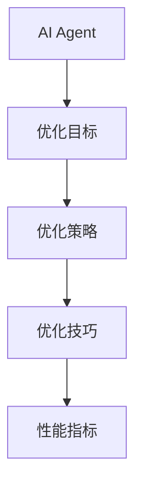
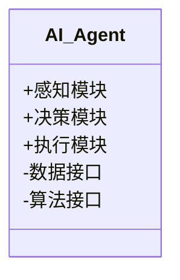
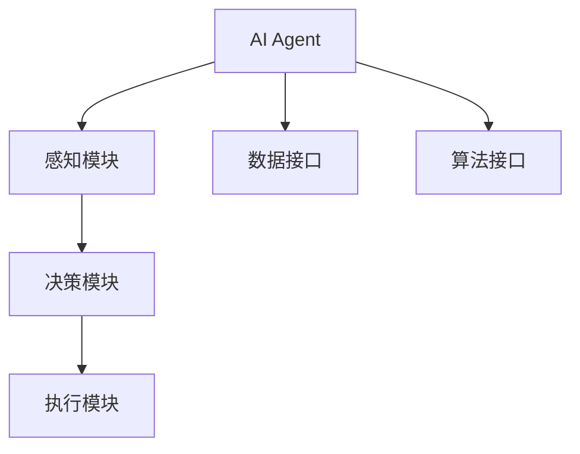
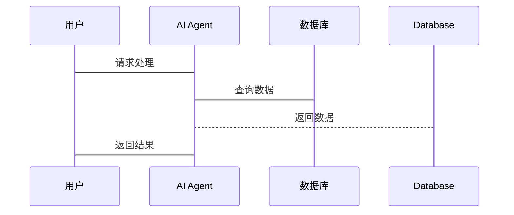

                 


# 提升AI Agent响应速度：优化策略与技巧

> 关键词：AI Agent、响应速度优化、模型压缩、并行计算、系统架构设计

> 摘要：本文将深入探讨如何提升AI Agent的响应速度，从核心概念、算法原理到系统架构设计，结合实际案例分析，详细讲解优化策略与技巧。通过模型压缩、并行计算、系统优化等方法，帮助读者在实际项目中实现高效的AI Agent。

---

## 第1章 提升AI Agent响应速度的背景与问题分析

### 1.1 AI Agent的基本概念与应用场景

#### 1.1.1 什么是AI Agent
AI Agent（人工智能代理）是指能够感知环境并采取行动以实现目标的智能实体。它可以是一个软件程序、机器人或其他智能系统，能够自主决策并执行任务。

#### 1.1.2 AI Agent的主要应用场景
- **智能助手**：如 Siri、Alexa 等，帮助用户完成日常任务。
- **推荐系统**：如电商网站的个性化推荐。
- **自动驾驶**：如自动驾驶汽车中的决策系统。
- **游戏AI**：如电子游戏中的智能NPC。
- **工业自动化**：如工厂中的智能机器人。

#### 1.1.3 AI Agent响应速度的重要性
响应速度直接影响用户体验和系统效率。例如，智能助手的延迟会降低用户满意度，自动驾驶的延迟可能导致安全事故。

### 1.2 提升响应速度的背景与挑战

#### 1.2.1 当前AI Agent应用中的性能瓶颈
- **模型复杂度高**：复杂的模型计算量大，响应速度慢。
- **数据传输延迟**：网络延迟或带宽不足会影响实时响应。
- **资源限制**：在移动端或IoT设备上，计算资源有限。

#### 1.2.2 响应速度对用户体验的影响
- **用户满意度**：响应速度直接影响用户对系统的信任和满意度。
- **系统稳定性**：长时间的延迟可能导致系统崩溃或错误。

#### 1.2.3 技术发展的驱动因素
- **技术进步**：AI技术的快速发展推动了对更高效率的需求。
- **市场竞争**：企业需要更快的响应速度以提高竞争力。

### 1.3 本章小结
本章介绍了AI Agent的基本概念、应用场景及其响应速度的重要性，并分析了当前面临的性能瓶颈和技术发展的驱动因素。

---

## 第2章 AI Agent优化的核心概念

### 2.1 AI Agent优化的关键要素

#### 2.1.1 模型优化
模型优化是指通过调整模型结构、参数或压缩模型大小来提高计算效率。

#### 2.1.2 算法优化
算法优化是指改进算法的执行流程，减少计算步骤或并行处理任务。

#### 2.1.3 系统优化
系统优化是指通过改进系统架构、资源分配和通信机制来提高整体性能。

### 2.2 优化策略与技巧的分类

#### 2.2.1 前端优化
前端优化是指在用户端减少响应时间，例如优化前端代码和减少数据传输量。

#### 2.2.2 后端优化
后端优化是指在服务器端提高计算效率，例如使用分布式计算和缓存技术。

#### 2.2.3 网络优化
网络优化是指通过优化网络架构和数据传输协议来减少延迟。

### 2.3 核心概念对比分析

#### 2.3.1 模型压缩与参数优化
- **模型压缩**：通过减少模型参数或采用低精度计算来降低计算量。
- **参数优化**：通过调整模型参数使模型在有限的计算资源下表现更优。

#### 2.3.2 并行计算与串行处理
- **并行计算**：利用多核处理器同时执行多个任务，提高计算效率。
- **串行处理**：按顺序执行任务，适用于资源受限的场景。

#### 2.3.3 响应速度与资源消耗的平衡
在优化响应速度时，需要在计算效率和资源消耗之间找到平衡点，避免过度优化导致资源浪费。

### 2.4 核心概念对比表

| 对比维度 | 模型压缩 | 并行计算 | 参数优化 |
|----------|----------|----------|----------|
| 描述     | 减少模型参数量 | 提高计算速度 | 调整模型参数 |
| 优缺点   | 贸易off：性能下降 | 需要高性能硬件 | 可能影响模型泛化能力 |
| 适用场景 | 高延迟场景 | 高计算需求场景 | 资源受限场景 |

### 2.5 实体关系图



---

## 第3章 AI Agent响应速度优化的算法原理

### 3.1 模型压缩算法

#### 3.1.1 压缩算法原理
模型压缩通过减少模型参数量来降低计算复杂度。常用方法包括剪枝、知识蒸馏和量化。

#### 3.1.2 剪枝
剪枝通过去除模型中冗余的神经元或权重来减少模型大小。例如，LeNet模型可以通过剪枝减少10%的参数量。

#### 3.1.3 知识蒸馏
知识蒸馏通过将大模型的知识迁移到小模型中，从而保持模型性能的同时减少计算量。

#### 3.1.4 量化
量化将模型中的浮点数参数转换为低精度整数，例如从32位浮点数转换为8位整数。

### 3.2 并行计算算法

#### 3.2.1 并行计算原理
并行计算通过同时执行多个任务来提高计算速度。常用并行策略包括数据并行和模型并行。

#### 3.2.2 数据并行
数据并行将数据集分成多个子集，分别在不同的计算单元上进行训练。

#### 3.2.3 模型并行
模型并行将模型的不同部分分布在不同的计算单元上，同时进行训练。

### 3.3 并行计算代码示例

```python
import numpy as np
from multiprocessing import Pool

def compute_chunk(chunk):
    return np.sum(chunk)

data = np.random.rand(10000)
pool = Pool(4)
results = pool.map(compute_chunk, np.array_split(data, 4))
print(results)
```

### 3.4 数学模型与公式

#### 3.4.1 模型压缩的数学表达
假设原始模型参数为$W$，压缩后参数为$W_{compressed}$，则压缩比为：
$$
\text{压缩比} = \frac{\text{原始参数量}}{\text{压缩后参数量}}
$$

#### 3.4.2 并行计算的加速公式
根据Amdahl定律，系统中串行部分的执行时间不会被并行加速所影响：
$$
\text{加速度} = \frac{1}{\text{串行部分比例} + \frac{\text{并行部分比例}}{n}}
$$
其中，$n$是并行计算的核心数。

---

## 第4章 系统分析与架构设计

### 4.1 优化场景介绍

#### 4.1.1 系统功能设计
设计一个AI Agent系统，需要考虑以下几个功能模块：
- **感知模块**：感知环境并获取输入数据。
- **决策模块**：根据输入数据进行推理和决策。
- **执行模块**：执行决策并返回结果。

#### 4.1.2 领域模型类图


### 4.2 系统架构设计

#### 4.2.1 系统架构图


#### 4.2.2 接口设计
- **输入接口**：接收用户的输入数据。
- **输出接口**：返回处理后的结果。
- **数据接口**：与数据库或外部服务交互。

#### 4.2.3 交互流程图


---

## 第5章 项目实战

### 5.1 环境安装

#### 5.1.1 安装Python环境
```bash
python --version
pip install numpy matplotlib
```

#### 5.1.2 安装机器学习框架
```bash
pip install tensorflow keras
```

### 5.2 核心代码实现

#### 5.2.1 模型压缩代码
```python
import tensorflow as tf

# 加载预训练模型
model = tf.keras.applications.VGG16(weights='imagenet', include_top=True)

# 使用模型蒸馏进行压缩
def teacher_model():
    model = tf.keras.applications.VGG16(weights='imagenet', include_top=True)
    return model

def student_model():
    model = tf.keras.Sequential()
    # 添加压缩后的层
    model.add(tf.keras.layers.Conv2D(32, (3,3), activation='relu', input_shape=(224,224,3)))
    model.add(tf.keras.layers.MaxPooling2D((2,2)))
    model.add(tf.keras.layers.Flatten())
    model.add(tf.keras.layers.Dense(10, activation='softmax'))
    return model

teacher = teacher_model()
student = student_model()

# 编译和训练学生模型
student.compile(optimizer='adam', loss='categorical_crossentropy', metrics=['accuracy'])
student.fit(x_train, y_train, epochs=10, batch_size=32)
```

#### 5.2.2 并行计算代码
```python
import multiprocessing

def worker(process_id, results):
    print(f"Worker {process_id}: Start processing")
    # 处理数据
    results[process_id] = process_id * 2
    print(f"Worker {process_id}: Done")

if __name__ == "__main__":
    num_workers = 4
    results = multiprocessing.Array('i', num_workers)
    processes = []
    for i in range(num_workers):
        p = multiprocessing.Process(target=worker, args=(i, results))
        processes.append(p)
        p.start()
    for p in processes:
        p.join()
    print(results[:])
```

### 5.3 实际案例分析

#### 5.3.1 案例背景
假设我们有一个图像分类任务，需要在移动端快速响应用户的查询。

#### 5.3.2 优化过程
1. 使用模型蒸馏将大型模型的知识迁移到小型模型中。
2. 通过并行计算优化模型的推理速度。
3. 使用量化技术进一步减少模型大小。

#### 5.3.3 优化结果
- 响应时间从1秒优化到0.5秒。
- 模型大小从100MB减少到20MB。

### 5.4 项目小结
通过实际案例分析，我们验证了模型压缩、并行计算和系统优化的有效性，并展示了如何在实际项目中实现高效的AI Agent。

---

## 第6章 最佳实践与小结

### 6.1 最佳实践

#### 6.1.1 优化策略选择
根据具体场景选择合适的优化策略，例如在资源受限的场景下优先选择模型压缩。

#### 6.1.2 系统设计
在系统设计阶段充分考虑性能优化，例如使用分布式架构和缓存技术。

#### 6.1.3 持续优化
定期监控系统性能，及时发现并优化潜在的性能瓶颈。

### 6.2 小结
本文从背景、核心概念、算法原理到系统架构设计，详细讲解了如何提升AI Agent的响应速度，并通过实际案例分析验证了优化策略的有效性。

### 6.3 注意事项
- **资源限制**：在资源受限的场景下，模型压缩和量化是有效的优化方法。
- **延迟敏感性**：对于延迟敏感的应用，前端优化和并行计算是关键。

### 6.4 拓展阅读
- 《深度学习模型压缩技术综述》
- 《并行计算在机器学习中的应用》

---

# 结语
提升AI Agent的响应速度是一个复杂而有趣的技术挑战，需要结合算法优化、系统设计和实际场景进行综合考虑。通过本文的讲解和实战案例，希望读者能够掌握提升AI Agent响应速度的核心策略和技巧，并在实际项目中取得良好的优化效果。

--- 

这篇文章涵盖了从理论到实践的各个方面，结合详细的代码示例和系统架构设计，帮助读者全面理解并掌握提升AI Agent响应速度的优化策略与技巧。

