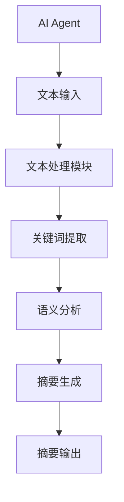
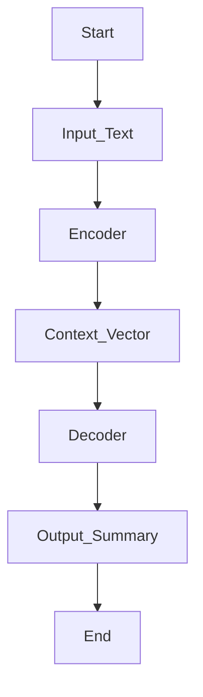

                 


# 文本摘要：让AI Agent提炼关键信息

---

## 关键词：
- 文本摘要
- AI Agent
- 自然语言处理
- 深度学习
- 强化学习

---

## 摘要：
本文系统地探讨了文本摘要的核心概念、算法原理及其与AI Agent的结合。通过详细分析文本摘要的实现方法，结合AI Agent的强化学习策略，提出了一种高效的信息提取方案。文章内容涵盖背景介绍、核心算法、系统架构设计和项目实战，旨在帮助读者全面理解文本摘要与AI Agent的协同工作原理，并通过实际案例展示其应用价值。

---

## 第一部分：文本摘要与AI Agent的背景与基础

### 第1章：文本摘要概述

#### 1.1 什么是文本摘要
- 1.1.1 文本摘要的定义
  - 文本摘要是指从大量文本数据中提取关键信息，生成简洁、准确的总结的过程。
  - 例如，从一篇新闻文章中提取标题和主要内容。

- 1.1.2 文本摘要的应用场景
  - 信息筛选：如邮件筛选、新闻阅读。
  - 自然语言处理：如智能客服、聊天机器人。
  - 数据分析：如日志分析、市场报告生成。

- 1.1.3 文本摘要的核心目标
  - 提炼关键信息。
  - 保持语义完整性。
  - 最大化信息密度。

#### 1.2 AI Agent的基本概念
- 1.2.1 AI Agent的定义
  - AI Agent是具有感知环境和自主决策能力的智能体，能够执行复杂任务。
  - 例如，智能助手Siri、自动驾驶汽车。

- 1.2.2 AI Agent的分类
  - 按智能水平：简单反射型、基于模型的反应型、目标驱动型、实用驱动型。
  - 按应用场景：服务型、决策型、交互型。

- 1.2.3 AI Agent与文本摘要的关系
  - AI Agent通过文本摘要快速获取关键信息，提升决策效率。
  - 文本摘要帮助AI Agent更好地理解输入数据，优化其执行任务的能力。

#### 1.3 文本摘要与AI Agent的结合
- 1.3.1 AI Agent如何辅助文本摘要
  - 通过上下文理解生成更准确的摘要。
  - 利用外部知识库优化摘要结果。

- 1.3.2 文本摘要如何提升AI Agent的效率
  - 减少数据处理量，加快响应速度。
  - 提高信息提取的准确性，增强决策能力。

- 1.3.3 两者的协同工作原理
  - AI Agent接收原始文本，通过文本摘要模块提取关键信息。
  - 摘要结果作为输入，用于AI Agent的后续处理和决策。

### 第2章：文本摘要的核心概念与联系

#### 2.1 文本摘要的关键属性对比
- 表格对比：
  | 属性       | 基于规则的摘要 | 基于统计的摘要 | 基于深度学习的摘要 |
  |------------|----------------|----------------|--------------------|
  | 方法        | 确定关键词、分句 | 频率统计、TF-IDF | 神经网络模型 |
  | 优势        | 简单易实现      | 更准确          | 更接近人类理解能力 |
  | 劣势        | 依赖规则库      | 语义理解不足     | 计算资源消耗大 |
  | 应用场景      | 简单文本处理     | 中等复杂度场景    | 复杂文本分析 |

#### 2.2 文本摘要与AI Agent的实体关系图


---

## 第二部分：文本摘要算法与实现

### 第3章：文本摘要算法原理

#### 3.1 基于Seq2Seq模型的文本摘要算法
- 3.1.1 算法概述
  - Seq2Seq模型通过编码器-解码器结构实现文本摘要。
  - 编码器将输入文本转化为向量表示，解码器生成目标摘要。

- 3.1.2 算法流程图


- 3.1.3 数学模型与公式
  - 编码器部分：
    $$ \text{Encoder} = f(x) $$
    $$ x = \text{输入文本} $$
  - 解码器部分：
    $$ \text{Decoder} = g(y_{\text{prev}}, c) $$
    $$ y_{\text{prev}} = \text{前一步输出} $$
    $$ c = \text{上下文向量} $$

- 3.1.4 实际案例分析
  - 示例文本：一篇新闻文章。
  - 摘要结果：生成简洁的标题和主要内容。

#### 3.2 基于强化学习的AI Agent优化
- 3.2.1 强化学习的基本原理
  - AI Agent通过与环境交互，学习最优策略。
  - 奖励机制：根据摘要的准确性和流畅性给予奖励。

- 3.2.2 算法优化流程
  ```mermaid
  graph TD
      Start --> Input_Summary
      Input_Summary --> Agent
      Agent --> Action
      Action --> Environment
      Environment --> Reward
      Reward --> Agent
      Agent --> Optimized_Summary
      Optimized_Summary --> End
  ```

- 3.2.3 数学模型与公式
  - 损失函数：
    $$ \text{Loss} = -\sum_{t=1}^{T} \log p(y_t | y_{<t}, x) $$
    $$ y_t = \text{预测输出} $$
    $$ x = \text{输入文本} $$
  - 奖励函数：
    $$ R = \alpha \cdot \text{BLEU} + \beta \cdot \text{ROUGE} $$
    $$ \alpha, \beta = \text{权重系数} $$

---

## 第三部分：AI Agent的设计与实现

### 第4章：AI Agent的设计原则

#### 4.1 设计原则
- 4.1.1 模块化设计
  - 输入模块、处理模块、输出模块。
- 4.1.2 可扩展性
  - 支持多种摘要算法和任务类型。
- 4.1.3 高效性
  - 优化计算流程，减少资源消耗。

#### 4.2 实际案例分析
- 案例：AI Agent辅助客服系统。
  - 输入：客户邮件。
  - 处理：文本摘要提取关键信息。
  - 输出：生成回复模板。

---

## 第四部分：系统架构与项目实战

### 第5章：系统架构设计

#### 5.1 系统功能设计
- 5.1.1 领域模型
  ```mermaid
  classDiagram
      class Text_Input {
          String text;
      }
      class Summarization_Module {
          void generate_summary();
      }
      class AI_Agent {
          void process_request();
      }
      Text_Input --> Summarization_Module
      Summarization_Module --> AI_Agent
  ```

- 5.1.2 系统架构
  ```mermaid
  architecture
      Client
      Server
      Database
  ```

- 5.1.3 接口设计
  - 输入接口：接收文本数据。
  - 输出接口：返回摘要结果。
  - 交互接口：与AI Agent进行通信。

#### 5.2 项目实战
- 5.2.1 环境安装
  - 安装Python、TensorFlow、Keras等库。

- 5.2.2 核心代码实现
  ```python
  import tensorflow as tf
  from tensorflow.keras import layers

  # 定义编码器
  encoder = layers.GRU(128, return_sequences=True)
  # 定义解码器
  decoder = layers.GRU(128, return_sequences=True)
  # 编码器输出
  encoded = encoder(input_text)
  # 解码器输出
  decoded = decoder(encoded)
  # 生成摘要
  summary = layers.Dense(vocab_size, activation='softmax')(decoded)
  ```

- 5.2.3 实际案例分析
  - 输入文本：《如何提高代码质量？》
  - 摘要结果：生成一篇简短的总结。

---

## 第五部分：总结与展望

### 第6章：最佳实践与注意事项

#### 6.1 最佳实践
- 选择合适的文本摘要算法，根据具体需求调整参数。
- 定期更新训练数据，保持模型的准确性。
- 使用高效的计算资源，优化算法性能。

#### 6.2 小结
- 本文详细讲解了文本摘要的核心概念与实现方法，结合AI Agent的应用场景，提出了一种高效的解决方案。
- 通过实际案例分析，展示了文本摘要与AI Agent协同工作的优势。

#### 6.3 注意事项
- 确保数据质量，避免噪声干扰。
- 保护用户隐私，遵守数据安全规范。

#### 6.4 拓展阅读
- 深度学习与自然语言处理的结合。
- 强化学习在文本摘要中的应用。

---

## 附录

### 附录A：术语表
- Text Summarization：文本摘要。
- AI Agent：人工智能代理。

### 附录B：代码示例
```python
# 文本摘要算法实现
def summarize(text):
    # 编码器处理
    encoded = encoder.encode(text)
    # 解码器生成摘要
    summary = decoder.decode(encoded)
    return summary
```

---

通过以上目录大纲，您可以根据需要逐步展开每个章节的具体内容，确保文章逻辑清晰、结构紧凑，满足技术博客的专业性和可读性要求。

