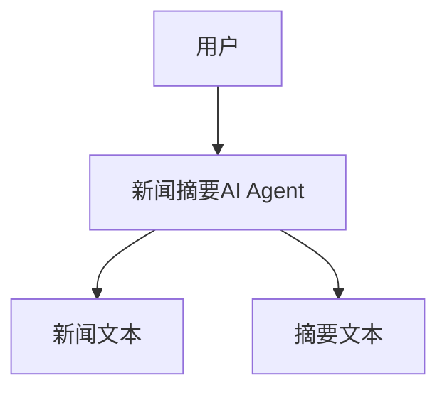
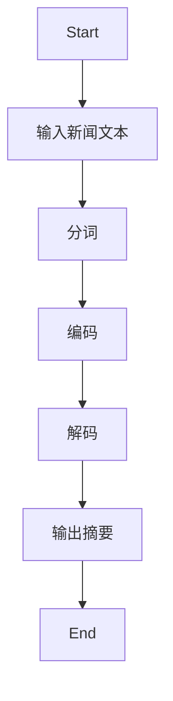
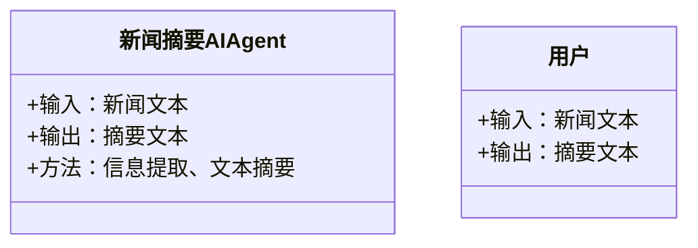
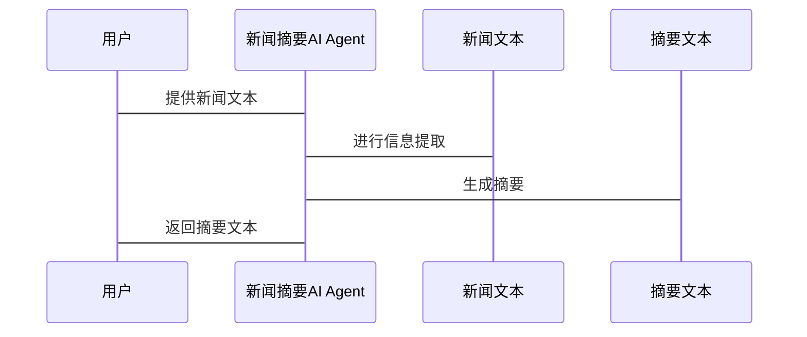

                 


# 新闻摘要 AI Agent：LLM 驱动的信息提取与总结

## 关键词：LLM、新闻摘要、AI Agent、信息提取、文本总结

## 摘要：本文深入探讨了基于LLM（大语言模型）的新闻摘要AI Agent，分析了其信息提取与总结的核心原理、系统架构设计及实际应用。文章从问题背景、核心概念、算法原理、系统分析到项目实战，全面解析了如何利用LLM技术实现高效的新闻摘要生成，为AI技术在新闻处理中的应用提供了详尽的技术参考。

---

# 第一部分: 新闻摘要 AI Agent 背景与核心概念

## 第1章: 新闻摘要 AI Agent 的背景与问题描述

### 1.1 问题背景

#### 1.1.1 当前新闻摘要的痛点
在信息爆炸的时代，新闻的数量呈现指数级增长，用户每天需要处理的信息量巨大。传统的新闻阅读方式耗时且效率低下，用户难以快速获取新闻的核心信息。新闻摘要作为信息筛选的重要工具，需求日益增长。

#### 1.1.2 AI 技术在新闻摘要中的应用潜力
AI技术，特别是大语言模型（LLM），在自然语言处理领域取得了显著进展。通过LLM生成新闻摘要，可以实现自动化、高效化的内容处理，满足用户对快速信息获取的需求。

#### 1.1.3 LLM 驱动的新闻摘要的优势
LLM具备强大的上下文理解和生成能力，能够准确捕捉新闻文本的关键信息，并生成连贯、简洁的摘要。与传统基于规则的摘要方法相比，LLM能够更好地适应不同类型的新闻内容，生成质量更高的摘要。

### 1.2 问题描述

#### 1.2.1 新闻摘要的基本定义
新闻摘要是指从一篇新闻文本中提取关键信息，生成一篇简短的、能够概括原文核心内容的摘要。

#### 1.2.2 LLM 驱动的新闻摘要的核心问题
如何利用LLM技术高效、准确地提取新闻文本中的关键信息，并生成高质量的摘要，是当前研究的重点。

#### 1.2.3 信息提取与总结的关键挑战
- **信息提取的准确性**：如何准确识别新闻文本中的关键信息。
- **文本摘要的连贯性**：生成的摘要需要保持语义连贯，避免信息断层。
- **模型的可解释性**：需要能够解释生成摘要的决策过程，以便进行优化和改进。

### 1.3 问题解决与边界

#### 1.3.1 新闻摘要 AI Agent 的解决方案
通过LLM技术实现新闻文本的自动摘要，结合自然语言处理技术，优化摘要生成的效果。

#### 1.3.2 解决方案的边界与外延
- **边界**：仅关注新闻文本的摘要生成，不涉及图像、视频等内容。
- **外延**：可扩展至其他类型的文本摘要，如学术论文、商业报告等。

#### 1.3.3 核心要素与组成结构
新闻摘要AI Agent的核心要素包括：
- 输入：新闻文本
- 处理模块：信息提取、语义理解
- 输出：新闻摘要
- 辅助模块：模型训练、优化算法

### 1.4 核心概念与联系

#### 1.4.1 核心概念原理
新闻摘要AI Agent通过LLM对新闻文本进行编码、解码，生成摘要。编码阶段将文本转化为向量表示，解码阶段根据向量生成摘要文本。

#### 1.4.2 核心概念属性特征对比表
| 概念         | 输入      | 输出      | 方法        |
|--------------|-----------|-----------|-------------|
| 信息提取     | 新闻文本   | 关键信息   | LLM驱动     |
| 文本摘要     | 新闻文本   | 摘要文本   | LLM生成     |
| LLM 驱动     | 各类文本   | 摘要文本   | 大模型生成   |

#### 1.4.3 实体关系图


---

# 第二部分: 算法原理讲解

## 第2章: LLM 驱动的新闻摘要算法原理

### 2.1 算法流程概述

#### 2.1.1 算法流程图


### 2.2 算法实现细节

#### 2.2.1 输入处理
新闻文本的预处理包括分词、去除停用词等步骤，以提高模型的处理效率。

#### 2.2.2 模型编码
使用LLM对新闻文本进行编码，生成文本的向量表示。

#### 2.2.3 模型解码
基于编码结果，生成摘要文本。

### 2.3 数学模型与公式

#### 2.3.1 概率计算
摘要生成的概率模型可以表示为：
$$ P(S|T) = \argmax_{S} P(S|T) $$
其中，\( S \) 是生成的摘要，\( T \) 是输入的新闻文本。

#### 2.3.2 损失函数
使用交叉熵损失函数来优化模型：
$$ L = -\sum_{i=1}^{n} \log P(s_i|s_{<i}, T) $$

---

# 第三部分: 系统分析与架构设计

## 第3章: 新闻摘要 AI Agent 的系统分析

### 3.1 项目背景
新闻摘要AI Agent旨在通过LLM技术，实现高效的信息提取与摘要生成，提升用户信息获取效率。

### 3.2 系统功能设计

#### 3.2.1 领域模型


### 3.3 系统架构设计

#### 3.3.1 分层架构
系统采用分层架构，包括数据层、处理层、应用层。

#### 3.3.2 组件关系


### 3.4 系统接口与交互

#### 3.4.1 接口设计
- 输入接口：接收新闻文本
- 输出接口：返回摘要文本

#### 3.4.2 交互流程


---

# 第四部分: 项目实战

## 第4章: 新闻摘要 AI Agent 的实现与应用

### 4.1 项目环境与安装

#### 4.1.1 环境安装
安装Python和必要的库，如TensorFlow、PyTorch等。

#### 4.1.2 代码实现
```python
def load_model():
    model = load_weights("llm_weights.h5")
    return model

def generate_summary(model, text):
    summary = model.decode(text)
    return summary

if __name__ == "__main__":
    model = load_model()
    text = "..."
    summary = generate_summary(model, text)
    print(summary)
```

### 4.2 代码分析

#### 4.2.1 核心代码解读
- `load_model()`：加载预训练好的模型权重。
- `generate_summary()`：使用模型生成摘要。

#### 4.2.2 功能实现
模型加载和新闻文本处理，生成摘要。

### 4.3 实际案例分析

#### 4.3.1 案例分析
输入新闻文本，生成摘要，展示生成过程。

#### 4.3.2 代码优化
优化模型参数，提升生成效率。

### 4.4 项目小结
总结项目实现的关键点，分析优缺点。

---

# 第五部分: 最佳实践与总结

## 第5章: 最佳实践与总结

### 5.1 小结
总结新闻摘要AI Agent的核心技术与实现方法。

### 5.2 注意事项
- 数据质量的重要性
- 模型调优的方法
- 代码实现的注意事项

### 5.3 拓展阅读
推荐相关领域的书籍和论文，供进一步学习。

---

通过以上目录结构，我们可以系统地学习和理解新闻摘要AI Agent的实现原理、系统架构及实际应用，为后续的开发和优化提供理论支持。

