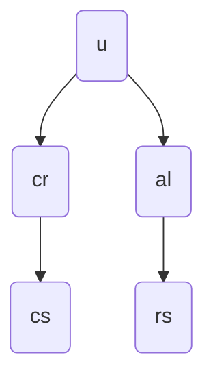
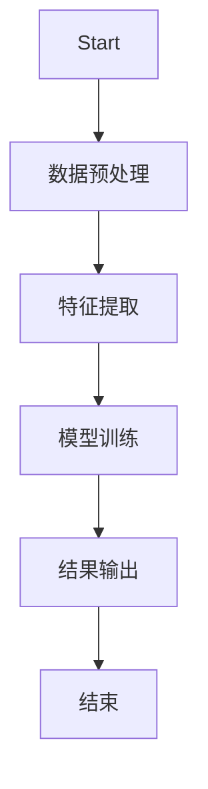
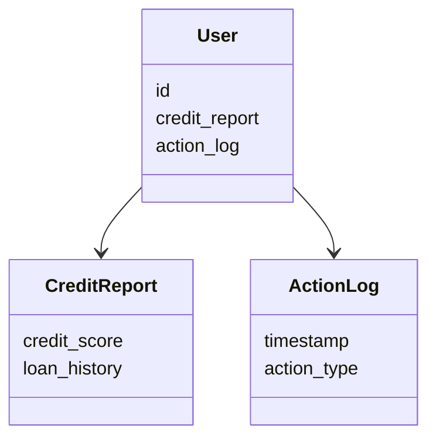
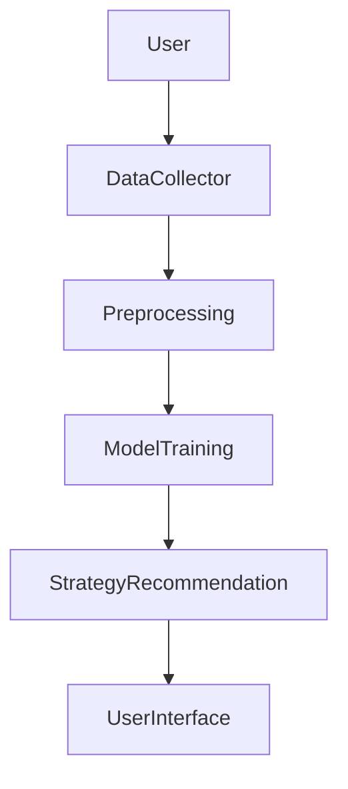
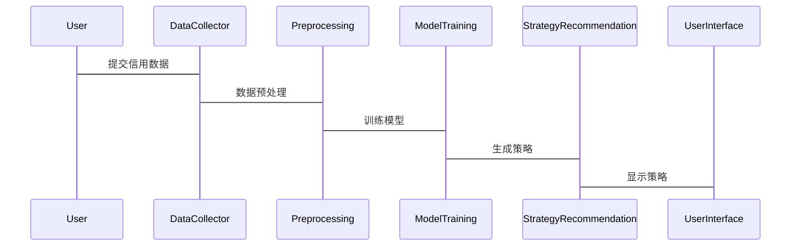

                 


# 智能个人信用修复策略推荐系统

## 关键词：智能信用修复，推荐系统，机器学习，信用评估，用户行为分析

## 摘要：本文介绍了一种基于人工智能的智能个人信用修复策略推荐系统，利用机器学习算法分析用户信用数据和行为，推荐个性化的修复策略，帮助个人有效管理信用记录。

---

# 第1章 背景介绍

## 1.1 问题背景与描述

### 1.1.1 个人信用评估的重要性
个人信用评估是金融机构评估客户信用风险的重要手段，直接影响贷款审批、信用卡额度等。然而，个人信用记录可能因疏忽或特殊情况而出现问题，影响个人的信用评分。

### 1.1.2 当前信用修复的痛点
传统的信用修复方法缺乏智能化，用户难以获得个性化的修复策略。修复过程复杂且耗时，用户往往无法有效管理和优化信用记录。

### 1.1.3 智能信用修复的必要性
通过人工智能技术，可以自动化分析信用数据和用户行为，提供个性化的修复建议，帮助用户高效优化信用记录。

## 1.2 问题解决与边界

### 1.2.1 智能信用修复的核心目标
通过分析用户的信用数据和行为，推荐最优的信用修复策略，帮助用户提高信用评分。

### 1.2.2 系统的边界与外延
系统仅针对个人信用修复，不涉及企业信用评估。系统边界包括信用数据收集、分析、策略推荐，不处理实际的信用修复操作。

### 1.2.3 核心要素与组成结构
核心要素包括信用数据、用户行为、修复策略，组成结构包括数据层、算法层、推荐层。

## 1.3 本章小结
本章介绍了智能信用修复的重要性、当前痛点及系统目标，为后续章节打下基础。

---

# 第2章 核心概念与联系

## 2.1 核心概念原理

### 2.1.1 信用评估模型
模型分析用户信用历史、还款能力、行为特征，预测信用风险。

### 2.1.2 推荐算法
基于机器学习的推荐系统，分析用户信用数据，推荐修复策略。

### 2.1.3 用户行为分析
分析用户的信用行为，预测行为模式，辅助策略制定。

## 2.2 概念属性特征对比

| 概念        | 属性          | 特征                          |
|-------------|---------------|----------------------------|
| 信用评估模型 | 数据来源      | 用户信用记录、行为数据        |
| 推荐算法     | 类型          | 协同过滤、基于内容的推荐      |
| 用户行为分析 | 方法          | 点击流分析、时间序列分析      |

## 2.3 ER实体关系图


## 2.4 本章小结
本章详细解释了系统的核心概念及其关系，为后续算法和系统设计奠定基础。

---

# 第3章 算法原理讲解

## 3.1 推荐算法流程



## 3.2 协同过滤算法

### 3.2.1 基于用户的协同过滤
寻找与用户信用行为相似的用户群体，推荐相似的修复策略。

### 3.2.2 余弦相似度计算
$$\text{similarity}(u_i, u_j) = \frac{\sum_{k=1}^n r_{ik} r_{jk}}{\sqrt{\sum_{k=1}^n r_{ik}^2} \sqrt{\sum_{k=1}^n r_{jk}^2}}$$

## 3.3 基于内容的推荐算法

### 3.3.1 信用特征提取
提取用户信用记录中的关键特征，如还款准时率、信用历史长度。

### 3.3.2 相似度计算
基于信用特征计算信用修复策略的相似度。

## 3.4 推荐结果评估

### 3.4.1 指标选择
如准确率、召回率、F1分数。

### 3.4.2 评估方法
采用交叉验证评估推荐系统的性能。

## 3.5 本章小结
本章详细讲解了推荐算法的原理和实现，为系统设计提供了算法基础。

---

# 第4章 系统分析与架构设计

## 4.1 问题场景介绍

### 4.1.1 系统功能
数据采集、信用评估、策略推荐、用户交互。

## 4.2 系统功能设计

### 4.2.1 领域模型


### 4.2.2 系统架构


## 4.3 系统接口设计

### 4.3.1 数据接口
用户数据输入接口、信用报告接口。

### 4.3.2 推荐接口
返回修复策略接口。

## 4.4 系统交互流程图


## 4.5 本章小结
本章详细描述了系统的架构设计和交互流程，为系统实现提供了指导。

---

# 第5章 项目实战

## 5.1 环境安装

### 5.1.1 Python环境
安装Python 3.x，安装numpy、pandas、scikit-learn、matplotlib。

## 5.2 系统核心实现

### 5.2.1 信用数据预处理
```python
import pandas as pd
data = pd.read_csv('credit_data.csv')
data = data.dropna()
```

### 5.2.2 特征提取与建模
```python
from sklearn.model_selection import train_test_split
from sklearn.metrics.pairwise import cosine_similarity

def compute_similarity(data):
    user_ids = data['user_id'].unique()
    similarities = {}
    for u1 in user_ids:
        for u2 in user_ids[u1:]:
            if u1 != u2:
                user1 = data[data['user_id'] == u1]
                user2 = data[data['user_id'] == u2]
                similarity = cosine_similarity(user1[['features']], user2[['features']])
                similarities[(u1, u2)] = similarity[0,0]
    return similarities
```

### 5.2.3 策略推荐实现
```python
def recommend_strategy(similarities, target_user):
    target_similarities = [sim for u, sim in similarities.items() if u[0] == target_user]
    sorted_users = sorted(target_similarities, key=lambda x: x[1], reverse=True)
    top_users = sorted_users[:5]
    strategies = []
    for u in top_users:
        strategies.append(users[u[0]]['credit_strategy'])
    return strategies
```

## 5.3 代码应用解读与分析

### 5.3.1 数据预处理
处理缺失值和异常值，确保数据质量。

### 5.3.2 模型训练
使用协同过滤算法训练推荐模型，计算用户相似度。

## 5.4 实际案例分析

### 5.4.1 案例数据
用户A的信用记录显示多次逾期，系统推荐提高还款能力的策略。

### 5.4.2 策略分析
推荐用户A建立紧急备用金，优化信用报告。

## 5.5 本章小结
本章通过实际案例展示了系统的实现过程，验证了推荐算法的有效性。

---

# 第6章 总结与展望

## 6.1 核心内容回顾
系统利用AI技术推荐信用修复策略，帮助用户优化信用记录。

## 6.2 最佳实践 tips

### 6.2.1 数据质量
确保数据准确性和完整性。

### 6.2.2 模型选择
根据需求选择合适的推荐算法。

### 6.2.3 用户隐私
保护用户数据隐私，遵守相关法规。

## 6.3 小结
系统在智能信用修复方面具有广阔的应用前景。

## 6.4 注意事项
避免过度依赖单一算法，定期更新模型。

## 6.5 拓展阅读
推荐阅读相关领域的书籍和论文，持续关注新技术发展。

---

# 结语

智能个人信用修复策略推荐系统利用AI技术，为用户提供个性化的信用管理方案，帮助用户有效优化信用记录，提升信用评分。希望本文能为相关领域提供有价值的参考和指导。

--- 

* THE END *

