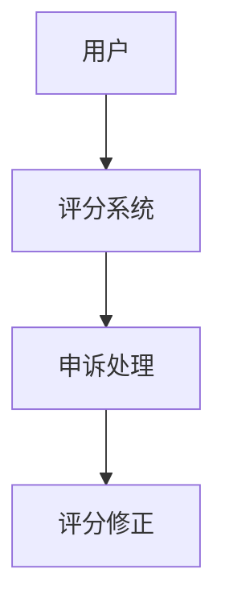
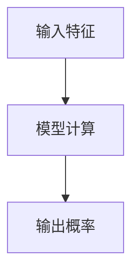
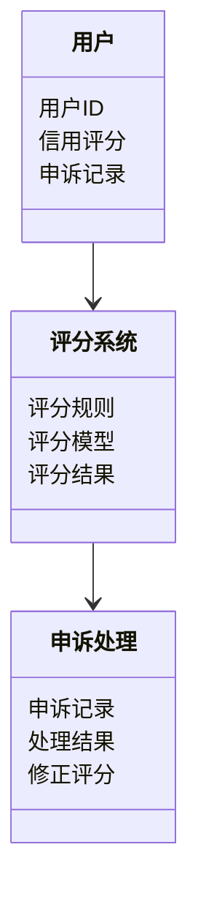
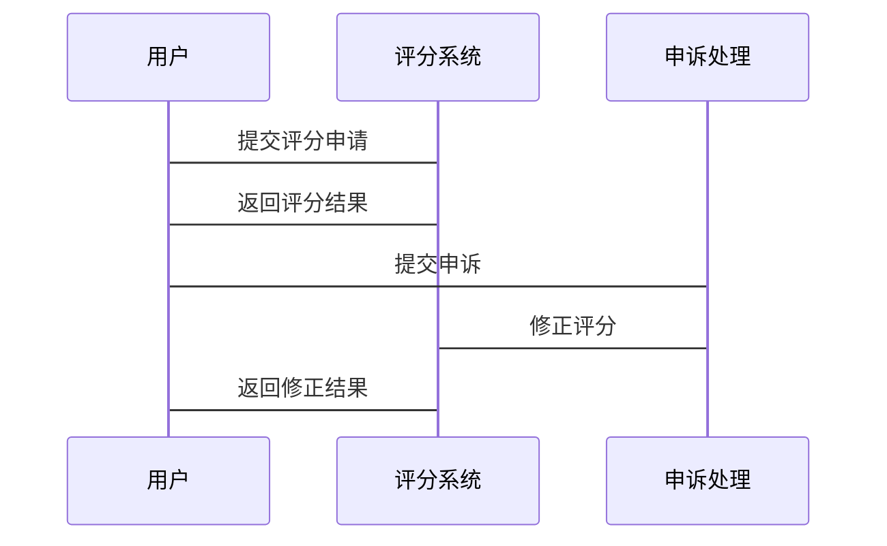

                 


# 第一部分: 智能个人信用评分申诉处理系统背景介绍

# 第1章: 智能个人信用评分申诉处理系统概述

## 1.1 问题背景与描述

### 1.1.1 传统信用评分系统的局限性
传统信用评分系统依赖简单的规则和统计模型，无法捕捉复杂的信用行为，容易产生偏差。

### 1.1.2 智能信用评分的必要性
引入机器学习和大数据分析，提高评分的准确性和个性化。

### 1.1.3 申诉处理系统的核心问题
用户对评分结果有异议时，需要通过系统快速处理和修正。

## 1.2 问题解决与边界

### 1.2.1 智能评分的核心解决思路
通过机器学习模型分析多维度数据，提供更精准的评分。

### 1.2.2 系统的边界与外延
明确系统的输入输出范围，以及与外部系统的接口。

### 1.2.3 核心要素与组成分析
用户数据、评分模型、申诉记录等。

## 1.3 核心概念与联系

### 1.3.1 智能评分系统的原理
利用机器学习模型分析用户行为和历史数据。

### 1.3.2 核心概念对比表格
| 概念 | 特性 |
|------|------|
| 传统评分 | 简单规则驱动 |
| 智能评分 | 机器学习驱动 |

### 1.3.3 实体关系图


# 第2章: 智能评分算法原理

## 2.1 算法原理讲解

### 2.1.1 逻辑回归模型


### 2.1.2 XGBoost模型


## 2.2 数学模型与公式

### 2.2.1 逻辑回归公式
$$ P(y=1|x) = \frac{1}{1 + e^{- (w \cdot x + b)}} $$

### 2.2.2 XGBoost损失函数
$$ \text{损失函数} = \sum_{i=1}^{n} (y_i - \hat{y}_i)^2 $$`

## 2.3 算法优缺点对比

### 2.3.1 逻辑回归
- 优点：简单、解释性强
- 缺点：对复杂关系建模能力有限

### 2.3.2 XGBoost
- 优点：高精度、鲁棒性强
- 缺点：计算复杂度高

# 第3章: 系统分析与架构设计

## 3.1 问题场景分析

### 3.1.1 用户评分申请流程
用户提交评分申请，系统计算评分并返回结果。

### 3.1.2 评分计算与申诉处理
用户对评分结果有异议时，提交申诉，系统处理并修正评分。

### 3.1.3 系统交互流程
用户与系统之间的交互流程，包括申请、计算、申诉、处理等步骤。

## 3.2 系统架构设计

### 3.2.1 领域模型


### 3.2.2 系统架构图


### 3.2.3 接口设计
- 用户接口：提交评分申请、提交申诉、查看结果
- 系统接口：评分计算接口、申诉处理接口、结果反馈接口

### 3.2.4 交互流程图


# 第4章: 项目实战

## 4.1 环境安装与配置

### 4.1.1 安装Python和必要的库
安装Python 3.x，安装numpy、pandas、xgboost、scikit-learn等库。

### 4.1.2 安装Jupyter Notebook或其他开发环境
配置Jupyter Notebook，确保环境可以运行Python代码。

## 4.2 核心代码实现

### 4.2.1 数据预处理
```python
import pandas as pd
import numpy as np

# 加载数据
data = pd.read_csv('credit.csv')

# 数据清洗
data = data.dropna()
data = pd.get_dummies(data)
```

### 4.2.2 构建逻辑回归模型
```python
from sklearn.linear_model import LogisticRegression
from sklearn.model_selection import train_test_split

# 划分数据集
X_train, X_test, y_train, y_test = train_test_split(data.drop('score', axis=1), data['score'], test_size=0.2)

# 训练模型
model = LogisticRegression()
model.fit(X_train, y_train)

# 预测
predictions = model.predict(X_test)
```

### 4.2.3 构建XGBoost模型
```python
import xgboost as xgb

# 转换数据格式
dtrain = xgb.DMatrix(X_train, label=y_train)
dtest = xgb.DMatrix(X_test, label=y_test)

# 训练模型
params = {'max_depth': 3, 'eta': 0.2, 'objective': 'binary:logistic'}
model = xgb.train(params, dtrain, num_boost_round=5)

# 预测
predictions = model.predict(dtest)
```

### 4.2.4 申诉处理逻辑
```python
def handle_complaints(data):
    # 调用评分修正函数
    corrected_scores = correct_scores(data)
    return corrected_scores

# 示例调用
complaint_data = {'user_id': '123', 'score': 650}
corrected = handle_complaints(complaint_data)
print(corrected)
```

## 4.3 案例分析与代码解读

### 4.3.1 数据分析
通过数据可视化工具分析用户特征，发现评分低的原因。

### 4.3.2 模型评估
使用混淆矩阵、ROC曲线等方法评估模型性能。

### 4.3.3 申诉处理流程
用户提交申诉后，系统根据新数据重新计算评分并反馈结果。

## 4.4 项目小结

### 4.4.1 系统实现的关键点
- 数据清洗与特征工程
- 模型选择与调优
- 申诉处理流程的自动化

### 4.4.2 系统优化建议
- 引入实时数据更新
- 增加用户反馈机制
- 定期模型再训练

# 第5章: 最佳实践与总结

## 5.1 最佳实践 tips

### 5.1.1 数据处理
- 确保数据清洗充分，特征工程到位
- 处理缺失值和异常值

### 5.1.2 模型选择
- 根据数据特性选择合适的模型
- 结合业务需求选择模型

### 5.1.3 申诉处理
- 设计高效的处理流程
- 确保透明性和公正性

## 5.2 系统小结

### 5.2.1 系统整体架构
用户-系统交互，模型计算，申诉处理的完整流程。

### 5.2.2 核心组件总结
用户模块、评分系统、申诉处理模块。

## 5.3 注意事项

### 5.3.1 数据隐私
确保用户数据的安全和隐私保护。

### 5.3.2 模型解释性
提高模型的可解释性，便于用户理解评分结果。

### 5.3.3 系统稳定性
确保系统运行稳定，避免服务中断。

## 5.4 拓展阅读

### 5.4.1 机器学习在金融领域的应用
了解机器学习在金融领域的其他应用，如风险控制、欺诈检测等。

### 5.4.2 深度学习模型的应用
探索使用深度学习模型（如神经网络）进行信用评分的可能性。

### 5.4.3 评分系统的未来趋势
探讨评分系统的发展方向，如引入区块链技术，提高系统的透明度和安全性。

# 附录: 参考文献

### 1. 书籍
- 《机器学习实战》
- 《深入浅出机器学习》

### 2. 网站
- scikit-learn 官网
- xgboost 官网

### 3. 工具
- Jupyter Notebook
- Pandas
- Matplotlib

### 4. 项目案例
- 公开的信用评分系统项目

---

通过以上目录结构，可以有条不紊地撰写一篇关于《智能个人信用评分申诉处理系统》的技术博客文章，内容详实且结构清晰。

