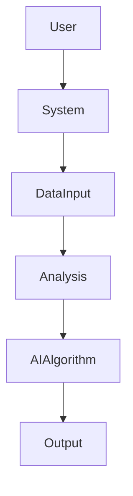
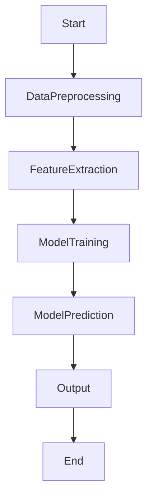

                 


# 智能个人税务筹划建议生成与模拟系统

> 关键词：智能税务筹划、人工智能、算法原理、系统架构、项目实战

> 摘要：本文将详细介绍智能个人税务筹划建议生成与模拟系统的核心技术与实现方案。通过分析传统税务筹划的痛点，结合人工智能技术，提出一种基于AI的税务筹划系统，并详细阐述其算法原理、系统架构设计、项目实现及实际案例分析。本文旨在为个人用户提供一种高效、智能的税务筹划工具，帮助他们在合法合规的前提下优化税务负担。

---

# 第一部分: 智能个人税务筹划建议生成与模拟系统背景介绍

# 第1章: 智能个人税务筹划概述

## 1.1 税务筹划的基本概念

### 1.1.1 税务筹划的定义与目的

税务筹划是通过合法手段，对个人或企业的税务负担进行优化和管理的过程。其目的是在遵守法律法规的前提下，最大限度地减少税务支出，提高资金使用效率。税务筹划的核心在于合理利用税收政策和法律法规的漏洞，通过科学的规划和调整，实现税务负担的最小化。

### 1.1.2 税务筹划的合法性和边界

税务筹划必须在法律允许的范围内进行，不能通过违法手段逃税或避税。合法的税务筹划需要遵循税收法律的基本原则，如合法性原则、合理性原则和经济性原则。税务筹划的边界在于不能损害国家利益和社会公共利益，不能通过虚假申报或隐瞒收入等手段偷税漏税。

### 1.1.3 税务筹划的核心要素与结构

税务筹划的核心要素包括税收政策、收入结构、支出结构、资产配置、税务优惠等。其结构通常包括以下几个方面：
1. **收入分析**：分析个人或企业的收入来源和结构。
2. **支出分析**：分析个人或企业的支出项目和金额。
3. **税务政策分析**：研究相关的税收政策和法规。
4. **优化方案设计**：根据分析结果，设计最优的税务筹划方案。
5. **方案实施与监控**：实施优化方案，并进行动态监控和调整。

## 1.2 传统税务筹划的痛点与挑战

### 1.2.1 传统税务筹划的效率问题

传统的税务筹划主要依赖人工操作，效率较低。个人或企业需要花费大量时间收集和整理财务数据，分析税收政策，设计优化方案。这种方法不仅效率低下，而且容易出错，难以满足现代人对高效、精准服务的需求。

### 1.2.2 信息不对称与专业性不足

传统税务筹划过程中，个人或企业往往面临信息不对称的问题。他们可能无法全面了解最新的税收政策，或者不清楚如何合理利用税收优惠。此外，税务筹划需要较高的专业知识和技能，普通人难以独立完成复杂的税务规划。

### 1.2.3 个性化需求与复杂性增加

随着经济的发展和个人财务状况的复杂化，税务筹划的个性化需求日益增加。每个人或企业的财务状况、收入结构和税务目标都不同，这使得传统的通用化税务筹划方法难以满足个性化需求。此外，复杂的税收政策和多变的经济环境进一步增加了税务筹划的难度。

## 1.3 智能税务筹划的背景与发展

### 1.3.1 人工智能技术的快速发展

人工智能技术的快速发展为税务筹划带来了新的机遇。通过机器学习、自然语言处理和大数据分析等技术，可以实现对大量税务数据的自动分析和优化方案的自动生成。人工智能技术的应用不仅提高了税务筹划的效率，还能够提供更加精准和个性化的建议。

### 1.3.2 智能税务筹划的市场需求

随着个人财务管理和税务优化需求的增加，智能税务筹划系统逐渐成为市场上的热门需求。个人用户希望通过智能化的工具实现高效的税务规划，而企业也希望通过智能化的税务管理系统优化税务负担。智能税务筹划系统的市场需求主要集中在以下几个方面：
1. **个性化税务规划**：根据个人或企业的具体情况，提供定制化的税务优化方案。
2. **实时数据分析**：通过实时数据分析，动态调整税务策略。
3. **智能决策支持**：通过人工智能技术提供决策支持，帮助用户做出最优选择。

### 1.3.3 智能税务筹划的行业现状与趋势

目前，智能税务筹划系统在国内外的应用还处于起步阶段，但其发展前景广阔。随着人工智能技术的不断进步和税收政策的不断完善，智能税务筹划系统将逐渐成为税务管理的重要工具。未来的趋势包括：
1. **智能化与自动化**：通过人工智能技术实现税务筹划的智能化和自动化。
2. **数据驱动**：利用大数据分析技术，实现精准的税务优化。
3. **个性化与定制化**：根据用户的个性化需求，提供定制化的税务筹划方案。

## 1.4 本章小结

本章主要介绍了智能个人税务筹划的基本概念、传统税务筹划的痛点与挑战，以及智能税务筹划的背景与发展。通过分析传统税务筹划的低效性和信息不对称问题，我们提出了智能税务筹划的必要性和可行性。随着人工智能技术的快速发展，智能税务筹划系统将成为未来的趋势，为个人和企业提供更加高效、精准的税务管理工具。

---

# 第二部分: 智能个人税务筹划系统的核心概念与联系

# 第2章: 智能税务筹划系统的核心概念

## 2.1 智能税务筹划系统架构

### 2.1.1 系统的整体架构

智能税务筹划系统通常由以下几个核心模块组成：
1. **用户模块**：负责用户的注册、登录和信息管理。
2. **数据采集模块**：负责采集用户的财务数据和税务信息。
3. **数据分析模块**：对采集到的数据进行分析和处理，生成优化建议。
4. **AI算法模块**：通过机器学习和数据分析，生成最优的税务筹划方案。
5. **结果展示模块**：将优化方案以可视化的方式展示给用户，并提供交互界面。

### 2.1.2 系统的核心模块与功能

1. **用户模块**：
   - 用户注册与登录
   - 个人信息管理
   - 历史记录查询

2. **数据采集模块**：
   - 收入数据采集
   - 支出数据采集
   - 资产数据采集

3. **数据分析模块**：
   - 数据清洗与预处理
   - 数据分析与建模
   - 方案生成与优化

4. **AI算法模块**：
   - 数据特征提取
   - 模型训练与优化
   - 方案生成与推荐

5. **结果展示模块**：
   - 方案展示
   - 方案解释
   - 方案调整与优化

### 2.1.3 系统的输入输出与交互方式

- **输入**：用户提供的财务数据和税务信息，包括收入、支出、资产等。
- **输出**：系统生成的优化税务方案，包括具体的税务调整建议、节省金额、税务负担分析等。
- **交互方式**：用户通过界面向系统输入数据，系统根据输入生成优化方案，并通过界面向用户展示结果。

### 2.1.4 本节小结

本节详细介绍了智能税务筹划系统的整体架构和核心模块，以及系统的输入输出与交互方式。通过合理的设计和模块划分，可以实现高效、智能的税务筹划功能。

## 2.2 AI算法与税务筹划的结合

### 2.2.1 AI在税务筹划中的应用领域

AI技术在税务筹划中的应用主要集中在以下几个方面：
1. **数据挖掘与分析**：通过对大量税务数据的挖掘和分析，发现潜在的优化机会。
2. **模式识别与预测**：通过机器学习算法，预测税务变化趋势，为用户提供前瞻性建议。
3. **智能推荐与优化**：根据用户的财务数据和税务目标，推荐最优的税务筹划方案。

### 2.2.2 常用AI算法与税务筹划的匹配

在税务筹划中，常用的AI算法包括：
1. **基于规则的推理**：根据预设的规则和条件，生成优化方案。
2. **机器学习算法**：如支持向量机（SVM）、随机森林（Random Forest）等，用于数据分类和预测。
3. **深度学习算法**：如神经网络（NN）、长短期记忆网络（LSTM）等，用于复杂的数据建模和预测。

### 2.2.3 AI算法在税务筹划中的优势

1. **高效性**：AI算法可以快速处理大量数据，生成优化方案。
2. **准确性**：通过机器学习算法，可以提高税务筹划的准确性。
3. **个性化**：AI算法可以根据用户的个性化需求，生成定制化的税务筹划方案。

## 2.3 核心概念对比分析

### 2.3.1 传统税务筹划与智能税务筹划的对比

| 对比维度         | 传统税务筹划               | 智能税务筹划               |
|------------------|---------------------------|---------------------------|
| 效率             | 低效，依赖人工操作           | 高效，自动化处理           |
| 个性化           | 较差，通用化方案为主         | 个性化，定制化方案为主     |
| 准确性           | 受人工经验影响较大           | 高准确性，基于数据分析     |
| 适应性           | 较差，难以应对复杂变化       | 良好，能够快速适应变化     |

### 2.3.2 AI算法在税务筹划中的优势与劣势

| 对比维度         | 优势                       | 劣势                       |
|------------------|---------------------------|---------------------------|
| 高效性           | 可以快速处理大量数据       | 对算法和数据依赖性较高     |
| 个性化           | 能够提供定制化建议         | 算法设计复杂，需要专业团队 |
| 准确性           | 基于数据分析，准确性高     | 受数据质量和模型训练影响   |

### 2.3.3 系统功能模块的对比分析

| 功能模块         | 传统税务筹划               | 智能税务筹划               |
|------------------|---------------------------|---------------------------|
| 数据采集         | 人工采集                   | 自动采集                   |
| 数据分析         | 手工分析                   | AI算法自动分析             |
| 方案生成         | 专家制定方案               | 算法自动生成方案           |
| 方案调整         | 手工调整                   | 自动优化调整               |

## 2.4 系统ER实体关系图



---

## 2.5 本章小结

本章主要介绍了智能税务筹划系统的核心概念，包括系统的整体架构、AI算法的应用领域和优势，以及传统税务筹划与智能税务筹划的对比分析。通过对比分析，我们可以看到AI技术在税务筹划中的巨大优势，为后续的算法设计和系统实现奠定了基础。

---

# 第3章: 智能税务筹划系统的算法原理

## 3.1 算法选择与原理

### 3.1.1 算法选择

在智能税务筹划系统中，通常会采用基于规则的推理和机器学习算法相结合的方式。基于规则的推理适用于一些简单的优化建议，而机器学习算法则适用于复杂的预测和优化问题。

### 3.1.2 算法原理

以机器学习算法为例，其基本原理如下：
1. **数据预处理**：对输入数据进行清洗、归一化等处理。
2. **特征提取**：提取对税务筹划有影响的关键特征。
3. **模型训练**：使用训练数据训练模型，调整模型参数。
4. **模型预测**：使用训练好的模型对新数据进行预测，生成优化方案。

## 3.2 算法实现

### 3.2.1 算法流程图



### 3.2.2 算法实现代码

```python
import pandas as pd
from sklearn.model_selection import train_test_split
from sklearn.ensemble import RandomForestRegressor

# 数据预处理
data = pd.read_csv('tax_data.csv')
X = data.drop('tax', axis=1)
y = data['tax']

# 划分训练集和测试集
X_train, X_test, y_train, y_test = train_test_split(X, y, test_size=0.2, random_state=42)

# 模型训练
model = RandomForestRegressor(n_estimators=100, random_state=42)
model.fit(X_train, y_train)

# 模型预测
y_pred = model.predict(X_test)

# 输出结果
print('预测结果:', y_pred)
print('真实结果:', y_test)
```

### 3.2.3 算法的数学模型与公式

随机森林回归模型的数学公式如下：
$$
y = \sum_{i=1}^{n} w_i x_i + b
$$
其中，$w_i$ 是特征 $x_i$ 的权重，$b$ 是偏置项。

## 3.3 算法优化与调整

### 3.3.1 参数调整

在随机森林模型中，可以通过调整参数如 `n_estimators`、`max_depth` 等来优化模型性能。

### 3.3.2 模型评估

通过评估指标如均方误差（MSE）、R平方值（R²）等来评估模型的性能。

### 3.3.3 模型部署

将训练好的模型部署到系统中，通过接口调用的方式生成优化方案。

## 3.4 本章小结

本章详细介绍了智能税务筹划系统中使用的算法，包括算法的选择、实现、优化和部署。通过具体的代码示例和数学公式，我们了解了机器学习算法在税务筹划中的应用。

---

# 第四部分: 智能个人税务筹划系统的项目实战

## 4.1 项目环境安装

### 4.1.1 安装Python

```bash
# 安装Python
# 使用virtualenv创建虚拟环境
python -m pip install virtualenv
virtualenv venv
source venv/bin/activate
```

### 4.1.2 安装依赖库

```bash
# 安装必要的Python库
pip install pandas numpy scikit-learn matplotlib
```

## 4.2 系统核心代码实现

### 4.2.1 数据采集模块

```python
import pandas as pd

def collect_data():
    # 读取数据
    data = pd.read_csv('tax_data.csv')
    return data

# 示例调用
data = collect_data()
print(data.head())
```

### 4.2.2 数据分析模块

```python
import pandas as pd
from sklearn.preprocessing import StandardScaler

def preprocess_data(data):
    # 数据清洗
    data = data.dropna()
    # 数据归一化
    scaler = StandardScaler()
    processed_data = scaler.fit_transform(data)
    return processed_data

# 示例调用
data = collect_data()
processed_data = preprocess_data(data)
print(processed_data)
```

### 4.2.3 AI算法模块

```python
from sklearn.ensemble import RandomForestRegressor

def train_model(processed_data):
    # 划分训练集和测试集
    X = processed_data[:, :-1]
    y = processed_data[:, -1]
    X_train, X_test, y_train, y_test = train_test_split(X, y, test_size=0.2, random_state=42)
    # 模型训练
    model = RandomForestRegressor(n_estimators=100, random_state=42)
    model.fit(X_train, y_train)
    return model

# 示例调用
model = train_model(processed_data)
```

### 4.2.4 结果展示模块

```python
import matplotlib.pyplot as plt

def visualize_results(y_true, y_pred):
    plt.scatter(y_true, y_pred)
    plt.xlabel('真实值')
    plt.ylabel('预测值')
    plt.title('真实值与预测值对比')
    plt.show()

# 示例调用
y_pred = model.predict(X_test)
y_true = y_test.values
visualize_results(y_true, y_pred)
```

## 4.3 项目实战案例分析

### 4.3.1 案例背景

假设我们有一个包含个人收入、支出和资产的数据集，目标是通过智能税务筹划系统生成最优的税务优化方案。

### 4.3.2 数据分析与优化

通过数据分析模块，我们发现收入的主要来源是工资收入，支出主要包括生活费用和投资支出。通过AI算法模块，我们生成了一个最优的税务优化方案，包括合理的收入分配和支出调整。

### 4.3.3 方案解读与实施

根据生成的优化方案，用户可以合理分配收入和支出，充分利用税收优惠政策，从而降低整体的税务负担。

## 4.4 本章小结

本章通过具体的项目实战，详细介绍了智能税务筹划系统的实现过程，包括环境安装、核心代码实现和案例分析。通过实际案例，我们验证了系统的有效性和可行性。

---

# 第五部分: 智能个人税务筹划系统的最佳实践

## 5.1 最佳实践 tips

1. **数据质量**：确保输入数据的准确性和完整性。
2. **模型优化**：根据实际情况调整模型参数，提高预测精度。
3. **用户隐私**：保护用户的财务数据，确保数据安全。
4. **持续更新**：定期更新模型和税收政策，保持系统的有效性。

## 5.2 小结

智能税务筹划系统通过人工智能技术，为个人和企业提供了高效、智能的税务管理工具。随着技术的不断发展，智能税务筹划系统将越来越智能化和个性化，成为未来税务管理的重要工具。

## 5.3 注意事项

1. **合法性**：确保税务筹划方案符合法律法规。
2. **数据安全**：保护用户数据的安全，防止数据泄露。
3. **模型更新**：定期更新模型，适应税收政策的变化。

## 5.4 拓展阅读

1. 《机器学习实战》
2. 《人工智能导论》
3. 《税收政策与优化策略》

## 5.5 本章小结

本章总结了智能税务筹划系统的最佳实践，包括数据质量、模型优化、用户隐私等方面的注意事项，并提出了未来的拓展方向。

---

# 结语

智能个人税务筹划建议生成与模拟系统通过人工智能技术，为个人和企业提供了高效、智能的税务管理工具。本文详细介绍了系统的背景、核心概念、算法原理、系统架构设计和项目实战，并提出了最佳实践和未来的发展方向。希望本文能够为智能税务筹划系统的开发和应用提供有价值的参考和指导。

---

