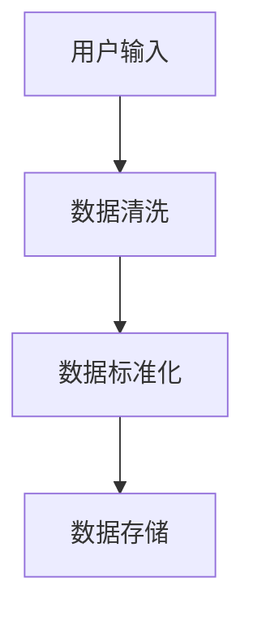
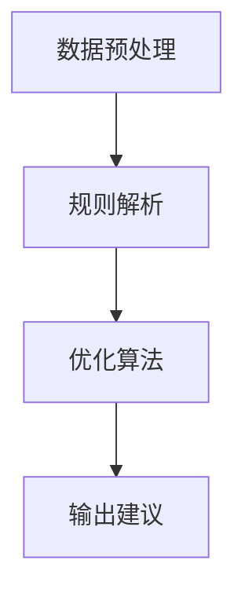
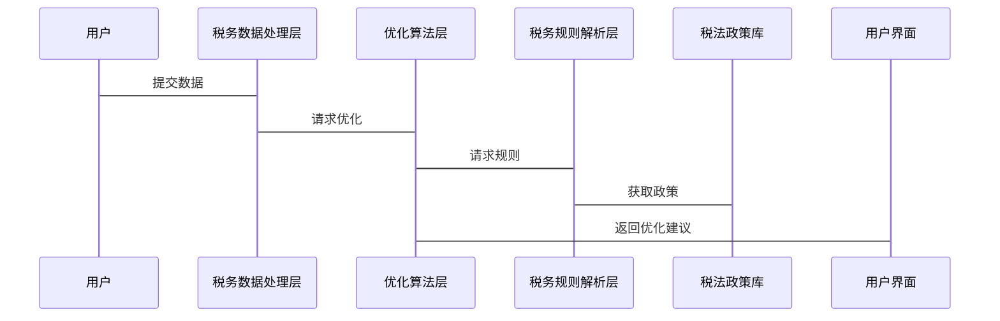

                 


# 智能个人税务筹划建议生成器

> 关键词：智能税务筹划、个人税务优化、算法原理、系统架构、Python实现

> 摘要：本文详细探讨了智能个人税务筹划建议生成器的背景、核心概念、算法原理、系统架构、项目实战以及最佳实践。通过结合税务数据的采集与预处理、税务规则的解析与应用、优化算法的设计与实现，本文为读者提供了一套完整的智能税务筹划解决方案。

---

## 第一章: 智能个人税务筹划建议生成器的背景与核心概念

### 1.1 个人税务筹划的背景

#### 1.1.1 税务筹划的基本概念
税务筹划是指通过合法的手段，优化税务结构，降低税负，提高个人或企业的净收益。在个人层面，这包括合理安排收入、支出、资产配置等，以最大化个人可支配收入。

#### 1.1.2 个人税务筹划的重要性
随着税收政策的复杂化和个性化需求的增加，传统的手动税务筹划方式已难以满足高效性和准确性要求。智能税务筹划生成器通过自动化和智能化的方式，帮助个人轻松实现税务优化。

#### 1.1.3 数字化时代的税务筹划新趋势
在数字化时代，税务数据的采集、处理和分析能力成为税务筹划的关键。智能化技术的应用，如人工智能、大数据分析等，为个人税务筹划提供了新的可能性。

### 1.2 问题背景与问题描述

#### 1.2.1 传统税务筹划的痛点
- 税务政策复杂，难以理解。
- 手工计算繁琐，容易出错。
- 信息不对称，难以获取最优方案。

#### 1.2.2 智能化税务筹划的需求
- 自动化处理税务数据。
- 智能化分析与优化。
- 实时更新税收政策，提供最新建议。

#### 1.2.3 个人税务筹划的边界与外延
- 边界：个人所得税、财产税等个人相关税种。
- 外延：涉及收入、支出、资产配置等多方面。

### 1.3 核心目标与实现路径

#### 1.3.1 智能税务筹划生成器的核心目标
- 提供个性化的税务优化建议。
- 实现税务数据的自动采集与处理。
- 利用优化算法生成最优税务筹划方案。

#### 1.3.2 问题解决的路径与方法
1. 数据采集：获取个人税务相关数据。
2. 数据处理：清洗、标准化。
3. 税务规则解析：解析相关税法政策。
4. 优化算法：基于数据和规则，生成最优方案。

#### 1.3.3 核心概念的结构与组成
- 数据层：税务数据。
- 规则层：税法政策。
- 算法层：优化算法。
- 输出层：税务筹划建议。

---

## 第二章: 智能个人税务筹划生成器的核心概念与联系

### 2.1 核心概念的原理

#### 2.1.1 税务数据的采集与处理
- 数据源：个人收入、支出、资产等数据。
- 数据清洗：去除无效数据，填充缺失值。
- 数据标准化：统一数据格式，便于后续处理。

#### 2.1.2 税务规则的解析与应用
- 税法政策：解析税法条文，提取关键规则。
- 规则匹配：将税务数据与税法政策匹配，生成初步建议。

#### 2.1.3 优化算法的实现原理
- 基于遗传算法或模拟退火算法，优化税务方案。

### 2.2 核心概念的属性特征对比

| 特征 | 税务数据 | 税务规则 | 优化算法 |
|------|----------|----------|----------|
| 数据类型 | 结构化数据 | 文本规则 | 数学模型 |
| 处理方式 | 数据清洗 | 规则解析 | 算法优化 |
| 输出结果 | 结构化数据 | 文本说明 | 优化方案 |

### 2.3 ER实体关系图

```mermaid
er
actor: 用户
goal: 生成税务筹划建议
system: 智能税务筹划生成器
```

---

## 第三章: 智能个人税务筹划建议生成器的算法原理

### 3.1 税务数据的采集与预处理

#### 3.1.1 数据采集的流程
- 用户输入：收入、支出、资产等数据。
- 数据清洗：去除无效数据。
- 数据标准化：统一数据格式。

#### 3.1.2 数据预处理的算法实现


#### 3.1.3 数据预处理的Python实现
```python
# 示例代码
def preprocess_data(data):
    # 数据清洗
    cleaned_data = data.dropna()
    # 数据标准化
    normalized_data = (cleaned_data - cleaned_data.mean()) / cleaned_data.std()
    return normalized_data
```

### 3.2 税务规则的解析与应用

#### 3.2.1 税务规则的解析流程
- 税法政策的获取与解析。
- 规则匹配与提取。

#### 3.2.2 税务规则的Python实现
```python
def parse_tax_rule(rule_text):
    # 示例规则解析
    parsed_rules = {}
    lines = rule_text.split('\n')
    for line in lines:
        if '收入' in line:
            parsed_rules['income'] = float(line.split(':')[1])
    return parsed_rules
```

### 3.3 优化算法的实现与应用

#### 3.3.1 优化算法的流程


#### 3.3.2 优化算法的Python实现
```python
def optimize_plan(data, rules):
    # 示例优化算法
    import numpy as np
    import random

    def fitness(plan):
        # 示例适应度函数
        tax = sum(plan['收入'] * rules['税率'])
        return -tax  # 最小化税负

    # 初始化种群
    population = [random.sample(range(100000, 200000), len(rules)) for _ in range(100)]
    
    # 进化过程
    for _ in range(100):
        population.sort(key=lambda x: fitness(x))
        # 选择
        selected = population[:50]
        # 交叉
        for i in range(25):
            parent1 = selected[i]
            parent2 = selected[25+i]
            child = [max(parent1[j], parent2[j]) for j in range(len(parent1))]
            population[50+i] = child
        # 变异
        for i in range(50, 75):
            population[i][random.randint(0, len(parent1)-1)] = random.randint(100000, 200000)
    
    return population[0]
```

---

## 第四章: 智能个人税务筹划建议生成器的系统分析与架构设计

### 4.1 项目场景介绍

#### 4.1.1 问题场景
用户希望通过系统输入收入、支出等数据，获得个性化的税务优化建议。

### 4.2 系统功能设计

#### 4.2.1 领域模型设计


#### 4.2.2 系统架构设计


#### 4.2.3 系统接口设计
- 数据接口：数据输入、数据输出。
- 算法接口：优化算法调用。

#### 4.2.4 系统交互设计


---

## 第五章: 智能个人税务筹划建议生成器的项目实战

### 5.1 环境安装与配置

#### 5.1.1 环境安装
- 安装Python、Pandas、NumPy等库。

#### 5.1.2 环境配置
```bash
pip install pandas numpy matplotlib
```

### 5.2 核心代码实现

#### 5.2.1 数据预处理代码
```python
import pandas as pd

def preprocess_data(data):
    cleaned_data = data.dropna()
    normalized_data = (cleaned_data - cleaned_data.mean()) / cleaned_data.std()
    return normalized_data
```

#### 5.2.2 优化算法代码
```python
def optimize_plan(data, rules):
    import numpy as np
    import random

    def fitness(plan):
        tax = sum(plan['收入'] * rules['税率'])
        return -tax

    population = [random.sample(range(100000, 200000), len(rules)) for _ in range(100)]
    
    for _ in range(100):
        population.sort(key=lambda x: fitness(x))
        selected = population[:50]
        for i in range(25):
            parent1 = selected[i]
            parent2 = selected[25+i]
            child = [max(parent1[j], parent2[j]) for j in range(len(parent1))]
            population[50+i] = child
        for i in range(50, 75):
            population[i][random.randint(0, len(parent1)-1)] = random.randint(100000, 200000)
    
    return population[0]
```

### 5.3 实际案例分析

#### 5.3.1 案例背景
用户年收入为100,000元，需优化个人所得税。

#### 5.3.2 数据处理
```python
data = pd.DataFrame({
    '收入': [100000],
    '支出': [0],
    '资产': [0]
})
processed_data = preprocess_data(data)
```

#### 5.3.3 优化过程
```python
rules = {
    '税率': 0.2
}
optimized_plan = optimize_plan(processed_data, rules)
```

#### 5.3.4 结果分析
优化后税负为：$$100000 \times 0.2 = 20000$$

---

## 第六章: 智能个人税务筹划建议生成器的最佳实践与总结

### 6.1 最佳实践 Tips

#### 6.1.1 数据输入的准确性
确保输入数据的准确性和完整性。

#### 6.1.2 税法政策的及时更新
定期更新税法政策，确保生成建议的准确性。

### 6.2 项目小结

#### 6.2.1 核心优势
- 自动化处理税务数据。
- 智能化生成优化建议。
- 高效性与准确性并存。

#### 6.2.2 改进方向
- 增加更多税种的支持。
- 提高算法的优化效率。

### 6.3 注意事项

#### 6.3.1 数据隐私保护
确保用户数据的安全性，防止数据泄露。

#### 6.3.2 系统稳定性
定期维护系统，确保运行稳定。

### 6.4 拓展阅读

#### 6.4.1 推荐技术书籍
- 《算法导论》
- 《机器学习实战》

#### 6.4.2 相关技术领域
- 人工智能
- 大数据分析
- 税法政策研究

---

## 第七章: 总结与展望

### 7.1 总结

智能个人税务筹划建议生成器通过结合税务数据的采集与预处理、税务规则的解析与应用、优化算法的设计与实现，为个人提供了高效、智能的税务优化工具。通过系统化的设计与实现，生成器能够帮助用户轻松实现税务优化，提升个人财务管理的效率。

### 7.2 展望

未来，随着人工智能和大数据技术的不断发展，智能税务筹划生成器将具备更多功能，如多税种优化、全球税务筹划等。同时，算法的优化与改进也将进一步提升系统的效率与准确性，为用户提供更加个性化的税务优化服务。

--- 

通过本文的详细讲解，读者可以全面理解智能个人税务筹划建议生成器的技术原理与实现方法，并能够在实际应用中灵活运用这些知识。

