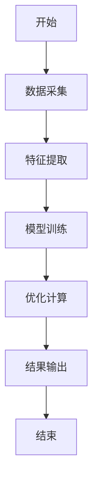
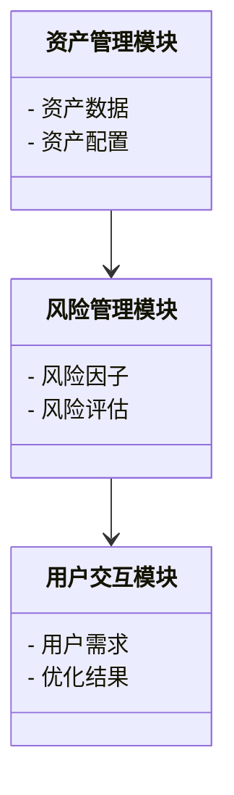
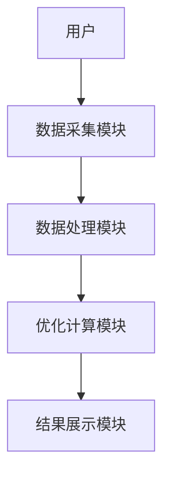
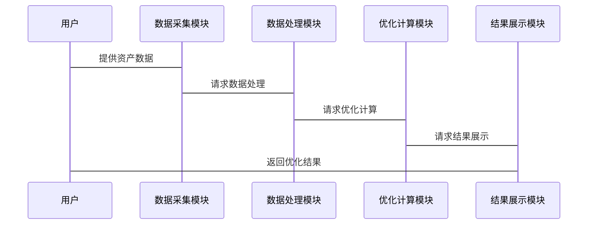

                 


# 智能个人资产负债结构优化与财富管理

## 关键词：智能优化、人工智能、财富管理、投资组合、风险管理、机器学习

## 摘要：  
随着人工智能技术的快速发展，个人资产负债结构优化与财富管理正逐渐从传统的经验管理向智能化、数据驱动的方向转变。本文系统性地探讨了智能个人资产负债优化的核心概念、算法原理、系统架构以及实际应用，结合具体案例，详细分析了基于人工智能的智能优化算法在个人财富管理中的应用，为读者提供了一套完整的智能优化解决方案。

---

## 第一部分: 智能个人资产负债优化与财富管理概述

### 第1章: 智能个人资产负债优化与财富管理概述

#### 1.1 问题背景与目标
##### 1.1.1 传统个人资产负债管理的局限性
传统的个人资产负债管理主要依赖于人工经验判断和简单的财务模型，存在以下问题：
- 资产负债结构难以实时优化，无法快速响应市场变化。
- 缺乏数据驱动的决策支持，难以实现精准的资产配置。
- 风险管理能力有限，难以有效应对复杂多变的市场环境。

##### 1.1.2 智能化管理的需求与目标
随着金融市场日益复杂化和个性化需求的增加，智能化个人资产负债管理的需求日益迫切。其目标包括：
- 实现资产配置的动态优化，提升投资收益。
- 降低投资风险，增强风险管理能力。
- 提供个性化的财富管理方案，满足不同用户的财务需求。

##### 1.1.3 智能化管理的核心问题与边界
智能个人资产负债优化的核心问题是：如何在多目标优化框架下，利用人工智能技术实现资产配置的动态优化。其边界包括：
- 优化目标：收益最大化、风险最小化、流动性最优。
- 约束条件：资产类别限制、风险承受能力、时间 horizon。

---

### 第2章: 智能个人资产负债优化的核心概念与联系

#### 2.1 核心概念原理
##### 2.1.1 资产负债结构优化的数学模型
资产配置的数学模型是智能优化的核心，主要包括以下几种：
- 均值-方差模型：用于优化投资组合的收益与风险。
- 黑塞矩阵：用于衡量资产之间的相关性。
- 现金流贴现模型：用于评估资产的未来价值。

##### 2.1.2 人工智能在优化中的应用原理
人工智能通过以下方式实现资产负债优化：
- 数据采集与特征提取：收集市场数据、用户需求、风险偏好等信息。
- 模型训练：利用机器学习算法训练优化模型。
- 结果输出：生成优化后的资产配置方案。

##### 2.1.3 智能优化算法的分类与选择
智能优化算法主要包括：
- 遗传算法：适用于全局优化。
- 粒子群优化：适用于连续空间优化。
- 支持向量机：适用于分类问题。

---

### 第3章: 智能个人资产负债优化的算法原理

#### 3.1 算法原理概述
##### 3.1.1 基于机器学习的优化方法
机器学习在资产优化中的应用包括：
- 监督学习：用于资产价格预测。
- 非监督学习：用于风险因子识别。

##### 3.1.2 基于遗传算法的优化策略
遗传算法通过以下步骤实现优化：
1. 初始化种群。
2. 计算适应度。
3. 选择、交叉、变异。
4. 重复迭代。

##### 3.1.3 基于粒子群优化的算法实现
粒子群优化通过以下步骤实现：
1. 初始化粒子群。
2. 计算个体最优解。
3. 更新全局最优解。
4. 重复迭代。

#### 3.2 算法实现流程
##### 3.2.1 算法流程图


##### 3.2.2 算法实现代码
```python
import numpy as np
from sklearn import svm

# 示例代码：基于SVM的资产分类
def optimize_assets/assets_data):
    # 数据预处理
    X = assets_data.drop('label', axis=1)
    y = assets_data['label']
    
    # 模型训练
    clf = svm.SVC()
    clf.fit(X, y)
    
    # 预测
    predicted = clf.predict(X)
    
    return predicted
```

---

## 第二部分: 智能个人资产负债结构优化与财富管理的系统架构

### 第4章: 系统功能设计与架构

#### 4.1 领域模型设计


#### 4.2 系统架构设计


#### 4.3 系统接口设计
- 输入接口：用户需求、市场数据。
- 输出接口：优化结果、风险评估。

#### 4.4 系统交互设计


---

### 第5章: 项目实战与案例分析

#### 5.1 环境配置
- Python 3.8+
- Jupyter Notebook
- 机器学习库（scikit-learn, xgboost）

#### 5.2 核心实现代码
```python
import numpy as np
from sklearn import svm

# 示例代码：基于SVM的资产分类
def optimize_assets/assets_data):
    # 数据预处理
    X = assets_data.drop('label', axis=1)
    y = assets_data['label']
    
    # 模型训练
    clf = svm.SVC()
    clf.fit(X, y)
    
    # 预测
    predicted = clf.predict(X)
    
    return predicted
```

#### 5.3 案例分析
以一个简单的资产配置问题为例，假设我们有两只资产：股票和债券。目标是通过遗传算法优化资产配置比例，使得在给定风险水平下的收益最大化。

---

### 第6章: 总结与展望

#### 6.1 最佳实践
- 数据质量是优化的基础。
- 模型选择需要结合实际场景。
- 风险管理是优化的核心。

#### 6.2 小结
本文系统性地探讨了智能个人资产负债优化的核心概念、算法原理和系统架构，并通过具体案例展示了其实现过程。

#### 6.3 注意事项
- 数据隐私保护。
- 模型的可解释性。
- 算法的鲁棒性。

#### 6.4 拓展阅读
- 现代投资组合理论。
- 机器学习在金融中的应用。

---

通过本文的系统性分析和实战案例，读者可以深入了解智能个人资产负债优化的核心原理和技术实现，为实际应用提供参考。

