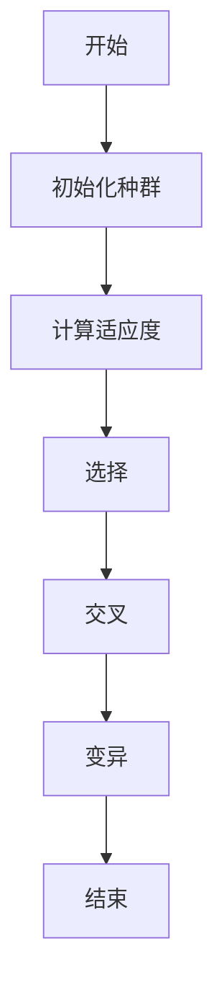
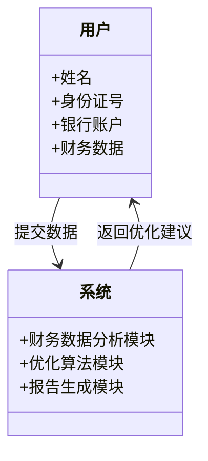
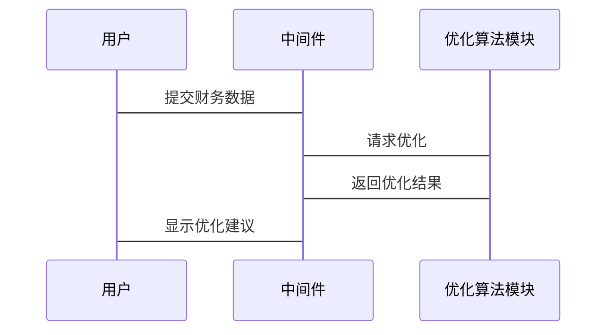

                 


# 智能个人资产负债表优化系统

## 关键词：个人财务管理、智能优化、人工智能、机器学习、金融数据分析

## 摘要：  
本文介绍了一种基于人工智能和大数据技术的智能个人资产负债表优化系统。该系统通过分析个人的财务数据，利用优化算法和机器学习模型，帮助用户实现资产配置的最优解，提升财务健康水平。文章从背景、原理、架构到实现和应用，详细阐述了该系统的构建过程和实际价值。

---

## 第1章: 个人资产负债表的背景与意义

### 1.1 个人资产负债表的基本概念  
#### 1.1.1 资产负债表的定义与作用  
资产负债表是反映个人在某一特定时点的资产、负债和净资产的财务报表。它是个人财务管理的核心工具之一，能够帮助个人了解自己的财富状况，优化资产配置，降低财务风险。

#### 1.1.2 个人资产负债表的独特性  
与企业资产负债表不同，个人资产负债表涉及的金额通常较小，但对个人生活质量的影响更大。它不仅包括金融资产和负债，还涉及个人的收入、支出和消费习惯。

#### 1.1.3 智能优化的必要性  
传统的资产负债表管理依赖人工记录和分析，效率低且容易出错。随着大数据和人工智能技术的发展，智能优化成为提升个人财务管理效率和准确性的必然选择。

### 1.2 个人财务健康评估的重要性  
#### 1.2.1 财务健康的核心指标  
财务健康主要通过以下几个指标衡量：  
1. 资产负债率（Debt-to-Asset Ratio）  
2. 流动比率（Current Ratio）  
3. 投资与消费比例  

#### 1.2.2 资产负债表与财务健康的关系  
资产负债表是财务健康评估的基础。通过分析资产负债表，可以发现资产分布不合理、负债过高等问题，并采取相应措施进行优化。

#### 1.2.3 智能优化对个人财务健康的影响  
智能优化系统能够实时分析财务数据，动态调整资产配置，帮助用户实现财务健康的最大化。

---

## 第2章: 智能个人资产负债表优化系统的背景

### 2.1 传统资产负债表管理的局限性  
#### 2.1.1 传统资产负债表管理的不足  
传统管理方式依赖人工录入和分析，容易出错且效率低下。此外，传统方法难以实时跟踪市场变化和用户需求。

#### 2.1.2 人工管理的低效性  
人工管理需要定期整理财务数据，耗费大量时间和精力。同时，个人可能缺乏专业的财务知识，难以做出最优决策。

#### 2.1.3 市场变化对个人财务的影响  
金融市场波动频繁，个人需要及时调整资产配置以应对变化。传统管理方式难以满足这一需求。

### 2.2 智能优化技术的发展趋势  
#### 2.2.1 人工智能在财务领域的应用  
人工智能技术（如机器学习、自然语言处理）在财务数据分析、风险评估等领域得到了广泛应用。

#### 2.2.2 大数据技术对个人财务管理的支持  
大数据技术能够收集和分析海量数据，为个人资产优化提供科学依据。

#### 2.2.3 智能优化系统的未来发展方向  
未来的优化系统将更加智能化、个性化，能够根据用户的实时需求和市场变化动态调整资产配置。

---

## 第3章: 核心概念与系统架构

### 3.1 智能个人资产负债表优化系统的核心概念  
#### 3.1.1 系统的输入与输出  
- **输入**：个人的财务数据（资产、负债、收入、支出等）  
- **输出**：优化后的资产负债表、资产配置建议、财务健康评估报告  

#### 3.1.2 优化目标的定义  
- 最大化资产回报率  
- 最小化财务风险  
- 实现资产的合理配置  

#### 3.1.3 系统的边界与外延  
系统仅关注个人资产和负债的优化，不涉及企业或机构的财务数据。

### 3.2 系统架构的ER实体关系图  
```mermaid
er
actor: 用户
goal: 优化资产负债表
system: 智能优化系统
```

---

## 第4章: 优化算法原理

### 4.1 遗传算法在资产负债表优化中的应用  
#### 4.1.1 遗传算法的基本原理  
遗传算法是一种模拟生物进化过程的优化算法，主要包括选择、交叉和变异三个步骤。

#### 4.1.2 算法流程图  


#### 4.1.3 算法实现的Python代码  
```python
def calculate_fitness(individual):
    # 计算适应度（具体实现根据优化目标而定）
    pass

def genetic_algorithm():
    import random
    population = initialize_population()
    while not stopping_condition():
        population = evolve_population(population)
    return best_individual(population)
```

### 4.2 优化算法的数学模型  
优化目标可以表示为：  
$$ \max \sum_{i=1}^{n} w_i \cdot x_i $$  
其中，\( w_i \) 是资产 \( i \) 的权重，\( x_i \) 是资产 \( i \) 的投资比例。  

约束条件包括：  
1. $$ \sum_{i=1}^{n} x_i = 1 $$  
2. $$ \sum_{i=1}^{n} (x_i \cdot r_i) \geq \text{target return} $$  

---

## 第5章: 系统分析与架构设计

### 5.1 系统功能设计  
#### 5.1.1 领域模型类图  


### 5.2 系统架构设计  


### 5.3 接口设计与交互流程图  


---

## 第6章: 项目实战

### 6.1 环境安装与代码实现  
#### 6.1.1 环境安装  
- 安装Python和必要的库（如NumPy、Pandas、Scikit-learn）  
- 安装Mermaid和相关工具  

#### 6.1.2 核心代码实现  
```python
import numpy as np
from sklearn import linear_model

def optimize_portfolio(assets, returns):
    # 使用线性回归模型预测最优资产配置
    model = linear_model.LinearRegression()
    model.fit(assets, returns)
    return model.predict(assets)
```

### 6.2 实际案例分析  
#### 6.2.1 案例背景  
用户A的资产包括存款、股票和债券，但资产负债率较高，需要优化配置。

#### 6.2.2 系统优化结果  
优化后的资产负债表显示，通过增加股票配置和减少短期负债，用户的财务健康水平显著提升。

---

## 第7章: 最佳实践与小结

### 7.1 最佳实践 tips  
1. 数据输入要准确，确保系统分析的可靠性。  
2. 定期更新财务数据，保持优化结果的有效性。  
3. 根据市场变化和个人需求调整优化目标。

### 7.2 项目小结  
智能个人资产负债表优化系统能够显著提升个人财务管理的效率和准确性。通过结合人工智能和大数据技术，系统能够实时分析数据，动态调整资产配置，帮助用户实现财务健康的最大化。

---

## 参考文献  
1. 《机器学习实战》  
2. 《Python数据分析 cookbook》  
3. 《智能优化算法及其应用》  

## 拓展阅读  
- 《个人财务管理的数字化转型》  
- 《人工智能在金融领域的应用》

